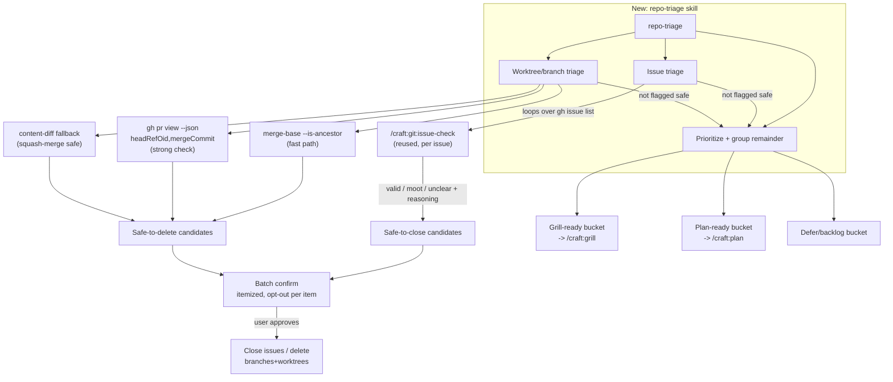

# BRAINSTORM: Repo Triage (open issues + stale worktrees/branches)

**Date:** 2026-08-07 · **Depth:** default · **Focus:** feature
**Branch:** dev · **Categories:** req, users, scope, success

## Origin

Seed request (refined via `--refine`): create a skill that triages open GitHub
issues and stale worktrees/branches, grounds each against current repo state,
determines whether it was superseded, offers to delete/close what's no longer
useful (with confirmation, never automatic), and groups the remainder for
`/craft:grill` (needs a locked decision) vs. `/craft:plan` (ready to scope).

Directly follows a live session where this exact triage was done by hand:
issue #327 was fixed and its table-edit committed; PR #325's own tests had a
real bug caught by code review, fixed, and merged; PR #321 (dependabot) was
rebased and merged; a stale worktree was removed after ancestor + PR-state
verification; and a stale remote branch (`codex/issue-316-spec`) was found to
be a squash-merged leftover of an already-shipped, already-closed issue and
deleted. This skill formalizes that manual workflow.

## Context Scan

- **No existing skill covers this.** `find`/`grep` across `skills/` and
  `docs/specs/` for `triage`, `worktree`, `stale-branch` found only
  `commands/git/issue-check.md` (single-issue premise check) and
  `docs/specs/BRAINSTORM-github-attention-triage-2026-07-14.md` (2026-07-14,
  produced `/craft:git:issue-check`).
- **`/craft:git:issue-check <N>`** already exists and does exactly the
  issue-grounding half of this skill's job, for one issue at a time:
  `classify_issue()` in `commands/git/issue-check.md` is the single source of
  truth (`tests/test_issue_check_unit.py` imports it directly), returns
  valid/moot/unclear + reasoning, is advisory-only, never mutates GitHub
  state. Decision below: **wrap it in a loop, don't reimplement.**
- **No existing skill covers worktree/branch grounding at all.** This
  session's manual process — `git worktree list`, `git branch -a`,
  `git rev-list --left-right --count`, `git merge-base --is-ancestor` (known
  to misreport squash merges — memory `git-cherry-misreports-squash-merges`),
  `gh pr view --json headRefOid,mergeCommit`, content-diff as the strong
  check when ancestor-check says "no" but the PR shows merged — is genuinely
  new territory. `skills/dev/git/SKILL.md` has a git-activity recap operation
  (Operation 7, feeds `/craft:restore`) but it's a *listing*, not a
  *grounding-and-recommend-deletion* operation.
- `.STATUS` already documents this exact false-negative trap from a past
  session: "Deleting a merged branch: do NOT gate on `git cherry`... Gate on
  both `gh pr view <N> --json headRefOid,mergeCommit`... and
  `git merge-base --is-ancestor`... Plain `git branch -d` usually succeeds."
  This skill's grounding logic should encode that lesson directly rather than
  rediscovering it per-invocation.

## Locked Decisions

| # | Question | Decision |
|---|---|---|
| 1 | Issue-grounding mechanism | **Reuse `/craft:git:issue-check`**, called per open issue (or its extracted `classify_issue()` logic directly) rather than a new classifier. One source of truth for "is this issue still valid." |
| 2 | Worktree/branch-grounding mechanism | **New logic**, since nothing exists — but built strictly from the `.STATUS`-documented squash-merge-safe pattern (ancestor check + `gh pr view` + content-diff fallback), not a naive `git branch -d`/`git cherry` check. |
| 3 | Deletion confirmation | **Batch confirm with itemized evidence.** One list of everything flagged safe-to-delete/close (issue → superseding PR/commit citation; branch/worktree → merge evidence), single yes/no to proceed with all, with the ability to opt individual items out before confirming. Never automatic, never per-item serial prompts. |
| 4 | Remainder handling | **Group into 3 buckets** for what's *not* safe to delete: grill-ready (needs a locked decision before build), plan-ready (scope is clear, go straight to `/craft:plan`), defer/backlog (neither — explicitly parked). One-line rationale per group, ADHD-scannable output (table/bullets, not prose). |
| 5 | Mutation scope | **Read-only by default, mutations gated behind explicit confirm** — same posture as `issue-check` (advisory) and this session's manual practice (nothing was deleted without a stated ground-truth check first). |

## Architecture

## Why This Shape (not the alternatives)

- **Not a rewrite of `issue-check`'s classifier**: `classify_issue()` is
  already tested (`tests/test_issue_check_unit.py`) and is the single source
  of truth per its own file header. Duplicating it here would create exactly
  the two-classifiers-for-one-question drift this repo's memory system
  already warns about elsewhere (e.g. `refine-flag-declarer-table-drift`).
- **Not folded into `skills/dev/git`'s existing Operation 7 (git activity
  recap)**: recap is a cheap raw listing by design (same "cheapest first"
  principle the 2026-07-14 brainstorm used to justify keeping
  issue-premise-check out of `/recap`'s inline path). Grounding + judging +
  offering deletion is a heavier, opt-in operation, not something that
  belongs in a fast status check.
- **Not auto-delete, ever**: mirrors both `issue-check`'s advisory-only
  posture and this session's actual practice — every deletion this session
  was preceded by an explicit ground-truth check the user could see before
  confirming.

## Risks / Open Questions (flagged for grill, not resolved here)

- **Cost/latency at scale**: looping `issue-check` (an LLM semantic read)
  over every open issue is fine for craft's current ~6 open issues, but
  doesn't obviously scale to a repo with 50+. Worth grilling whether a cheap
  pre-filter (e.g. issue age, last-comment date) should run before the
  expensive per-issue check.
- **Squash-merge content-diff false-negative risk**: the content-diff
  fallback (used this session for `codex/issue-316-spec`) confirms "no diff
  on the files this branch touched" — but doesn't prove the branch contributed
  *nothing else*. A branch that touched files later modified again by
  unrelated `dev` commits could show spurious diff noise even when its actual
  contribution shipped. Needs a scoped-diff strategy, not a blind full-repo
  diff.
- **Worktree-vs-branch coupling**: this session hit a real edge case —
  `gh pr merge --delete-branch` silently failed to delete the remote branch
  because a local worktree held it checked out, with no clear error signal
  short of grepping the merge output. The skill's grounding step needs to
  check "is this branch checked out in a worktree" *before* attempting
  delete, not discover it from a failed command.
- **Scope-boundary with `/craft:git:clean`** (if it exists) or similar
  existing cleanup tooling — worth a grep before build to confirm no
  overlap/duplication.

## Test-Plan Scaffold (default-on)

Tier inferred: **new skill + reuses an existing command + cross-command data
flow (issue-check invocation)** → full suite tier (unit + e2e + dogfood +
integration).

- Unit: worktree/branch grounding function returns one of
  {safe-to-delete, needs-recheck, active} with cited evidence (ancestor
  result, PR state, content-diff result); never throws on a worktree path
  that no longer exists on disk (stale `git worktree list` entry).
- Integration: issue-triage step correctly invokes/reuses `issue-check`'s
  `classify_issue()` without duplicating its logic — a regression test should
  fail if the two classifiers diverge.
- E2E: run against a fixture repo with (a) a squash-merged branch with a live
  worktree (must detect the worktree lock, not just attempt-and-fail), (b) a
  genuinely still-active feature branch (must NOT flag as safe), (c) an issue
  already fixed by a later commit not yet referenced in the issue itself.
- Dogfood: run against craft's own current open issues + worktrees as a
  real-world smoke test before merge (mirrors the 2026-07-14 brainstorm's
  dogfood approach).
- Non-goal test: confirm the skill **never** calls `git branch -D`,
  `git worktree remove`, or `gh issue close` without a preceding explicit
  user confirmation captured in the same run — mutation-gating is a testable
  invariant.

## Documentation Scaffolding (default-on)

Doc-impact score (via `skills/orchestration/references/doc-impact-rubric.md`,
threshold ≥3):

- [x] Guide/tutorial — new skill, no existing doc covers this workflow (score
      ≥3: new user-facing capability + no prior art)
- [x] REFCARD entry — should list alongside `/craft:git:issue-check` and
      `/craft:restore` under the git/dev workflow section
- [ ] Demo — N/A, score <3 (not a visually-driven feature)
- [ ] Mermaid diagram beyond this doc's own — N/A, score <3 (the architecture
      diagram above is sufficient for the skill's own SKILL.md)

## Next Steps

Recommended: run `/craft:grill` on this BRAINSTORM next — five locked
decisions and four open risks above (cost/latency at scale, content-diff
false-negatives, worktree-lock detection, and the `git:clean` overlap check)
are exactly the kind of thing that benefits from adversarial interrogation
before implementation starts, per this skill's own "Reuse `issue-check`"
decision setting the bar for evidence-based reuse over reinvention.
