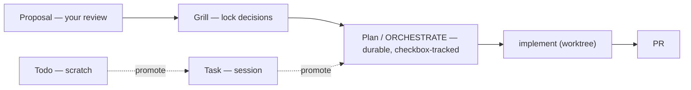

# PROPOSAL: Simplify the orchestrate/do Command Family

**Status:** For your review — no implementation, no grill yet.
**Date:** 2026-07-01
**Source:** Two independent research-agent audits of `commands/do.md`, `commands/orchestrate.md`,
`commands/orchestrate/{plan,workflow,drive,resume}.md` this session, cross-checked against
`docs/guide/{pipeline-orchestrate-guide,orchestrator}.md`.

---

## TL;DR

6 commands share the `orchestrate`/`do` prefix. They're actually **4 structurally different
engines** + **1 real router** + **1 pure-prose feature that was never built**. The naming makes
them look like one family with options; they're not. Fixing the 2 cheapest items removes the
worst of the confusion with almost no risk.

**This revision (2026-07-01) adds two things you asked for:** (1) a deeper set of refactors
ranked by which **latest Anthropic / community token-saving lever** each one rides — see
[Deeper cuts](#deeper-cuts--prioritised-by-token-lever); and (2) **document-type defaults &
options** for proposal / grill / plan / tasks / todos, folded in as a real craft convention —
see [Document-type defaults & options](#document-type-defaults--options).

---

## The map (what's real vs. what's documented)

| Command | What it actually is | Real or aspirational? |
|---|---|---|
| `/craft:do` | Own complexity-scorer + agent-picker, ~1040 lines inline | Real, but duplicates orchestrate.md's scoring logic independently |
| `/craft:orchestrate` | Freeform fan-out + `--swarm`, own inline mode-selection | Real, but has an internal self-contradiction (see below) |
| `/craft:orchestrate:plan` | Spec → ORCHESTRATE file → worktree | Real, but **marked `deprecated: true` while still carrying full duplicate logic** |
| `/craft:orchestrate:workflow` | Coded YAML/DSL control-flow engine (craft's own, NOT the platform `Workflow()` tool) | Real, clean thin shim |
| `/craft:orchestrate:drive` | Spec-driven `/goal` turn-loop | Real, clean thin shim |
| `/craft:orchestrate:resume` | "Session teleportation" — cloud sync, encryption, S3 backends, team sharing | **Never implemented.** Zero code, zero skill call, references sub-commands (`:sync`, `:archive`, `:share`) that don't exist |

---

## Findings, ranked by how much confusion each one causes

### 🔴 High-impact, cheap to fix

1. **`orchestrate:resume` is entirely fictional.** 523 lines describing a feature with no
   implementation anywhere in the repo. It also collides in name with a totally different,
   *real* mechanism (`orchestrate:workflow --resume <run-id>`, actual cache-replay) and with a
   *third* real mechanism (`session-state` skill's local JSON, used by `orchestrate`'s `continue`
   sub-verb). Three unrelated things called "resume."

2. **`orchestrate:plan` is a zombie deprecation.** Frontmatter says `deprecated: true` /
   `replaced-by: plan-orchestrator skill` — but the command body still has the full 8-step
   spec-parsing/ORCHESTRATE-generation logic, word-for-word duplicating the skill. Every guide
   doc still treats it as the live, current command. The ORCHESTRATE template itself is
   duplicated in both places — edit one, the other drifts.

### 🟡 Medium-impact

3. **`orchestrate.md` contradicts itself internally.** Its engine-auto-detect step literally
   says "Route to `:workflow` engine" in the prompt text, then actually invokes
   `/craft:orchestrate:drive` in the next line — and does this even when the detected file is a
   `WORKFLOW-*.yaml`, which `drive` can't consume (it only takes `SPEC-*.md`). Not just confusing
   naming — an actual misroute.

4. **No single canonical "which engine when" table.** `orchestrate.md`, `workflow.md`,
   `drive.md`, and the pipeline guide each carry their own partial comparison table. They drift
   independently.

### 🟢 Lower-impact, larger effort

5. **`do.md` and `orchestrate.md` each reimplement the same complexity scorer** (0-10,
   near-identical breakdowns) with no shared source of truth.

6. Docs mismatch: `docs/guide/orchestrator.md` documents `--orch` as available on
   `/craft:check`, `/craft:docs:sync`, `/craft:ci:generate` — only `do.md` was confirmed to
   actually implement it in this audit. Worth verifying, not yet confirmed broken.

---

## Deeper cuts — prioritised by token lever

The explicit priority is refactors that ride the **newest Anthropic / community token-saving
tooling**, not just tidy-ups. Grounding (mid-2026, sources at foot):

- **Context editing** — auto-clears stale tool calls/results near the limit; **84% token cut**
  in a 100-turn eval, +29% task completion alone, **+39% paired with the memory tool**.
- **Memory tool** — file-based state that lives *outside* the context window and survives
  compaction. craft already has an analog (the `MEMORY.md` + per-project memory dir).
- **Skills / progressive disclosure** — one documented case cut always-loaded rules
  **1,358 → 807 lines (41%)** purely by moving procedure-heavy rules into on-demand Skills and
  path-scoping the rest. This is exactly craft's thin-command / fat-skill pattern.
- **Prompt caching** — cache reads are ~1/10 the price of fresh input.
- **Subagent multiplier** — each subagent is a *separate* context window; community post-mortems
  report **$8k–$47k** runaway multi-agent runs. Caps are a token control, not just a safety rail.

| # | Refactor | Token lever it rides | Effort | Why it's high-value |
|---|---|---|---|---|
| **T1** | **Thin-shim `do.md`** — extract its ~1040-line inline complexity-scorer + agent-picker into a skill (loads on demand) | Progressive disclosure (the 41% lever) | Med-High | `/craft:do` is the highest-traffic command; its body loads every invocation. Biggest single always-loaded blob left after PR #236. |
| **T2** | **Extract the duplicated verify-gate + engine-comparison prose** (in `orchestrate.md` / `workflow.md` / `drive.md`) into ONE on-demand reference | Progressive disclosure | Low-Med | Kills finding #4's drift AND removes 3× copied prose from always-loaded command bodies. |
| **T3** | **Collapse the 3 "resume" mechanisms onto the memory-tool / file-persistence pattern** — keep the real `workflow --resume` cache-replay, delete the fictional cloud-sync, document the `session-state` JSON as the one canonical "resume" | Memory tool + context editing | Low (delete) + Med (doc) | Anthropic's canonical answer to "persist agent state cheaply" is file-based memory, not an ad hoc cloud feature. Aligns craft with the pattern instead of inventing one. |
| **T4** | **Promote the grill's soft concurrency cap (branches 9/13) to a plugin-wide default** for any multi-agent dispatch (`do --orch`, `orchestrate --swarm`, orchestrate-dispatch) | Subagent-multiplier control | Low | Directly answers the $8k–$47k failure mode with one shared guardrail instead of per-command reinvention. |
| **T5** | **Path-scope craft's own guidance** — move subsystem rules (git workflow, release, governance) out of always-loaded prose into directory-scoped or skill-loaded context | Progressive disclosure + path-scoping | Med | The 41% lever applied to craft's *own* preamble, not just user projects. |

**Ranking rationale:** T1 and T2 are the same proven pattern as PR #236 (thin shim + extract),
aimed at the highest-traffic surfaces — both low-risk, high-return. T3/T4 fold the still-held
orchestrate-dispatch design directly onto Anthropic's memory + subagent-cap guidance, so doing
them now de-risks that plan too.

---

## Document-type defaults & options

Folding your taxonomy question into this proposal. Each type gets a **default** behaviour and
**options** — and the whole ladder turns out to *be* craft's local version of Anthropic's
context-management model.

| Type | For whom | Default | Options | Persists past session? | Context-mgmt role |
|---|---|---|---|---|---|
| **Proposal** | **You** (review) | Write `docs/specs/PROPOSAL-*.md`, open it, do **not** execute | `--inline` (chat-only) · `--no-open` | Yes | Memory (review gate) |
| **Grill** | You + implementer | Write `GRILL-*.md` ledger, back-link source, never rewrite source body | `--bound N` · `--no-capture` (ephemeral) | Yes | Memory (judgment lock) |
| **Plan / ORCHESTRATE** | Implementer (new session or bg agent) | Write `ORCHESTRATE-*.md`, self-contained, checkbox-tracked | `--output orchestrate-only \| worktree \| dispatch` | Yes | **Memory tool** — persists outside context, survives compaction |
| **Tasks** | Me, this session | Session TaskList, in-memory | `--persist` → write to ORCHESTRATE checkboxes | No | **Working set** — cleared on compaction |
| **Todos** | Nobody durable | Inline chat scratch | `--promote` → Task or Plan | No | **Context** — first thing context-editing clears |

**The insight that ties it to token-saving:**

`★ Insight ─────────────────────────────────────`

- Todos → Tasks → Plan is an **increasing-durability ladder**, and it maps 1:1 onto Anthropic's
  context / working-set / memory split. The more *unattended* the eventual execution, the more
  durable and self-contained the doc must be.
- **Proposal** and **Grill** sit *outside* the execution ladder — they're gates (human review /
  judgment lock), not artifacts an agent acts on. That's why "Proposal = for my review" is
  exactly right: it's a memory doc whose only consumer is you.
- Choosing the right type IS a context-management decision: keep throwaway reasoning as Todos
  (cheap, cleared), promote only what must survive to a Plan (persisted like the memory tool).

`─────────────────────────────────────────────────`

**Default-selection heuristic (which type to emit):**

| Shape of the work | Emit |
|---|---|
| Findings + options awaiting your decision | **Proposal** |
| Open judgment calls to lock before any build | **Grill** |
| Locked scope ready for unattended / background execution | **Plan / ORCHESTRATE** |
| In-flight steps for *this* conversation only | **Tasks** |
| A passing thought, maybe promote later | **Todo** |

**Lifecycle (the two axes reconciled):**

The selection table above is a *lookup*; this is the *order*. Two axes meet at the Plan node —
the **review/lifecycle spine** (Proposal → Grill → Plan) and the **durability ladder**
(Todo → Task → Plan). Proposal and Grill are human gates; Todo/Task/Plan is the execution ladder.

**Reality check — is this order implemented by any command?** No. It's a *manual convention*
today (we drove it by hand this session). The only automated hop is
`orchestrate:plan` / `plan-orchestrator` (SPEC + optional GRILL → ORCHESTRATE); `orchestrate`
has a non-durable inline grill-clarify (`--bound 2 --no-capture`, writes no ledger) then executes;
`do` only *suggests* the pipeline (Step 2.5, advisory). **No command knows about `PROPOSAL-*.md`
at all** — the front of the spine is entirely manual and unrecognized (see grill branch 5).

---

## Recommended path (unified — token-lever items float up)

| Rank | Action | Class | Effort | Risk |
|---|---|---|---|---|
| **1** | Delete / gut `orchestrate/resume.md` (fictional feature) | structural + T3 | Low | None |
| **2** | Thin-shim `orchestrate/plan.md` → `plan-orchestrator` skill; drop the duplicate template | structural + progressive-disclosure | Low-Med | Low (PR #236 pattern) |
| **3** | Extract shared verify-gate + engine table into one on-demand ref (T2) | token | Low-Med | Low |
| **4** | Fix `orchestrate.md` engine-name / route self-contradiction | structural | Low | Low |
| **5** | Thin-shim `do.md` scorer into a skill (T1) | token | Med-High | Med (highest-traffic cmd) |
| **6** | Promote concurrency cap to a plugin-wide default (T4) | token | Low | Low |
| **7** | Path-scope craft's own guidance (T5) | token | Med | Low-Med |
| **8** | Unify `do.md` / `orchestrate.md` scorers (largely subsumed if T1 done well) | structural | Med-High | Med |

**Recommended first wave: ranks 1–3.** All low-risk, two reuse the exact PR #236 playbook, and
rank 3 is the cheapest pure token win. That trio also unblocks the held orchestrate-dispatch
design by removing the plan-template duplication it would otherwise inherit.

**My recommendation:** start with #1 + #2 together. Same bug class (dead/duplicate logic),
same fix pattern already validated this session, lowest risk, and #2 directly removes the
SPEC/ORCHESTRATE-template duplication relevant to the still-held orchestrate-dispatch design
(`GRILL-plan-orchestrator-dispatch-mode-2026-07-01.md`).

---

## Not decided yet (yours to call)

- [ ] **Scope:** first wave = ranks 1–3 only, or a bigger batch?
- [ ] **Doc-types:** adopt the defaults/options table as a real craft convention (recognised by
      the `brainstorm` skill + a lint rule, the way `SPEC-*` / `GRILL-*` already are), or keep it
      as this session's working agreement?
- [ ] **Proposal as a first-class type:** promote `PROPOSAL-*.md` into the conventions, or let it
      collapse into `SPEC-*`?
- [ ] Spec the first wave via `/craft:grill`, or hold in `.STATUS` next to #237 + orchestrate-dispatch?
- [ ] Verify finding #6 (`--orch` reach on check/docs:sync/ci:generate) before acting, or drop it?

---

## Sources (token-lever grounding, mid-2026)

- [Managing context on the Claude Developer Platform](https://claude.com/blog/context-management)
- [Context editing — Claude Platform Docs](https://platform.claude.com/docs/en/build-with-claude/context-editing)
- [Memory tool — Claude Platform Docs](https://platform.claude.com/docs/en/agents-and-tools/tool-use/memory-tool)
- [Context engineering: memory, compaction, and tool clearing — Claude Cookbook](https://platform.claude.com/cookbook/tool-use-context-engineering-context-engineering-tools)
- [Claude Code Token Optimization (2026 Guide)](https://buildtolaunch.substack.com/p/claude-code-token-optimization)
- [How I Cut Claude Code Token Usage by 90%+](https://medium.com/@abdulgafoorabid/how-i-cut-claude-code-token-usage-by-90-with-4-tools-custom-hooks-and-enforcement-d3f8d2488cd6)

---

*Generated from a self-review pass (2 independent research-agent audits, cross-checked), no
subagent used for synthesis — per this session's "avoid multi-agent to save tokens" instruction.*
