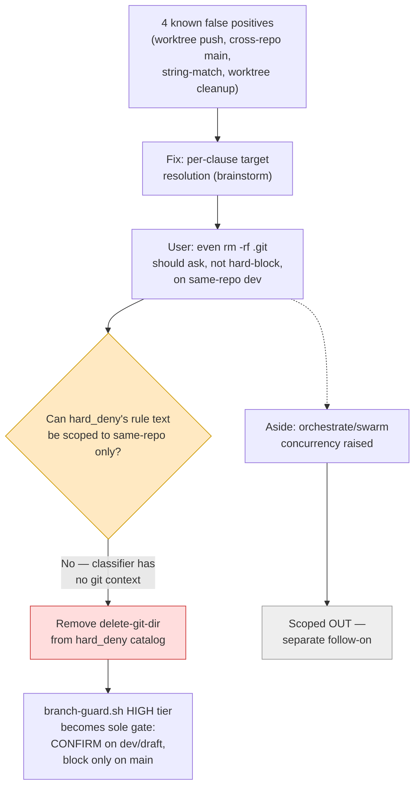

# Report: Branch Guard — Architecture, Rules, and Known Problems

**Date:** 2026-07-14 · **Scope:** craft's two-hook Guard Suite (`branch-guard.sh` + `no-switch-guard.sh`)
**Companions:** [BRAINSTORM-branch-guard-target-resolution-2026-07-14.md](../../BRAINSTORM-branch-guard-target-resolution-2026-07-14.md) (proposed fix) · [GRILL-branch-guard-target-resolution-2026-07-14.md](GRILL-branch-guard-target-resolution-2026-07-14.md) (interrogation + locked decisions)

## 1. What It Is

`branch-guard.sh` (955 lines, `~/.claude/hooks/`) is a Claude Code
`PreToolUse` hook that enforces branch protection on every `Edit`/`Write`/
`Bash` tool call. It reads JSON on stdin (`tool_name`, `tool_input`, `cwd`),
resolves the current git branch, classifies the action into one of three
risk tiers, and exits `0` (allow) or `2` (block, message on stderr).

It is paired with `no-switch-guard.sh` (125 lines), which specifically
guards branch/worktree switches (`git checkout`, `git switch`,
`git worktree add|remove|move`). Both share a registry at
`~/.claude/guards.json` and a `--classify` / `GUARD_DRY_RUN=1` dry-run mode.

A fourth, independent layer — `autoMode.hard_deny` in
`~/.claude/settings.json` — sits **above** both hooks, enforced by the
Claude Code classifier itself before any tool call runs, with no bypass.

## 2. The Rule Model

### 2.1 Three risk tiers (branch-guard.sh)

| Tier | Marker | Behavior | Approvable? |
|---|---|---|---|
| **LOW** | `[guard]` | Note once, then silent | Auto-allowed |
| **MEDIUM** | `[CONFIRM]` | Teaching box, asks user | Yes — one-shot |
| **HIGH** | `CATASTROPHIC` | Hard block | No — only by removing the hook |

### 2.2 What triggers each tier

**LOW (auto-allow):** editing an existing file, writing `.md`, writing
extensionless project files (`.STATUS`, `Makefile`, `Dockerfile`,
`LICENSE`), writing under `tests/`, overwriting a file that already exists.

**MEDIUM (confirm):** creating a *new* code file (`.py .sh .js .ts .json
.yml` …) via `Write`; the same via Bash write-through (`echo > new.py`,
`tee`, `cp x new.py`); `git push --force` / `--force-with-lease`;
`git reset --hard`; `git checkout -- <file>`; `git restore <file>`
(non-`--staged`); `git clean -f/-fd/-fx`; `git branch -D`; touching
critical files (`.env*`, `*.pem`, `*.key`, `*.secret`,
`branch-guard.json`).

**HIGH (hard block):** `rm -rf .git` — the only unconditional hard block
inside branch-guard.sh itself, on any branch.

### 2.3 Branch protection map (defaults)

| Branch | Protection | Effect |
|---|---|---|
| `main` | `block-all` | Everything blocked — PR-only, no confirm, no bypass except removing the hook |
| `dev` | `smart` (aka `confirm`, aka deprecated alias `block-new-code`) | 3-tier LOW/MEDIUM/HIGH as above |
| `feature/*` | *(empty)* | No protection — hook is inactive |

### 2.4 hard_deny layer (v2.33.0+, unconditional)

| Rule ID | Blocks | Bypass |
|---|---|---|
| `force-push-main` | Force push to `main`/`master`/protected primary | **None** |
| `delete-git-dir` | Recursive deletion of `.git` | **None** |
| `delete-github-repo` | `gh repo delete` and API equivalents | **None** |
| `destroy-claude-config` | Recursive deletion of `~/.claude` | **None** |

This survives `.claude/allow-once` and `/craft:git:unprotect` — it is
enforced by the classifier, not by branch-guard.sh, so branch-guard's own
bypass mechanisms can't reach it.

Deliberately **not** in hard_deny (left to smart-tier judgment instead):
hard reset to `origin/main` (legitimate on feature branches),
`find . -delete` (classifier can't see filter args), pipeline-driven
removal via `xargs rm` (depends on upstream pipeline), and discarding
uncommitted changes (`git checkout .` / `git restore .` — annoying but
recoverable from stash/reflog).

### 2.5 Bypass mechanisms

- **One-shot** (`[CONFIRM]` → user approves → `.claude/allow-once` written
  → consumed on next hook call → protection resumes).
- **Session bypass** (`/craft:git:unprotect [reason]` → all guards off
  until `/craft:git:protect` or session end).

## 3. Enforcement Flow

See the companion visual Artifact (published earlier this session) for the rendered flowchart. Textual walk:
stdin JSON → extract `tool_name`/`file_path`/`command` → check
`~/.claude/guards.json` mute registry (catastrophic checks are never
muteable) → resolve current branch via session CWD → look up protection
level for that branch → classify the specific file/command against
LOW/MEDIUM/HIGH → LOW auto-allows, MEDIUM emits `[CONFIRM]` (Claude relays
to user, writes `allow-once` on yes), HIGH exits 2 unconditionally.

## 4. Known Problems (current session's focus)

All four are **target-resolution** bugs, not rule-model bugs — the hook
infers "what branch/repo does this command target" from session CWD plus
whole-string matching, rather than resolving each git-subcommand's actual
target:

| # | Scenario | Root cause |
|---|---|---|
| 1 | Session on `dev`, `cd <worktree> && git push` | Hook reads branch from session CWD (`dev`), ignoring that `cd` inside the command retargets to the worktree's own branch |
| 2 | Session on `main`, cross-repo push to an unrelated sibling repo | Hook still sees session branch `main` and blocks, even though the command targets a different repository entirely |
| 3 | Compound command containing the literal string `main` (e.g. `git pull origin main && git push origin dev`) | Substring match on `"main"` over the whole command line, not per-clause |
| 4 | `git worktree remove ... && git branch -D ...` | Blocked as a single unit; the branch-delete clause isn't independently checked against actual merge state |

**Proposed fix** (locked in the companion brainstorm): split compound
commands on `&&`/`;`/`\|\|`, resolve each git-touching clause's actual
target from its own args (`-C`, leading `cd`, remote+refspec), classify
each clause independently. Cross-repo `main` case downgrades to
`[CONFIRM]` rather than a hard block, per explicit user decision this
session ("I do not want hard gate to disrupt"). Full detail, rejected
alternatives, and test plan: see the companion BRAINSTORM doc.

## 5. Solutions (locked via grill, 2026-07-14)

The grill pass widened scope from pure parsing bugs into a policy question
— and surfaced a real contradiction along the way, worth reading in full
in the GRILL ledger. Summary:

### 5.1 Fix set

| # | Problem | Fix | Where it lives |
|---|---|---|---|
| A | #1–#4 target-resolution false positives | Per-clause split + resolve (`-C`, `cd`, remote+refspec), classify each clause independently | `branch-guard.sh` internals |
| B | Cross-repo `main` false hard-block | Downgrade to `[CONFIRM]`, never hard-block a cross-repo target | `branch-guard.sh` MEDIUM tier |
| C | `rm -rf .git` un-confirmable even on same-repo dev/draft | **Remove `delete-git-dir` from the hard_deny catalog.** branch-guard.sh's own HIGH tier becomes the sole gate: `[CONFIRM]` on dev/draft, hard block only on `main` | `scripts/hard-deny-rules.json` + `/craft:git:protect` install list |

### 5.2 Why C required removing hard_deny, not scoping it

The natural first idea — keep `delete-git-dir` in hard_deny but scope its
rule text to "same-repo only" — was **rejected on adversarial review**.
hard_deny is enforced by the Claude Code classifier against command *text*
alone, before any hook runs; it has no git execution context (no cwd
resolution, no way to check "does this target the session's own repo?").
A same-repo carve-out is something the classifier structurally cannot
verify. The only implementable fix is global: pull `rm -rf .git`
protection out of the bypass-proof classifier layer entirely and let
branch-guard.sh (which *does* have real git context) own it. **Cost:**
the "survives a forgotten session bypass" guarantee is lost everywhere
`delete-git-dir` used to apply — cross-repo and main-adjacent cases
included — not just the same-repo-dev case that motivated the ask.

### 5.3 Explicitly deferred

- **Concurrency-safety for Workflow/orchestrate-dispatched agents** racing
  on shared guard state (`.claude/allow-once`, `guards.json`) — a
  genuinely separate failure class (races, not target-resolution). Scoped
  to its own follow-on brainstorm/grill; first step there is *confirming*
  the race is real (markers may already be session/worktree-scoped) before
  designing a fix.

### 5.4 Open questions carried into implementation (not locked)

- Whether the per-clause resolver needs **cumulative cwd tracking** (a
  bare `cd <path> &&` clause updates the effective target for every clause
  after it) — without this, problem #1 (worktree push) only downgrades to
  confirm rather than resolving correctly. Left for the implementer.
- **Rollout blast radius** of removing `delete-git-dir` from hard_deny —
  affects every craft install that ran `/craft:git:protect` with hard_deny
  enabled, not just this repo. Not sized during the grill.

## 6. Decision Flow (this session)

## 7. Sources

- `~/.claude/hooks/branch-guard.sh` (live, 955 lines) — current implementation
- `docs/reference/REFCARD-BRANCH-GUARD.md` (craft v2.61.2 cache) — tier tables, bypass mechanisms
- `docs/adr/ADR-001-workflow-branch-guard.md` — original design rationale
- `~/.claude/CLAUDE.md` "Branch Guard & Git Hooks" — documented false-positive workarounds (source of problems #1–#4 above)
- `PROPOSAL-branch-guard-improvements.md` (2026-02-13, v2.16.0) — **stale**, predates confirm-mode/hard_deny; superseded, not reused except as historical context
- `docs/specs/GRILL-branch-guard-target-resolution-2026-07-14.md` — interrogation ledger, source of §5–6 above
