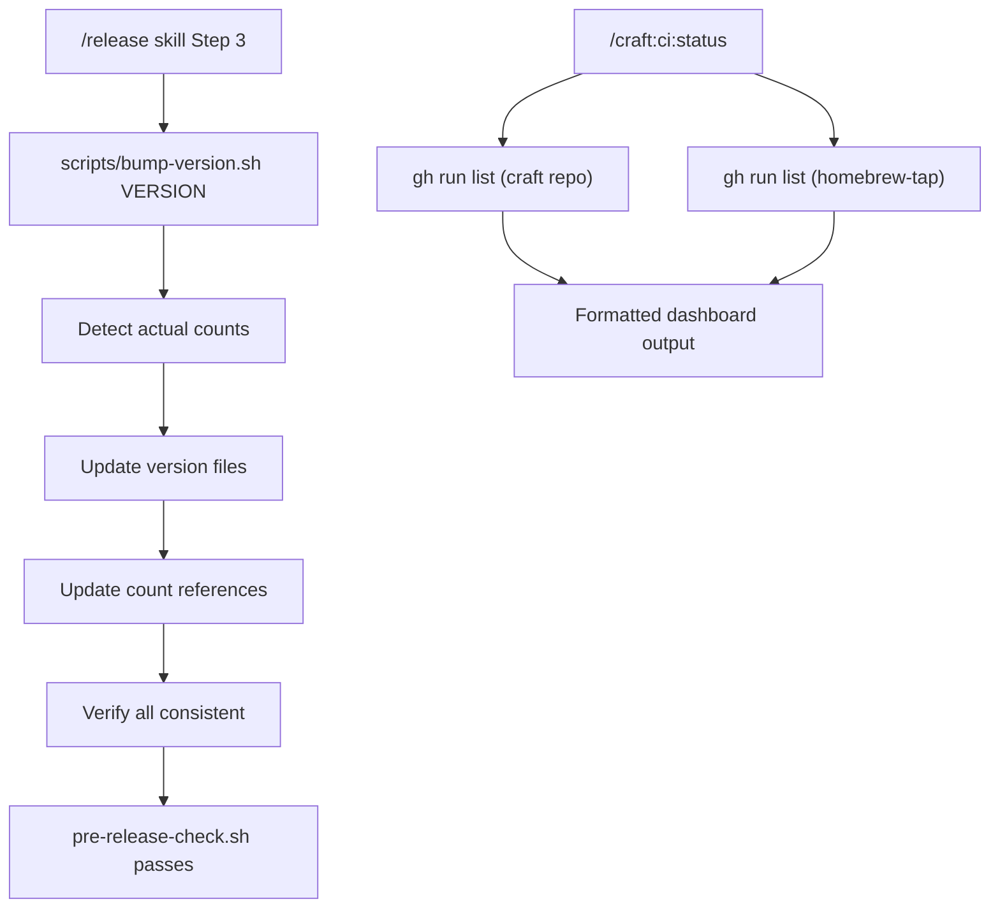

# SPEC: Version Bump Script + CI Status Dashboard

**Status:** approved
**Created:** 2026-02-19
**Approved:** 2026-02-19
**From Brainstorm:** BRAINSTORM-homebrew-release-fix-2026-02-19.md

## Overview

Create a `scripts/bump-version.sh` script that atomically bumps version numbers AND syncs command/skill/agent counts across all project files. Also create a `/craft:ci:status` dashboard command showing cross-repo CI status. These changes prevent the class of release failures where marketplace.json or other version files drift out of sync.

## Primary User Story

As a **plugin maintainer**, I want a single command that bumps ALL version references so that releases never fail due to forgotten files like marketplace.json.

### Acceptance Criteria

- [ ] `./scripts/bump-version.sh 2.23.0` updates all 8+ version files atomically
- [ ] `./scripts/bump-version.sh 2.23.0 --dry-run` previews changes without writing
- [ ] `./scripts/bump-version.sh --counts-only` syncs counts without version bump
- [ ] `/craft:ci:status` shows all workflows across craft + homebrew-tap repos
- [ ] Release skill Step 3 calls bump-version.sh instead of manual edits
- [ ] Pre-release-check.sh passes after bump-version.sh runs (zero drift)

## Secondary User Stories

### CI Visibility

As a **maintainer**, I want to see all CI workflow statuses in one view so I can quickly spot failures like the homebrew-release that failed silently for 2 releases.

### Count Drift Prevention

As a **maintainer**, I want command/skill/agent counts auto-synced during version bump so "111 commands" vs "107 commands" drift never recurs.

## Architecture



## Component A: `scripts/bump-version.sh`

### Files to Update

| File | Version Field | Count Fields |
|------|--------------|-------------|
| `.claude-plugin/plugin.json` | `version` | `description` (commands, agents, skills) |
| `.claude-plugin/marketplace.json` | `metadata.version` + `plugins[0].version` | `metadata.description` + `plugins[0].description` |
| `package.json` | `version` | `description` |
| `CLAUDE.md` | "Current Version: vX.Y.Z" line | "**NNN commands**" line |
| `README.md` | version badge `version-X.Y.Z` | stats line |
| `docs/index.md` | version references | command count references |
| `mkdocs.yml` | `site_description` version | `site_description` counts |
| `.STATUS` | version line | stats line |

### Interface

```bash
# Full bump (version + counts)
./scripts/bump-version.sh 2.23.0

# Dry-run preview
./scripts/bump-version.sh 2.23.0 --dry-run

# Counts only (no version change)
./scripts/bump-version.sh --counts-only

# Verify current state (exit 0 if consistent, 1 if drift)
./scripts/bump-version.sh --verify
```

### Implementation Notes

- Use Python for JSON manipulation (plugin.json, marketplace.json, package.json)
- Use sed for text file updates (CLAUDE.md, README.md, docs/*, mkdocs.yml)
- Count detection reuses logic from `validate-counts.sh`:

  ```bash
  CMD_COUNT=$(find commands -name "*.md" ! -name "index.md" ! -name "README.md" | wc -l | tr -d ' ')
  SKILL_COUNT=$(find skills -name "*.md" -o -name "SKILL.md" | wc -l | tr -d ' ')
  AGENT_COUNT=$(find agents -name "*.md" | wc -l | tr -d ' ')
  ```

- `--dry-run` prints each file + what would change, exits 0
- `--verify` runs the same checks as pre-release-check.sh (version + counts consistency)
- Exit codes: 0 = success, 1 = drift found (--verify), 2 = usage error

### Edge Cases

- marketplace.json might not exist (not all projects use it) — skip gracefully
- Some files may have multiple version references (docs/index.md) — update all
- Count patterns like "107 commands" appear in many docs files — only update canonical files listed above, not tutorials/cookbooks (those are documentation, not metadata)

## Component B: `/craft:ci:status` Command

### Output Format

```
┌─────────────────────────────────────────────────────────────┐
│ CI Status Dashboard                                          │
├─────────────────────────────────────────────────────────────┤
│                                                             │
│ Data-Wise/craft                                             │
│   Craft CI (main)          ✅ passed    2 min ago           │
│   Craft CI (dev)           ✅ passed    2 min ago           │
│   Deploy Documentation     ✅ passed    3 min ago           │
│   Documentation Quality    ✅ passed    3 min ago           │
│   Homebrew Release         ❌ FAILED    5 hours ago         │
│   Validate Dependencies    ✅ passed    3 min ago           │
│                                                             │
│ Data-Wise/homebrew-tap                                      │
│   Update Formula           ✅ passed    1 day ago           │
│                                                             │
├─────────────────────────────────────────────────────────────┤
│ ❌ 1 failure: Homebrew Release (v2.22.0)                     │
│    → marketplace.json version mismatch                       │
│    → Fix: Run ./scripts/bump-version.sh before tagging       │
└─────────────────────────────────────────────────────────────┘
```

### Implementation

- Uses `gh run list` for both repos
- Shows last run per workflow, color-coded
- Failure section at bottom with one-line diagnosis
- Supports `--json` output for scripting

### Command File

`commands/ci/status.md` — new command in the existing `ci/` category.

## Component C: Release Skill Update

### Changes to `skills/release/SKILL.md`

**Step 3 (Version Bump):** Replace manual file-by-file instructions with:

```bash
./scripts/bump-version.sh <version>
```

**Step 8.5 (Post-Release):** Add verification that homebrew-release workflow succeeded:

```bash
# After GitHub release is created, poll homebrew-release workflow
sleep 30
gh run list --repo Data-Wise/craft --workflow=homebrew-release.yml --limit 1 \
  --json status,conclusion --jq '.[0]'
```

## Dependencies

- `gh` CLI (already required)
- `python3` (already required for pre-release-check.sh)
- `jq` (optional, for JSON formatting in ci:status)

## UI/UX Specifications

N/A — CLI only (terminal output with box-drawing characters).

## Component D: Workflow Robustness Fix

### `update-formula.yml` (homebrew-tap)

The "Direct push to main" step fails with exit 1 when there's nothing to commit (formula already up to date). Fix:

```bash
# Replace: git commit -m "..."
# With:
git diff --quiet Formula/${FORMULA_NAME}.rb && echo "Formula already up to date" && exit 0
git add "Formula/${FORMULA_NAME}.rb"
git commit -m "${FORMULA_NAME}: update to v${VERSION}"
```

This handles the idempotent case where the formula was already updated (e.g., manual fix before workflow re-run).

## Open Questions

1. Should bump-version.sh also update tutorial/cookbook files that reference counts, or just canonical metadata files?
2. Should /craft:ci:status also show the docs-sync workflow (manual trigger only)?

## Review Checklist

- [ ] bump-version.sh handles all 8 version files
- [ ] bump-version.sh --dry-run shows diff without writing
- [ ] bump-version.sh --counts-only updates counts in all files
- [ ] bump-version.sh --verify exits non-zero on drift
- [ ] /craft:ci:status shows both repos
- [ ] /craft:ci:status failure section shows diagnosis
- [ ] Release skill Step 3 uses bump-version.sh
- [ ] Release skill Step 8.5 verifies homebrew-release
- [ ] Tests pass for bump-version.sh (unit tests)
- [ ] pre-release-check.sh passes after bump-version.sh

## Implementation Notes

- bump-version.sh should be idempotent (running twice with same version = no changes)
- The script should detect the project type (craft plugin, Python, Node) and adjust which files it updates
- For craft plugin projects, the canonical count source is always the filesystem (find commands)
- The --verify flag makes this script a superset of validate-counts.sh (could eventually replace it)

## History

| Date | Change |
|------|--------|
| 2026-02-19 | Initial draft from brainstorm session |
| 2026-02-19 | Approved — review notes: add REFCARD.md to files table, handle package.json conditionally, close Q1 (already answered in edge cases) |
