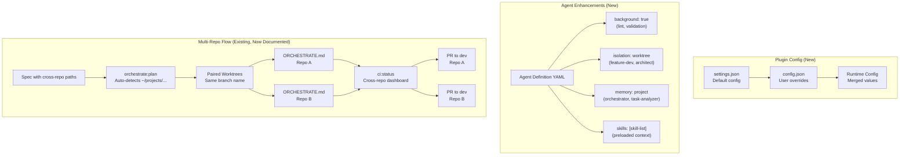
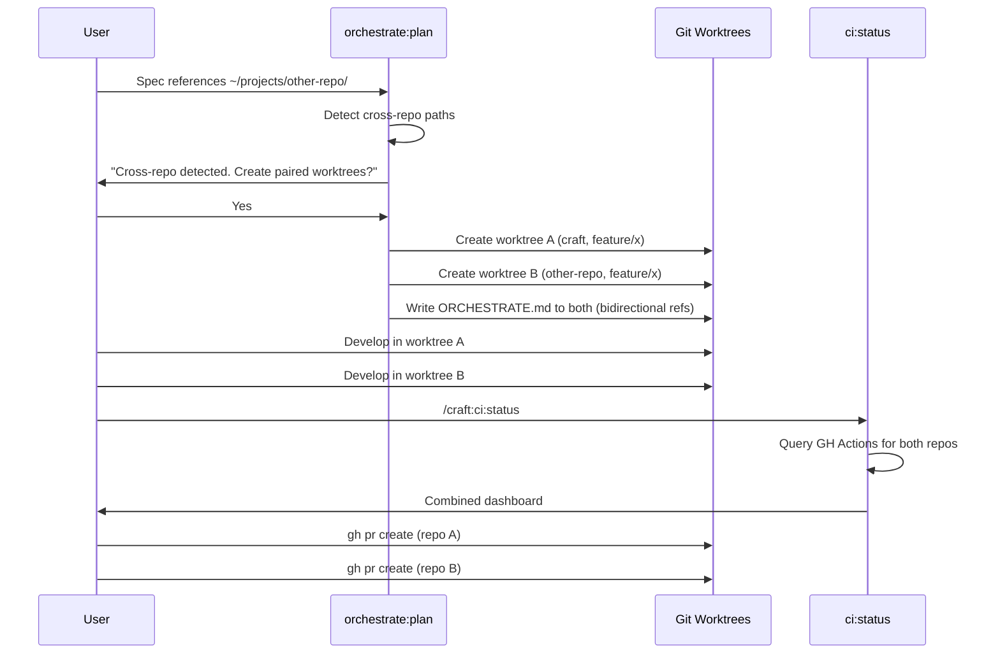

# SPEC: Claude Code v2.1.49 Feature Integration

**Status:** draft
**Created:** 2026-02-20
**From Brainstorm:** `BRAINSTORM-claude-code-integration-2026-02-20.md`
**Author:** DT + Claude

---

## Overview

Integrate three Claude Code v2.1.49 platform features into craft's existing command and agent system: (1) plugin `settings.json` to eliminate manual config setup, (2) agent enhancements (`background`, `isolation: "worktree"`, `memory`, `skills` fields), and (3) comprehensive multi-repo coordination documentation including a walkthrough guide, architecture diagram, and improved command discovery. Also document the worktree path difference between craft's `~/.git-worktrees/` (recommended) and Claude's native `.claude/worktrees/`.

---

## Primary User Story

**As a** craft plugin user managing multi-repo projects with Claude Code,
**I want** craft to leverage Claude Code's latest agent isolation, background execution, and memory features while providing clear documentation for cross-repo workflows,
**So that** I can work on multi-repo features in parallel with less setup friction and full understanding of the coordination tools available.

### Acceptance Criteria

- [ ] Plugin ships `settings.json` with default budget and mode config
- [ ] `.claude-plugin/config.json` manual setup is no longer required for defaults
- [ ] Existing config.json overrides still work (user customization preserved)
- [ ] At least 2 craft agents declare `background: true` (validation/lint agents)
- [ ] At least 3 craft agents declare `isolation: "worktree"` (code-modifying agents)
- [ ] Orchestration agents have `memory: project` for cross-session knowledge
- [ ] Agents with `skills` field preload relevant skills at startup
- [ ] New standalone multi-repo workflow guide exists in docs/guide/
- [ ] Guide includes end-to-end walkthrough: spec -> orchestrate:plan -> paired worktrees -> ci:status -> PRs
- [ ] Mermaid architecture diagram shows multi-repo detection, worktree pairing, and CI flow
- [ ] Worktree path comparison documented in /craft:git:worktree and refcard
- [ ] `worktree-advanced-patterns.md` includes cross-repo section
- [ ] MkDocs nav groups multi-repo docs together
- [ ] All existing unit tests still pass (13/13)

---

## Secondary User Stories

### Plugin First-Timer

**As a** developer installing craft for the first time,
**I want** sensible defaults to work without any config file creation,
**So that** I can start using commands immediately after `claude plugin add craft`.

### Parallel Workflow User

**As a** developer running multiple agents on the same codebase,
**I want** agents to work in isolated worktrees automatically,
**So that** parallel changes don't conflict and failures don't corrupt my working tree.

### Multi-Repo Developer

**As a** developer working on features that span craft + another repository,
**I want** clear documentation showing how orchestrate:plan auto-detects cross-repo specs and creates paired worktrees,
**So that** I don't have to manually coordinate branches and worktrees across repos.

---

## Architecture



---

## Increments

### Increment 1: Plugin settings.json (Quick Win)

**Files to create:**

- `settings.json` (plugin root, alongside plugin.json)

**Contents:**

```json
{
  "claude_md_budget": 150,
  "default_mode": "default",
  "debug_mode": false
}
```

**Migration:**

- Users with existing `.claude-plugin/config.json` keep their overrides
- New users get defaults from `settings.json` automatically
- Update utilities (`claude_md_optimizer.py`, `claude_md_sync.py`, `claude-md-budget-check.sh`) to check `settings.json` in the resolution chain: config.json -> settings.json -> package.json -> hardcoded default

### Increment 2: Agent Background & Isolation

**Files to modify:** Agent definitions in `.claude/agents/` (or equivalent craft agent configs)

**Changes:**

| Agent | Add `background` | Add `isolation` | Rationale |
|-------|------------------|-----------------|-----------|
| code-reviewer | - | `worktree` | Code analysis should be isolated |
| feature-dev | - | `worktree` | Feature code changes need isolation |
| backend-architect | - | `worktree` | Architecture changes need isolation |
| orchestrator-v2 | - | - | Coordinates, doesn't modify code |
| docs-architect | `true` | - | Long-running, non-blocking |
| reference-builder | `true` | - | Long-running, non-blocking |

### Increment 3: Agent Memory & Skills

**Files to modify:** Same agent definitions

**Changes:**

| Agent | Add `memory` | Add `skills` | Rationale |
|-------|-------------|-------------|-----------|
| orchestrator-v2 | `project` | `[session-state, task-analyzer]` | Needs cross-session knowledge + orchestration skills |
| task-analyzer | `project` | `[mode-controller]` | Remembers project patterns |
| feature-dev | - | `[test-generator]` | Preloads test generation for feature work |
| backend-architect | - | `[system-architect]` | Preloads architecture patterns |

### Increment 4: Multi-Repo Documentation

**Files to create:**

- `docs/guide/multi-repo-workflow.md` - Standalone end-to-end guide

**Files to modify:**

- `docs/guide/worktree-advanced-patterns.md` - Add cross-repo section
- `mkdocs.yml` - Add multi-repo nav grouping
- `ROADMAP.md` - Clarify what's built vs planned

**Guide structure:**

1. When to use cross-repo coordination
2. Writing specs that trigger auto-detection (the `~/projects/dev-tools/<name>/` pattern)
3. What `orchestrate:plan` does when it detects cross-repo references
4. Paired worktrees with bidirectional ORCHESTRATE references
5. Branch name enforcement across repos
6. Using `ci:status` to monitor both repos
7. Coordinating PRs

**Mermaid diagram** (embedded in guide):



### Increment 5: Worktree Path Documentation

**Files to modify:**

- `commands/git/worktree.md` - Add comparison table
- `docs/reference/REFCARD-GIT-WORKTREE.md` - Add comparison section

**Comparison table:**

| Aspect | Craft (`~/.git-worktrees/`) | Claude Native (`.claude/worktrees/`) |
|--------|----------------------------|--------------------------------------|
| Location | Global, outside repo tree | Inside repo `.claude/` directory |
| Scope | Cross-project accessible | Per-repo only |
| Auto-cleanup | Manual (`git worktree remove`) | Auto-removed if no changes |
| Branch source | Explicit (usually `dev`) | Default remote branch |
| Command | `/craft:git:worktree` | `claude -w <name>` |
| Recommendation | **Primary** - explicit control | Alternative for quick tasks |

---

## API Design

N/A - No API changes. All changes are configuration files, agent definitions, and documentation.

---

## Data Models

N/A - No data model changes.

---

## Dependencies

| Dependency | Version | Purpose |
|------------|---------|---------|
| Claude Code | >= v2.1.49 | `settings.json`, agent `background`/`isolation`/`memory`/`skills` fields |
| MkDocs | existing | Documentation site build |
| GitHub Actions | existing | CI status queries |

---

## UI/UX Specifications

N/A - CLI plugin, no UI changes. Documentation improvements are the UX improvement.

---

## Open Questions

1. **settings.json schema** - Does Claude Code validate settings.json contents, or is it free-form JSON? Need to test.
2. **Agent isolation behavior** - When an agent with `isolation: "worktree"` finishes with changes, does it auto-commit or leave uncommitted files? Need to verify.
3. **Memory persistence scope** - Does `memory: project` survive across different worktrees of the same repo?
4. **Skills preloading** - What's the context budget impact of preloading skills into agents?

---

## Review Checklist

- [ ] All acceptance criteria addressed
- [ ] settings.json ships with plugin and utilities read it
- [ ] Agent definitions updated with new fields
- [ ] Multi-repo guide is comprehensive and navigable
- [ ] Mermaid diagrams render correctly in MkDocs
- [ ] Worktree comparison is clear and recommends craft's approach
- [ ] Existing 13 unit tests pass
- [ ] MkDocs nav updated with multi-repo grouping
- [ ] No broken internal links

---

## Implementation Notes

- **Increment order matters**: settings.json (1) is independent. Agent fields (2-3) are independent of docs (4-5). Can parallelize.
- **Testing the new agent fields** requires Claude Code v2.1.49+ - verify user's version in the worktree session.
- **The multi-repo guide** should be the canonical landing page - other docs should link to it rather than duplicating content.
- **ROADMAP.md** should distinguish: "Cross-repo worktree coordination" (built, v2.15.0+) from "Monorepo distribution support" (planned).

---

## History

| Date | Change |
|------|--------|
| 2026-02-20 | Initial draft from brainstorm session |
