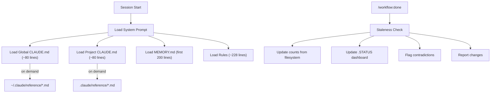

# SPEC: CLAUDE.md & Memory System Refactor

**Status:** WIP
**Created:** 2026-02-18
**From Brainstorm:** `BRAINSTORM-claude-md-refactor-2026-02-18.md`
**Author:** DT + Claude

---

## Overview

Restructure Claude Code's instruction hierarchy from a flat, scattered 819-line system across 6 files into a layered architecture: lean behavioral CLAUDE.md files (~80 lines each) + reference files loaded on demand + per-project rules + auto-updated .STATUS dashboard. Integrate CLAUDE.md maintenance into the `/workflow:done` trigger.

---

## Primary User Story

**As a** developer managing 16+ projects with Claude Code,
**I want** my instruction files lean, accurate, and auto-maintained,
**So that** Claude loads only relevant behavioral rules (not reference material), counts stay fresh, and I have one trigger (`/workflow:done`) to keep everything in sync.

### Acceptance Criteria

- [ ] Global CLAUDE.md reduced to ~80 lines of behavioral rules only
- [ ] Reference material (MCP servers, plugins, keybinds, shell aliases) moved to `~/.claude/reference/` files
- [ ] Craft CLAUDE.md reduced to ~80 lines with auto-generated counts
- [ ] Reference sections (agents, tests, project structure) moved to `.claude/reference/` files
- [ ] Memory behavioral rules promoted to `~/.claude/rules/spec-only-mode.md`
- [ ] `claude-code-instruction-enforcement.md` archived out of memory/
- [ ] .STATUS auto-updates on `/workflow:done`: branch status, version, last session, next action
- [ ] `/workflow:done` triggers CLAUDE.md staleness check
- [ ] No stale counts in any CLAUDE.md file after sync
- [ ] Context budget reduced from ~8300 tokens to ~4000 tokens per session

---

## Secondary User Stories

### Instruction Discoverability

**As a** developer debugging why Claude ignores a rule,
**I want** to see all active instruction sources in one view,
**So that** I can find contradictions and understand the loading order.

### Per-Project Rules

**As a** developer with diverse project types,
**I want** rules scoped to specific projects,
**So that** brainstorm formatting rules don't load for R packages and spec-only rules apply everywhere.

---

## Architecture



### File Hierarchy (After Refactor)

```
~/.claude/
├── CLAUDE.md                  # ~80 lines: git workflow, safety rules, commit standards
├── reference/                 # NEW: on-demand reference material
│   ├── mcp-servers.md         # MCP server table (from global CLAUDE.md L75-89)
│   ├── plugins.md             # Plugin list (from global CLAUDE.md L93-97)
│   ├── shell-workflow.md      # ADHD commands, teaching, research (from L60-71)
│   ├── email-neovim.md        # Himalaya + keybinds (from L126-144)
│   └── release-automation.md  # Homebrew/PyPI pipelines (from L108-115)
├── rules/
│   ├── brainstorm-mode.md     # Trimmed: ~120 lines (from 167)
│   ├── feature-branch-workflow.md  # Unchanged (61 lines)
│   └── spec-only-mode.md     # NEW: promoted from memory
└── projects/*/memory/         # Pruned: remove stale worktree memories

craft/
├── CLAUDE.md                  # ~80 lines: workflow, key commands, troubleshooting
├── .claude/
│   └── reference/             # NEW: auto-generated project details
│       ├── agents.md          # Agent table
│       ├── test-suite.md      # Test commands + counts
│       └── project-structure.md  # Tree, key files, version history
└── .STATUS                    # Auto-updated living dashboard
```

---

## API Design

### /workflow:done Enhancement

Add CLAUDE.md maintenance as a step in the done workflow:

| Step | What it does |
|------|-------------|
| Existing steps | ... |
| **NEW: CLAUDE.md sync** | Run `claude_md_sync.py` to update counts |
| **NEW: .STATUS refresh** | Update branch status, version, last_session, next action |
| **NEW: Staleness report** | Flag any CLAUDE.md sections with stale data |

### /craft:check Enhancement

Add instruction health to pre-flight checks:

| Check | What it validates |
|-------|------------------|
| CLAUDE.md line count | Both global (<100) and project (<100) within budget |
| Count accuracy | Commands, skills, agents, specs, tests match filesystem |
| Memory staleness | Flag memories older than 30 days with no updates |
| Rule conflicts | Detect contradictions between global + project + memory |

---

## Data Models

N/A - No data model changes. File-based configuration only.

---

## Dependencies

| Dependency | Purpose | Required? |
|------------|---------|-----------|
| `claude_md_sync.py` | Existing sync utility | Yes (enhance) |
| `validate-counts.sh` | Existing count validator | Yes (reuse) |

---

## UI/UX Specifications

### Staleness Report (shown by /workflow:done)

```
CLAUDE.md Health Check
======================
Global (~/.claude/CLAUDE.md):
  ✅ 78 lines (budget: 100)
  ✅ No contradictions with project CLAUDE.md

Craft (CLAUDE.md):
  ✅ 82 lines (budget: 100)
  ✅ Counts match filesystem
  ⚠  Version history section 2 releases behind

.STATUS:
  ✅ Updated: branch status, version, last_session

Memory:
  ✅ 36 lines (budget: 200)
  ⚠  claude-code-instruction-enforcement.md not updated in 12 days
```

---

## Open Questions

1. ~~Should `~/.claude/reference/` files be gitignored or tracked?~~ **RESOLVED:** Gitignored — they live in `~/.claude/` which is user-private. Not version-controlled.
2. ~~Should per-project rules live in `.claude/rules/` (gitignored) or `rules/` (tracked)?~~ **RESOLVED:** Use `.claude/rules/` — Claude Code supports this natively, gitignored by default. Consistent with existing `.claude/` convention.
3. ~~Should `.STATUS` auto-update happen via hook (SessionStart) or command (/workflow:done)?~~ **RESOLVED:** `/workflow:done` trigger — user's explicit preference from brainstorm session. Single trigger point for all maintenance.
4. ~~Should orphan worktree memory files be auto-pruned or require manual cleanup?~~ **RESOLVED:** Manual cleanup — safer, low priority. Can revisit if orphan count grows.

---

## Review Checklist

- [ ] Spec reviewed by stakeholder
- [ ] Architecture diagram accurate
- [ ] No behavioral rules lost during restructuring
- [ ] Migration path clear (can rollback if layering causes issues)
- [ ] Backward compatible with existing /craft:docs:claude-md:sync
- [ ] Context budget reduction measured (target: ~50%)

---

## Implementation Notes

### Phase 1: Quick Wins (Priority: HIGH, < 30 min)

- Fix 5 stale counts in craft CLAUDE.md
- Archive `claude-code-instruction-enforcement.md` to `docs/reference/`
- Promote memory rules to `~/.claude/rules/spec-only-mode.md`
- Remove `--delete-branch` duplication from MEMORY.md
- Update .STATUS with current session info

### Phase 2: Global CLAUDE.md Layering (Priority: HIGH)

- Extract reference material (~120 lines) to `~/.claude/reference/` files
- Rewrite global CLAUDE.md as behavioral rules only (~80 lines)
- Trim brainstorm-mode.md AppleScript section (50 -> 10 lines)
- Verify no behavioral rules lost in extraction

### Phase 3: Craft CLAUDE.md Layering (Priority: HIGH)

- Extract agents, test suite, project structure to `.claude/reference/`
- Auto-generate reference files from filesystem state
- Enhance `claude_md_sync.py` to populate reference files
- Rewrite craft CLAUDE.md as workflow + commands + troubleshooting (~80 lines)

### Phase 4: Workflow Integration (Priority: MEDIUM)

- Add CLAUDE.md staleness check to `/workflow:done`
- Add .STATUS auto-refresh to `/workflow:done`
- Add instruction health check to `/craft:check`
- Add count accuracy validation to both

### Phase 5: Per-Project Rules (Priority: LOW)

- Support `.claude/rules/` in project directories
- Rules load alongside global `~/.claude/rules/`
- Different projects get different rules
- Document rule loading order

---

## History

| Date | Change |
|------|--------|
| 2026-02-18 | Initial draft from max brainstorm (deep + 2 agents) |
| 2026-02-18 | Resolved all 4 open questions during spec review |
| 2026-02-18 | Spec approved for implementation |
