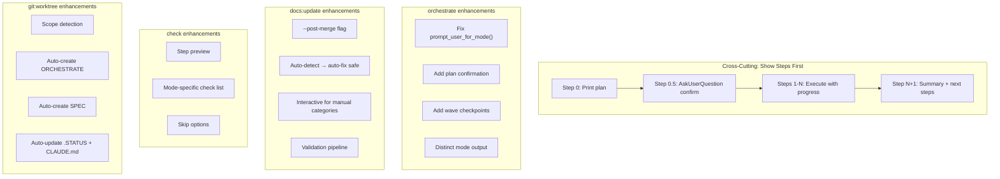
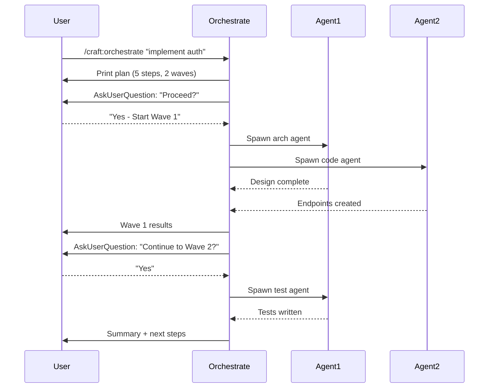

# SPEC: Command Behavior Enhancements

**Status:** draft
**Created:** 2026-01-29
**From Brainstorm:** BRAINSTORM-command-enhancements-2026-01-29.md
**Target Release:** v2.9.0 (or v2.10.0)
**Branch:** `feature/v2.9.0` (worktree: `~/.git-worktrees/craft/feature-v2.9.0`)

---

## Overview

Enhance the four most-used craft commands (orchestrate, docs:update, check, git:worktree) with consistent interactive behavior: show planned steps before execution, ask before proceeding, and enforce mode-specific behavior differences. Adds post-merge documentation automation and worktree auto-setup.

---

## Primary User Story

**As a** craft plugin user,
**I want** commands to show me what they'll do before doing it and ask for confirmation,
**So that** I can review the plan, catch skipped steps, and modify the approach before execution.

### Acceptance Criteria

- [ ] All 4 commands show numbered step plan before execution
- [ ] `AskUserQuestion` used for confirmation at key decision points
- [ ] Orchestrate asks for mode selection when not specified
- [ ] Orchestrate pauses between waves for review
- [ ] docs:update supports `--post-merge` for automated post-merge workflow
- [ ] git:worktree auto-creates workflow files based on scope
- [ ] check shows plan preview with mode-specific check list
- [ ] Execution modes produce visibly different output

---

## Secondary User Stories

### Orchestrate user running complex tasks

**As a** developer orchestrating multi-agent tasks,
**I want** checkpoints between waves where I can review results and adjust,
**So that** I'm not locked into a plan that may need course correction.

### Developer after PR merge

**As a** developer who just merged a feature PR,
**I want** documentation to auto-detect what needs updating and apply safe fixes,
**So that** docs stay current without me remembering to run update manually.

### Developer starting a feature branch

**As a** developer creating a worktree for a new feature,
**I want** the worktree to come pre-configured with an orchestration plan and spec,
**So that** I can start working immediately with proper documentation structure.

---

## Architecture



---

## API Design

N/A -- CLI command enhancements, no API changes.

---

## Data Models

N/A -- No data model changes.

---

## Dependencies

No new external dependencies. All enhancements modify existing command markdown files and the orchestrator-v2 agent definition.

---

## UI/UX Specifications

### User Flow: Orchestrate with Step Preview



### Wireframe: Step Preview

```text
/craft:orchestrate "implement auth"

Orchestration Plan:
  Task: implement auth
  Mode: default (2 agents, 70% compression)
  Complexity: 7/10

  Steps:
  1. Analyze    → Design auth flow         (arch agent)
  2. Implement  → Backend endpoints        (code agent)
  3. Test       → Unit + integration tests (test agent)
  4. Document   → Update docs              (doc agent)

  Wave 1 (parallel): Steps 1-2
  Wave 2 (sequential): Steps 3-4

  [Proceed?]  [Modify]  [Change mode]  [Cancel]
```

### Accessibility Checklist

- [x] Plan displayed as numbered list (screen reader friendly)
- [x] AskUserQuestion provides structured options (keyboard navigable)
- [x] Progress shown with text indicators (not just icons)
- [x] Mode differences documented in help text

---

## Open Questions

1. **Should "Show Steps First" be opt-out?**
   Adding `--no-preview` or `--yes` to skip the plan display for scripted use.

2. **Post-merge: GitHub Action or Claude hook?**
   GitHub Action can detect merge automatically but can't run Claude commands. Claude hook requires manual trigger but has full command access. Could combine: Action creates issue, user runs command.

3. **Worktree scope detection: how granular?**
   Auto-detect from branch name (`fix/*` vs `feature/*` vs `release/*`) or always ask?

4. **Wave checkpoints in optimize mode?**
   Optimize mode is meant to be fast. Should it still pause between waves, or only in debug/release?

---

## Review Checklist

- [ ] Implementation matches spec
- [ ] All acceptance criteria met
- [ ] Tests added for step preview behavior
- [ ] Orchestrator-v2 agent updated with checkpoint behavior
- [ ] docs:update supports --post-merge flag
- [ ] git:worktree auto-setup works for all scope levels
- [ ] No regressions in 706+ existing tests
- [ ] Documentation updated (CLAUDE.md, command docs)

---

## Implementation Notes

### User-Confirmed Decisions

| Decision | Choice |
| -------- | ------ |
| Primary pain point | Commands skip documented steps |
| Core enhancement | "Show Steps First" pattern across all 4 commands |
| Orchestrate fix | Interactive questions + wave checkpoints |
| docs:update trigger | `--post-merge` flag (Option B) |
| Worktree setup | Auto-create ORCHESTRATE + SPEC + update .STATUS + CLAUDE.md |
| Mode behavior | Make flags produce visibly different output |

### Priority Order

1. orchestrate -- fix mode selection + add plan confirmation (highest pain)
2. Cross-cutting -- "Show Steps First" pattern
3. git:worktree -- auto-setup workflow files
4. docs:update -- `--post-merge` pipeline
5. check -- step preview with mode-specific list

### Key Files to Modify

| File | Enhancement |
| ---- | ----------- |
| `commands/orchestrate.md` | Add step preview + confirmation requirement |
| `agents/orchestrator-v2.md` | Add wave checkpoints + AskUserQuestion |
| `utils/orch_flag_handler.py` | Fix `prompt_user_for_mode()` |
| `commands/docs/update.md` | Add `--post-merge` flag + pipeline |
| `commands/check.md` | Add step preview + mode-specific list |
| `commands/git/worktree.md` | Add auto-setup + scope detection |

---

## History

| Date | Change | Author |
| ---- | ------ | ------ |
| 2026-01-29 | Initial spec from max brainstorm | Claude |
