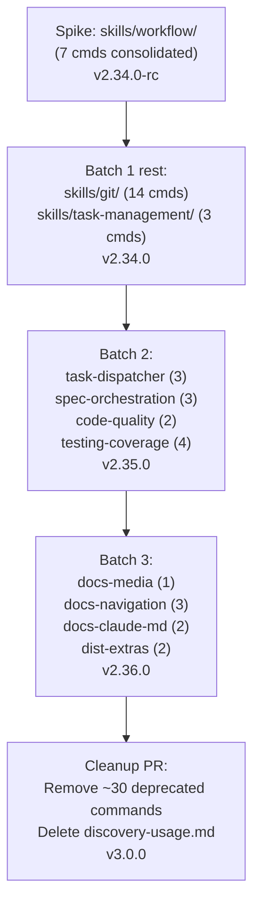

# SPEC: Commands → Skills Migration

**Status:** draft
**Created:** 2026-05-13
**From Brainstorm:** `/workflow:brainstorm -d -s` (deep + save) session, 2026-05-13
**Related plan:** [migration-plan.md](../migration-plan.md) (v2 — gap-analysis-corrected)
**Estimated effort:** ~3 release cycles (v2.34.0, v2.35.0, v2.36.0) + final cleanup at v3.0.0
**Target versions:** v2.34.0 (Batch 1) → v2.35.0 (Batch 2) → v2.36.0 (Batch 3) → v3.0.0 (cleanup)

---

## Overview

Craft has 108 commands at `commands/` and 13 thematic skills at `skills/`. A gap analysis (6 parallel Explore agents, 2026-05-13) showed:

- **~47%** of commands are already covered by existing skills
- **~29%** are genuine gaps with no skill equivalent
- **~23%** are partially covered (skills touch the concern but miss specifics)
- **1** internal-doc command should be deleted

This spec captures the migration approach: build **~11 new consolidated skills** (not 108 1:1 ports), with explicit deprecation of redundant commands, phased over 3 minor releases plus a major-version cleanup.

---

## Primary User Story

**As a** craft plugin user,
**I want** to discover and invoke craft capabilities via natural-language skill triggers (Claude Code auto-fires skills on description match) instead of memorizing 108 `/craft:foo:bar` command paths,
**so that** the cognitive overhead of "which command do I run?" disappears, and skills auto-engage when my prompt matches their concern.

### Acceptance Criteria

1. ✅ 3 new skills exist in `skills/` covering the 24 commands in Batch 1 (`git/`, `workflow/`, `task-management/`).
2. ✅ 4 new skills exist covering Batch 2 (`task-dispatcher/`, `spec-orchestration/`, `code-quality/`, `testing-coverage/`).
3. ✅ 4 new skills exist covering Batch 3 (`docs-media/`, `docs-navigation/`, `docs-claude-md/`, `dist-extras/`).
4. ✅ All deprecated commands carry a `deprecated: true` frontmatter flag and a one-line notice pointing to their replacement skill.
5. ✅ `tests/test_craft_plugin.py` enumerates skills and validates: (a) YAML frontmatter parses, (b) `name` is unique, (c) **no two skills' `description:` trigger phrases collide**.
6. ✅ `commands/_discovery.py` indexes both `commands/` and `skills/` so `/craft:hub` shows a single unified surface.
7. ✅ `commands/discovery-usage.md` is deleted (it's internal documentation, not a user-facing command).
8. ✅ Each batch ships in its own minor-version release with a CHANGELOG entry.
9. ✅ Final cleanup PR (v3.0.0) removes all deprecated commands.

---

## Secondary User Stories

**As a** craft contributor,
**I want** the migration to follow the existing 13-skill mega-skill pattern (one skill per concern, not sub-split),
**so that** new skills are visually consistent with the established convention and onboarding stays cheap.

**As a** downstream consumer of `/craft:foo:bar` invocation paths (homebrew tap, marketplace listing, external scripts),
**I want** existing commands to keep working through a deprecation cycle of at least 1 minor release,
**so that** my scripts don't break overnight when craft ships a new version.

**As a** developer running the test suite,
**I want** trigger-phrase collisions between skills to fail the build,
**so that** Claude Code never gets ambiguous about which skill to auto-fire on a user prompt.

---

## Architecture

### Migration phases



### Coexistence model during transition

```
commands/foo.md  ─┐
                  ├──► /craft:hub displays both ──► user invokes
skills/bar/      ─┘                                 ─ /craft:foo (explicit)
                                                    ─ skill auto-fires on phrase match
```

Both invocation paths work during the transition. Commands marked `deprecated: true` show a notice but continue to function.

### Discovery integration

`_discovery.py` extends to walk both trees:

```python
def discover():
    commands = walk("commands/", filter="*.md")
    skills = walk("skills/", filter="**/SKILL.md")
    return {"commands": commands, "skills": skills, "total": len(commands) + len(skills)}
```

`_cache.json` schema gains a `skills` key alongside the existing `commands` key. `/craft:hub` renders both sections.

---

## API Design

**N/A** — no external API surface. This is an internal restructure of the plugin's command/skill files. The user-facing invocation paths (`/craft:foo:bar`) remain unchanged during transition.

---

## Data Models

**N/A** — no persistent data model changes. Frontmatter schema for skills already exists in `skills/<name>/SKILL.md` files:

```yaml
---
name: <kebab-case-semantic-name>
description: "This skill should be used when the user asks to '<phrase>', '<phrase>', or mentions <triggers>."
---
```

For deprecated commands, add one new optional frontmatter field:

```yaml
---
# existing fields...
deprecated: true
replaced-by: "skills/<name>/"
---
```

---

## Dependencies

- Existing `commands/_discovery.py` — extend to index skills
- Existing `tests/test_craft_plugin.py` — extend to enumerate skills and check trigger uniqueness
- Existing `bump-version.sh` — already syncs version refs; need to add skill-count to the substitution list (currently does command-count)
- No new external dependencies (no new npm/pip packages)

---

## UI/UX Specifications

**N/A** — backend/structure migration, no UI changes. The user-visible change is in `/craft:hub` output:

```text
Craft Plugin v2.34.0 — 108 commands | 14 skills | 8 agents
                                       ^^^^^^^^^
                                       +1 from spike (workflow)
```

Hub progression across batches:

| Version | Commands | Skills | Notes |
|---|---|---|---|
| v2.33.0 (current) | 108 | 13 | starting state |
| v2.34.0 (Batch 1 done) | 108 | 16 | 3 new skills, commands stay |
| v2.35.0 (Batch 2 done) | 108 | 20 | 4 more skills |
| v2.36.0 (Batch 3 done) | 108 | 24 | 4 more skills |
| v3.0.0 (cleanup) | ~58 | 24 | ~50 deprecated commands removed |

---

## Open Questions

1. **Trigger-phrase test threshold:** what counts as a "collision"? Exact phrase match, or fuzzy similarity? Fuzzy is harder to implement; exact-match is the conservative pick. **Tentative: exact-match for v1, revisit if real collisions emerge.**
2. **`skills/sync-features` reference:** two agents in the gap analysis referenced `skills/sync-features` as covering several commands, but I haven't verified it exists. Confirm before Batch 2 (where `task-dispatcher` lands) since it overlaps. **Action:** grep `skills/` for `sync-features` before starting Batch 2.
3. **Deprecation notice rendering:** where does the user see the deprecation warning — at command invocation time, in `/craft:hub` listing, or both? **Tentative: both, with the notice in the command body itself so it appears on invocation.**
4. **Cleanup PR scope:** v3.0.0 is a major bump; should it bundle other breaking changes (orchestrator-v2 rollout? other deferred breakage?) or stay narrowly scoped to migration cleanup? **Defer decision to v2.36.0 release planning.**

---

## Review Checklist

- [ ] All 8 decisions from the brainstorm reflected accurately (coexistence, spike pick, granularity, tests, refs, discovery, docs, cutover)
- [ ] Phasing aligns with craft's release discipline (CHANGELOG per batch, minor bump per batch, major bump for cleanup)
- [ ] Acceptance criteria are testable (each maps to a specific check)
- [ ] Trigger-phrase uniqueness test is feasible (existing test infrastructure can express it)
- [ ] Open questions don't block Batch 1 spike (only #2 might surface in Batch 2)
- [ ] No external API breakage (verified: `/craft:foo:bar` paths preserved through deprecation)
- [ ] Memory entries about discovery cache + manifest patterns are honored (this plan keeps `_discovery.py` as source of truth)

---

## Implementation Notes

### Order of operations (Batch 1 — first release cycle)

1. **Spike:** Build `skills/workflow/SKILL.md` consolidating workflow commands (done, focus, next, recap, refine, spec-review, stuck). Single agent dispatch. Review the resulting skill carefully — this is the pattern reference for the next 10.
2. **Extend tests:** Add `test_skill_frontmatter_valid` and `test_skill_trigger_phrases_unique` to `tests/test_craft_plugin.py`. Run them against the spike to confirm they fire.
3. **Extend discovery:** Update `_discovery.py` to walk `skills/`. Regenerate `_cache.json`. Verify `/craft:hub` displays the new skill.
4. **Parallel-dispatch the rest of Batch 1:** Two agents in one message — one for `skills/git/SKILL.md` (14 cmds consolidated), one for `skills/task-management/SKILL.md` (3 cmds).
5. **Deprecate Batch 1 source commands:** Add `deprecated: true` + `replaced-by:` to frontmatter of the 24 source commands. Do NOT delete yet.
6. **Update docs:** CLAUDE.md (Quick Commands table), REFCARD-RELEASE.md (skill count line), `docs/index.md` (info box). Standard Tier-2 sweep per memory note on version drift.
7. **CHANGELOG entry + version bump:** v2.34.0 with "commands → skills migration begins (Batch 1: workflow, git, task-management)".
8. **Release:** Standard craft release pipeline (`/release`).

### Order for Batches 2 and 3

Same shape as Batch 1: spike-or-smallest first if unsure, then parallel-dispatch the rest, then deprecate sources, then docs sweep, then CHANGELOG + bump + release.

### Cleanup PR (v3.0.0)

- Remove ~50 commands that have been deprecated for at least one full minor cycle (Batch 1 deprecations have been live since v2.34.0, so by v3.0.0 they've had 2-3 minor cycles of notice).
- Delete `commands/discovery-usage.md` (internal doc).
- Update `_discovery.py` to no longer expect deleted files; regenerate cache.
- Update tests to drop assertions about removed commands.
- CHANGELOG entry highlighting BREAKING CHANGE: removed commands. List replacements per removed item.

### Rollback path

If a batch lands and turns out to be wrong (e.g., trigger-phrase collisions discovered post-release), the deprecated commands are still in place — rollback is just removing the new skill files and reverting `_discovery.py`. No data loss.

---

## History

| Date | Change |
|------|--------|
| 2026-05-13 | Initial draft from `/workflow:brainstorm -d -s` session. 8 expert questions answered with recommendations. Plan v2 (migration-plan.md) reflects same scope. |
