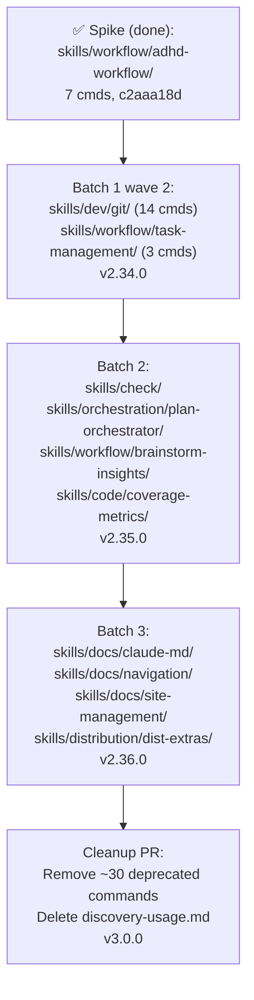

# SPEC: Commands → Skills Migration

**Status:** implemented — Batches 1+2+3 complete, 11 new skills built, 56 commands consolidated. Pending: v3.0.0 cleanup PR (delete deprecated commands).
**Created:** 2026-05-13
**Revised:** 2026-05-13 (v2 — post-spike, post-re-audit against full 26-skill tree)
**Implementation:** Complete in 11 commits on `worktree-migration-plan-doc` (e3eabd39 → 011b4d33). Skills tree expanded from 25 → 36 SKILL.md files.
**From Brainstorm:** `/workflow:brainstorm -d -s` (deep + save) session, 2026-05-13
**Related plan:** [migration-plan.md](../migration-plan.md) (v3 — synced to this revision)
**Estimated effort:** ~3 release cycles (v2.34.0, v2.35.0, v2.36.0) + final cleanup at v3.0.0
**Target versions:** v2.34.0 (Batch 1) → v2.35.0 (Batch 2) → v2.36.0 (Batch 3) → v3.0.0 (cleanup)

---

## Revision history (v1 → v2)

| Change | Why |
|---|---|
| 13-skill baseline → **26-skill baseline** | The original audit counted top-level dirs only; the actual tree has nested sub-skills under `design/`, `distribution/`, `docs/`, `orchestration/`, `testing/`. |
| 47% covered → **39% covered** | The original % was based on an under-counted skill tree; full audit reduced coverage estimate. |
| Flat path convention (`skills/git/`) → **Nested category convention** | Per user direction: new skills nest under thematic category dirs (matches `skills/design/<sub>`, `skills/docs/<sub>` pattern). |
| Spike at `skills/workflow/SKILL.md` → `skills/workflow/adhd-workflow/SKILL.md` | Restructured to fit nested convention. Already done; tests pass. |
| Proposed `skills/task-dispatcher/` | **REMOVED** — `skills/orchestration/task-analyzer/` already covers `/do` routing. |
| `refactor` classified as GAP | **Flipped to COVERED** — nested `skills/design/{backend,frontend,devops}-*` cover refactoring guidance. |
| Generic `skills/docs-*` (3 proposed) | **Replaced** with specific gaps: `skills/docs/claude-md/`, `skills/docs/navigation/`, `skills/docs/site-management/`, possibly more. Docs gaps are bigger than the v1 audit suggested. |
| Missing: `skills/check/` | **ADDED** — pre-flight validation (commit/PR/release/deploy) is broader than `skills/ci/` (project-detector only). |
| Missing: planning sub-skill | **ADDED** — `skills/planning/SKILL.md` (project-planner) is high-level; feature/roadmap/sprint commands need a dedicated sub-skill. |

---

## Overview

Craft has 108 commands at `commands/` and **26 SKILL.md files** under `skills/` (some categories nest sub-skills). A full re-audit (6 parallel Explore agents, 2026-05-13, against the corrected 26-skill baseline) shows:

- **~39%** of commands are already covered by existing skills
- **~49%** are real GAPs with no skill equivalent
- **~11%** are partially covered (skills touch the concern but miss specifics)
- **1** internal-doc command should be deleted

This spec captures the migration approach: build **~10-12 new consolidated skills**, all nested under thematic category dirs, with explicit deprecation of redundant commands, phased over 3 minor releases plus a major-version cleanup.

---

## Primary User Story

**As a** craft plugin user,
**I want** to discover and invoke craft capabilities via natural-language skill triggers (Claude Code auto-fires skills on description match) instead of memorizing 108 `/craft:foo:bar` command paths,
**so that** the cognitive overhead of "which command do I run?" disappears, and skills auto-engage when my prompt matches their concern.

### Acceptance Criteria

1. ✅ Batch 1 ships 3 new skills covering the highest-leverage gaps:
   - `skills/workflow/adhd-workflow/SKILL.md` (DONE — spike commit c2aaa18d, moved to nested path)
   - `skills/dev/git/SKILL.md` (14 commands consolidated; git is a real gap, no skill exists today)
   - `skills/workflow/task-management/SKILL.md` (3 commands; currently PARTIAL by `task-analyzer`)
2. ✅ Batch 2 ships ~4 new skills:
   - `skills/check/SKILL.md` (pre-flight validation across commit/PR/release/deploy)
   - `skills/orchestration/plan-orchestrator/SKILL.md` (`commands/orchestrate/plan` + `commands/plan/{feature,roadmap,sprint}`)
   - `skills/workflow/brainstorm-insights/SKILL.md` (`commands/workflow/{brainstorm,insights}`)
   - `skills/code/coverage-metrics/SKILL.md` (`commands/code/coverage` + `commands/code/demo` instructional concern)
3. ✅ Batch 3 ships ~4 new skills (docs/site/dist gaps):
   - `skills/docs/claude-md/SKILL.md` (`commands/docs/claude-md/{edit,init,sync}`)
   - `skills/docs/navigation/SKILL.md` (`commands/docs/nav-update` + `commands/site/{add,nav}`)
   - `skills/docs/site-management/SKILL.md` (`commands/site/{build,deploy,publish,theme,status,update,...}`)
   - `skills/distribution/dist-extras/SKILL.md` (`commands/dist/{pypi,curl-install,marketplace}`)
4. ✅ All deprecated commands carry a `deprecated: true` frontmatter flag and a one-line notice pointing to their replacement skill.
5. ✅ `tests/test_craft_plugin.py` enumerates skills and validates: (a) YAML frontmatter parses, (b) `name` is unique, (c) **no two skills' `description:` trigger phrases collide** (already implemented as of c2aaa18d).
6. ✅ `commands/_discovery.py` indexes both `commands/` and `skills/` (already implemented; cache walks nested dirs via rglob).
7. ✅ `commands/discovery-usage.md` is deleted (it's internal documentation, not a user-facing command).
8. ✅ Each batch ships in its own minor-version release with a CHANGELOG entry.
9. ✅ Final cleanup PR (v3.0.0) removes all deprecated commands.

---

## Secondary User Stories

**As a** craft contributor,
**I want** the migration to follow the existing **nested-category convention** (e.g., `skills/orchestration/<sub>/SKILL.md`, `skills/docs/<sub>/SKILL.md`),
**so that** new skills are visually consistent with the established structure and discoverability stays predictable.

**As a** downstream consumer of `/craft:foo:bar` invocation paths (homebrew tap, marketplace listing, external scripts),
**I want** existing commands to keep working through a deprecation cycle of at least 1 minor release,
**so that** my scripts don't break overnight when craft ships a new version.

**As a** developer running the test suite,
**I want** trigger-phrase collisions between skills to fail the build,
**so that** Claude Code never gets ambiguous about which skill to auto-fire on a user prompt.

---

## Architecture

### The 26-skill baseline

```text
skills/
├── architecture/SKILL.md          (system-architect)
├── ci/SKILL.md                    (project-detector)
├── code/SKILL.md                  (sync-features)
├── design/
│   ├── backend-designer/SKILL.md
│   ├── frontend-designer/SKILL.md
│   └── devops-helper/SKILL.md
├── distribution/
│   ├── distribution-strategist/SKILL.md
│   ├── homebrew-formula-expert/SKILL.md
│   ├── homebrew-multi-formula/SKILL.md
│   ├── homebrew-setup-wizard/SKILL.md
│   └── homebrew-workflow-expert/SKILL.md
├── docs/
│   ├── architecture-decision-records/SKILL.md
│   ├── changelog-automation/SKILL.md
│   ├── doc-classifier/SKILL.md
│   ├── mermaid-linter/SKILL.md
│   └── openapi-spec-generation/SKILL.md
├── guard-audit/SKILL.md
├── insights-apply/SKILL.md
├── modes/SKILL.md                 (mode-controller)
├── orchestration/
│   ├── session-state/SKILL.md
│   └── task-analyzer/SKILL.md
├── planning/SKILL.md              (project-planner)
├── release/SKILL.md
├── testing/
│   ├── test-generator/SKILL.md
│   └── test-strategist/SKILL.md
└── workflow/
    └── adhd-workflow/SKILL.md     (NEW from spike c2aaa18d)
```

### Migration phases



### Coexistence model during transition

```text
commands/foo.md  ─┐
                  ├──► /craft:hub displays both ──► user invokes:
skills/<cat>/bar/─┘                                 ─ /craft:foo (explicit)
                                                    ─ skill auto-fires on phrase match
```

Both invocation paths work during transition. Commands marked `deprecated: true` show a notice but continue to function.

### Discovery integration (DONE in c2aaa18d)

`_discovery.py` walks `skills/**/SKILL.md` via `rglob` — already supports nested paths. `_cache.json` has top-level keys `skills`, `skills_count`, `skills_categories`. No further work needed for nested skills.

---

## API Design

**N/A** — no external API surface. This is an internal restructure of the plugin's command/skill files. The user-facing invocation paths (`/craft:foo:bar`) remain unchanged during transition.

---

## Data Models

**N/A** — no persistent data model changes. Skill frontmatter schema:

```yaml
---
name: <kebab-case-semantic-name>
description: "This skill should be used when the user asks to '<phrase>', '<phrase>', or mentions <triggers>."
---
```

For deprecated commands, add one new optional frontmatter field:

```yaml
---
# existing fields...
deprecated: true
replaced-by: "skills/<category>/<name>/"
---
```

---

## Dependencies

- ✅ `commands/_discovery.py` — extended to index nested skills (c2aaa18d)
- ✅ `tests/test_craft_plugin.py` — frontmatter + trigger-phrase tests added (c2aaa18d)
- `bump-version.sh` — needs `skills_count` substitution added (currently only does `commands_count`)
- `commands/hub.md` — template needs `skills` section
- No new external dependencies

---

## UI/UX Specifications

**N/A** — backend/structure migration. The user-visible change is in `/craft:hub` output:

| Version | Commands | Skills | Notes |
|---|---|---|---|
| v2.33.0 (pre-migration) | 108 | 25 | starting state (per re-audit count) |
| v2.34.0 (Batch 1 done) | 108 | 28 | +3 new skills, commands stay |
| v2.35.0 (Batch 2 done) | 108 | 32 | +4 more skills |
| v2.36.0 (Batch 3 done) | 108 | 36 | +4 more skills |
| v3.0.0 (cleanup) | ~58 | 36 | ~50 deprecated commands removed |

(Note: spike already added 1 skill to take baseline from 25 → 26. v2.34.0 adds 2 more = 28 total.)

---

## Open Questions

1. **`skills/dev/` as a new category** — does git warrant its own new category dir, or should it nest under an existing one (e.g., `skills/release/dev-tools/git/`)? **Tentative:** create `skills/dev/` as a new top-level category because git is foundational, not a release sub-concern.
2. **Trigger-phrase test threshold** — exact-match collision only, or fuzzy similarity? Currently exact-match. Revisit if real collisions emerge.
3. **Cleanup PR scope** — v3.0.0 is a major bump; should it bundle other breaking changes or stay narrowly scoped to migration cleanup? **Defer decision to v2.36.0 release planning.**
4. **`skills/check/` vs extending `skills/ci/`** — is pre-flight validation a new skill or a section in `project-detector`? **Tentative:** new skill, because `project-detector` is purely detection (no validation orchestration).

---

## Review Checklist

- [x] All 8 brainstorm decisions reflected
- [x] Re-audit findings (26-skill baseline) integrated
- [x] Nested-category placement convention applied to all new skills
- [x] Spike restructured to match convention (skills/workflow/adhd-workflow/)
- [x] task-dispatcher removed; task-analyzer recognized as existing coverage
- [x] Acceptance criteria updated with specific skill paths
- [x] Discovery & tests already verified working with nested paths
- [ ] migration-plan.md updated to v3 to match (in progress)

---

## Implementation Notes

### Batch 1 wave 2 (next dispatch)

1. Parallel agents (single message):
   - **Agent A:** `skills/dev/git/SKILL.md` consolidating 10 git commands + 4 git docs (14 total)
   - **Agent B:** `skills/workflow/task-management/SKILL.md` consolidating 3 task-* commands
2. Both agents: read existing skills as pattern reference (`skills/release/SKILL.md`, `skills/workflow/adhd-workflow/SKILL.md`, `skills/orchestration/task-analyzer/SKILL.md` for git's safety-rail overlap).
3. Validate: re-run skill tests, regenerate cache, smoke-check `/craft:hub`.
4. Commit. Update CLAUDE.md + REFCARD totals. Version bump to v2.34.0. CHANGELOG entry.

### Batch 2 (after Batch 1 ships)

Same shape. Most important parallel dispatch: `skills/check/` and `skills/orchestration/plan-orchestrator/` first (foundational), then `skills/workflow/brainstorm-insights/` and `skills/code/coverage-metrics/`.

### Batch 3 (after Batch 2 ships)

Most complex — docs/site has 28 GAP commands but only ~3-4 new skills will cover them (consolidation ratio ~7:1). Agents will need careful prompting to consolidate without over-fragmentation.

### Cleanup PR (v3.0.0)

Remove all `deprecated: true` commands. Delete `commands/discovery-usage.md`. Update `_discovery.py` and tests to drop assertions. CHANGELOG: BREAKING CHANGE with per-removed-command replacement map.

### Rollback path

Each batch is reversible: deprecated commands are still in place, and new skills can be deleted without affecting command flow. Only the cleanup PR is destructive.

---

## History

| Date | Change |
|------|--------|
| 2026-05-13 | v1 draft from `/workflow:brainstorm -d -s` session. 8 expert questions answered. |
| 2026-05-13 | v2 revision after Batch 1 spike + re-audit against full 26-skill tree. Coverage estimate refined (47%→39%). Path convention switched to nested. task-dispatcher removed; check + plan-orchestrator added. |
