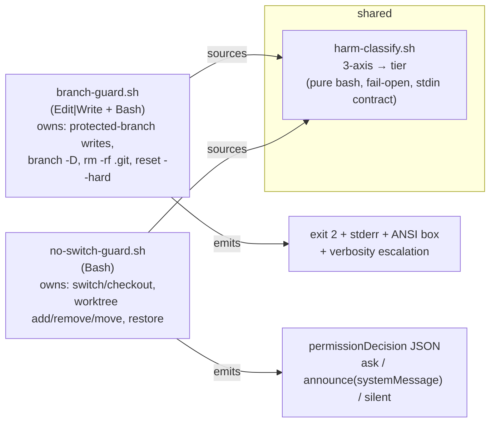

# SPEC — craft Guard Suite (shared classifier + adapters)

| | |
|---|---|
| **Status** | approved |
| **Created** | 2026-06-19 |
| **Owner** | dt |
| **From** | `~/.claude/PROPOSAL-guards-into-craft.md` + `PROPOSAL-guard-reconciliation.md` + `PROPOSAL-switch-guard-harm-taxonomy.md` (max-depth brainstorm, 2 agents) |
| **Scope** | Promote the personal `no-switch-guard.sh` into craft, extract a shared harm-classification lib, and expose/guard guard-consistency — WITHOUT unifying the two hooks' emission mechanisms. |

---

## 1. Overview

craft ships one PreToolUse guard (`branch-guard.sh`) and a second guard (`no-switch-guard.sh`) now
lives personal-only in `~/.claude/hooks/`. They independently re-implement overlapping rules (e.g.
destructive-restore detection) with divergent regexes. This spec consolidates the **classification**
(a shared 3-axis harm taxonomy) while **deliberately keeping the two emission mechanisms separate**,
because an architecture review found full unification is net-negative.

## 2. Decision record (what was REJECTED and why)

### ❌ Rejected: single table-driven "craft-guard" engine (brainstorm #7)

- branch-guard emits **only** `exit 2` + stderr (its `_confirm` is a model-mediated `[CONFIRM]`
  text convention); no-switch-guard emits **only** `permissionDecision` JSON on stdout. The
  channels are mutually exclusive per invocation — one `action=ask` cell cannot mean both.
- Branch-protection is **context-dependent** (same command = deny on `main` / ask on `dev` /
  silent on `feature`), resolved by ~60 lines of procedural logic — not a static table column.
- branch-guard's **session-count verbosity escalation** + ANSI teaching boxes are stateful and
  inexpressible declaratively; unifying onto JSON `ask` loses the teaching pedagogy.

### ❌ Rejected: unify enforcement mechanism (reconciliation item 3)

- Flips **~100-105 safety-critical assertions** across `test_branch_guard.sh` (~55-60 `exit 2`),
  `test_branch_guard_e2e.sh` (~30), `test_branch_guard_dogfood.py` (~15) — in code with documented
  CI-invisible-regression history. Cost ≫ benefit.

### ✅ Adopted: shared classification core + two thin adapters

One taxonomy library answers "how harmful is this command?"; each hook keeps its **native**
emission. Kills rule-duplication drift without paying the unification cost.

## 3. Architecture

**Harm taxonomy (3 axes → tier → action):** data-loss · context-desync · rule-enablement →
`{silent, announce, ask, deny}`. (Full rationale: `PROPOSAL-switch-guard-harm-taxonomy.md`.)

**Ownership seam (one owner per command — no double coverage):**

| Domain | Owner |
|---|---|
| switch/checkout, worktree add/remove/move, restore | **no-switch-guard** |
| protected-branch writes, new-code-on-dev, `branch -D`, `rm -rf .git`, `reset --hard` | **branch-guard** |

## 4. Phased plan

### Phase A — promote + reconcile (cheap, zero mechanism risk)

- **A1. Promote `no-switch-guard.sh` into craft** `scripts/`, keeping its JSON mechanism as a
  separate 3rd `Bash` PreToolUse hook. Generalize `scripts/install-branch-guard.sh` (→ install both
  guards; idempotent per-entry check). Add `tests/test_no_switch_guard.sh` modeled on
  `test_branch_guard.sh` using the validated 3-tier matrix (silent/announce/ask). Script-only ⇒ no
  count cascade.
- **A2. Reconcile destructive-restore ownership** — pick ONE owner, de-dupe the divergent regex
  (branch-guard `716-733` vs no-switch `64-68`). Prerequisite for the classifier.
- **A3. Extend `skills/guard-audit`** to detect (a) duplicate/overlapping `~/.claude/settings.json`
  PreToolUse matchers, (b) **duplicated rule coverage** (same command gated by both hooks). LOW
  effort — one `jq` + grep; the skill's existing 5-step scaffold fits (add Step 1b/1c).

### Phase B — the prize (moderate)

- **B1. Extract `scripts/harm-classify.sh`** — pure bash, stdin contract, fail-open (avoid the
  ~30ms python3 hot-path spawn branch-guard already fights). Migrate destructive-restore FIRST,
  behavior-pinned by a fixture asserting byte-identical pre/post action. Both hooks source it.

### Phase C — surface + drift-prevention

- **C1. `/craft:git:guard`** (`list` / `status` / `explain "<cmd>"` / `test` / `tier` /
  `enable <name>` / `disable <name>`) hosted in `skills/dev/git/SKILL.md` (protect/unprotect already
  deprecated into it) + thin `commands/git/guard.md`. Turns invisible hooks into an inspectable,
  toggleable surface; kills "why was I prompted?" friction. **Triggers the ~14-file
  `bump-version.sh` count cascade** + docs.
  - **`list`** — one row per registered guard: name, file, matcher(s), mechanism, what it gates,
    enabled/disabled (reads the registry below + `settings.json` wiring).
  - **`enable`/`disable <name>`** — flip a flag in a central **guard registry**, NOT settings.json
    surgery (keeps hooks wired; guards self-disable). Optional `--session` for a temporary,
    auto-expiring bypass (reuse the `/craft:git:unprotect` TTL-marker pattern).

- **C1b. Guard registry + self-check contract.** Add `~/.claude/guards.json`
  (`{ "guards": { "<name>": { "enabled": true, "muted_until": <epoch|null> } } }`), mirroring the
  existing `.claude/branch-guard.json` config pattern that `guard-audit` already reads. EACH guard
  script gains a 2-line preamble: read its own enabled flag + `muted_until`, **fail-OPEN** (default
  enabled if file/key missing or jq absent), `exit 0` silently if disabled or still inside the mute
  window. Single mechanism, uniform across all guards (branch-guard, no-switch-guard, future ones).
  Pairs with the A3 `guard-audit` extension (surface disabled/muted guards).

- **C1c. ADHD toggle UX (canonical — source: `~/.claude/PROPOSAL-guard-toggle-ux.md`).** The design
  principle: externalize state, make "off" self-healing, toggle where the friction is felt. Three
  required mechanisms + one sub-feature:
  1. **Auto-expire by default.** `disable <guard>` writes `muted_until = now + 30m` (configurable),
     NOT a permanent off. Self-re-arms on expiry. Permanent requires explicit `--permanent`
     (`enabled:false`, no `muted_until`). Kills the "forgot it's off" trap.
  2. **In-prompt mute.** When a guard emits `ask`, the confirmation surfaces the toggle in context:
     `Approve once` · `Approve + mute this guard 30m` · `Always allow THIS command`. The
     interruption becomes the off-switch — no separate command, no name-recall. (Mechanism: the
     guard's `permissionDecisionReason` advertises the mute verb; selecting it runs the registry
     write. branch-guard's exit-2 path offers the equivalent as a `[CONFIRM]`-style hint.)
  3. **Statusline chip.** Surface guard state in the statusline (claude-hud owns it):
     `🛡️ on` · `⚠️ muted (24m left)` · `⛔ off (permanent)`. The countdown is the anti-forgetting
     device. Ambient, zero-memory awareness of true state. (Integration point — see Q7.)
  - **Sub-feature: named profiles.** `/craft:git:guard <profile>` sets a known multi-guard state in
    one word: `focus` (all on) · `yolo` (switch-guards off) · `spec` (only branch-guard). Collapses
    per-guard decisions into one intent; reuses the `cc yolo` precedent. `list` is numbered so
    `guard off 2` works without name-recall.
- **C2. `guard-consistency` validator** in `.claude-plugin/skills/validation/` (hot_reload),
  reads `~/.claude` — fails on duplicate matchers / duplicated rule coverage.

### Independent (do whenever) — branch-guard delete→ask (reconciliation item 2)

Convert `rm -rf .git` (`_hard_block`→`_confirm`) and `reset --hard` on main (`block`→`_confirm`).
Trimmed by the ownership seam (worktree-remove handled by no-switch-guard). Flips
`test_branch_guard.sh:669` + catastrophic-group asserts from deny→confirm.

## 5. Risks

1. **Destructive-restore reconciliation drift** — gated by both hooks today with different regexes
   AND different actions. Migrate it first, fixture-pinned, and consciously choose teach-confirm vs
   click-ask. Getting it wrong = a data-loss-prompt regression.
2. **Dual-`Bash` matcher precedence** (deny > ask > allow) — both guards run on `Bash`
   (branch-guard then no-switch-guard). Don't touch emitters in the classifier-extract PR; only the
   *tier source* changes. This bug class is CI-invisible until post-merge main (project history).
3. **Shared classifier = single point of failure** — a bug mis-tiers both hooks at once. Pure-bash,
   fail-open, fuzz against the existing per-hook fixtures before cutover.

## 6. Test impact

- New: `tests/test_no_switch_guard.sh` (3-tier matrix).
- B1: classifier fixtures (`command → tier`, pure-function).
- Item 2 only: flip `test_branch_guard.sh:669` + catastrophic-group asserts deny→confirm.
- No mass exit-2→JSON rewrite (that was the rejected path).

## 7. Cost (count/doc cascade)

- A1 (script + test): ≈ none (scripts don't count).
- C1 (1 command [+ maybe 1 skill]): `./scripts/bump-version.sh` syncs ~13-14 Tier-1 files; +2-3
  manual docs (`docs/commands.md` A-Z, `docs/skills-agents.md` row, hub/category page); +possible
  `plugin.json` `(N craft + M workflow)` subtotal. Phase 8 of `docs-staleness-check.sh --fix`
  semi-automates coverage.

## 8. Documentation deliverables

Each shipped phase carries its docs; the doc-coverage gate (Phase 8 of `docs-staleness-check.sh`)
must pass. Generate with craft's own doc commands.

| Artifact | Tool | Path | Covers |
|---|---|---|---|
| **Guide** | `/craft:docs:guide` | `docs/guide/guard-suite.md` | concepts: harm taxonomy, ownership seam, registry, enable/disable, profiles, statusline chip |
| **Design rationale** | (this spec) | `docs/guide/guard-design.md` | 3-axis model + rejected options (#7, mechanism-unify) |
| **Refcard** | `/craft:docs:refcard` + `/craft:git:docs:refcard` | `docs/REFCARD.md` (guard section) + git refcard | one-page: `list`/`enable`/`disable`/profiles verbs, tier legend (🟢🟡🔴), chip legend (🛡️/⚠️/⛔), in-prompt mute options |
| **Tutorial** | `/craft:docs:tutorial` | `docs/tutorials/guard-suite.md` | walkthrough: see guards → mute one in-prompt → set a profile → watch it auto-re-arm |
| **Command help** | command frontmatter | `commands/git/guard.md` + `docs/commands/…` | `/craft:git:guard` usage |
| **Skill doc** | — | `docs/skills-agents.md` row | the A3 `guard-audit` extension |

### Index files to update (the "index file" cascade)

- **mkdocs.yml** nav — add the Guide / Tutorial / Refcard / guard-design pages under their sections.
  *(Active specs auto-glob via `specs/SPEC-*.md` — THIS spec needs no manual nav entry; the new doc
  PAGES do.)*
- **docs/index.md** — landing-page links to the guide + tutorial.
- **docs/REFCARD.md** — guard quick-reference entry.
- **docs/commands.md** (A-Z) + **commands/hub.md** / `docs/commands/hub.md` — the `/craft:git:guard`
  row + git-category subtotal.
- **docs/skills-agents.md** — `guard-audit` extension note (+ Orchestration/skill subtotals if a new
  skill dir is added).
- Run **`bump-version.sh`** (Tier-1 counts) then **`docs-staleness-check.sh --fix`** (Phase 6 nav +
  Phase 8 doc-coverage) to sweep counts and catch any missing index entries.

## 9. Resolved decisions

- **Q1 (Default state on feature branches): Both guards enabled.** Minimum disruption; branch-guard
  blocks dangerous main ops; no-switch-guard gates dirty switches — both needed on feature branches.

- **Q2 (`cd` gate): `cd` is NOT gated.** cwd resets every call; verified already off in the
  personal copy.

- **Q3 (Two emit mechanisms): Preserved as-is.** Unifying would break platform-native UX;
  branch-guard uses exit 2 + stderr; no-switch-guard uses `permissionDecision` JSON — different
  contracts, different behaviors needed.

- **Q4 (`harm-classify.sh` shared core): Deferred to Phase B.** Phase A ships working guards;
  shared classification core is a Phase B enhancement.

- **Q5 (`muted_until` format): `YYYY-MM-DDTHH:MM:%SZ` BSD date format.** macOS compat;
  `date -u -j -f "%Y-%m-%dT%H:%M:%SZ"` for parsing,
  `date -u -v +${WINDOW}M +"%Y-%m-%dT%H:%M:%SZ"` for generation.

- **Q6 (`jq false // true` quirk): Read `enabled` without `// true` fallback.** Use
  `jq -r '.guards["name"].enabled'` then check `== "false"` separately; `|| true` is on the jq
  call (for `set -e`), not the field default.

- **Q7 (`install-guards.sh` idempotency): Single `jq any(test("no-switch-guard"))` check** before
  registering the Bash matcher; seeds `guards.json` on first install.

- **Q8 (`--staged` exclusion): `git restore --staged` is GREEN.** Only unstages, doesn't discard
  working-tree changes; bare `git restore` remains RED; implemented as two separate grep checks
  with a `&& !` guard.

## 10. Review checklist

- [ ] Ownership seam leaves zero double-covered commands
- [ ] no-switch-guard keeps JSON mechanism (no exit-2 migration)
- [ ] classifier is pure-bash + fail-open
- [ ] destructive-restore migrated first, fixture-pinned
- [ ] precedence on dual-Bash matcher verified unchanged
- [ ] count cascade run for any new command/skill
- [ ] installed `~/.claude/hooks/branch-guard.sh` confirmed identical to `scripts/` source pre-change
- [ ] docs shipped (guide, refcard, tutorial) + index cascade swept (§8)

## 11. History

- **2026-06-19** — Approved after implementation. All Q1–Q8 open questions resolved (see §9). Phase A shipped: no-switch-guard promoted, registry + toggle UX, `/craft:git:guard` command, guard-consistency validator, guard-audit skill extended. Phase B (harm-classify.sh) deferred.
- 2026-06-19 — draft created from max-depth brainstorm (architecture critique + craft infra map agents).
- 2026-06-19 — added C1 list/enable/disable + C1b registry; folded ADHD toggle UX into C1c (auto-expire,
  in-prompt mute, statusline chip, named profiles) from `PROPOSAL-guard-toggle-ux.md`; +Q5–Q8.
- 2026-06-19 — added §8 Documentation deliverables (guide, refcard, tutorial, design rationale) + the
  index-file cascade (mkdocs nav, docs/index.md, REFCARD, commands.md, skills-agents.md); renumbered §9–11.
