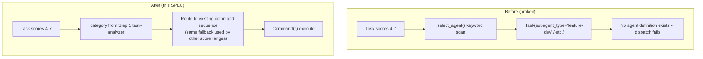
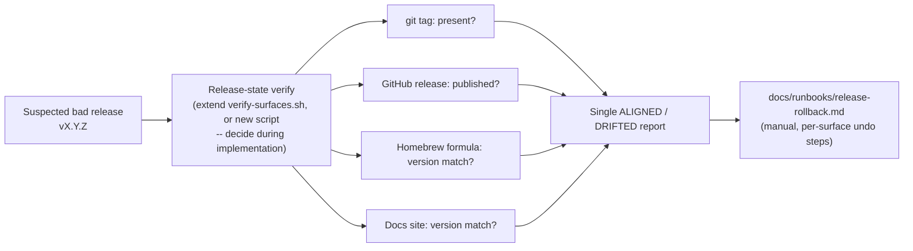

# SPEC: Craft Review Follow-ups (G1, H3, M1/M10)

**Status:** draft
**Created:** 2026-07-06
**From Brainstorm:** `BRAINSTORM-craft-review-followups-2026-07-06.md`
**Author:** DT + Claude

---

## Overview

Three decisions carried over from this session's adversarial review of craft's branch-guard,
release-pipeline, and command-routing subsystems (all mechanical findings from that review —
H1, H2, H4, H5-H7, M2, M3, M4, M5, M7 — are already fixed and committed on `dev`; M8 was
investigated and closed as a misdiagnosis). This SPEC covers the 3 remaining items that
needed a design decision rather than a mechanical fix: removing `do.md`'s dead
agent-delegation branch (H3), adding a release-state verify step + rollback runbook
(M1/M10), and disposing of a stray root-level file (G1).

---

## Primary User Story

**As a** craft plugin maintainer,
**I want** `do.md`'s task routing to never dispatch to a nonexistent agent, and a fast way to
tell how far a bad release actually propagated across craft/homebrew-tap/docs-site,
**So that** task routing fails safely and a bad release can be diagnosed in one command
instead of manual multi-repo checking.

### Acceptance Criteria

- [ ] `commands/do.md`'s Score 4-7 path no longer names `feature-dev`, `backend-architect`,
      `bug-detective`, or `code-quality-reviewer` as a `subagent_type`
- [ ] Score 4-7 tasks route through the same category-based command-sequencing fallback
      Score 1-3 and 8+ already use (single source of truth for category → command mapping)
- [ ] `select_agent()`'s independent keyword-rescan is removed (closes M6 as a side effect —
      no second classifier that can disagree with Step 1's `category`)
- [ ] A release-state verify capability exists that checks, for a given version: git tag
      presence, GitHub release publication, Homebrew formula version match, docs-site version
      match — reporting ALIGNED or DRIFTED per surface
- [ ] Before writing new code, `scripts/verify-surfaces.sh` is read in full to determine
      whether this is an extension of that existing check or a genuinely distinct read path
- [ ] `docs/runbooks/release-rollback.md` documents the manual per-surface undo steps for a
      bad release (tag, GitHub release, Homebrew formula, docs deploy) — referenced from
      `commands/code/release.md`'s existing "have a rollback plan" line
- [ ] `Chat-Instructions-v1.3.0.md` is removed from the repo root (pending explicit
      confirmation at implementation time — deletion is not pre-authorized by this SPEC alone)
- [ ] All existing tests still pass; new `e2e`/`dogfood` coverage added for the `do.md`
      routing change and `unit` coverage for the verify script's per-surface checks
- [ ] A code review (`/code-review`) and architecture review (`/craft:arch:review`) both run
      and pass before any of this is merged

---

## Secondary User Stories

### Task Router User

**As a** craft user running `/craft:do "add OAuth login"` (a Score-4 task),
**I want** the task to route to real, working command sequencing,
**So that** I never hit a silent dispatch failure to an agent that doesn't exist.

### Release Incident Responder

**As a** craft maintainer who suspects a release went out wrong,
**I want** one command that tells me exactly which of the 3 release surfaces (tag/release,
Homebrew, docs) actually updated,
**So that** I know what to fix before I start manually poking at 3 repos.

### Repo Hygiene

**As a** craft contributor,
**I want** the repo root to contain only documented content types,
**So that** stray files don't accumulate and confuse future contributors about what belongs
where.

---

## Architecture

### H3: `do.md` routing simplification

### M1/M10: release-state verify flow

---

## Scope

### In scope

- Deleting `select_agent()`'s dead agent-dispatch branch in `commands/do.md` and routing
  Score 4-7 through existing command sequencing.
- A release-state verify capability (extending `verify-surfaces.sh` or new, TBD at
  implementation) covering the 4 surfaces listed in Acceptance Criteria.
- A manual rollback runbook (`docs/runbooks/release-rollback.md`).
- Removing `Chat-Instructions-v1.3.0.md` from the repo root, pending confirmation.

### Non-goals

- No new agent definitions (feature-dev, backend-architect, bug-detective,
  code-quality-reviewer) — explicitly decided against in the brainstorm (cost/fit mismatch
  against craft's actual 8 agents).
- No automated/scripted release rollback (undo) — explicitly decided against; only the
  *diagnostic* (verify) half is in scope, undo stays manual and reviewed.
- No change to `bump-version.sh`'s internal transaction safety (M1's narrower finding about
  no rollback mid-13-file-loop) beyond what the verify step surfaces after the fact — a
  transactional rewrite of `bump-version.sh` itself is a separate, larger effort not bundled
  here.

---

## Dependencies

- Read `scripts/verify-surfaces.sh` in full before implementing the verify step — reuse if
  its existing check already covers this need; do not duplicate.
- `commands/code/release.md`'s "have a rollback plan" line is the doc anchor point for the
  new runbook.
- The `do.md` fix should be implemented alongside a check that no other file references the
  4 removed agent names (`grep -rn "feature-dev\|backend-architect\|bug-detective\|code-quality-reviewer"`
  across `commands/`, `skills/`, `tests/`) so nothing else silently depended on them existing.

---

## Review Checklist

- [ ] `/code-review` run and findings addressed before merge
- [ ] `/craft:arch:review` run and findings addressed before merge
- [ ] Full test suite green (`python3 -m pytest tests/`)
- [ ] `./scripts/validate-counts.sh` GREEN (no new commands/skills/agents expected — verify)

---

## Open Questions

- Extend `verify-surfaces.sh` or write a new script? — resolve by reading the existing
  script first; this SPEC doesn't pre-decide it.
- Does the release-state verify step get its own command (`/craft:release:verify-state` or
  similar) or fold into an existing one (`/craft:check`, `/craft:orch`'s pre-flight)? — resolve
  at implementation, matching whichever existing entry point users would actually reach for
  during an incident.

> Interrogated by grill — see [GRILL-craft-review-followups-2026-07-06.md](GRILL-craft-review-followups-2026-07-06.md)
