# SPEC: Demo Command Dependency Management

**Status:** draft
**Created:** 2026-01-17
**From Brainstorm:** Deep feature analysis (10 expert questions)
**Author:** Claude Sonnet 4.5
**Target Version:** v1.23.0

---

## Overview

Embed dependency checking, installation, and management directly into `/craft:docs:demo` command to eliminate manual setup friction when creating GIF demos. Users should get **informed consent** before any installations, with **graceful degradation** when tools are missing, and comprehensive **health checking** to validate installations.

**Core Philosophy:** Make asciinema + agg workflow "just work" while respecting user control and providing escape hatches for manual management.

---

## Primary User Story

**As a** craft plugin user
**I want** dependency management embedded in the demo command
**So that** I can create GIF demos without manually installing asciinema, agg, and gifsicle

**Acceptance Criteria:**
- ✅ Running `/craft:docs:demo "feature"` checks dependencies automatically
- ✅ Missing tools trigger informed consent prompt before installation
- ✅ Installation failures fall back to alternative methods gracefully
- ✅ `--check` flag shows comprehensive dependency status
- ✅ `--fix` flag repairs broken or outdated installations
- ✅ `--convert` flag batch-converts `.cast` files to `.gif`
- ✅ `--batch` flag processes multiple recordings in one command
- ✅ Session-level caching avoids redundant dependency checks
- ✅ All dependency metadata lives in command frontmatter (YAML)

---

## Secondary User Stories

### Story 2: Power User - Batch Conversion

**As a** developer regenerating multiple GIFs
**I want** to convert all `.cast` recordings to GIFs in one command
**So that** I don't manually run `agg` + `gifsicle` for 11+ files

**Acceptance:**
- `--batch` flag processes all `.cast` files in `docs/demos/` and `docs/gifs/`
- Shows progress indicator (1/11, 2/11, etc.)
- Skips files where `.gif` already exists (unless `--force`)
- Reports size savings after optimization

### Story 3: System Administrator - Pre-flight Checks

**As a** CI/CD pipeline maintainer
**I want** to validate all craft dependencies before running workflows
**So that** builds don't fail mid-execution due to missing tools

**Acceptance:**
- `--check` exits with code 0 if all dependencies satisfied
- `--check` exits with code 1 if any dependency missing/broken
- `--check --json` outputs machine-readable status
- Works in both interactive and non-interactive environments

### Story 4: New User - Guided Setup

**As a** first-time craft user
**I want** clear guidance when dependencies are missing
**So that** I know exactly what to install and how

**Acceptance:**
- Dependency errors show table of missing tools
- Each missing tool has copy-paste installation command
- Links to tool documentation for troubleshooting
- Suggests `--fix` as quick resolution path

---

## Architecture

### Component Diagram


### Data Flow: Dependency Check on Command Invocation

```mermaid
sequenceDiagram
    participant User
    participant Demo as /craft:docs:demo
    participant DM as DependencyManager
    participant Cache
    participant Checker
    participant Installer

    User->>Demo: /craft:docs:demo "feature"
    Demo->>DM: checkDependencies(method="asciinema")

    DM->>Cache: getCachedResults()
    alt Cache Hit
        Cache-->>DM: {asciinema: ✓, agg: ✓, gifsicle: ✓}
        DM-->>Demo: All dependencies satisfied
    else Cache Miss
        DM->>Checker: validateTools(["asciinema", "agg", "gifsicle"])

        Checker->>Checker: detectInstallation()
        Checker->>Checker: runHealthCheck()
        Checker->>Checker: validateVersion()

        alt All Tools OK
            Checker-->>DM: {status: "ok", tools: [...]}
            DM->>Cache: store(results)
            DM-->>Demo: Proceed with recording
        else Missing Tools
            Checker-->>DM: {status: "missing", tools: ["agg"]}
            DM->>User: Show missing tools table + consent prompt
            User-->>DM: "Yes, install"
            DM->>Installer: install("agg")
            Installer->>Installer: Try brew install
            alt Brew Success
                Installer-->>DM: Installation successful
                DM->>Cache: store(updated results)
                DM-->>Demo: Proceed with recording
            else Brew Failed
                Installer->>Installer: Try cargo install
                alt Cargo Success
                    Installer-->>DM: Installation successful
                    DM-->>Demo: Proceed with recording
                else All Methods Failed
                    Installer-->>DM: Show manual instructions
                    DM-->>Demo: Degrade to VHS method
                end
            end
        end
    end

    Demo->>User: Start recording workflow
```



---

## API Design

### Command Frontmatter Extension

```yaml
---
name: docs:demo
description: Terminal recording & GIF generator
category: docs

# NEW: Dependency declarations
dependencies:
  asciinema:
    required: true
    methods: ["asciinema"]  # Only needed for asciinema method
    install:
      brew: "asciinema"
      apt: "asciinema"
      pacman: "asciinema"
    version:
      min: "2.0.0"
      check: "asciinema --version | grep -oE '[0-9]+\\.[0-9]+\\.[0-9]+'"
    health_check: "asciinema --help"
    docs: "https://asciinema.org"

  agg:
    required: true
    methods: ["asciinema"]
    install:
      cargo: "--git https://github.com/asciinema/agg"
      binary:
        url: "https://github.com/asciinema/agg/releases/latest/download/agg-{arch}-apple-darwin"
        path: "/usr/local/bin/agg"
    version:
      min: "1.0.0"
      check: "agg --version | grep -oE '[0-9]+\\.[0-9]+\\.[0-9]+'"
    health_check: "agg --help"
    docs: "https://github.com/asciinema/agg"

  gifsicle:
    required: false  # Optional - optimization only
    methods: ["asciinema", "vhs"]
    install:
      brew: "gifsicle"
      apt: "gifsicle"
      pacman: "gifsicle"
    version:
      min: "1.90"
      check: "gifsicle --version | grep -oE '[0-9]+\\.[0-9]+'"
    health_check: "gifsicle --help"
    docs: "https://www.lcdf.org/gifsicle/"

  vhs:
    required: false  # Only for VHS method
    methods: ["vhs"]
    install:
      brew: "charmbracelet/tap/vhs"
    version:
      min: "0.6.0"
      check: "vhs --version | grep -oE '[0-9]+\\.[0-9]+\\.[0-9]+'"
    health_check: "vhs --help"
    docs: "https://github.com/charmbracelet/vhs"

# NEW: Flags
flags:
  - name: --check
    description: "Validate dependencies and show status"
  - name: --fix
    description: "Auto-install/repair missing or broken dependencies"
  - name: --convert
    description: "Convert existing .cast files to .gif"
  - name: --batch
    description: "Process multiple recordings in one command"
  - name: --force
    description: "Overwrite existing files in batch mode"
  - name: --json
    description: "Output machine-readable JSON (works with --check)"
---
```

### DependencyManager Interface

```typescript
interface DependencyManager {
  /**
   * Check dependencies for a given method
   * Caches results per session to avoid redundant checks
   */
  checkDependencies(
    method: "asciinema" | "vhs",
    options?: { skipCache?: boolean }
  ): Promise<DependencyCheckResult>;

  /**
   * Install missing dependencies with informed consent
   */
  installDependencies(
    tools: string[],
    options?: { autoConsent?: boolean }
  ): Promise<InstallResult>;

  /**
   * Repair broken or outdated installations
   */
  repairDependencies(
    tools: string[]
  ): Promise<RepairResult>;

  /**
   * Get cached dependency status
   */
  getCachedStatus(): DependencyStatus | null;

  /**
   * Clear session cache (force re-check)
   */
  clearCache(): void;
}

interface DependencyCheckResult {
  status: "ok" | "missing" | "outdated" | "broken";
  tools: {
    name: string;
    installed: boolean;
    version: string | null;
    versionOk: boolean;
    healthOk: boolean;
    path: string | null;
  }[];
  missingTools: string[];
  brokenTools: string[];
  outdatedTools: string[];
}

interface InstallResult {
  success: boolean;
  installed: string[];
  failed: string[];
  method: "brew" | "cargo" | "binary" | "manual";
  logs: string[];
}

interface RepairResult {
  success: boolean;
  repaired: string[];
  failed: string[];
  actions: {
    tool: string;
    action: "reinstall" | "update" | "cleanup";
    result: "success" | "failure";
  }[];
}
```

### CLI Flag Behaviors

| Flag | Behavior | Exit Code |
|------|----------|-----------|
| `--check` | Show dependency status table, run health checks | 0 if all OK, 1 if any missing/broken |
| `--check --json` | Output JSON status, skip interactive table | Same as `--check` |
| `--fix` | Auto-install missing, repair broken, update outdated | 0 if all fixed, 1 if any failed |
| `--fix --auto-yes` | Skip consent prompts (for CI/CD) | Same as `--fix` |
| `--convert` | Convert all `.cast` → `.gif` in docs/ | 0 if all converted, 1 if any failed |
| `--convert --force` | Overwrite existing GIFs | Same as `--convert` |
| `--batch` | Process multiple recordings (auto-detect .cast files) | 0 if all processed, 1 if any failed |
| `--batch --force` | Overwrite existing GIFs in batch mode | Same as `--batch` |

---

## Data Models

### Session Cache Structure

Stored in memory (process lifetime):

```typescript
interface SessionCache {
  timestamp: number;  // When cache was populated
  dependencies: {
    [toolName: string]: {
      installed: boolean;
      version: string | null;
      path: string | null;
      healthCheckPassed: boolean;
      lastChecked: number;
    };
  };
}
```

**Cache Invalidation:**
- Never persists across sessions
- Cleared on any `--fix` operation
- Cleared on explicit `--check` with `--no-cache` flag
- Automatically cleared if older than session start time

### Dependency Metadata (Command Frontmatter)

See API Design section for YAML structure.

**Key Fields:**
- `required` - Boolean, blocks execution if missing
- `methods` - Array of methods that need this tool
- `install` - Object with package manager → package name mappings
- `version.min` - Minimum version requirement
- `version.check` - Shell command to extract version
- `health_check` - Command to validate tool works
- `docs` - URL for troubleshooting

---

## Dependencies

### Runtime Dependencies (craft itself)

- **Bash** - For running installation commands
- **jq** - For JSON output formatting (optional)
- **Claude Code** - Plugin execution environment

### External Tools (managed by this spec)

| Tool | Purpose | Required? | Methods |
|------|---------|-----------|---------|
| **asciinema** | Terminal recorder | Yes | asciinema |
| **agg** | asciinema → GIF converter | Yes | asciinema |
| **gifsicle** | GIF optimizer | No | asciinema, vhs |
| **vhs** | VHS tape executor | No | vhs |

### Package Managers Supported

| Platform | Primary | Fallback 1 | Fallback 2 | Fallback 3 |
|----------|---------|------------|------------|------------|
| **macOS** | brew | cargo | binary download | manual |
| **Linux (Debian/Ubuntu)** | apt | cargo | binary download | manual |
| **Linux (Arch)** | pacman | cargo | binary download | manual |
| **Linux (Other)** | cargo | binary download | manual | - |

**Detection Logic:**
1. Check `uname -s` for platform (Darwin, Linux, etc.)
2. On macOS: Default to `brew`
3. On Linux: Check for `apt-get`, `pacman`, then default to `cargo`
4. Store detected package manager in session cache
5. Allow override via `.craft/settings.local.json` → `packageManager: "brew"`

---

## UI/UX Specifications

### User Flow: First-Time Recording with Missing Dependencies

```mermaid
flowchart TD
    Start[User runs:<br/>/craft:docs:demo 'feature'] --> CheckCache{Cache<br/>exists?}

    CheckCache -->|No| RunCheck[Run dependency check]
    CheckCache -->|Yes| UseCache[Use cached results]

    RunCheck --> DetectMissing[Detect: agg is missing]
    UseCache --> DetectMissing

    DetectMissing --> ShowTable["┌─────────────────────────────────┐<br/>│ ⚠️  MISSING DEPENDENCIES       │<br/>├─────────────────────────────────┤<br/>│ Tool      Status    Version     │<br/>│ asciinema ✓ OK      2.3.0       │<br/>│ agg       ✗ MISSING -           │<br/>│ gifsicle  ✓ OK      1.96        │<br/>└─────────────────────────────────┘"]

    ShowTable --> AskConsent["❓ Install missing dependencies?<br/>(agg via cargo install)"]

    AskConsent -->|Yes| TryBrew[Try: cargo install agg]
    AskConsent -->|No| ShowManual["📋 Manual install:<br/>cargo install --git https://github.com/asciinema/agg"]

    TryBrew -->|Success| UpdateCache[Update cache]
    TryBrew -->|Failed| TryCargo[Try: binary download]

    TryCargo -->|Success| UpdateCache
    TryCargo -->|Failed| ShowManual

    UpdateCache --> Proceed[✅ Proceed with recording]
    ShowManual --> Degrade[Fall back to VHS method]

    Proceed --> End[User records demo]
    Degrade --> End

    style Start fill:#4CAF50
    style ShowTable fill:#FFC107
    style AskConsent fill:#2196F3
    style Proceed fill:#4CAF50
    style End fill:#4CAF50
```



### Wireframes (ASCII)

#### Dependency Status Table (`--check`)

```
┌─────────────────────────────────────────────────────────────┐
│ 🔍 DEPENDENCY CHECK: /craft:docs:demo                        │
├─────────────────────────────────────────────────────────────┤
│                                                             │
│ Tool          Status      Version     Path                 │
│ ──────────    ─────────   ─────────   ──────────────────── │
│ asciinema     ✓ OK        2.3.0       /usr/local/bin       │
│ agg           ✗ MISSING   -           -                    │
│ gifsicle      ✓ OK        1.96        /opt/homebrew/bin    │
│ vhs           ⚠ OUTDATED  0.5.1       /usr/local/bin       │
│                           (min: 0.6.0)                      │
│                                                             │
├─────────────────────────────────────────────────────────────┤
│ Overall Status: ✗ MISSING DEPENDENCIES                      │
│                                                             │
│ Missing:  1 tool  (agg)                                     │
│ Outdated: 1 tool  (vhs)                                     │
│                                                             │
│ 💡 Quick fix:                                               │
│    /craft:docs:demo --fix                                   │
│                                                             │
│ 📦 Manual install:                                          │
│    cargo install --git https://github.com/asciinema/agg     │
│    brew upgrade charmbracelet/tap/vhs                       │
│                                                             │
└─────────────────────────────────────────────────────────────┘

Exit code: 1 (dependencies not satisfied)
```

#### Installation Consent Prompt

```
┌─────────────────────────────────────────────────────────────┐
│ 📦 INSTALL DEPENDENCIES                                      │
├─────────────────────────────────────────────────────────────┤
│                                                             │
│ The following tools need to be installed:                   │
│                                                             │
│   • agg (asciinema → GIF converter)                         │
│     Method: cargo install                                   │
│     Command: cargo install --git https://github.com/...     │
│     Estimated time: ~2 minutes                              │
│                                                             │
│ ──────────────────────────────────────────────────────────  │
│                                                             │
│ ❓ Proceed with installation?                               │
│                                                             │
│   [Y] Yes, install now                                      │
│   [N] No, show manual instructions                          │
│   [S] Skip and use VHS method instead                       │
│                                                             │
└─────────────────────────────────────────────────────────────┘
```

#### Batch Conversion Progress (`--batch`)

```
┌─────────────────────────────────────────────────────────────┐
│ 🔄 BATCH CONVERSION: docs/demos/*.cast → .gif               │
├─────────────────────────────────────────────────────────────┤
│                                                             │
│ Found: 11 recordings                                         │
│                                                             │
│ Progress:                                                    │
│   [████████████░░░░░░░░░░░░░░] 8/11 (73%)                   │
│                                                             │
│ ✓ teaching-workflow.cast → teaching-workflow.gif (245 KB)   │
│ ✓ workflow-01.cast → workflow-01-docs-update.gif (198 KB)   │
│ ✓ workflow-02.cast → workflow-02-site-create.gif (312 KB)   │
│ ✓ workflow-03.cast → workflow-03-check.gif (156 KB)         │
│ ✓ workflow-04.cast → workflow-04-auth.gif (423 KB)          │
│ ✓ workflow-05.cast → workflow-05-test.gif (289 KB)          │
│ ✓ workflow-06.cast → workflow-06-lint.gif (201 KB)          │
│ ✓ workflow-07.cast → workflow-07-worktree.gif (267 KB)      │
│ ⏳ Converting: workflow-08.cast...                          │
│ ⏸  Pending: workflow-09.cast                                │
│ ⏸  Pending: workflow-10.cast                                │
│                                                             │
│ Total size: 2.1 MB → 1.8 MB (14% reduction)                 │
│                                                             │
└─────────────────────────────────────────────────────────────┘
```

#### Fix Command Output (`--fix`)

```
┌─────────────────────────────────────────────────────────────┐
│ 🔧 FIX DEPENDENCIES                                          │
├─────────────────────────────────────────────────────────────┤
│                                                             │
│ Fixing 2 issues:                                             │
│                                                             │
│ 1. Installing: agg                                           │
│    ⏳ Trying: cargo install --git https://github.com/...    │
│    ✓ Installed successfully (v1.4.0)                         │
│    ✓ Health check passed                                     │
│                                                             │
│ 2. Updating: vhs (0.5.1 → 0.7.2)                             │
│    ⏳ Trying: brew upgrade charmbracelet/tap/vhs            │
│    ✓ Updated successfully (v0.7.2)                           │
│    ✓ Health check passed                                     │
│                                                             │
├─────────────────────────────────────────────────────────────┤
│ ✅ All dependencies fixed                                    │
│                                                             │
│ Updated cache: 4 tools ready                                 │
│                                                             │
└─────────────────────────────────────────────────────────────┘

Exit code: 0 (all fixed)
```

### Accessibility Checklist

- ✅ **Color-blind friendly**: Use symbols (✓, ✗, ⚠) not just colors
- ✅ **Screen reader compatible**: Clear status text ("OK", "MISSING", "OUTDATED")
- ✅ **Keyboard navigation**: All prompts have keyboard shortcuts (Y/N/S)
- ✅ **Clear error messages**: Explain what's wrong and how to fix
- ✅ **Non-blocking**: Always provide manual install option
- ✅ **Progressive disclosure**: Show details on demand (`--verbose`)

---

## Open Questions

### Q1: Should `--batch` also handle `.tape` files?

**Context:** Currently spec says `--convert` and `--batch` only process `.cast` files. VHS `.tape` files could also be batch-processed.

**Options:**
1. **`.cast` only** (current spec) - Keep it simple, `.tape` → `.gif` via `vhs [file].tape` is already easy
2. **Auto-detect both** - Process `.cast` and `.tape` files in batch mode
3. **Separate flag** - `--batch-tape` for VHS tapes, `--batch` for asciinema

**Recommendation:** Option 1 (`.cast` only). Rationale: VHS tapes are scripted, rarely regenerated in bulk. asciinema recordings are real sessions that need batch regeneration after tool updates.

**Resolution:** Pending user feedback

---

### Q2: How aggressive should version validation be?

**Context:** Some tools (like `agg`) don't have stable version numbering. Strict version checks may break unnecessarily.

**Options:**
1. **Strict** - Require exact minimum version, fail if below
2. **Warn** - Check version, warn if below minimum but continue
3. **Best-effort** - Try to parse version, skip check if unparseable
4. **Configurable** - Let users set strictness in `.craft/settings.local.json`

**Current Spec:** Option 3 (best-effort) with warnings

**Trade-offs:**
- Strict: Maximum safety, possible false negatives
- Warn: Good balance, user decides to upgrade
- Best-effort: Maximum compatibility, possible runtime errors
- Configurable: Most flexible, more complex implementation

**Recommendation:** Option 2 (warn). Show version mismatch but continue unless tool actually fails health check.

**Resolution:** Pending implementation testing

---

### Q3: Should craft manage dependency updates automatically?

**Context:** Tools like `agg` and `vhs` release frequently. Should craft auto-update them?

**Options:**
1. **Never auto-update** (current spec) - User controls all updates
2. **Notify on outdated** - Show message "agg 1.2.0 available (you have 1.0.0)"
3. **Prompt to update** - Ask user if they want to update during `--check`
4. **Auto-update on `--fix`** - `--fix` includes updating outdated tools

**Current Spec:** Option 4 (auto-update on `--fix`) + Option 2 (notify during regular checks)

**Recommendation:** Keep current spec. `--fix` should fix everything including outdated versions, but regular command invocations should not auto-update.

**Resolution:** Pending user feedback

---

## Review Checklist

- [x] **User stories** - Primary + 3 secondary stories defined
- [x] **Acceptance criteria** - All stories have clear success metrics
- [x] **Architecture** - Component diagram + sequence diagram complete
- [x] **API design** - Command frontmatter + interfaces documented
- [x] **Data models** - Cache structure + metadata format defined
- [x] **Dependencies** - All external tools and package managers listed
- [x] **UI/UX** - User flow diagram + 4 wireframes (ASCII)
- [x] **Accessibility** - 6-point checklist validated
- [x] **Open questions** - 3 design decisions flagged for review
- [ ] **Security review** - Validate installation commands don't expose shell injection
- [ ] **Error handling** - Document all failure modes and recovery paths
- [ ] **Testing plan** - Unit tests, integration tests, E2E tests
- [ ] **Documentation** - Update `/craft:docs:demo` reference docs
- [ ] **Migration guide** - How existing users adopt new flags

---

## Implementation Notes

### Phase 1: Core Dependency Checking (v1.23.0)

**Scope:**
- Add `dependencies` section to command frontmatter
- Implement `DependencyChecker` with tool detection
- Add session-level caching
- Implement `--check` flag with ASCII table output
- Graceful degradation (asciinema → VHS fallback)

**Duration:** ~6 hours

**Files to modify:**
- `commands/docs/demo.md` - Add frontmatter, update When Invoked
- `scripts/dependency-manager.sh` - New helper script
- `tests/test_dependency_checking.py` - New test suite

### Phase 2: Auto-Installation (v1.24.0)

**Scope:**
- Implement `DependencyInstaller` with brew/cargo/binary strategies
- Add informed consent prompts
- Implement `--fix` flag
- Retry with fallback methods on failure
- Installation logging

**Duration:** ~8 hours

**Files to modify:**
- `scripts/dependency-installer.sh` - New installer script
- `commands/docs/demo.md` - Add installation workflow
- `tests/test_dependency_installation.py` - Test suite

### Phase 3: Batch Conversion (v1.25.0)

**Scope:**
- Implement `--convert` flag for single file conversion
- Implement `--batch` flag for bulk processing
- Progress indicators
- Size reporting
- `--force` flag for overwrite

**Duration:** ~4 hours

**Files to modify:**
- `commands/docs/demo.md` - Add batch conversion logic
- `scripts/batch-convert.sh` - New batch processor
- `docs/GIF-REGENERATION-CHECKLIST.md` - Add batch mode instructions

### Phase 4: Advanced Features (v1.26.0)

**Scope:**
- Health check validation
- Version checking with warnings
- Repair functionality (reinstall broken tools)
- JSON output (`--check --json`)
- CI/CD integration guide

**Duration:** ~6 hours

**Files to modify:**
- `scripts/health-check.sh` - New health checker
- `.github/workflows/validate-dependencies.yml` - CI integration
- `docs/reference/dependency-management.md` - New guide

### Total Estimated Effort

**Implementation:** ~24 hours (3 working days)
**Testing:** ~8 hours
**Documentation:** ~4 hours
**Total:** ~36 hours (4.5 working days)

### Testing Strategy

| Test Type | Coverage | Tools |
|-----------|----------|-------|
| **Unit Tests** | Individual functions (detection, version parsing) | Python unittest |
| **Integration Tests** | Full dependency check + install workflow | Bash + Python |
| **E2E Tests** | Real tool installation on clean VM | GitHub Actions |
| **Regression Tests** | Ensure existing VHS workflow still works | Existing test suite |

### Risks and Mitigations

| Risk | Impact | Likelihood | Mitigation |
|------|--------|------------|------------|
| **Installation failures** | High | Medium | Multi-strategy fallback (brew → cargo → binary → manual) |
| **Version incompatibilities** | Medium | Low | Best-effort version parsing, warn-only on mismatch |
| **Platform differences** | High | Medium | Test on macOS, Ubuntu, Arch Linux via CI |
| **Cache invalidation bugs** | Low | Low | Session-only cache, cleared on --fix |
| **Security: Command injection** | Critical | Low | Sanitize all inputs, use parameterized commands |

### Performance Considerations

- **Dependency checks:** < 500ms (cached), < 2s (first check)
- **Installation:** Variable (brew: ~30s, cargo: ~2min)
- **Batch conversion:** ~20s per GIF (11 GIFs = ~4min total)
- **Cache overhead:** Negligible (in-memory only)

---

## History

| Date | Author | Change |
|------|--------|--------|
| 2026-01-17 | Claude Sonnet 4.5 | Initial spec from deep brainstorm (10 questions) |
| 2026-01-17 | Claude Sonnet 4.5 | Added --batch flag based on user insight |
| 2026-01-17 | Claude Sonnet 4.5 | Completed all sections (architecture, UI/UX, implementation) |

---

## Next Steps

1. **Review this spec** - `/craft:spec:review demo-dependency-management`
2. **Approve for implementation** - Mark status: `draft` → `approved`
3. **Create feature branch** - `git worktree add feature/demo-deps`
4. **Implement Phase 1** - Core dependency checking (6 hours)
5. **Test on multiple platforms** - macOS, Ubuntu via CI
6. **Iterate based on feedback** - Adjust UX based on real usage

---

**Questions or feedback?** Reply with specific section references (e.g., "In Architecture → Data Flow, why is caching session-level?")
