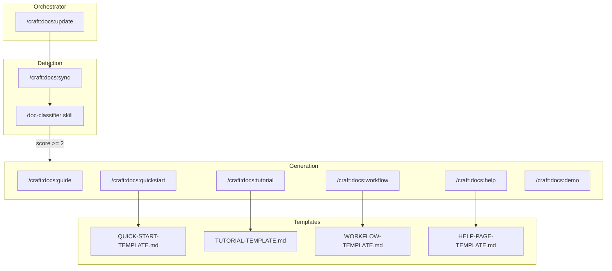
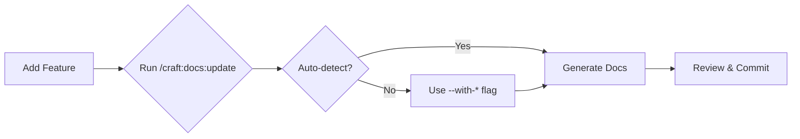

# SPEC: Craft Documentation System Improvement

**Status:** draft
**Created:** 2026-01-14
**From Brainstorm:** This session
**Priority:** High

---

## Overview

Enhance Craft's documentation system to reliably generate docs for new features, create help/workflow/tutorial pages on demand, and integrate ADHD-friendly templates from flow-cli. The current `/craft:docs:update` command sometimes fails to trigger because the scoring algorithm threshold is too high or changes don't match classification patterns.

---

## Primary User Story

**As a** plugin developer using Craft
**I want** documentation to be automatically generated when I add new features
**So that** I don't have to manually remember which docs to create or update

### Acceptance Criteria

- [ ] `/craft:docs:update` generates tutorial when multi-step features detected
- [ ] `/craft:docs:update --with-tutorial` forces tutorial generation
- [ ] `/craft:docs:help "command"` generates help page from template
- [ ] `/craft:docs:workflow "topic"` generates workflow doc from template
- [ ] 7 ADHD templates imported from flow-cli
- [ ] All tests pass

---

## Secondary User Stories

### Story 2: Force Generation
**As a** developer
**I want** to force specific doc types to be generated
**So that** I can create docs even when auto-detection doesn't trigger

### Story 3: Template Access
**As a** developer
**I want** access to ADHD-friendly doc templates
**So that** I can create consistent, scannable documentation

---

## Architecture



---

## API Design

### New Commands

| Command | Arguments | Description |
|---------|-----------|-------------|
| `/craft:docs:help` | `"command-name"` | Generate help page for a command |
| `/craft:docs:workflow` | `"topic"` | Generate workflow documentation |
| `/craft:docs:quickstart` | (none) | Generate 5-minute quickstart guide |

### Enhanced Flags for `/craft:docs:update`

| Flag | Effect |
|------|--------|
| `--with-tutorial` | Force tutorial generation |
| `--with-help` | Force help page generation |
| `--with-workflow` | Force workflow generation |
| `--with-quickstart` | Force quickstart generation |
| `--all` | Generate all doc types |
| `--threshold N` | Override scoring threshold (default: 3) |

---

## Data Models

### Extended Scoring Algorithm

```yaml
# skills/docs/doc-classifier.md additions
scoring_factors:
  tutorial:
    new_cli_command: 1
    new_module: 2
    multi_step_process: 3
    config_changes: 1
    user_facing_feature: 2
    complex_workflow: 3
    threshold: 2  # Lower than guide (3)

  help:
    new_cli_command: 2
    new_module: 1
    user_facing_feature: 1
    threshold: 2

  workflow:
    multi_step_process: 3
    complex_workflow: 4
    hook_system: 2
    threshold: 3

  quickstart:
    new_cli_command: 1
    new_module: 2
    user_facing_feature: 3
    first_time_setup: 4
    threshold: 3
```

---

## Dependencies

| Dependency | Purpose | Status |
|------------|---------|--------|
| flow-cli templates | ADHD-friendly doc templates | To import |
| VHS | Terminal GIF recording | Existing |
| MkDocs | Documentation site | Existing |
| Mermaid | Diagrams | Existing |

---

## UI/UX Specifications

### User Flow



### Wireframes (ASCII)

```
┌─────────────────────────────────────────────────────────────┐
│ /craft:docs:update --with-tutorial                          │
├─────────────────────────────────────────────────────────────┤
│                                                             │
│ Step 1/5: DETECTING CHANGES                                 │
│   ✓ 3 new commands detected                                 │
│   ✓ Tutorial requested (--with-tutorial)                    │
│                                                             │
│ Step 2/5: GENERATING DOCS                                   │
│   ✓ Guide: docs/guide/feature.md                            │
│   ✓ Tutorial: docs/tutorials/feature-tutorial.md  ← NEW     │
│   ✓ Refcard: docs/reference/REFCARD-FEATURE.md              │
│                                                             │
│ Step 3/5: CHECKING DOCS                                     │
│   ✓ All links valid                                         │
│                                                             │
└─────────────────────────────────────────────────────────────┘
```

### Accessibility Checklist

- [x] Progress indicators for each phase
- [x] Clear success/failure status
- [x] Next steps always shown
- [x] Time estimates included
- [x] One-command operation (ADHD-friendly)

---

## Open Questions

1. **Template location:** Should templates live in `templates/docs/` or `skills/docs/templates/`?
2. **Backward compatibility:** Should old `/craft:docs:feature` alias remain?
3. **Default threshold:** Should we lower global threshold from 3 to 2?

---

## Review Checklist

- [ ] All new commands have tests
- [ ] Templates imported from flow-cli
- [ ] Scoring algorithm updated
- [ ] CLAUDE.md updated with new commands
- [ ] Documentation site updated
- [ ] ROADMAP.md updated

---

## Implementation Notes

### Phase 1: Quick Wins (30 min)
1. Import 7 templates from `~/projects/dev-tools/flow-cli/docs/conventions/adhd/`
2. Add `--with-tutorial`, `--with-help`, `--with-workflow` flags to update.md

### Phase 2: New Commands (2-3 hours)
1. Create `/craft:docs:help.md`
2. Create `/craft:docs:workflow.md`
3. Create `/craft:docs:quickstart.md`

### Phase 3: Scoring Enhancement (1 hour)
1. Update `skills/docs/doc-classifier.md` with new types
2. Add new types to `/craft:docs:update.md` orchestrator

### Phase 4: Testing (30 min)
1. Add tests for new commands
2. Validate scoring thresholds

---

## History

| Date | Change | Author |
|------|--------|--------|
| 2026-01-14 | Initial spec from brainstorm | Claude + DT |
