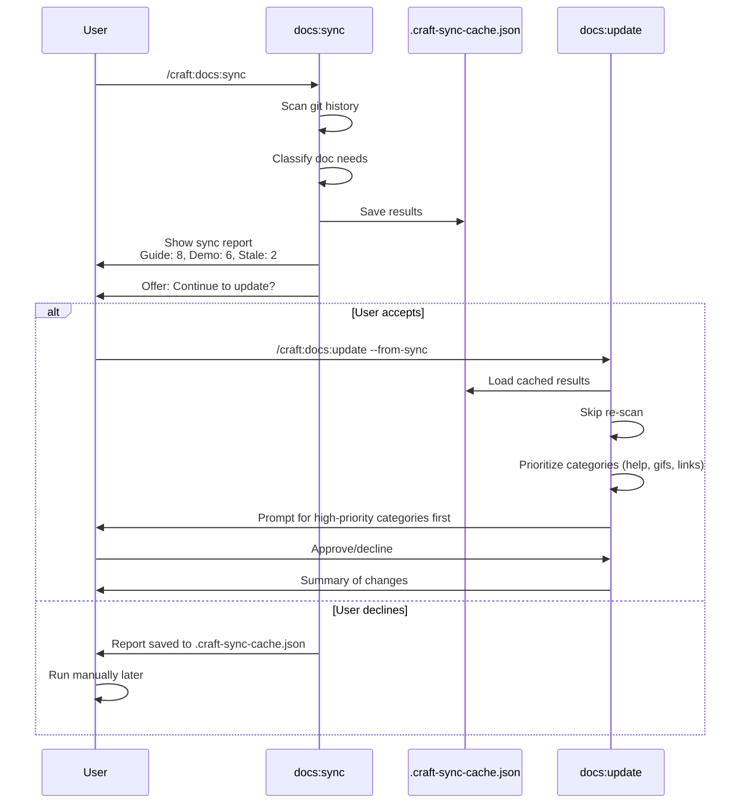

# SPEC: Merged `/craft:docs:update` with Integrated Detection

**Status:** draft → **revised (merge decision)**
**Created:** 2026-01-22
**Revised:** 2026-01-22 (User decision: Merge sync into update)
**From Brainstorm:** deep optimize analysis
**Related:** SPEC-docs-update-interactive-2026-01-22.md

---

## Overview

**DECISION:** Merge `/craft:docs:sync` functionality into `/craft:docs:update` to create a single, unified documentation command that **auto-detects** changes before prompting for updates.

**Rationale:**

- Eliminates command duplication (two commands → one)
- Auto-detection is more intuitive (user doesn't need to know about sync)
- Single workflow: detect → classify → prioritize → prompt → execute
- `/craft:docs:sync` becomes **deprecated** (replaced by `/craft:docs:update --detect-only`)

**Key Change:** `/craft:docs:update` now **always starts with detection** (git scan + classification) before showing interactive prompts.

---

## Primary User Story

**As a** craft plugin maintainer
**I want** a single command that auto-detects what needs updating then lets me approve changes
**So that** I don't need to manually run detection before updates or remember two separate commands

**Acceptance Criteria:**

- ✅ Single `/craft:docs:update` command (sync merged in)
- ✅ Auto-detection runs first (git scan + classification)
- ✅ Detection results prioritize prompts (high-score categories first)
- ✅ `--detect-only` flag for analysis without prompts (replaces sync)
- ✅ Backward compat: `/craft:docs:sync` → alias or deprecation warning

---

## Current State Analysis

### `/craft:docs:sync` - Detection & Classification

**Purpose:** Read-only analysis
**What it does:**

- Scans git history (last N commits)
- Detects new commands, modules, hooks
- Classifies doc needs (guide, refcard, demo, mermaid)
- Scores each type (threshold: 3)
- Reports stale docs (file age vs code changes)
- Recommends next action

**Outputs:**

- Quick summary (default)
- Detailed breakdown (--verbose)
- JSON for automation (--json)
- Suggested command: `/craft:docs:update "feature"`

**Flags:**

```
--verbose      Detailed analysis
--json         Machine-readable
--since        Custom commit range
--dry-run      Preview analysis plan
--orch         Orchestration mode (v2.5.0)
--orch-mode    Orchestration mode selection
```

**Key Feature:** Classification algorithm scores documentation needs

### `/craft:docs:update` - Interactive Execution

**Purpose:** Apply documentation updates with user approval
**What it does:**

- Updates version references
- Updates command counts
- Fixes broken links
- Regenerates outdated GIFs
- Validates/creates help files
- Auto-triggers lint
- Prompts for tutorials
- Updates changelog

**Outputs:**

- Interactive prompts per category
- Summary of all changes applied
- Files created/updated

**Flags:**

```
--dry-run         Preview changes only
--category        Process specific category
--skip-lint       Don't auto-lint
--skip-tutorials  Don't prompt for tutorials
--skip-help       Don't check help files
--auto-approve    Auto-approve categories
```

**Key Feature:** Interactive category-level prompts

---

## Overlap Analysis

### ✅ Complementary (Good Separation)

| Feature | docs:sync | docs:update |
|---------|-----------|-------------|
| **Purpose** | Detect what needs updating | Execute updates with approval |
| **Mode** | Read-only analysis | Write operations |
| **Input** | Git history | User decisions |
| **Output** | Recommendations | Applied changes |
| **Interactivity** | None (batch) | High (prompts) |

**Verdict:** Core purposes are distinct and complementary.

### ⚠️ Overlapping Features (Needs Integration)

| Feature | docs:sync | docs:update | Issue |
|---------|-----------|-------------|-------|
| **Stale detection** | ✓ Reports stale docs | ✓ Could detect stale docs | Duplication |
| **--verbose flag** | ✓ Detailed breakdown | ✓ Could show detailed changes | Similar UX |
| **--json flag** | ✓ Machine output | Could add JSON output | Similar need |
| **--dry-run** | ✓ Preview analysis | ✓ Preview changes | Consistent pattern |
| **Orchestration** | ✓ --orch flag | Could add --orch | Both support orch |

**Verdict:** Shared patterns should use common implementation.

### ❌ Missing Integration

| Gap | Impact |
|-----|--------|
| **No handoff** | User must manually run `docs:update` after `sync` | Medium |
| **Re-scanning** | `update` might re-scan what `sync` already found | Low |
| **No cache** | `sync` results not persisted for `update` | Low |
| **Inconsistent categories** | `sync` scores (guide, demo) vs `update` (version, GIF, help) | High |

**Verdict:** Needs better workflow integration.

---

## Architecture: Before vs After Merge

### Before: Separate Commands (Current)

```mermaid
graph TD
    User[User] -->|runs| Sync[/craft:docs:sync]
    Sync -->|scans| Git[Git History]
    Sync -->|outputs| Report[Report: "3 docs stale, guide score: 7"]

    Report -->|user sees| Recommendation["Suggested: /craft:docs:update"]

    User -->|manually runs| Update[/craft:docs:update]
    Update -->|prompts| UserPrompts[Category prompts]
    UserPrompts -->|approves| Changes[Apply changes]

    Changes --> Files[Updated files]

    style Sync fill:#e1f5ff
    style Update fill:#fff4e1
    style Report fill:#f0f0f0
```

**Issues:**

- Two separate commands (confusing UX)
- No automatic handoff
- User must remember to run sync first
- Sync scores don't influence update priorities

### After: Merged Command (Proposed)

```mermaid
graph TD
    User[User] -->|runs| Update[/craft:docs:update]

    Update -->|Step 1| Detect[Auto-detect changes]
    Detect -->|scans| Git[Git History]
    Detect -->|classifies| Classify[Score doc needs]

    Classify -->|maps| Categories[Map to update categories]
    Categories -->|prioritizes| Priority[Sort by score]

    Priority -->|Step 2| Report{--detect-only?}

    Report -->|Yes| ShowReport[Show report + exit]
    Report -->|No| Prompts[Interactive prompts]

    Prompts -->|prioritized order| HighPriority[Help files: score 10]
    HighPriority -->|user approves| NextCategory[Changelog: score 9]
    NextCategory -->|user approves| Continue[... more categories]

    Continue -->|all done| Changes[Apply changes]
    Changes --> Files[Updated files]

    ShowReport -->|exit| End[Complete]
    Changes --> Summary[Show summary]
    Summary --> End

    style Update fill:#e1ffe1
    style Detect fill:#e1f5ff
    style Report fill:#ffe1f5
```

**Benefits:**

- **Single command** - No need to know about sync
- **Auto-detection** - Always runs before prompts
- **Prioritized prompts** - High-score categories first
- **Detect-only mode** - `--detect-only` flag replaces sync
- **Backward compat** - `/craft:docs:sync` becomes alias

---

## Merged Command Behavior

### `/craft:docs:update` (New Unified Behavior)

**Default:** Auto-detect then prompt for updates

```bash
/craft:docs:update

# Step 1: Auto-detection (replaces old sync)
→ Scans git history (default: HEAD~10)
→ Detects new commands, modules, hooks
→ Classifies doc needs (guide, demo, refcard, mermaid)
→ Maps classifications to update categories
→ Prioritizes categories by score

# Step 2: Interactive prompts (existing behavior)
→ Shows detection summary
→ Prompts for each category (highest priority first)
→ User approves/declines
→ Applies changes
→ Shows summary
```

**Detection-Only Mode:** Analysis without prompts (replaces `/craft:docs:sync`)

```bash
/craft:docs:update --detect-only

# Runs detection, shows report, exits (no prompts)
→ Scans git history
→ Classifies doc needs
→ Shows sync-style report
→ Exits (no updates applied)
```

**Flags:**

| Flag | Effect | Replaces |
|------|--------|----------|
| `--detect-only` | Analysis report only, no prompts | `/craft:docs:sync` |
| `--no-detect` | Skip detection, manual category selection | (new) |
| `--since COMMIT` | Custom commit range for detection | (from sync) |
| `--category` | Override detected priorities, process specific category | (existing) |
| `--dry-run` | Preview all changes (detection + prompts) | (existing) |
| `--verbose` | Detailed detection report + prompts | (from sync + existing) |
| `--json` | JSON output for automation | (from sync) |

### `/craft:docs:sync` (Deprecated)

**Status:** Aliased to `/craft:docs:update --detect-only`

```bash
/craft:docs:sync
# Internally executes:
# /craft:docs:update --detect-only

# Shows deprecation warning:
⚠️  /craft:docs:sync is deprecated
   Use: /craft:docs:update --detect-only
   (or just: /craft:docs:update for full workflow)
```

**Migration Path:**

| Old Command | New Equivalent | Notes |
|-------------|----------------|-------|
| `/craft:docs:sync` | `/craft:docs:update --detect-only` | Alias with warning |
| `/craft:docs:sync --verbose` | `/craft:docs:update --detect-only --verbose` | Same output |
| `/craft:docs:sync --json` | `/craft:docs:update --detect-only --json` | Same JSON |
| `/craft:docs:sync + manual update` | `/craft:docs:update` | Single command now |

---

## Technical Requirements

### Unified Detection Module

**Create:** `utils/docs_detector.py`

```python
@dataclass
class DocChange:
    """Unified change detection"""
    type: str  # version, count, link, gif, help, stale
    file_path: str
    old_value: Optional[str]
    new_value: Optional[str]
    confidence: float  # 0.0-1.0
    source: str  # git_history, file_scan, help_validation

@dataclass
class SyncResult:
    """Output from docs:sync"""
    feature_name: Optional[str]
    classifications: Dict[str, float]  # guide: 8, demo: 6, etc.
    stale_docs: List[str]
    changes_detected: List[DocChange]
    suggested_categories: List[str]  # For docs:update

def detect_all_changes(since: str = "HEAD~10") -> SyncResult:
    """Unified detection used by both sync and update"""
    pass

def map_classification_to_categories(result: SyncResult) -> List[str]:
    """Map sync classifications to update categories"""
    # guide score: 8 → ["changelog", "help"] high priority
    # demo score: 6 → ["gifs"] high priority
    # stale: 2 docs → ["broken_links"] medium priority
    pass
```

### Integration Layer

**Create:** `utils/sync_update_bridge.py`

```python
def save_sync_results(result: SyncResult, cache_file: str = ".craft-sync-cache.json"):
    """Persist sync results for update command"""
    pass

def load_sync_results(cache_file: str) -> Optional[SyncResult]:
    """Load cached sync results in update command"""
    pass

def prioritize_categories(result: SyncResult) -> List[Tuple[str, int]]:
    """Return categories sorted by priority based on sync scores"""
    # Returns: [("help", 10), ("gifs", 6), ("links", 3)]
    pass
```

### Modified Commands

#### `/craft:docs:sync` Updates

**Add at end of command:**

```python
# After showing sync report
result = detect_all_changes(since=args.since)

# Save results for potential update handoff
save_sync_results(result)

# Offer workflow handoff
if result.changes_detected or result.stale_docs:
    print("\n📋 Recommended next step:")
    print(f"   /craft:docs:update --from-sync")
    print(f"   (will use cached results from this scan)\n")

    # Optional: Auto-invoke update
    if args.auto_update:  # NEW FLAG
        print("Auto-invoking /craft:docs:update...")
        subprocess.run(["/craft:docs:update", "--from-sync"])
```

**New flags:**

```
--auto-update    Automatically invoke docs:update after sync
--no-cache       Don't save results (ephemeral analysis)
```

#### `/craft:docs:update` Updates

**Add at start of command:**

```python
# Check for cached sync results
cached = load_sync_results()

if args.from_sync and cached:
    print("Using cached sync results from previous scan...")
    print(f"Feature: {cached.feature_name}")
    print(f"Changes detected: {len(cached.changes_detected)}")

    # Prioritize categories based on sync scores
    categories = prioritize_categories(cached)

    # Skip re-scanning, use cached changes
    changes_by_category = group_by_category(cached.changes_detected)

else:
    # Normal flow: scan from scratch
    changes_by_category = scan_for_updates()
```

**New flags:**

```
--from-sync      Use cached results from recent docs:sync run
--no-sync-cache  Ignore sync cache, scan from scratch
```

---

## Category Mapping

### Sync Classifications → Update Categories

| Sync Output | Update Category | Priority | Reason |
|-------------|-----------------|----------|--------|
| **Guide score ≥ 3** | Help Files | High | Guide needs → help docs |
| **Guide score ≥ 3** | Changelog | High | New feature → changelog entry |
| **Refcard score ≥ 3** | Help Files | Medium | Quick ref → help YAML |
| **Demo score ≥ 3** | GIF Regeneration | High | Demo needed → regenerate GIFs |
| **Mermaid score ≥ 3** | (N/A - manual) | Low | Diagrams are tutorial content |
| **Stale docs detected** | Broken Links | Medium | Stale → likely broken refs |
| **Stale docs detected** | Version References | Low | Old docs → old versions |
| **New commands found** | Help Files | High | New command → create help |
| **New modules found** | Tutorials | Medium | New module → tutorial |

**Implementation:**

```python
def map_classification_to_categories(result: SyncResult) -> List[Tuple[str, int]]:
    """Map sync scores to update categories with priority"""
    categories = []

    if result.classifications.get("guide", 0) >= 3:
        categories.append(("help", 10))  # High priority
        categories.append(("changelog", 9))

    if result.classifications.get("demo", 0) >= 3:
        categories.append(("gifs", 8))

    if result.classifications.get("refcard", 0) >= 3:
        categories.append(("help", 7))

    if len(result.stale_docs) > 0:
        categories.append(("links", 6))
        categories.append(("version", 5))

    if len(result.changes_detected) > 0:
        # Analyze change types
        for change in result.changes_detected:
            if change.type == "new_command":
                categories.append(("help", 9))
            elif change.type == "new_module":
                categories.append(("tutorials", 7))

    # Remove duplicates, sort by priority
    unique = dict(categories)  # Keeps highest priority per category
    return sorted(unique.items(), key=lambda x: x[1], reverse=True)
```

---

## UI/UX Specifications

### Workflow: Sync → Update Handoff

**User Flow:**



### Sync Report with Handoff Option

**Terminal Output:**

```
┌─────────────────────────────────────────────────────────────┐
│ /craft:docs:sync                                            │
├─────────────────────────────────────────────────────────────┤
│                                                             │
│ 📊 DOCUMENTATION STATUS                                     │
│                                                             │
│ Recent changes: 15 commits, 23 files                        │
│ Feature detected: "session tracking"                        │
│                                                             │
│ Classification (scores):                                    │
│   Guide:   ✓ 8  → Help files + Changelog                    │
│   Refcard: ✓ 5  → Help files                                │
│   Demo:    ✓ 6  → GIF regeneration                          │
│   Mermaid: ✓ 7  → (Tutorial content)                        │
│                                                             │
│ Stale docs: 2  → Broken links + Version refs                │
│   - docs/guide/auth.md (45 days)                            │
│   - docs/reference/api.md (32 days)                         │
│                                                             │
│ ──────────────────────────────────────────────────────────  │
│                                                             │
│ 📋 RECOMMENDED WORKFLOW                                     │
│                                                             │
│ Priority categories mapped:                                 │
│   1. Help files (priority: 10)                              │
│   2. Changelog (priority: 9)                                │
│   3. GIF regeneration (priority: 8)                         │
│   4. Broken links (priority: 6)                             │
│                                                             │
│ Continue to interactive update?                             │
│   ○ Yes - Run /craft:docs:update now (Recommended)          │
│   ○ No - Save report and exit                               │
│                                                             │
└─────────────────────────────────────────────────────────────┘
```

### Update Using Cached Sync Results

**Terminal Output:**

```
┌─────────────────────────────────────────────────────────────┐
│ /craft:docs:update --from-sync                              │
├─────────────────────────────────────────────────────────────┤
│                                                             │
│ 📂 Using cached sync results...                             │
│                                                             │
│ Feature: "session tracking"                                 │
│ Scanned: 15 commits, 23 files (via docs:sync)               │
│ Categories prioritized by sync classification               │
│                                                             │
│ ──────────────────────────────────────────────────────────  │
│                                                             │
│ Processing categories in priority order:                    │
│   1. Help files (score: 10)                                 │
│   2. Changelog (score: 9)                                   │
│   3. GIF regeneration (score: 8)                            │
│   4. Broken links (score: 6)                                │
│                                                             │
└─────────────────────────────────────────────────────────────┘

┌─────────────────────────────────────────────┐
│ Category: Help Files (Priority: 10)         │
├─────────────────────────────────────────────┤
│                                             │
│ Detected from sync:                         │
│   • 5 new commands need help files          │
│   • Guide score: 8 (recommended)            │
│                                             │
│ Create help files for new commands?         │
│   ○ Yes - Create all (Recommended)          │
│   ○ Yes - Prompt per command                │
│   ○ No - Skip this category                 │
│                                             │
└─────────────────────────────────────────────┘
```

---

## Data Models

### SyncResult

```python
@dataclass
class SyncResult:
    """Cached output from docs:sync"""
    timestamp: datetime
    feature_name: Optional[str]
    commit_range: str  # e.g., "HEAD~10..HEAD"

    # Classification scores
    classifications: Dict[str, float]
    # { "guide": 8, "refcard": 5, "demo": 6, "mermaid": 7 }

    # Detected components
    new_commands: List[str]
    new_modules: List[str]
    new_hooks: List[str]

    # Stale docs
    stale_docs: List[StaleDoc]

    # Mapped to update categories
    suggested_categories: List[Tuple[str, int]]
    # [("help", 10), ("changelog", 9), ("gifs", 8)]

    # Raw changes for update to use
    changes_detected: List[DocChange]

@dataclass
class StaleDoc:
    path: str
    days_old: int
    related_code_changed: bool
    last_code_change: Optional[datetime]

@dataclass
class DocChange:
    type: str  # version, count, link, gif, help, stale
    category: str  # Maps to update category
    file_path: str
    description: str  # Human-readable
    old_value: Optional[str]
    new_value: Optional[str]
    confidence: float
    source: str  # git_history, file_scan, help_validation
```

### Cache File Format

**`.craft-sync-cache.json`:**

```json
{
  "timestamp": "2026-01-22T20:30:00Z",
  "feature_name": "session tracking",
  "commit_range": "HEAD~15..HEAD",
  "classifications": {
    "guide": 8,
    "refcard": 5,
    "demo": 6,
    "mermaid": 7
  },
  "new_commands": [
    "sessions live",
    "sessions current",
    "sessions task"
  ],
  "stale_docs": [
    {
      "path": "docs/guide/auth.md",
      "days_old": 45,
      "related_code_changed": true
    }
  ],
  "suggested_categories": [
    ["help", 10],
    ["changelog", 9],
    ["gifs", 8],
    ["links", 6]
  ],
  "changes_detected": [
    {
      "type": "new_command",
      "category": "help",
      "file_path": "commands/sessions/live.md",
      "description": "New command: sessions live",
      "confidence": 1.0,
      "source": "git_history"
    }
  ]
}
```

---

## API Design

### New Flags for `/craft:docs:sync`

| Flag | Type | Default | Description |
|------|------|---------|-------------|
| `--auto-update` | bool | false | Auto-invoke docs:update after sync |
| `--no-cache` | bool | false | Don't save results (ephemeral) |
| `--cache-file` | str | .craft-sync-cache.json | Custom cache location |

### New Flags for `/craft:docs:update`

| Flag | Type | Default | Description |
|------|------|---------|-------------|
| `--from-sync` | bool | false | Use cached sync results |
| `--no-sync-cache` | bool | false | Ignore sync cache, scan fresh |
| `--sync-cache-file` | str | .craft-sync-cache.json | Custom cache location |

### Internal Functions

```python
# Shared detection (used by both commands)
def detect_all_changes(since: str) -> SyncResult:
    """Unified change detection"""
    pass

def classify_doc_needs(changes: List[DocChange]) -> Dict[str, float]:
    """Classification algorithm (sync scoring)"""
    pass

def detect_stale_docs(doc_dir: str, code_dir: str) -> List[StaleDoc]:
    """Find stale docs"""
    pass

# Integration layer
def save_sync_results(result: SyncResult, cache_file: str):
    """Persist to JSON"""
    pass

def load_sync_results(cache_file: str) -> Optional[SyncResult]:
    """Load from JSON"""
    pass

def map_classification_to_categories(result: SyncResult) -> List[Tuple[str, int]]:
    """Sync scores → update categories"""
    pass

def prioritize_categories(result: SyncResult) -> List[Tuple[str, int]]:
    """Sort categories by priority"""
    pass

def group_changes_by_category(changes: List[DocChange]) -> Dict[str, List[DocChange]]:
    """Group for update prompts"""
    pass
```

---

## Open Questions

1. **Cache Expiration**
   Q: How long should sync cache be valid?
   Options: (a) 1 hour; (b) Until next sync; (c) User clears manually
   **Recommendation:** (b) Until next sync run (always fresh)

2. **Auto-Update Default**
   Q: Should `docs:sync` auto-invoke `docs:update` by default?
   Options: (a) Always ask; (b) Auto-invoke if changes found; (c) Require --auto-update flag
   **Recommendation:** (a) Always ask (explicit consent)

3. **Sync Without Update**
   Q: Should `docs:sync` work standalone or always integrate with update?
   Options: (a) Standalone only; (b) Integration only; (c) Both modes
   **Recommendation:** (c) Both - sync alone for analysis, integration for workflow

4. **Category Priority Override**
   Q: Should users be able to override sync-based priorities?
   Options: (a) No, sync decides; (b) Yes, via --category flag; (c) Prompt at start
   **Recommendation:** (b) `--category` flag overrides sync priorities

5. **Multiple Sync Runs**
   Q: What if user runs sync multiple times before update?
   Options: (a) Overwrite cache; (b) Merge results; (c) Ask which to use
   **Recommendation:** (a) Overwrite (latest is source of truth)

---

## Review Checklist

### Implementation

- [ ] Create shared `utils/docs_detector.py` module
- [ ] Extract detection logic from both commands
- [ ] Implement `SyncResult` data model
- [ ] Add cache save/load functions
- [ ] Implement classification → category mapping
- [ ] Add `--from-sync` flag to docs:update
- [ ] Add `--auto-update` flag to docs:sync
- [ ] Update docs:sync to offer handoff
- [ ] Update docs:update to check cache first
- [ ] Add cache expiration logic

### Testing

- [ ] Unit tests: Shared detection module
- [ ] Unit tests: Cache save/load
- [ ] Unit tests: Category mapping
- [ ] Integration test: Sync → Update workflow
- [ ] Integration test: Cache hit vs miss
- [ ] Edge case: Cache file corrupt
- [ ] Edge case: Sync run with no changes
- [ ] Edge case: Multiple sync runs before update
- [ ] Performance: Cached update faster than fresh scan

### Documentation

- [ ] Update `/craft:docs:sync` command docs
- [ ] Update `/craft:docs:update` command docs
- [ ] Document sync → update workflow
- [ ] Add examples for --from-sync
- [ ] Add examples for --auto-update
- [ ] Document cache file format
- [ ] Tutorial: "Documentation Workflow"
- [ ] Update CLAUDE.md with integration

### UX

- [ ] Handoff prompt is clear
- [ ] Cache usage is transparent
- [ ] Priority explanation shown
- [ ] "Recommended" options marked
- [ ] Summary shows cache hit/miss

---

## Implementation Notes

### Phase 1: Shared Detection (Week 1)

**Goal:** Extract and unify detection logic

1. Create `utils/docs_detector.py`
2. Move detection functions from both commands
3. Implement `SyncResult` data model
4. Update both commands to use shared module

**Deliverables:**

- No duplication of detection code
- Both commands use same detection
- Tests pass for both commands

### Phase 2: Caching Layer (Week 2)

**Goal:** Implement cache save/load

1. Implement JSON serialization for `SyncResult`
2. Add cache save at end of `docs:sync`
3. Add cache load at start of `docs:update`
4. Handle cache expiration/corruption

**Deliverables:**

- Cache file written by sync
- Cache file read by update
- Graceful fallback if cache missing

### Phase 3: Integration Workflow (Week 3)

**Goal:** Connect sync and update seamlessly

1. Add handoff prompt to `docs:sync`
2. Add `--from-sync` flag to `docs:update`
3. Implement category mapping (sync → update)
4. Prioritize categories based on sync scores

**Deliverables:**

- Seamless workflow: sync → update
- Prioritized prompts in update
- User can decline handoff

### Phase 4: Polish & Flags (Week 4)

**Goal:** Add convenience flags and docs

1. Add `--auto-update` to sync
2. Add `--no-cache` flags
3. Write comprehensive tests
4. Update documentation
5. Create workflow tutorial

**Deliverables:**

- All flags work as spec'd
- 90%+ test coverage
- Tutorial published

---

## Success Metrics

| Metric | Target | How to Measure |
|--------|--------|----------------|
| **Workflow efficiency** | 50% faster than manual | Time from sync to complete update |
| **Cache hit rate** | 80% of updates use cache | Track --from-sync usage |
| **No re-scanning** | 0 redundant scans | Log when detection runs |
| **User satisfaction** | 90% prefer integrated workflow | User feedback survey |
| **Code duplication** | 0% shared detection code | Static analysis |

---

## History

| Date | Change | Author |
|------|--------|--------|
| 2026-01-22 | Initial spec from deep optimize brainstorm | Claude |

---

## Related Specs

- SPEC-docs-update-interactive-2026-01-22.md (Interactive update workflow)
- SPEC-craft-hub-v2-2026-01-15.md (Auto-discovery patterns)

---

## Appendix: Comparison Table

### Command Comparison

| Feature | docs:sync | docs:update | Integration Needed |
|---------|-----------|-------------|-------------------|
| **Purpose** | Detect & classify | Execute & update | ✅ Complementary |
| **Mode** | Read-only | Write operations | ✅ Clear separation |
| **Input** | Git history | User decisions | ⚠️ Could share context |
| **Interactivity** | None | High (prompts) | ✅ Different UX needs |
| **Caching** | None | None | ❌ Need shared cache |
| **Handoff** | Manual (suggest) | Manual (invoke) | ❌ Need auto-handoff |
| **Prioritization** | Scoring | None | ❌ Need score → priority |
| **--dry-run** | ✓ | ✓ | ✅ Consistent |
| **--verbose** | ✓ | Could add | ⚠️ Similar patterns |
| **--json** | ✓ | Could add | ⚠️ Similar patterns |
| **Orchestration** | ✓ --orch | Could add | ⚠️ Both support orch |

### Category Mapping Table

| Sync Classification | Score Threshold | Update Category | Priority | Auto-Create |
|---------------------|-----------------|-----------------|----------|-------------|
| Guide | ≥ 3 | Help Files | 10 | Create YAML |
| Guide | ≥ 3 | Changelog | 9 | Add entry |
| Refcard | ≥ 3 | Help Files | 7 | Update args |
| Demo | ≥ 3 | GIF Regeneration | 8 | Regenerate |
| Mermaid | ≥ 3 | Tutorials | 5 | Create diagram |
| Stale docs | > 0 | Broken Links | 6 | Fix refs |
| Stale docs | > 0 | Version References | 5 | Update versions |
| New commands | > 0 | Help Files | 9 | Create from template |
| New modules | > 0 | Tutorials | 7 | Create tutorial |
