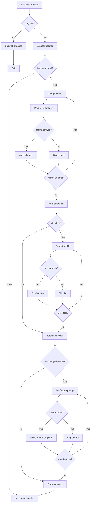
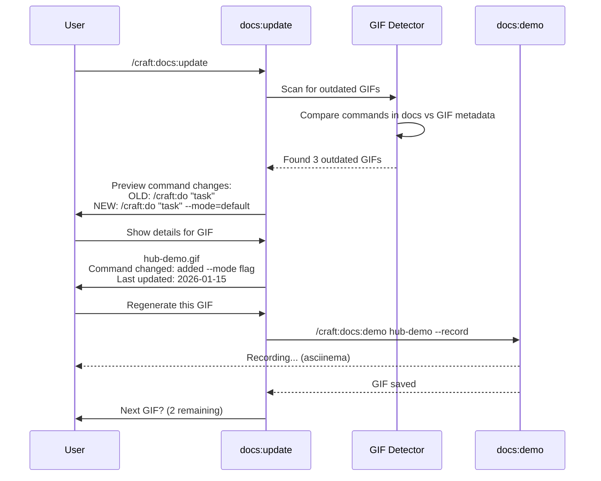
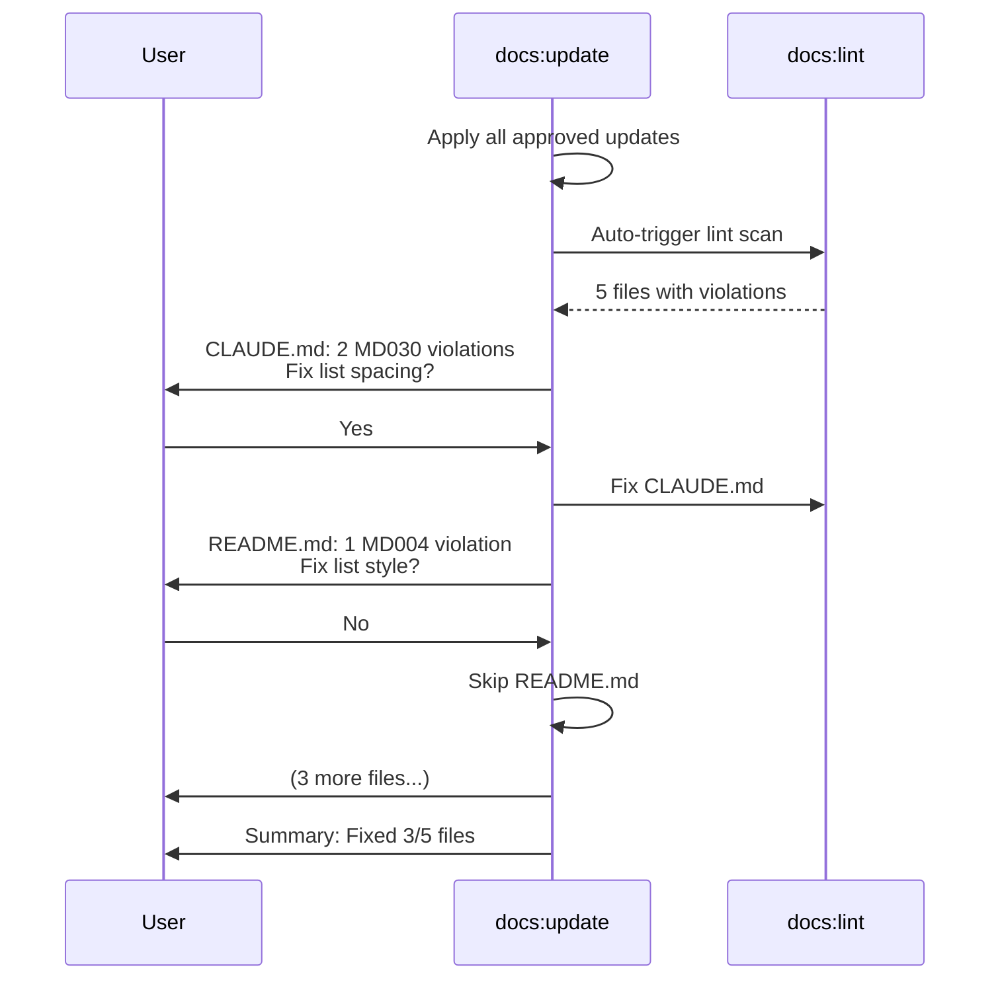
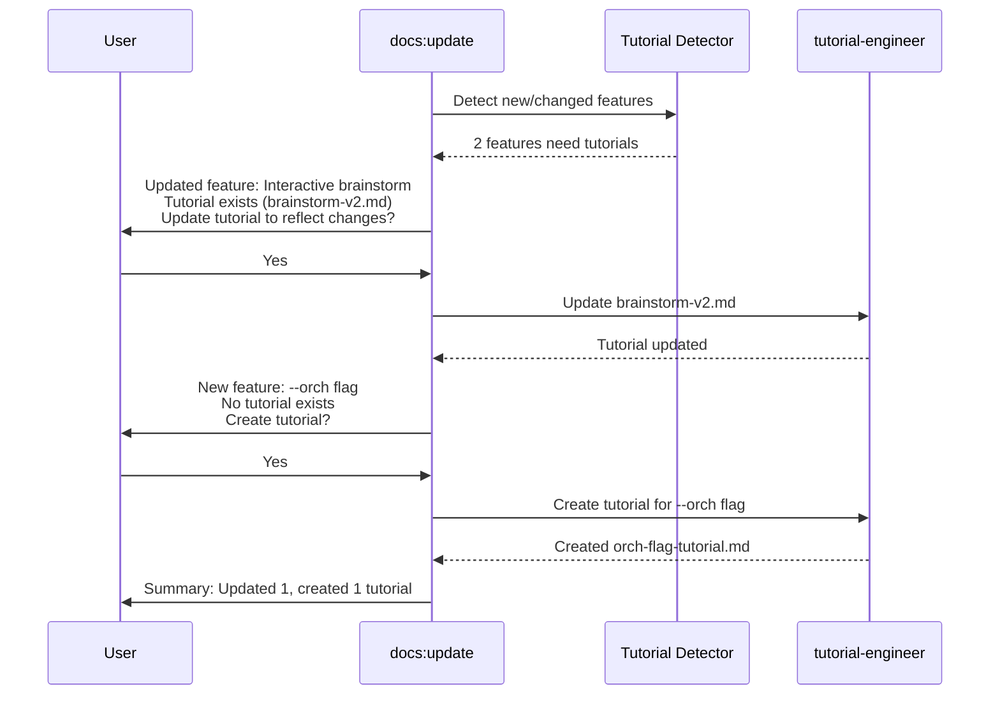
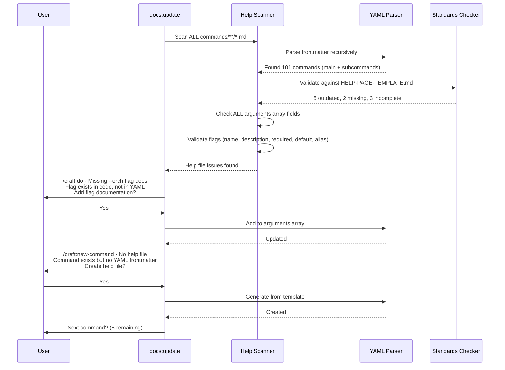

# SPEC: Interactive Documentation Update Workflow

**Status:** draft
**Created:** 2026-01-22
**From Brainstorm:** deep feature analysis
**Related:** `/craft:docs:update`, `/craft:docs:demo`, `/craft:docs:lint`, `/craft:tutorial-engineer`

---

## Overview

Transform `/craft:docs:update` from an all-or-nothing batch operation into an interactive workflow with category-level control, integrated GIF regeneration, help file validation, automatic linting, and smart tutorial creation. Users gain precise control over what gets updated while maintaining a fast, ADHD-friendly experience.

**Key Value Proposition:** Trust through transparency and control. Users see what will change, approve by category, and let the command orchestrate related operations (lint, tutorials, GIFs) in a guided workflow.

---

## Primary User Story

**As a** craft plugin maintainer
**I want** interactive control over documentation updates with integrated GIF/tutorial workflows
**So that** I can approve changes by category, regenerate outdated demos, fix lint violations, and create tutorials in one guided session without surprises

**Acceptance Criteria:**

- ✅ Category-level prompts (version updates, GIF regen, link fixes, help files, etc.)
- ✅ Integrated GIF workflow: detect outdated GIFs → show command diffs → offer regeneration
- ✅ Help file detection: scan command YAML frontmatter → suggest updates → prompt per command
- ✅ Auto-trigger lint after updates, prompt per-file for fixes
- ✅ Per-feature tutorial prompts during doc updates
- ✅ Dry-run mode via `--dry-run` flag for preview-only
- ✅ Bulk change handling: group by type, one prompt per category
- ✅ Declined updates skip silently (no logging/tasks)

---

## Secondary User Stories

### Story 2: Quick Updates Without Friction

**As a** time-pressed developer
**I want** smart defaults that auto-fix safe changes
**So that** I only get prompted for decisions that matter (not 50 identical link fixes)

**Acceptance Criteria:**

- Group identical change types (e.g., "Fix 47 broken internal links?")
- Show summary with first 5 examples
- Single yes/no per category

### Story 3: GIF Regeneration Confidence

**As a** docs maintainer worried about broken demos
**I want** to see what changed in GIF commands before regenerating
**So that** I can verify new commands work before recording them

**Acceptance Criteria:**

- Detect which GIF commands changed (diff old vs new)
- Show command changes: `OLD: /craft:do "task"` → `NEW: /craft:do "task" --mode=default`
- Offer regeneration with preview of changes
- User decides yes/no per GIF (no auto-regen)

### Story 4: Tutorial Maintenance

**As a** feature developer adding new commands
**I want** to be prompted to create/update tutorials during doc updates
**So that** tutorials stay in sync with feature changes

**Acceptance Criteria:**

- Per-feature prompt: "Create tutorial for new feature X?"
- Detect existing tutorials, offer update: "Tutorial exists, update it?"
- Seamless handoff to `/tutorial-engineer` agent

---

## Architecture

### Workflow Phases



### Update Categories

| Category | What It Updates | Example Prompt |
|----------|-----------------|----------------|
| **Version References** | Version numbers in docs (v2.5.0 → v2.6.0) | "Update 12 version references to v2.6.0?" |
| **Command Counts** | "99 commands" → "101 commands" | "Update command count to 101 in 4 files?" |
| **Feature Status** | Feature matrix, completion % | "Mark 3 features complete in status matrix?" |
| **Broken Links** | Internal links, file refs | "Fix 47 broken internal links?" |
| **GIF Regeneration** | Outdated demo GIFs | "Regenerate 3 GIFs with changed commands?" |
| **Changelog** | Add release notes for new version | "Add changelog entry for v2.6.0?" |
| **Navigation** | mkdocs.yml, table of contents | "Add 2 new pages to navigation?" |
| **Help Files** | Command YAML frontmatter (description, arguments, flags) | "5 commands need help updates, 2 missing help entirely?" |
| **Tutorial Updates** | Existing tutorial files (docs/tutorials/) | "Update 2 tutorials with new features?" |

### GIF Workflow Integration



### Lint Integration



### Tutorial Integration



### Help File Integration



**Comprehensive Help File Validation:**

#### 1. Command Discovery (Recursive)

```bash
# Scan all command files (main + subcommands)
find commands/ -type f -name "*.md" | sort

# Examples found:
# - commands/do.md                    (main command)
# - commands/docs/lint.md             (subcommand)
# - commands/git/worktree.md          (subcommand)
# - commands/orchestrate/resume.md    (nested subcommand)
```

**Validation:** Test ALL 101 commands, including nested subcommands.

#### 2. YAML Frontmatter Validation

For each command file, validate complete YAML structure:

```yaml
---
description: <string>              # REQUIRED - Main help text
category: <string>                 # REQUIRED for subcommands
arguments:                         # OPTIONAL but recommended
  - name: <string>                 # REQUIRED if arguments exist
    description: <string>          # REQUIRED
    required: <boolean>            # REQUIRED
    default: <any>                 # OPTIONAL
    alias: <string>                # OPTIONAL (e.g., "-n")
---
```

**Standards Compliance Checks:**

| Field | Requirement | Example | Check |
|-------|-------------|---------|-------|
| `description:` | 1-2 sentences, actionable | "Smart task routing with complexity scoring" | ✓ Present, concise |
| `category:` | Match directory | `docs` for `commands/docs/lint.md` | ✓ Matches path |
| `arguments:` | Complete for all flags | All `--flag` options documented | ✓ All flags listed |
| `arguments[].name` | Match actual flag | `--dry-run` in code → `dry-run` in YAML | ✓ Name matches |
| `arguments[].description` | Clear, helpful | "Preview without executing" not "Dry run mode" | ✓ Actionable text |
| `arguments[].required` | Accurate | `true` for positional args, `false` for flags | ✓ Correct boolean |
| `arguments[].default` | Accurate | `false` for boolean flags, `null` for optional | ✓ Correct default |
| `arguments[].alias` | If exists | `-n` for `--dry-run` | ✓ Alias documented |

#### 3. Flag Completeness Validation

**Detection Method:**

1. **Extract from Code:** Parse command implementation for all flags
2. **Extract from YAML:** Parse `arguments:` array
3. **Compare:** Find missing/extra/mismatched flags

**Example Validation:**

```python
# Code defines these flags:
code_flags = ["--dry-run", "--orch", "--orch-mode", "task"]

# YAML documents these:
yaml_flags = ["task", "dry-run", "orch"]

# Missing from YAML:
missing = ["--orch-mode"]  # ← Needs to be added

# Extra in YAML:
extra = []  # ← All YAML flags exist in code

# Validation result: Missing 1 flag documentation
```

#### 4. Issue Types Detected

| Issue Type | Description | Action |
|------------|-------------|--------|
| **Missing Help File** | Command exists, no YAML frontmatter | Offer to CREATE |
| **Incomplete YAML** | Missing `description` or `category` | Offer to ADD fields |
| **Outdated Description** | Mentions removed features | Offer to UPDATE |
| **Missing Flags** | Flag in code, not in `arguments:` | Offer to ADD flag |
| **Extra Flags** | Flag in YAML, not in code | Offer to REMOVE |
| **Wrong Defaults** | `default:` doesn't match code | Offer to FIX |
| **Missing Aliases** | Short flag exists, not documented | Offer to ADD alias |
| **Category Mismatch** | `category: git` but file in `commands/docs/` | Offer to FIX |

#### 5. Help File Standards (from HELP-PAGE-TEMPLATE.md)

**Command Structure Standards:**

```markdown
# /craft:[command] - [Title]

> **[One-sentence description]**

## Synopsis

\`\`\`bash
/craft:[command] [OPTIONS] [ARGUMENTS]
\`\`\`

## Options

### Required Arguments
| Argument | Description | Example |
|----------|-------------|---------|
| `<arg>` | [What this is] | `command foo` |

### Flags
| Flag | Short | Description |
|------|-------|-------------|
| `--flag` | `-f` | [What this does] |

## Examples

\`\`\`bash
# [Common use case]
/craft:[command] [usage]
\`\`\`
```

**Validation Against Template:**

- ✓ Synopsis section exists with bash code block
- ✓ Options section lists all arguments
- ✓ Flags table includes Short column for aliases
- ✓ Examples section shows real usage

#### 6. Prompts for Each Issue Type

**Missing Help File:**

```
╭─────────────────────────────────────────────╮
│ Missing Help: /craft:new-command (1 of 2)   │
├─────────────────────────────────────────────┤
│                                             │
│ File: commands/new-command.md               │
│ Status: No YAML frontmatter found           │
│                                             │
│ Detected from code:                         │
│   • 2 required arguments                    │
│   • 4 optional flags                        │
│   • Category: (unknown)                     │
│                                             │
│ Create help file from template?             │
│   ○ Yes - Generate YAML + help page         │
│   ○ Yes - YAML frontmatter only             │
│   ○ No - Skip this command                  │
│                                             │
╰─────────────────────────────────────────────╯
```

**Missing Flag Documentation:**

```
╭─────────────────────────────────────────────╮
│ Missing Flag: /craft:do (1 of 5)            │
├─────────────────────────────────────────────┤
│                                             │
│ Flag: --orch-mode                           │
│ Status: In code, not in YAML                │
│                                             │
│ Detected from implementation:               │
│   Name: orch-mode                           │
│   Type: string                              │
│   Default: null                             │
│   Options: default|debug|optimize|release   │
│                                             │
│ Suggested documentation:                    │
│   - name: orch-mode                         │
│     description: "Orchestration mode        │
│       (default|debug|optimize|release)"     │
│     required: false                         │
│     default: null                           │
│                                             │
│ Add this flag to arguments array?           │
│   ○ Yes - Use suggested (Recommended)       │
│   ○ Yes - Edit description first            │
│   ○ No - Skip this flag                     │
│                                             │
╰─────────────────────────────────────────────╯
```

**Outdated Description:**

```
╭─────────────────────────────────────────────╮
│ Outdated Help: /craft:check (1 of 3)        │
├─────────────────────────────────────────────┤
│                                             │
│ Current description:                        │
│   "Pre-flight validation with 3 checks"     │
│                                             │
│ Issues detected:                            │
│   ⚠ Says "3 checks" but code has 5         │
│   ⚠ Doesn't mention hot-reload validators   │
│                                             │
│ Suggested update:                           │
│   "Pre-flight validation with 5 built-in    │
│   checks plus hot-reload validators"        │
│                                             │
│ Update description?                         │
│   ○ Yes - Use suggested (Recommended)       │
│   ○ Yes - Edit custom text                  │
│   ○ No - Keep current                       │
│                                             │
╰─────────────────────────────────────────────╯
```

**Subcommand Category Validation:**

```
╭─────────────────────────────────────────────╮
│ Category Mismatch: /craft:docs:lint (1 of 1)│
├─────────────────────────────────────────────┤
│                                             │
│ File path: commands/docs/lint.md            │
│ YAML category: "documentation"              │
│ Expected: "docs"                            │
│                                             │
│ Issue: Category should match directory name │
│                                             │
│ Fix category field?                         │
│   ○ Yes - Change to "docs" (Recommended)    │
│   ○ No - Keep "documentation"               │
│                                             │
╰─────────────────────────────────────────────╯
```

#### 7. Batch Prompts for Common Issues

When multiple commands have the same issue type, group prompts:

```
╭─────────────────────────────────────────────╮
│ Missing --dry-run Flag Documentation        │
├─────────────────────────────────────────────┤
│                                             │
│ 12 commands have --dry-run in code but not  │
│ documented in YAML frontmatter:             │
│                                             │
│   • /craft:do                               │
│   • /craft:docs:lint                        │
│   • /craft:docs:update                      │
│   • /craft:check                            │
│   ... (8 more)                              │
│                                             │
│ Standard --dry-run documentation:           │
│   - name: dry-run                           │
│     description: "Preview without executing"│
│     required: false                         │
│     default: false                          │
│     alias: "-n"                             │
│                                             │
│ Add --dry-run to all 12 commands?           │
│   ○ Yes - Add to all (Recommended)          │
│   ○ Yes - Prompt per command                │
│   ○ No - Skip all                           │
│                                             │
╰─────────────────────────────────────────────╯
```

#### 8. Command-Line Help Validation (`--help` Output)

**Purpose:** Validate that `--help` output matches YAML frontmatter and provides consistent UX.

**Validation Method:**

```bash
# For each command, invoke with --help
/craft:do --help
/craft:docs:lint --help
/craft:check --help

# Capture output and parse
```

**What to Validate:**

| Element | Check | Example |
|---------|-------|---------|
| **Synopsis line** | Matches usage pattern | `/craft:do <task> [OPTIONS]` |
| **Description** | Matches YAML `description:` field | "Smart task routing..." |
| **Flags list** | All flags from YAML appear | `--dry-run`, `--orch`, `--orch-mode` |
| **Flag descriptions** | Match YAML `arguments[].description` | "Preview without executing" |
| **Aliases** | Short flags shown | `-n` for `--dry-run` |
| **Defaults** | Default values shown | `[default: false]` |

**Inconsistency Types:**

| Issue | Example | Action |
|-------|---------|--------|
| **Missing from --help** | YAML has `--orch`, `--help` doesn't | Fix `--help` implementation |
| **Extra in --help** | `--help` shows `--verbose`, YAML doesn't | Add to YAML or remove from code |
| **Description mismatch** | YAML: "Preview mode", --help: "Dry run" | Standardize (prefer YAML) |
| **Alias missing** | YAML has `alias: "-n"`, not in `--help` | Add alias to `--help` output |
| **Wrong default** | YAML: `default: false`, --help: `[default: true]` | Fix code or YAML |

**Example Validation Output:**

```
╭─────────────────────────────────────────────╮
│ --help Mismatch: /craft:do (1 of 3)         │
├─────────────────────────────────────────────┤
│                                             │
│ YAML frontmatter vs --help output:          │
│                                             │
│ ⚠ Flag: --orch-mode                         │
│   YAML: "Orchestration mode (default|...)"  │
│   --help: "Orch mode"                       │
│   Issue: Inconsistent wording               │
│                                             │
│ ⚠ Flag: --dry-run                           │
│   YAML: alias "-n"                          │
│   --help: No alias shown                    │
│   Issue: Missing alias in output            │
│                                             │
│ Fix --help output?                          │
│   ○ Yes - Update to match YAML              │
│   ○ Yes - Update YAML to match --help       │
│   ○ No - Keep current                       │
│                                             │
╰─────────────────────────────────────────────╯
```

**Implementation Approach:**

```python
def validate_help_output(command: str) -> List[HelpMismatch]:
    """Compare YAML frontmatter with --help output"""

    # 1. Parse YAML frontmatter
    yaml_data = parse_command_yaml(f"commands/{command}.md")

    # 2. Execute command with --help
    help_output = subprocess.run(
        f"/craft:{command} --help",
        capture_output=True,
        text=True
    ).stdout

    # 3. Parse --help output
    help_data = parse_help_output(help_output)

    # 4. Compare
    mismatches = []

    # Check description
    if yaml_data['description'] != help_data['description']:
        mismatches.append(HelpMismatch(
            field='description',
            yaml_value=yaml_data['description'],
            help_value=help_data['description']
        ))

    # Check each argument
    for arg in yaml_data.get('arguments', []):
        help_arg = help_data.get_argument(arg['name'])

        if not help_arg:
            mismatches.append(HelpMismatch(
                field=f"argument:{arg['name']}",
                yaml_value=f"Exists: {arg['description']}",
                help_value="Missing from --help output"
            ))
        elif arg['description'] != help_arg['description']:
            mismatches.append(HelpMismatch(
                field=f"argument:{arg['name']}:description",
                yaml_value=arg['description'],
                help_value=help_arg['description']
            ))

        # Check alias
        if 'alias' in arg and arg['alias'] not in help_arg.get('aliases', []):
            mismatches.append(HelpMismatch(
                field=f"argument:{arg['name']}:alias",
                yaml_value=arg['alias'],
                help_value="Not shown in --help"
            ))

    return mismatches
```

**Batch Detection:**

When multiple commands have the same `--help` issue, offer batch fix:

```
╭─────────────────────────────────────────────╮
│ Batch --help Fix: Missing Aliases           │
├─────────────────────────────────────────────┤
│                                             │
│ 8 commands have aliases in YAML but not     │
│ shown in --help output:                     │
│                                             │
│   • /craft:do (-n for --dry-run)            │
│   • /craft:docs:lint (-n for --dry-run)     │
│   • /craft:check (-v for --verbose)         │
│   ... (5 more)                              │
│                                             │
│ Fix all --help implementations to show      │
│ aliases?                                    │
│   ○ Yes - Fix all (Recommended)             │
│   ○ Yes - Prompt per command                │
│   ○ No - Skip all                           │
│                                             │
╰─────────────────────────────────────────────╯
```

**Priority Order for Resolution:**

When YAML and `--help` conflict:

1. **YAML is source of truth** - Update `--help` implementation to match
2. **If --help shows more detail** - Copy to YAML
3. **If both wrong** - Prompt user to choose or enter correct value

---

## Technical Requirements

### Dependencies

| Dependency | Purpose | Version |
|------------|---------|---------|
| **docs:demo** | GIF regeneration | Current |
| **docs:lint** | Markdown linting | Current |
| **tutorial-engineer** | Tutorial creation/updates | Agent |
| **AskUserQuestion** | Interactive prompts | Tool |
| **Write/Edit** | File updates | Tool |
| **Bash** | GIF command extraction | Tool |

### Data Models

#### Update Category

```python
@dataclass
class UpdateCategory:
    name: str                    # e.g., "Version References"
    description: str             # User-facing description
    changes: List[Change]        # Individual changes in this category
    auto_approve: bool = False   # If True, skip prompt for safe changes

    def group_by_type(self) -> Dict[str, List[Change]]:
        """Group changes by type for bulk prompts"""
        pass

    def preview(self) -> str:
        """Generate preview text for AskUserQuestion"""
        pass

@dataclass
class Change:
    file_path: str
    old_value: str
    new_value: str
    line_number: Optional[int]
    change_type: str  # version, count, link, etc.
```

#### GIF Update

```python
@dataclass
class GIFUpdate:
    gif_path: str
    command_old: str
    command_new: str
    last_updated: datetime
    status: str  # outdated, current, broken

    def diff(self) -> str:
        """Show command diff with highlighting"""
        pass

    def needs_regen(self) -> bool:
        """Check if command changed significantly"""
        pass
```

#### Tutorial Task

```python
@dataclass
class TutorialTask:
    feature_name: str
    tutorial_path: Optional[str]  # None if new
    status: str  # new, update_needed, current
    doc_files: List[str]  # Files that document this feature

    def exists(self) -> bool:
        """Check if tutorial already exists"""
        pass

    def needs_update(self) -> bool:
        """Check if existing tutorial is stale"""
        pass

#### Help File Update

```python
@dataclass
class HelpFileUpdate:
    command_path: str  # e.g., commands/do.md
    command_name: str  # e.g., /craft:do
    issue_type: str  # missing_file, incomplete_yaml, outdated, missing_flag, extra_flag, wrong_default

    # YAML frontmatter data
    current_yaml: Dict  # Current YAML frontmatter
    suggested_yaml: Dict  # Suggested updates

    # CLI --help data
    help_output: Optional[str]  # Output from --help command
    help_mismatches: List['HelpMismatch']  # Discrepancies between YAML and --help

    # Metadata
    reason: str  # Why update is needed
    confidence: float  # 0.0-1.0, how confident we are

    def diff(self) -> str:
        """Show diff between current and suggested YAML"""
        pass

    def needs_yaml_update(self) -> bool:
        """Check if YAML needs updating"""
        pass

    def needs_help_update(self) -> bool:
        """Check if --help implementation needs updating"""
        pass

@dataclass
class HelpMismatch:
    """Discrepancy between YAML frontmatter and --help output"""
    field: str  # e.g., "description", "argument:dry-run:description"
    yaml_value: str  # Value from YAML frontmatter
    help_value: str  # Value from --help output
    severity: str  # missing, mismatch, extra

    def resolution(self) -> str:
        """Suggest how to resolve (update_yaml, update_help, prompt_user)"""
        pass

@dataclass
class CommandArgument:
    """Parsed argument from YAML or --help"""
    name: str
    description: str
    required: bool
    default: Optional[Any] = None
    alias: Optional[str] = None
    type: Optional[str] = None  # string, boolean, number

    def to_yaml(self) -> Dict:
        """Convert to YAML frontmatter format"""
        pass

    @classmethod
    def from_help_output(cls, help_text: str) -> 'CommandArgument':
        """Parse from --help output"""
        pass
```

### API Design

#### Main Entry Point

```bash
/craft:docs:update [--dry-run] [--category=<name>] [--skip-lint] [--skip-tutorials] [--skip-help]

# Examples
/craft:docs:update                    # Interactive, all categories
/craft:docs:update --dry-run          # Preview only, no prompts
/craft:docs:update --category=gifs    # Only GIF updates
/craft:docs:update --category=help    # Only help file updates
/craft:docs:update --skip-lint        # Skip auto-lint
/craft:docs:update --skip-help        # Skip help file checks
```

#### Flags

| Flag | Type | Default | Description |
|------|------|---------|-------------|
| `--dry-run` | bool | false | Preview all changes, exit without applying |
| `--category` | str | all | Only process specific category (version, help, gifs, links, etc.) |
| `--skip-lint` | bool | false | Don't auto-trigger lint after updates |
| `--skip-tutorials` | bool | false | Don't prompt for tutorial creation |
| `--skip-help` | bool | false | Don't check/update command help files |
| `--auto-approve` | str | none | Auto-approve categories (comma-separated) |

#### Internal Functions

```python
def scan_for_updates() -> List[UpdateCategory]:
    """Scan all docs for potential updates, group by category"""
    pass

def detect_outdated_gifs() -> List[GIFUpdate]:
    """Compare GIF commands in docs vs actual GIF metadata"""
    pass

def prompt_for_category(category: UpdateCategory) -> bool:
    """Show AskUserQuestion for category, return user decision"""
    pass

def apply_category_updates(category: UpdateCategory) -> None:
    """Apply all changes in approved category"""
    pass

def run_lint_workflow(changed_files: List[str]) -> None:
    """Trigger lint, prompt per-file for violations"""
    pass

def detect_tutorial_needs() -> List[TutorialTask]:
    """Detect features needing tutorials (new or updates)"""
    pass

def prompt_per_feature_tutorial(task: TutorialTask) -> bool:
    """Ask user if they want to create/update tutorial"""
    pass

def invoke_tutorial_engineer(task: TutorialTask) -> None:
    """Delegate to tutorial-engineer agent"""
    pass

# ============================================================================
# Help File Validation Functions
# ============================================================================

def scan_all_commands() -> List[str]:
    """Recursively find all command files (main + subcommands)"""
    pass

def detect_outdated_help_files() -> List[HelpFileUpdate]:
    """Comprehensive help file validation across all commands"""
    pass

def parse_command_yaml(file_path: str) -> Dict:
    """Extract YAML frontmatter from command markdown file"""
    pass

def validate_yaml_structure(yaml_data: Dict, file_path: str) -> List[str]:
    """Check YAML has required fields (description, category for subcommands, arguments)"""
    pass

def validate_yaml_arguments(yaml_args: List[Dict]) -> List[str]:
    """Validate each argument has name, description, required, etc."""
    pass

def extract_flags_from_code(command_name: str) -> List[CommandArgument]:
    """Parse command implementation to find all flags"""
    pass

def compare_yaml_vs_code(yaml_args: List[Dict], code_args: List[CommandArgument]) -> Tuple[List, List]:
    """Find missing flags (in code, not YAML) and extra flags (in YAML, not code)"""
    pass

def get_help_output(command_name: str) -> str:
    """Execute command with --help and capture output"""
    pass

def parse_help_output(help_text: str) -> Dict:
    """Parse --help output to extract description, flags, etc."""
    pass

def validate_help_consistency(yaml_data: Dict, help_output: str) -> List[HelpMismatch]:
    """Compare YAML frontmatter with --help output, find discrepancies"""
    pass

def suggest_help_text(command: Dict) -> Optional[str]:
    """Generate suggested help text based on command implementation"""
    pass

def suggest_yaml_frontmatter(command_path: str) -> Dict:
    """Generate complete YAML frontmatter from code analysis + template"""
    pass

def update_command_yaml(file_path: str, updates: Dict) -> None:
    """Update YAML frontmatter fields in command file"""
    pass

def create_help_file(command_path: str, template_type: str = "full") -> None:
    """Create new help file from HELP-PAGE-TEMPLATE.md"""
    pass

def validate_against_template(command_file: str) -> List[str]:
    """Check if command file follows HELP-PAGE-TEMPLATE.md structure"""
    pass

def group_help_issues_by_type(issues: List[HelpFileUpdate]) -> Dict[str, List[HelpFileUpdate]]:
    """Group issues for batch prompts (e.g., all missing --dry-run flags)"""
    pass
```

---

## UI/UX Specifications

### User Flow

```mermaid
flowchart TD
    Start["User: /craft:docs:update"] --> Scan[Scan for updates]
    Scan --> FoundChanges{Changes found?}

    FoundChanges -->|No| NoUpdates["✅ No updates needed"]
    FoundChanges -->|Yes| ShowSummary["Show summary:<br/>- 12 version refs<br/>- 3 outdated GIFs<br/>- 47 broken links"]

    ShowSummary --> Cat1["Category: Version References<br/>Update 12 refs to v2.6.0?"]
    Cat1 --> Cat1Decision{User choice}
    Cat1Decision -->|Yes| ApplyCat1[Apply updates]
    Cat1Decision -->|No| SkipCat1[Skip]

    ApplyCat1 --> Cat2
    SkipCat1 --> Cat2

    Cat2["Category: GIF Regeneration<br/>Preview command changes"]
    Cat2 --> GIFPreview["GIF 1: hub-demo.gif<br/>OLD: /craft:hub<br/>NEW: /craft:hub --format=table<br/>Regenerate?"]
    GIFPreview --> GIFDecision{User choice}
    GIFDecision -->|Yes| RegenGIF[Record new GIF]
    GIFDecision -->|No| SkipGIF[Skip GIF]

    RegenGIF --> MoreGIFs{More GIFs?}
    SkipGIF --> MoreGIFs
    MoreGIFs -->|Yes| GIFPreview
    MoreGIFs -->|No| Cat3

    Cat3["Category: Broken Links<br/>Fix 47 internal links?"]
    Cat3 --> Cat3Decision{User choice}
    Cat3Decision -->|Yes| FixLinks[Fix all links]
    Cat3Decision -->|No| SkipLinks[Skip]

    FixLinks --> Lint
    SkipLinks --> Lint

    Lint["Auto-trigger: /craft:docs:lint"]
    Lint --> LintResults{Violations?}
    LintResults -->|No| Tutorial
    LintResults -->|Yes| LintFile1["File: CLAUDE.md<br/>2 MD030 violations<br/>Fix?"]

    LintFile1 --> LintDecision{User choice}
    LintDecision -->|Yes| FixFile[Fix violations]
    LintDecision -->|No| SkipFile[Skip file]

    FixFile --> MoreLintFiles{More files?}
    SkipFile --> MoreLintFiles
    MoreLintFiles -->|Yes| LintFile1
    MoreLintFiles -->|No| Tutorial

    Tutorial["Detect features needing tutorials"]
    Tutorial --> TutorialNeeded{Features found?}
    TutorialNeeded -->|No| Summary
    TutorialNeeded -->|Yes| TutorialPrompt["Feature: Interactive brainstorm<br/>Tutorial exists (old)<br/>Update tutorial?"]

    TutorialPrompt --> TutorialDecision{User choice}
    TutorialDecision -->|Yes| CreateTutorial[Invoke tutorial-engineer]
    TutorialDecision -->|No| SkipTutorial[Skip]

    CreateTutorial --> MoreTutorials{More features?}
    SkipTutorial --> MoreTutorials
    MoreTutorials -->|Yes| TutorialPrompt
    MoreTutorials -->|No| Summary

    Summary["Summary:<br/>✅ Updated 12 version refs<br/>✅ Regenerated 2 GIFs<br/>✅ Fixed 47 links<br/>✅ Lint: fixed 3/5 files<br/>✅ Tutorials: updated 1, created 1"]
    Summary --> End[Complete]
    NoUpdates --> End
```



### Category Prompt Format

**AskUserQuestion Template:**

```
question: "Update 12 version references to v2.6.0?"
header: "Version Refs"
multiSelect: false
options:
  - label: "Yes - Update all (Recommended)"
    description: "Change v2.5.1 → v2.6.0 in CLAUDE.md, README.md, etc."
  - label: "No - Skip this category"
    description: "Keep current version references"
  - label: "Show details"
    description: "List all 12 changes before deciding"
```

**Detail View (if user selects "Show details"):**

```
12 version references to update:

  CLAUDE.md:3        v2.5.1 → v2.6.0
  CLAUDE.md:47       v2.5.1 → v2.6.0
  README.md:12       v2.5.1 → v2.6.0
  docs/guide/x.md:5  v2.5.1 → v2.6.0
  ... (8 more)

Update all?
  ○ Yes - Update all (Recommended)
  ○ No - Skip this category
```

### GIF Prompt Format

**GIF Preview:**

```
╭─────────────────────────────────────────────╮
│ GIF Update: hub-demo.gif (1 of 3)           │
├─────────────────────────────────────────────┤
│                                             │
│ Command Changed:                            │
│   OLD: /craft:hub                           │
│   NEW: /craft:hub --format=table            │
│                                             │
│ Reason: Added --format flag in v2.6.0       │
│ Last updated: 2026-01-15 (7 days ago)       │
│                                             │
│ Regenerate this GIF?                        │
│   ○ Yes - Record new demo (Recommended)     │
│   ○ No - Keep current GIF                   │
│   ○ Skip all remaining GIFs                 │
│                                             │
╰─────────────────────────────────────────────╯
```

### Lint Prompt Format

**Per-File Lint:**

```
╭─────────────────────────────────────────────╮
│ Lint Violations: CLAUDE.md (1 of 5)         │
├─────────────────────────────────────────────┤
│                                             │
│ 2 violations found:                         │
│                                             │
│   Line 47: MD030 - List spacing            │
│     -  Item   ← should be: - Item           │
│                                             │
│   Line 89: MD030 - List spacing            │
│     -  Item   ← should be: - Item           │
│                                             │
│ Auto-fix these violations?                  │
│   ○ Yes - Fix this file (Recommended)       │
│   ○ No - Skip this file                     │
│   ○ Fix all remaining files                 │
│                                             │
╰─────────────────────────────────────────────╯
```

### Tutorial Prompt Format

**Per-Feature Tutorial:**

```
╭─────────────────────────────────────────────╮
│ Tutorial: Interactive Brainstorm (1 of 2)   │
├─────────────────────────────────────────────┤
│                                             │
│ Feature: /craft:workflow:brainstorm         │
│ Status: Updated in v2.6.0                   │
│                                             │
│ Existing Tutorial:                          │
│   docs/tutorials/brainstorm-v2.md           │
│   Last updated: 2026-01-10                  │
│                                             │
│ Changes since tutorial:                     │
│   - Added --orch flag integration           │
│   - New category-level control              │
│   - Updated question flow                   │
│                                             │
│ Update this tutorial?                       │
│   ○ Yes - Update with new features          │
│   ○ No - Keep current tutorial              │
│   ○ Skip all tutorials                      │
│                                             │
╰─────────────────────────────────────────────╯
```

### Accessibility

| Requirement | Implementation |
|-------------|----------------|
| **Screen reader** | All prompts use semantic markdown, clear headers |
| **Keyboard navigation** | Arrow keys, Enter, Esc (AskUserQuestion default) |
| **Color blindness** | No color-only indicators, use symbols (✅ ⚠️ ❌) |
| **ADHD-friendly** | Progressive disclosure, clear escape hatches, summaries |

---

## Open Questions

1. **GIF Regeneration Timeout**
   Q: What happens if GIF recording takes > 5 minutes (user error, slow command)?
   Options: (a) Set timeout, cancel after 5min; (b) Let user cancel manually; (c) Run in background
   **Recommendation:** (b) Let user cancel, show progress indicator

2. **Partial Category Updates**
   Q: Should users be able to approve some changes within a category (e.g., fix 5 of 47 links)?
   Options: (a) All-or-nothing per category; (b) Allow file-level selection; (c) Add --interactive-deep mode
   **Recommendation:** (a) Keep simple, all-or-nothing per category

3. **Tutorial Agent Handoff**
   Q: Should tutorial-engineer run inline or in background Task?
   Options: (a) Inline (blocking); (b) Background Task, notify when done; (c) User choice per tutorial
   **Recommendation:** (a) Inline for immediate feedback, tutorials are quick

4. **Dry-Run Output Format**
   Q: Should `--dry-run` output be machine-readable (JSON) or human-readable (markdown)?
   Options: (a) Markdown only; (b) JSON only; (c) Add `--format` flag
   **Recommendation:** (c) Add `--format` flag for flexibility

5. **Auto-Approve Safe Categories**
   Q: Should certain categories (e.g., broken internal links) auto-fix without prompt?
   Options: (a) Always prompt; (b) Add `--auto-approve=links,lint`; (c) Smart mode (auto if > 20 changes)
   **Recommendation:** (b) Add `--auto-approve` for power users

---

## Review Checklist

### Implementation

- [ ] Category detection: scan all docs for update types
- [ ] GIF command extraction from markdown code blocks
- [ ] GIF metadata parsing (last updated, command used)
- [ ] Command diff generation (old vs new)
- [ ] AskUserQuestion prompts for each category
- [ ] Bulk change grouping (e.g., 47 links → one prompt)
- [ ] Apply updates per approved category
- [ ] Auto-trigger `/craft:docs:lint` after updates
- [ ] Per-file lint prompts with violation details
- [ ] Tutorial detection (new features, changed features)
- [ ] Existing tutorial check and update prompts
- [ ] Tutorial-engineer agent invocation
- [ ] **Help file validation (comprehensive):**
  - [ ] Recursive scan of ALL commands/**/*.md files
  - [ ] YAML frontmatter parsing (description, category, arguments)
  - [ ] Missing help file detection (command exists, no YAML)
  - [ ] Incomplete YAML detection (missing required fields)
  - [ ] Flag completeness check (compare YAML vs code)
  - [ ] CLI --help output validation
  - [ ] YAML vs --help consistency check
  - [ ] HELP-PAGE-TEMPLATE.md compliance validation
  - [ ] Offer to CREATE missing help files
  - [ ] Offer to ADD missing flags to YAML
  - [ ] Offer to UPDATE outdated descriptions
  - [ ] Batch prompts for common issues (e.g., missing --dry-run)
- [ ] Summary report with all actions taken

### Testing

- [ ] Unit tests: category detection, grouping, diff generation
- [ ] **Unit tests: help file validation**
  - [ ] YAML parsing for all frontmatter field types
  - [ ] Missing file detection
  - [ ] Flag comparison (YAML vs code)
  - [ ] --help output parsing
  - [ ] YAML vs --help consistency detection
- [ ] Integration test: full workflow (update → lint → tutorial → help)
- [ ] **Integration test: help workflow**
  - [ ] End-to-end: scan → detect → prompt → create/update
  - [ ] Batch prompt for common issues
  - [ ] YAML update + --help validation
- [ ] Edge case: no updates found
- [ ] Edge case: user declines all categories
- [ ] Edge case: GIF regeneration fails
- [ ] Edge case: tutorial-engineer returns error
- [ ] **Edge case: help validation**
  - [ ] Command with no YAML frontmatter
  - [ ] YAML missing required fields
  - [ ] YAML and --help completely mismatched
  - [ ] Subcommand with wrong category
  - [ ] --help command fails to execute
- [ ] Performance: scan 100+ docs in < 5s
- [ ] **Performance: help validation**
  - [ ] Parse 101 command YAML files in < 2s
  - [ ] Execute 101 --help commands in < 10s
  - [ ] Full help validation suite in < 15s

### Documentation

- [ ] Update `/craft:docs:update` command docs
- [ ] Add examples for each flag (`--dry-run`, `--category`, etc.)
- [ ] Document category types and what they update
- [ ] Tutorial: "Interactive Docs Workflow"
- [ ] Update CLAUDE.md with new workflow
- [ ] Add to release notes

### UX

- [ ] Prompt text is clear and concise
- [ ] "Recommended" options marked
- [ ] Escape hatches at each step
- [ ] Summary shows what was done, what was skipped
- [ ] Progress indicators for long operations (GIF recording)

---

## Implementation Notes

### Phase 1: Core Interactive Workflow (Week 1)

**Goal:** Category-level prompts, apply updates

1. Implement category detection and grouping
2. Create AskUserQuestion prompts for each category
3. Apply updates for approved categories
4. Basic summary report

**Deliverables:**

- `/craft:docs:update` works interactively
- Supports version refs, counts, links, changelog
- No GIF/lint/tutorial integration yet

### Phase 2: GIF Integration (Week 2)

**Goal:** Detect outdated GIFs, show command diffs, offer regeneration

1. Parse GIF metadata from asciinema/gifcast files
2. Extract commands from markdown docs
3. Generate command diffs (old vs new)
4. Integrate with `/craft:docs:demo` for regeneration

**Deliverables:**

- GIF category works end-to-end
- Shows command changes, regenerates on approval
- Handles errors (command fails, recording timeout)

### Phase 3: Lint, Tutorial & Help Integration (Week 3)

**Goal:** Auto-trigger lint, detect tutorial needs, comprehensive help validation

1. Auto-invoke `/craft:docs:lint` after updates
2. Parse lint violations, group by file
3. Per-file prompts with violation details
4. Tutorial detection (new/changed features)
5. Tutorial-engineer agent invocation
6. **Comprehensive help file validation:**
   - Recursive scan of all commands/**/*.md
   - YAML frontmatter parsing and validation
   - Flag completeness check (YAML vs code)
   - CLI --help output validation
   - YAML vs --help consistency checks
   - Offer to CREATE/UPDATE help files
   - Batch prompts for common issues

**Deliverables:**

- Full workflow: update → lint → tutorial → help
- Seamless handoff to agents
- Help file validation for all 101 commands
- Comprehensive summary report

### Phase 4: Polish, Flags & Standards Compliance (Week 4)

**Goal:** Add flags, standards validation, comprehensive testing

1. Implement `--dry-run` preview mode
2. Add `--category` filtering (including `--category=help`)
3. Add `--skip-help` flag
4. Add `--auto-approve` for power users
5. **HELP-PAGE-TEMPLATE.md compliance:**
   - Validate command files against template structure
   - Check Synopsis, Options, Examples sections
   - Ensure consistent formatting
6. Write comprehensive tests (90%+ coverage)
7. Update documentation

**Deliverables:**

- All flags work as spec'd
- Help validation fully integrated
- Template compliance checking
- 90%+ test coverage
- Tutorial published

---

## History

| Date | Change | Author |
|------|--------|--------|
| 2026-01-22 | Initial spec from deep brainstorm | Claude |
| 2026-01-22 | **Revision:** Comprehensive help file validation added | Claude |
|            | - Test ALL commands and subcommands (recursive scan) |
|            | - Validate ALL flags in arguments array |
|            | - Offer to CREATE missing help files (not just update) |
|            | - CLI --help output validation |
|            | - YAML vs --help consistency checks |
|            | - HELP-PAGE-TEMPLATE.md compliance validation |
|            | - Batch prompts for common issues |

---

## Related Specs

- SPEC-brainstorm-phase1-2026-01-18.md (Question control)
- SPEC-craft-hub-v2-2026-01-15.md (Auto-discovery patterns)
- SPEC-teaching-workflow-2026-01-16.md (Safe publish workflow inspiration)

---

## Success Metrics

| Metric | Target | How to Measure |
|--------|--------|----------------|
| **Adoption** | 80% of maintainers use interactive mode | Track command invocations |
| **Trust** | 0 "surprise" updates reported | User feedback |
| **Efficiency** | Avg session < 5 min for 50 updates | Time tracking |
| **Tutorial creation** | 2x increase in tutorial coverage | Count tutorials before/after |
| **GIF freshness** | 0 outdated GIFs older than 30 days | Metadata scan |
| **Help file coverage** | 100% of commands have complete YAML | Scan all commands/**/*.md |
| **Help consistency** | 100% YAML matches --help output | Automated validation |
| **Template compliance** | 90%+ commands follow HELP-PAGE-TEMPLATE.md | Structure validation |

---

## Appendix: Example Session

```bash
$ /craft:docs:update

Scanning documentation...

Found 92 potential updates across 7 categories:
  - Version References: 12 changes
  - Command Counts: 4 changes
  - Feature Status: 3 changes
  - Broken Links: 47 changes
  - GIF Regeneration: 3 GIFs outdated
  - Help Files: 5 outdated, 2 missing
  - Changelog: 1 entry to add

┌─────────────────────────────────────────────┐
│ Category: Version References                │
├─────────────────────────────────────────────┤
│                                             │
│ Update 12 version references to v2.6.0?     │
│                                             │
│   ○ Yes - Update all (Recommended)          │
│   ○ No - Skip this category                 │
│   ○ Show details                            │
│                                             │
└─────────────────────────────────────────────┘

> Yes

✅ Updated 12 version references

┌─────────────────────────────────────────────┐
│ Category: GIF Regeneration                  │
├─────────────────────────────────────────────┤
│                                             │
│ 3 GIFs have outdated commands               │
│                                             │
│ Preview changes for each GIF?               │
│   ○ Yes - Show GIF details (Recommended)    │
│   ○ No - Skip all GIFs                      │
│                                             │
└─────────────────────────────────────────────┘

> Yes

╭─────────────────────────────────────────────╮
│ GIF Update: hub-demo.gif (1 of 3)           │
├─────────────────────────────────────────────┤
│                                             │
│ Command Changed:                            │
│   OLD: /craft:hub                           │
│   NEW: /craft:hub --format=table            │
│                                             │
│ Regenerate this GIF?                        │
│   ○ Yes - Record new demo (Recommended)     │
│   ○ No - Keep current GIF                   │
│   ○ Skip all remaining GIFs                 │
│                                             │
╰─────────────────────────────────────────────╯

> Yes

Recording hub-demo.gif...
  $ /craft:hub --format=table
  [Recording...]
✅ Saved hub-demo.gif (2.3 MB, 47s)

(2 more GIFs...)

✅ Regenerated 2/3 GIFs (skipped 1)

┌─────────────────────────────────────────────┐
│ Category: Broken Links                      │
├─────────────────────────────────────────────┤
│                                             │
│ Fix 47 broken internal links?              │
│                                             │
│ Examples:                                   │
│   CLAUDE.md:89  → docs/specs/SPEC-xyz.md   │
│   README.md:12  → commands/hub.md           │
│   ... (45 more)                             │
│                                             │
│   ○ Yes - Fix all (Recommended)             │
│   ○ No - Skip this category                 │
│                                             │
└─────────────────────────────────────────────┘

> Yes

✅ Fixed 47 broken links

┌─────────────────────────────────────────────┐
│ Category: Help Files                        │
├─────────────────────────────────────────────┤
│                                             │
│ 7 commands need help file updates:         │
│   • 5 outdated (missing new flags)          │
│   • 2 missing help entirely                 │
│                                             │
│ Process help file updates?                  │
│   ○ Yes - Review each command               │
│   ○ No - Skip this category                 │
│                                             │
└─────────────────────────────────────────────┘

> Yes

╭─────────────────────────────────────────────╮
│ Missing Flag: /craft:do (1 of 5)            │
├─────────────────────────────────────────────┤
│                                             │
│ Flag: --orch-mode                           │
│ Status: In code, not in YAML                │
│                                             │
│ Suggested documentation:                    │
│   - name: orch-mode                         │
│     description: "Orchestration mode        │
│       (default|debug|optimize|release)"     │
│     required: false                         │
│     default: null                           │
│                                             │
│ Add this flag to arguments array?           │
│   ○ Yes - Use suggested (Recommended)       │
│   ○ No - Skip this flag                     │
│                                             │
╰─────────────────────────────────────────────╯

> Yes

✅ Added --orch-mode to /craft:do YAML

(4 more commands...)

╭─────────────────────────────────────────────╮
│ Missing Help: /craft:new-command (1 of 2)   │
├─────────────────────────────────────────────┤
│                                             │
│ File: commands/new-command.md               │
│ Status: No YAML frontmatter found           │
│                                             │
│ Detected from code:                         │
│   • 2 required arguments                    │
│   • 3 optional flags                        │
│                                             │
│ Create help file from template?             │
│   ○ Yes - Generate YAML + help page         │
│   ○ No - Skip this command                  │
│                                             │
╰─────────────────────────────────────────────╯

> Yes

✅ Created help file for /craft:new-command

(1 more missing help file...)

✅ Help files: 5 updated, 2 created

Auto-triggering lint check...

Found 5 files with violations

╭─────────────────────────────────────────────╮
│ Lint Violations: CLAUDE.md (1 of 5)         │
├─────────────────────────────────────────────┤
│                                             │
│ 2 violations found:                         │
│   Line 47: MD030 - List spacing             │
│   Line 89: MD030 - List spacing             │
│                                             │
│ Auto-fix these violations?                  │
│   ○ Yes - Fix this file (Recommended)       │
│   ○ No - Skip this file                     │
│                                             │
╰─────────────────────────────────────────────╯

> Yes

✅ Fixed CLAUDE.md

(4 more files...)

✅ Lint: Fixed 4/5 files (skipped 1)

Detecting features needing tutorials...

Found 1 feature with tutorial update needed

╭─────────────────────────────────────────────╮
│ Tutorial: --orch Flag (1 of 1)              │
├─────────────────────────────────────────────┤
│                                             │
│ Feature: /craft:do --orch flag              │
│ Status: New in v2.6.0                       │
│                                             │
│ Tutorial needed for:                        │
│   - Usage examples                          │
│   - Mode selection                          │
│   - Integration with orchestrator           │
│                                             │
│ Create tutorial?                            │
│   ○ Yes - Create tutorial (Recommended)     │
│   ○ No - Skip                               │
│                                             │
╰─────────────────────────────────────────────╯

> Yes

Invoking tutorial-engineer...
✅ Created docs/tutorials/orch-flag-usage.md

┌─────────────────────────────────────────────┐
│ Summary: Documentation Update Complete      │
├─────────────────────────────────────────────┤
│                                             │
│ Updates Applied:                            │
│   ✅ Version refs: 12 updated               │
│   ✅ Command counts: 4 updated              │
│   ✅ Feature status: 3 updated              │
│   ✅ Broken links: 47 fixed                 │
│   ✅ GIFs: 2 regenerated (1 skipped)        │
│   ✅ Help files: 5 updated, 2 created       │
│   ✅ Changelog: 1 entry added               │
│                                             │
│ Lint Results:                               │
│   ✅ Fixed: 4 files                         │
│   ⚠️  Skipped: 1 file (README.md)           │
│                                             │
│ Tutorials:                                  │
│   ✅ Created: 1 tutorial                    │
│                                             │
│ Help File Validation:                       │
│   ✅ 101 commands scanned                   │
│   ✅ 5 commands updated (missing flags)     │
│   ✅ 2 help files created from scratch      │
│   ✅ 100% YAML coverage achieved            │
│                                             │
│ Duration: 3m 42s                            │
│                                             │
│ Next steps:                                 │
│   • Review skipped lint file: README.md     │
│   • Test regenerated GIFs                   │
│   • Commit changes                          │
│                                             │
└─────────────────────────────────────────────┘
```
