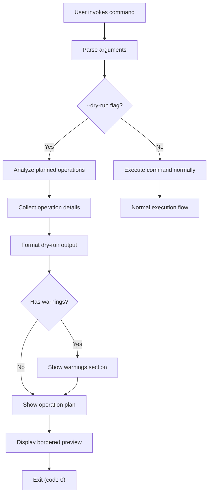
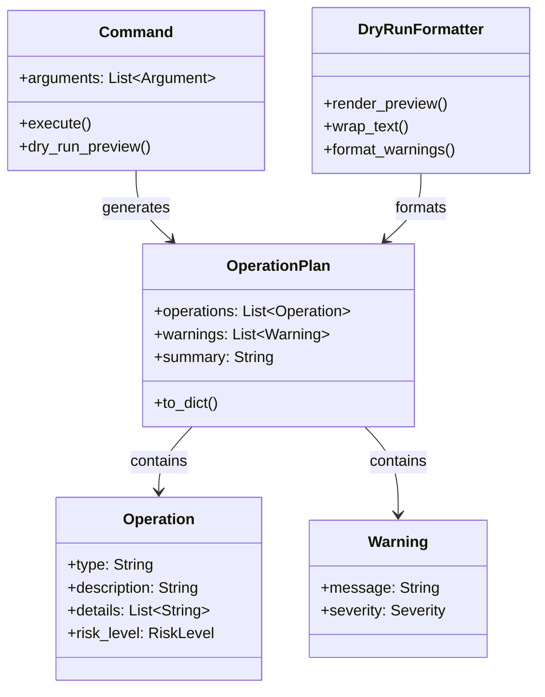
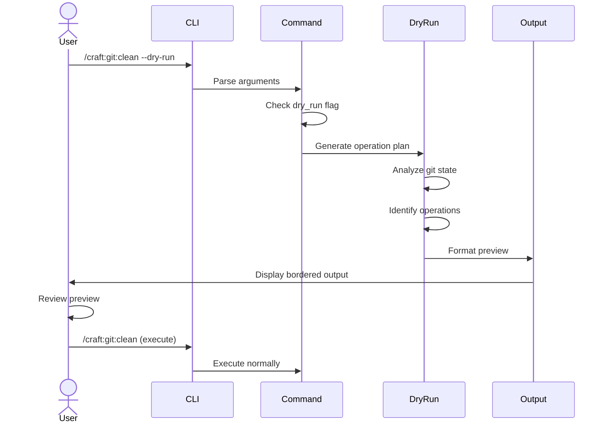

# SPEC: Dry-Run Feature for Craft Commands

**Status:** draft
**Created:** 2026-01-15
**From Brainstorm:** See BRAINSTORM-dry-run-feature-2026-01-15.md in project root
**Owner:** TBD
**Target Release:** v1.20.0

---

## Overview

Add standardized `--dry-run` / `-n` flag to 47 high-impact craft commands (52% of total 90 commands) to build user trust in automation through transparent previews before execution. Focus on git operations, file generation, distribution, and smart routing where consequences are significant or irreversible.

**Primary Goal:** Build confidence in automation - users want to see exactly what will happen before committing to changes.

**Scope:** 36 new implementations + 11 standardizations of existing dry-run commands.

---

## Primary User Story

**As a** craft plugin user
**I want** to preview command effects before execution
**So that** I can confidently use automation without fear of irreversible mistakes

**Acceptance Criteria:**
- ✅ 47 commands support `--dry-run` flag with `-n` alias
- ✅ All dry-run outputs follow consistent format (bordered box, high-level summary)
- ✅ Best-effort preview shows warnings for uncertain operations
- ✅ No actual changes are made during dry-run mode
- ✅ Users can execute after dry-run by re-running without flag

---

## Secondary User Stories

### User Story 2: Learning & Discovery
**As a** new craft user
**I want** to see what commands will do before running them
**So that** I can learn craft capabilities through exploration

### User Story 3: Debugging
**As a** developer troubleshooting command behavior
**I want** to see the execution plan without side effects
**So that** I can understand why commands fail or behave unexpectedly

### User Story 4: Safety Net
**As a** craft user working with production code
**I want** to prevent accidental destructive operations
**So that** I can use powerful automation safely

---

## Technical Requirements

### Architecture



### Component Diagram



---

## API Design

### Command Frontmatter Standard

All commands with dry-run support must include:

```yaml
---
description: [Command description]
arguments:
  - name: dry-run
    description: Preview changes without executing
    required: false
    default: false
    alias: -n
  [... other arguments ...]
---
```

### Dry-Run Output API

**Function Signature:**
```python
def render_dry_run_preview(
    command_name: str,
    actions: List[str],
    warnings: Optional[List[str]] = None,
    summary: Optional[str] = None,
    risk_level: RiskLevel = RiskLevel.MEDIUM
) -> str:
    """
    Render standardized dry-run output

    Args:
        command_name: Name of the command (e.g., "Clean Merged Branches")
        actions: List of high-level operations (3-7 items)
        warnings: Optional list of warning messages
        summary: Optional summary line (e.g., "5 branches to delete, 2 skipped")
        risk_level: Risk level for color coding (LOW|MEDIUM|HIGH|CRITICAL)

    Returns:
        Formatted dry-run output string with bordered box
    """
```

**Output Template:**
```
┌─────────────────────────────────────────────────────────────┐
│ 🔍 DRY RUN: {command_name}                                  │
├─────────────────────────────────────────────────────────────┤
│                                                             │
│ {action_1}                                                  │
│   - {detail_1}                                              │
│   - {detail_2}                                              │
│                                                             │
│ {action_2}                                                  │
│                                                             │
│ ⚠ Warnings:                                                 │
│   • {warning_1}                                             │
│   • {warning_2}                                             │
│                                                             │
│ 📊 Summary: {summary}                                       │
│                                                             │
├─────────────────────────────────────────────────────────────┤
│ Run without --dry-run to execute                            │
└─────────────────────────────────────────────────────────────┘
```

---

## Data Models

### OperationPlan

```python
@dataclass
class OperationPlan:
    """Represents planned operations for dry-run preview"""

    operations: List[Operation]
    warnings: List[Warning]
    summary: Optional[str] = None
    risk_level: RiskLevel = RiskLevel.MEDIUM

    def to_dict(self) -> Dict[str, Any]:
        """Convert to dictionary for JSON output"""
        return {
            "operations": [op.to_dict() for op in self.operations],
            "warnings": [w.to_dict() for w in self.warnings],
            "summary": self.summary,
            "risk_level": self.risk_level.value
        }
```

### Operation

```python
@dataclass
class Operation:
    """Single operation in execution plan"""

    type: OperationType  # CREATE, MODIFY, DELETE, EXECUTE
    description: str
    details: List[str]
    target: Optional[str] = None  # File path, branch name, etc.
    risk_level: RiskLevel = RiskLevel.MEDIUM

    def to_dict(self) -> Dict[str, Any]:
        return {
            "type": self.type.value,
            "description": self.description,
            "details": self.details,
            "target": self.target,
            "risk_level": self.risk_level.value
        }
```

### Warning

```python
@dataclass
class Warning:
    """Warning about uncertain or risky operation"""

    message: str
    severity: Severity  # INFO, WARNING, CRITICAL
    reason: Optional[str] = None

    def to_dict(self) -> Dict[str, Any]:
        return {
            "message": self.message,
            "severity": self.severity.value,
            "reason": self.reason
        }
```

### Enums

```python
class OperationType(Enum):
    CREATE = "create"
    MODIFY = "modify"
    DELETE = "delete"
    EXECUTE = "execute"
    PUBLISH = "publish"

class RiskLevel(Enum):
    LOW = "low"
    MEDIUM = "medium"
    HIGH = "high"
    CRITICAL = "critical"

class Severity(Enum):
    INFO = "info"
    WARNING = "warning"
    CRITICAL = "critical"
```

---

## Dependencies

**Required:**
- No new external dependencies
- Python 3.8+ (already required)
- Existing craft command infrastructure

**Optional (Future):**
- Colorama (for colored output) - Future enhancement
- Rich (for interactive dry-run) - Future enhancement

---

## UI/UX Specifications

### User Flow



### Wireframes (ASCII)

**Main Dry-Run Output:**
```
┌─────────────────────────────────────────────────────────────┐
│ 🔍 DRY RUN: Clean Merged Branches                           │  ← Title
├─────────────────────────────────────────────────────────────┤  ← Separator
│                                                             │
│ ✓ Local Branches (3)                                        │  ← Section
│   - feature/auth-system (merged to dev)                     │  ← Detail
│   - fix/login-bug (merged to main)                          │  ← Detail
│                                                             │
│ ⚠ Warnings:                                                 │  ← Warnings
│   • feature/wip has uncommitted changes                     │
│                                                             │
│ 📊 Summary: 3 branches to delete, 1 skipped                 │  ← Summary
├─────────────────────────────────────────────────────────────┤
│ Run without --dry-run to execute                            │  ← Call to action
└─────────────────────────────────────────────────────────────┘
```

**With Multiple Categories:**
```
┌─────────────────────────────────────────────────────────────┐
│ 🔍 DRY RUN: Generate CI Workflow                            │
├─────────────────────────────────────────────────────────────┤
│                                                             │
│ ✓ Files to create:                                          │  ← Category 1
│   - .github/workflows/ci.yml (~45 lines, 1.2 KB)            │
│                                                             │
│ ✓ Configuration:                                            │  ← Category 2
│   - Detected: Python project (uv)                           │
│   - Tests: pytest                                           │
│   - Python versions: 3.9, 3.10, 3.11                        │
│                                                             │
│ ⚠ Warnings:                                                 │  ← Warnings
│   • No existing workflow file                               │
│   • Will commit .github/workflows/ci.yml                    │
│                                                             │
├─────────────────────────────────────────────────────────────┤
│ Run: /craft:ci:generate (without --dry-run)                 │
└─────────────────────────────────────────────────────────────┘
```

### Accessibility Checklist

- ✅ **Screen readers:** Plain text output, no ASCII art except borders
- ✅ **Color blind:** No reliance on color (uses ✓/⚠/📊 symbols)
- ✅ **Low vision:** Bordered box provides clear visual structure
- ✅ **Keyboard only:** No interactive elements, pure text output
- ✅ **Copy/paste:** Plain text format, easy to share/save

---

## Open Questions

1. **Q:** Should dry-run show exact shell commands that will be executed?
   **A:** Add `--verbose` flag to dry-run for technical details (future)

2. **Q:** How to handle commands with interactive prompts in dry-run?
   **A:** Show "Would prompt for: [input description]" in preview

3. **Q:** Should dry-run have its own exit code?
   **A:** No, exit 0 (follows Unix convention). Set `CRAFT_DRY_RUN=1` env var

4. **Q:** How to test dry-run accuracy?
   **A:** Manual testing initially, automate with sandbox testing framework (Phase 3)

5. **Q:** Should `/craft:do` recurse into delegated command's dry-run?
   **A:** No - show delegation plan only. Add `--recursive-dry-run` in future

---

## Review Checklist

- [ ] Architecture reviewed by technical lead
- [ ] API design approved
- [ ] UX tested with 3+ users
- [ ] Security considerations addressed
- [ ] Performance impact assessed
- [ ] Documentation plan approved
- [ ] Test strategy defined
- [ ] Rollout plan created
- [ ] Backward compatibility verified
- [ ] Accessibility requirements met

---

## Implementation Notes

### Phase 1: Critical Safety (Week 1 - 20h)

**Priority 0 Commands (8 commands):**
1. `/craft:git:clean` - Delete branches (CRITICAL)
2. `/craft:git:worktree` - Worktree operations (HIGH)
3. `/craft:git:branch` - Branch operations (HIGH)
4. `/craft:git:sync` - Sync with remote
5. `/craft:git:recap` - Activity summary
6. `/craft:dist:pypi` - PyPI publish (CRITICAL)

**Deliverables:**
- Shared `dry_run_output.py` utility
- Template `dry-run-pattern.md`
- 6 command implementations
- Test suite (basic)
- Updated documentation

**Success Criteria:**
- All P0 commands have dry-run
- Consistent output format
- No false positives/negatives in preview
- User documentation complete

---

### Phase 2: High-Impact Additions (Week 2 - 30h)

**File Generation (17 commands):**
- Documentation commands (5)
- Site management (5)
- CI/CD (3)

**Smart Routing (4 commands):**
- `/craft:do` - Show delegation plan
- `/craft:orchestrate` - Show agent plan
- `/craft:check` - Preview validation
- `/craft:help` - N/A (read-only)

**Success Criteria:**
- 27 total commands with dry-run
- Consistent pattern across all
- User confidence measured (survey)
- Documentation updated

---

### Phase 3: Long Tail (Future - 40h)

**Remaining Commands:**
- Code & test (12)
- Architecture & planning (7)

**Advanced Features:**
- Dry-run testing framework
- Usage analytics
- Interactive dry-run
- Diff view

---

## History

| Date | Change | Author |
|------|--------|--------|
| 2026-01-15 | Initial specification from brainstorm | Claude Sonnet 4.5 |

---

**Status:** ⏳ Awaiting review and approval

**Next Steps:**
1. Review this spec with team
2. Approve or request changes
3. Create implementation tasks
4. Assign ownership
5. Begin Phase 1 (Week 1)
