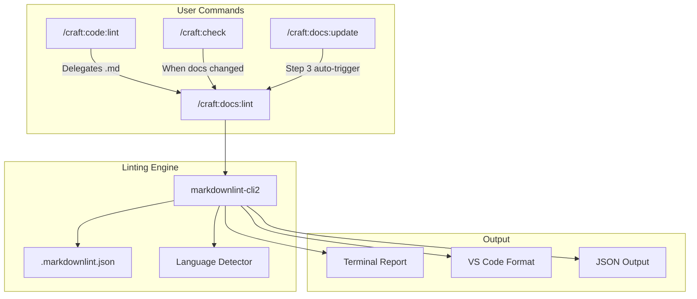

# SPEC: Full Markdown Linting Implementation

**Status:** draft
**Created:** 2026-01-25
**From Brainstorm:** /workflow:brainstorm deep feat save

---

## Overview

Implement comprehensive markdown linting with auto-fix capabilities across the craft plugin ecosystem. Enhance `/craft:docs:lint` command to support all 42 markdownlint rules with intelligent auto-fix, language detection, and interactive prompts for complex issues.

---

## Primary User Story

**As a** plugin developer maintaining craft documentation,
**I want** comprehensive markdown linting with automatic fixes,
**So that** I can ensure consistent, high-quality documentation without manual review of every formatting detail.

### Acceptance Criteria

- [ ] `.markdownlint.json` expanded from 24 to 42 rules
- [ ] `/craft:docs:lint --fix` auto-fixes 15+ issue types
- [ ] Language detection works for Python, JavaScript, bash, JSON, YAML
- [ ] All 706+ existing tests pass
- [ ] Pre-commit hook configuration available

---

## Secondary User Stories

### Developer running quick checks

**As a** developer committing changes,
**I want** fast lint checks before commit,
**So that** I catch formatting issues before they enter the codebase.

### CI/CD pipeline validation

**As a** CI system,
**I want** deterministic lint validation,
**So that** builds fail consistently on markdown quality issues.

---

## Architecture



---

## API Design

N/A - This is a CLI command enhancement, not an API.

---

## Data Models

N/A - No data model changes required.

---

## Dependencies

| Dependency | Version | Installation | Purpose |
|------------|---------|--------------|---------|
| `markdownlint-cli2` | ^0.14.0 | `npm install -g markdownlint-cli2` (global, recommended) | Core linting engine |
| `markdownlint` | ^0.35.0 | (included with cli2) | Rule definitions |
| Node.js | ^18.0 | System | Runtime for markdownlint |

**Fallback:** If global install not found, auto-download via `npx markdownlint-cli2`

---

## UI/UX Specifications

### User Flow

```mermaid
sequenceDiagram
    participant User
    participant docs:lint
    participant markdownlint
    participant FileSystem

    User->>docs:lint: /craft:docs:lint --fix
    docs:lint->>FileSystem: Scan *.md files
    docs:lint->>markdownlint: Run with .markdownlint.json
    markdownlint-->>docs:lint: Issues found (15)
    docs:lint->>docs:lint: Categorize (auto-fix vs manual)
    docs:lint->>FileSystem: Apply auto-fixes (12)
    docs:lint-->>User: Report (12 fixed, 3 manual)
```

### Wireframe (ASCII)

```text
┌─────────────────────────────────────────────────────────────┐
│ /craft:docs:lint (release mode)                             │
├─────────────────────────────────────────────────────────────┤
│                                                             │
│ ✓ Checked: 48 markdown files                                │
│                                                             │
│ ✗ Issues Found (15):                                        │
│                                                             │
│ Auto-fixable (12):                                          │
│   • MD009: Trailing spaces (5 files)                        │
│   • MD030: List spacing (4 files)                           │
│   • MD032: Blank lines (3 files)                            │
│                                                             │
│ Manual review (3):                                          │
│   • MD045: Missing alt text (docs/guide/setup.md:45)        │
│   • MD001: Heading skip (docs/reference/api.md:78)          │
│   • MD040: Unknown language (commands/do.md:120)            │
│                                                             │
│ ───────────────────────────────────────────────────────────│
│                                                             │
│ Run with --fix to apply 12 auto-fixes                       │
│                                                             │
│ Exit code: 1 (manual fixes needed)                          │
│                                                             │
└─────────────────────────────────────────────────────────────┘
```

### Accessibility Checklist

- [x] Output uses semantic characters (✓ ✗ ⚠)
- [x] Color not required for meaning (symbols provide context)
- [x] Line numbers provided for VS Code navigation
- [x] Exit codes follow standard conventions

---

## Open Questions

1. **Should MD034 (bare URLs) be auto-fixed?**
   - Pro: Easy fix (wrap in angle brackets)
   - Con: May break intentional bare URLs in examples

2. **Interactive mode scope?**
   - Should complex fixes prompt individually or in batches?

---

## Review Checklist

- [ ] Implementation matches spec
- [ ] All acceptance criteria met
- [ ] Tests added for new functionality
- [ ] Documentation updated
- [ ] CLAUDE.md reflects changes
- [ ] No regressions in existing tests

---

## Implementation Notes

### User-Confirmed Decisions

| Feature | Decision |
|---------|----------|
| MD034 (Bare URLs) | Always auto-fix → `<url>` |
| MD040 (Unknown lang) | Interactive prompt |
| MD001 (Heading skip) | Prompt with suggestions |
| Installation | Global npm, npx fallback |
| Output style | Styled boxes, raw with --verbose |
| Fix safety | Preview before applying |

### Rule Categories and Fix Strategy

| Category | Rules | Auto-Fix Strategy |
|----------|-------|-------------------|
| List formatting | MD004, MD005, MD007, MD029, MD030, MD031, MD032 | ✅ Safe to auto-fix |
| Headings | MD001, MD003, MD022, MD023, MD024, MD036 | ⚠️ MD001: Prompt with suggestions |
| Code blocks | MD040, MD046, MD048 | ⚠️ MD040: Prompt for language |
| Links/Images | MD011, MD042, MD045, MD052, MD056 | ⚠️ MD045 needs prompt |
| Whitespace | MD009, MD010, MD012 | ✅ Safe to auto-fix |
| Inline | MD034, MD049, MD050 | ✅ MD034: Always auto-fix |

### Language Detection Priority

1. Shebang (`#!/bin/bash` → bash)
2. Keywords (`def`, `import` → python)
3. Syntax (`const`, `=>` → javascript)
4. File extension in comment
5. Fallback: `text`

---

## History

| Date | Change | Author |
|------|--------|--------|
| 2026-01-25 | Initial spec from brainstorm | Claude |
