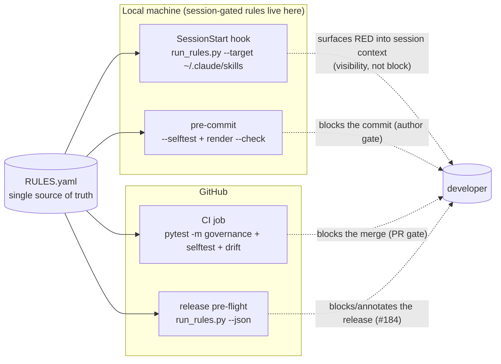

# SPEC: Skill-Ecosystem Governance — Phase 2 (Enforced Gates)

| Field | Value |
|---|---|
| **Status** | Draft (brainstorm capture) |
| **Date** | 2026-06-20 |
| **Owner** | stat-wise (dt) |
| **Focus** | Architecture / process (policy-as-code enforcement) |
| **Depth** | deep (brainstorm) |
| **Branch** | authored on `feature/skill-governance`; belongs in its **own** PR after Phase 0 (#185) merges |
| **Builds on** | Phase 0 — [#185](https://github.com/Data-Wise/craft/pull/185) (engine + 8 rules + selftest, hardened) |
| **Relates to** | [#184](https://github.com/Data-Wise/craft/issues/184) release-time drift + visibility guard |

## Problem

Phase 0 shipped a hardened engine (`governance/run_rules.py`) that *can* audit, fail-closed,
self-test, and render the `CLAUDE.md` rule block. But nothing **runs** it automatically — it is still
a manual script. Until the engine is wired into the places work actually happens, the rules are
documentation, not enforcement, and the very drift the system exists to prevent can still land.

## Goals

- Turn the engine from a manual script into an **enforced gate** at the three surfaces where drift
  enters: session start, commit, and PR.
- Do it **honestly** — each gate runs only the checks it can actually evaluate, and says so when a
  check is vacuous (no silent green).
- Provide the **gentle-ramp machinery** so a `warn` rule can graduate to `error` on evidence, not
  vibes, with a time-boxed waiver escape hatch.
- Make the craft-homed engine **consumable** by savant/scholar without copying (vendored, pinned).

## Non-Goals

- Automating R03/R04 (that is Phase 1 — listed here only as a long-term enabler). N/A for this spec.
- Expanding scope beyond skills to commands/agents/plugins (deferred until the skills rule set is
  fully green). N/A.
- A burndown/metrics dashboard for data-driven promotion (deferred; the soak machinery is the MVP).

## Locked Decisions (from brainstorm)

1. **Target = Phase 2: wire the gates.** Highest leverage now that fail-closed works.
2. **SessionStart hook first**, then pre-commit, then CI — because R01/R07 are `session`-gated and
   the fastest feedback loop is local, where the canon repos exist.
3. **Soak-then-flip, per-rule.** A rule stays `warn` until its surface is clean for a defined window,
   then a human promotes it to `error` (with a time-boxed waiver). Machinery *recommends*; human
   *promotes*.
4. **Vendored + version-pinned** cross-repo: consumers invoke the installed craft plugin's
   `governance/`, never a copy. Matches `R07-version-is-truth`.

## Design

### Gate topology

### Surface 1 — SessionStart hook (priority 1, *visibility* gate)

- New `hooks/governance-session.sh` runs `run_rules.py --target ~/.claude/skills --index …` and emits
  a **compact RED-only summary** into session context (e.g. `GOVERNANCE: 1 red — R08 dead link
  skills/foo`). SessionStart hooks **inject context, they do not hard-block** — so this is a
  visibility gate, by design. The *prevention* gates are pre-commit + CI.
- Performance: must be <1–2s. The symlink walk is cheap; cache by `~/.claude/skills` mtime so a
  clean, unchanged tree skips re-audit.
- Honesty: warn-rules are summarized but never escalate the message to RED; `external` (R07) is
  shown as delegated.

### Surface 2 — pre-commit (priority 2, *author* gate)

- Add a `.pre-commit-config.yaml` hook, **filtered to `governance/` paths** (`files: ^governance/`),
  running two fast, env-independent checks:
  - `run_rules.py --selftest` — engine + checkers still valid.
  - `render_rules.py --check governance/CLAUDE-rules.md` — the rules-drift gate.
- It does **not** run the live-env audit (the dev machine's `~/.claude` state is irrelevant to a
  craft commit). Clean separation keeps commits fast and deterministic.

### Surface 3 — CI (priority 3, *PR* gate)

- Add a CI job: `pytest -m governance` + `run_rules.py --selftest` + `render_rules.py --check`.
- CI **cannot** see savant/scholar, so it does **not** run the live audit — R01/R07 are session-gated
  exactly for this reason. The job description must state loudly what CI does *not* check, so green CI
  never implies live-env cleanliness.
- Release pre-flight (`scripts/pre-release-check.sh`) gains a `run_rules.py --json` step → the #184
  release-drift tie-in.

### Soak-then-flip machinery (the gentle-ramp)

- Add `run_rules.py --promote-check`: reads a **local** `governance/STATE.json` (gitignored) that
  records the last-RED date per rule from session audits, and lists `warn` rules clean for ≥ the soak
  window (default 14 days) as **promotion-eligible**.
- The flip itself stays a **human RULES.yaml edit** (`severity: warn → error`) + commit, optionally
  with a time-boxed `waivers:` entry for any residual violations. The waiver primitives already exist
  (selftest fails on expired/owner-less waivers), so the escape hatch is built.

### Cross-repo consumption (vendored + pinned)

- `governance/` ships inside the craft plugin. savant/scholar invoke the **installed** craft copy
  (`<craft-plugin-root>/governance/run_rules.py`) — there is exactly one copy, so there is no drift.
- A thin `governance/run.sh` wrapper resolves the installed plugin path; the SessionStart hook calls
  it. Verify path-portability from a second repo (the engine is already `__file__`-relative; R07 uses
  an external feed to stay portable).

## Phased Plan (brainstorm output)

### Quick Wins (< 30 min each)

1. **pre-commit drift+selftest hook** (`files: ^governance/`) — cheapest enforcement, zero CI/cross-repo
   dependency, immediately protects the just-merged engine from regression. **← recommended first.**
2. **CI governance job** — `pytest -m governance` + selftest + `--check` in the existing workflow.
3. **Release pre-flight step** — add `run_rules.py --json` to `scripts/pre-release-check.sh` (#184).

### Medium Effort (1–2 hr each)

4. **SessionStart hook** — `hooks/governance-session.sh`, RED-only summary, mtime cache, wired into
   settings.
5. **Soak machinery** — `--promote-check` + local `STATE.json` + a selftest advisory listing
   promotion-eligible warn-rules.
6. **Cross-repo wrapper** — `governance/run.sh` + a portability test invoking the engine from a second
   repo against the installed craft path.

### Long-term (future sessions)

7. **Automate R03 + R04** (Phase 1) — graduate them from `manual` to `script` so more error-rules
   become CI/pre-commit enforceable.
8. **Burndown/metrics promotion** — violation counts over time → data-driven flips.
9. **Expand scope** beyond skills (commands/agents/plugins) once the skills set is green.

### Recommended next step

→ **Quick Win #1 (pre-commit gate)**, then #2 (CI) in the same PR — they are the cheapest, highest-
certainty enforcement and have no cross-repo or live-env dependency. Ship them as the Phase 2 opener;
defer the SessionStart hook (#4) to the following PR once the author/PR gates are proven.

## Acceptance Criteria

- [ ] A commit touching `governance/` that hand-edits `CLAUDE-rules.md` or breaks a checker is
      **rejected by pre-commit**.
- [ ] A PR that breaks the engine or drifts the generated block **fails CI** (`pytest -m governance`
      + selftest + `--check` all run).
- [ ] CI output explicitly states it does **not** evaluate R01/R07 live-env state (no silent green).
- [ ] Opening a session with a dead skill symlink **surfaces a RED governance line** in context.
- [ ] `run_rules.py --promote-check` lists exactly the `warn` rules clean ≥ soak window; flipping one
      to `error` is a one-line RULES.yaml edit that re-renders and stays drift-clean.
- [ ] savant (or scholar) can run the audit against the **installed craft** engine with no copied
      files.
- [ ] `validate-counts.sh` + `docs-staleness-check.sh` clean after the change.

## Risks & Mitigations

| Risk | Mitigation |
|---|---|
| SessionStart hook noise annoys every session | RED-only summary + mtime cache; warn/external never escalate. |
| SessionStart can't truly block | Frame it as a **visibility** gate; prevention lives in pre-commit + CI. Document the distinction. |
| Green CI implies live-env clean (it doesn't) | Job prints what it does NOT check; R01/R07 marked session-only. |
| pre-commit slows every commit | `files: ^governance/` filter — only fires on governance changes. |
| `STATE.json` history is per-machine | Acceptable: the session gate is local. Keep it gitignored; promotion is a deliberate human commit. |
| Existing violations block a new error-rule | Land green with a time-boxed waiver (owner + future `expires`); selftest enforces hygiene. |
| Cross-repo path resolution fragility | `run.sh` wrapper + an explicit portability test from a second repo. |

## Documentation & Discoverability

- [ ] Guide update (`docs/guide/governance.md`) — add a "Gates & enforcement" section (the three
      surfaces + the visibility-vs-prevention distinction).
- [ ] Help / reference — document the new `run_rules.py --promote-check` flag and the
      `governance-session` hook in `governance/README.md`.
- [ ] REFCARD entry — one row in `docs/REFCARD.md` (or governance section) for the gate commands.
- [ ] Help hub / discovery — N/A (governance is scripts + hooks, not a `/craft:` command;
      `_discovery.py` deliberately excludes `scripts/`/`governance/`). Confirm hooks are listed where
      craft documents its hooks.
- [ ] Website + catalog — `mkdocs.yml` nav already carries the governance guide; `mkdocs build` clean.
      No `docs/skills-agents.md` row (not a skill/agent).
- [ ] CHANGELOG `[Unreleased]` entry for the Phase 2 gates; `validate-counts.sh` +
      `docs-staleness-check.sh` clean.

## Open Questions

- Should the SessionStart hook be **global** (`~/.claude/settings.json`, fires in every project) or
  **per-repo** (only where governance applies)? Global gives whole-machine coverage; per-repo is
  quieter. Lean global for skills (skills are machine-wide under `~/.claude/skills`).
- Soak window: 14 days fixed, or per-rule in `RULES.yaml`?
- Does the #184 release guard want the audit to **block** a release on RED, or only annotate the
  release notes? (Block is safer; annotate is gentler-ramp.)

## References

- Phase 0 PR — [#185](https://github.com/Data-Wise/craft/pull/185)
- Release-drift guard — [#184](https://github.com/Data-Wise/craft/issues/184)
- Engine reference — [`governance/README.md`](../../governance/README.md)
- Guide — [Skill-Ecosystem Governance](../guide/governance.md)
- Runbook — [Plugin Release Runbook](../guide/plugin-release-runbook.md)
