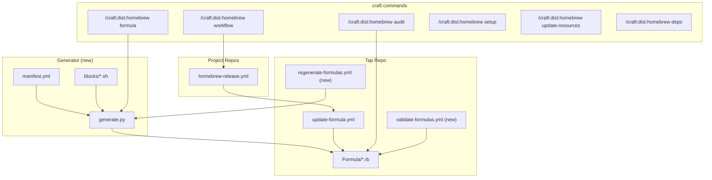

# SPEC: Homebrew Automation Refactor

**Status:** draft
**Created:** 2026-02-15
**From Brainstorm:** [BRAINSTORM-homebrew-refactor-2026-02-15.md](../brainstorm/BRAINSTORM-homebrew-refactor-2026-02-15.md)
**Scope:** /craft:dist:homebrew commands, CI workflows, formula generator, release skill

---

## Overview

Refactor craft's Homebrew automation to close CI coverage gaps, codify hard-won patterns (macOS sandbox, schema cleanup, Claude detection), consolidate duplicated formula code via a Python generator, and harden the entire pipeline against known vulnerabilities (script injection, bare rescue, auth issues).

## Primary User Story

**As a** craft plugin maintainer,
**I want** a single command to generate, validate, and deploy Homebrew formulas with consistent patterns,
**So that** all 14 tap formulas are reliable, secure, and automatically updated on release.

### Acceptance Criteria

- [ ] All 6 subcommands work correctly (formula, workflow, audit, setup, update-resources, deps)
- [ ] Python generator produces valid formulas for 5 plugin archetypes
- [ ] 4 missing caller workflows created and tested
- [ ] Security vulnerabilities fixed in existing callers
- [ ] Weekly validation workflow catches staleness
- [ ] All 14 formulas pass `brew audit --strict`

## Secondary User Stories

**As a** developer adding a new project to the tap,
**I want** `/craft:dist:homebrew setup` to handle everything,
**So that** I don't need to manually copy and adapt formula boilerplate.

**As a** release manager,
**I want** the release skill to reliably update the tap,
**So that** `brew upgrade` gets users the latest version within minutes of release.

---

## Architecture



---

## Increment 1: Security & Reliability Fixes (Quick Wins)

**Effort:** < 2 hours | **Risk:** Low | **Requires:** Direct edits to tap repo + project repos

### 1.1 Fix Script Injection in Callers

**Affected:** aiterm, atlas, flow-cli homebrew-release.yml

**Change:** Replace direct `${{ github.event.inputs.version }}` with `env:` indirection:

```yaml
# Before (vulnerable)
run: VERSION="${{ github.event.inputs.version }}"

# After (safe)
env:
  INPUT_VERSION: ${{ inputs.version }}
run: VERSION="$INPUT_VERSION"
```

### 1.2 Standardize SHA Calculation

**Affected:** craft, scholar (use `shasum -a 256`), all callers without retry

**Change:** Use `sha256sum` (coreutils, always on ubuntu runners) + retry + empty-SHA guard:

```bash
EMPTY_SHA="e3b0c44298fc1c149afbf4c8996fb92427ae41e4649b934ca495991b7852b855"
TMPFILE=$(mktemp)
for attempt in 1 2 3 4 5; do
    HTTP_CODE=$(curl -sL --max-time 60 -w '%{http_code}' -o "$TMPFILE" "$URL")
    if [ "$HTTP_CODE" = "200" ]; then
        SHA256=$(sha256sum "$TMPFILE" | cut -d' ' -f1)
        if [ -n "$SHA256" ] && [ "$SHA256" != "$EMPTY_SHA" ]; then
            break
        fi
    fi
    sleep 15
done
rm -f "$TMPFILE"
```

### 1.3 Fix Bare `rescue` in Scholar Formula

**File:** `homebrew-tap/Formula/scholar.rb` post_install

**Change:** Wrap each step in own `begin/rescue/end`:

```ruby
def post_install
  begin
    system bin/"scholar-install"
  rescue
    nil
  end
  begin
    system "claude", "plugin", "update", "scholar@local-plugins" if which("claude")
  rescue
    nil
  end
end
```

### 1.4 Add Claude-Running Guard to rforge-orchestrator

**File:** `homebrew-tap/Formula/rforge-orchestrator.rb` install script

**Change:** Add `pgrep -x "claude"` check before modifying `settings.json`.

### 1.5 Rename `validate` → `audit` in Command

**File:** `commands/dist/homebrew.md`

**Change:** Rename subcommand, update all references.

---

## Increment 2: Command Refactor

**Effort:** 2-4 hours | **Risk:** Low | **Requires:** Edit commands/dist/homebrew.md

### 2.1 Subcommand Structure (8 → 6)

| Subcommand | Arguments | Description |
|-----------|-----------|-------------|
| `formula` | `[--tap TAP] [--version VER] [--diff]` | Generate or update formula. `--diff` shows changes vs existing |
| `workflow` | `[--tap TAP] [--source TYPE]` | Generate smart per-project CI caller workflow |
| `audit` | `[--strict] [--online] [--build] [--check-only]` | Validate formula with brew audit. `--build` runs install from source |
| `setup` | `[--tap TAP]` | Full wizard: detect → formula → audit → workflow → token → commit |
| `update-resources` | `[FORMULA] [--all] [--dry-run] [--pin]` | Fix stale PyPI resource URLs |
| `deps` | `[--mermaid] [--system] [--inter-formula]` | Dependency graph (both inter-formula and system deps) |

### 2.2 Smart Workflow Generation

`/craft:dist:homebrew workflow` now auto-detects project type and generates appropriate caller:

| Detected | Caller Pattern |
|----------|---------------|
| `.claude-plugin/plugin.json` | Plugin caller (metadata extraction, schema validation) |
| `pyproject.toml` | Python caller (version from pyproject) |
| `package.json` with `bin` | npm caller (npm registry URL) |
| `DESCRIPTION` (R) | CRAN caller |
| Default | GitHub tarball caller |

### 2.3 Token Guide Folded into Setup

Setup wizard step 4 shows the token guide inline. No separate `token` subcommand.

### 2.4 `audit --build` Flag

Runs `brew install --build-from-source ./Formula/NAME.rb` locally. Warnings about env-specific results.

### 2.5 `deps` Expanded Scope

Two views:

1. **Inter-formula:** Which formulas depend on others (e.g., rforge-orchestrator → rforge)
2. **System deps:** Matrix of what each formula needs (node, python, jq, etc.)

Output: table + optional Mermaid diagram (`--mermaid`).

---

## Increment 3: Python Formula Generator

**Effort:** 4-8 hours | **Risk:** Medium | **Requires:** New script in homebrew-tap repo

### 3.1 Generator Script

**File:** `homebrew-tap/generator/generate.py` (Python 3, stdlib only)

**Input:** `manifest.yml` (declares all formulas)
**Output:** `Formula/*.rb` files (committed to repo)

### 3.2 Manifest Schema

```yaml
# Top-level defaults
defaults:
  license: MIT
  tap: data-wise/tap

formulas:
  craft:
    type: claude-plugin      # claude-plugin | python-virtualenv | node-npm | shell | cask
    desc: "Full-stack toolkit for Claude Code with {command_count} commands"
    homepage: https://github.com/Data-Wise/craft
    source: github
    version: "2.19.0"
    sha256: "abc..."
    dependencies:
      optional: [jq]
    features:
      schema_cleanup: true
      branch_guard: true
      marketplace: true
      claude_detection: true
    dynamic_counts: [commands, agents, skills]
    test_paths:
      - ".claude-plugin/plugin.json"
      - {path: "commands", type: directory}
      - {path: "skills", type: directory}
    caveats_extra: |
      109 commands for full-stack development

  himalaya-mcp:
    type: claude-plugin
    desc: "Privacy-first email MCP server and Claude Code plugin"
    source: github
    dependencies:
      runtime: [himalaya, node]
      optional: [jq]
    build_steps:
      - 'system "npm", "install", *std_npm_args(prefix: false)'
      - 'system "npm", "run", "build:bundle"'
    libexec_paths: [.claude-plugin, .mcp.json, plugin, dist]
    features:
      schema_cleanup: true
      marketplace: true
      claude_detection: true
    test_paths:
      - ".claude-plugin/plugin.json"
      - "dist/index.js"
      - {path: "plugin/skills", type: directory}
```

### 3.3 Composable Install Script Blocks

Each block is a parameterized bash snippet:

| Block | Purpose | Feature Flag |
|-------|---------|-------------|
| `header.sh` | Shebang, PLUGIN_NAME, TARGET_DIR, SOURCE_DIR | Always |
| `schema-cleanup.sh` | Strip unrecognized keys from plugin.json | `schema_cleanup` |
| `symlink.sh` | Remove existing, create symlink (3 methods) | Always |
| `marketplace.sh` | Register in local-marketplace/, update manifest | `marketplace` |
| `claude-detection.sh` | Check if Claude is running, auto-enable | `claude_detection` |
| `branch-guard.sh` | Copy branch guard hook | `branch_guard` |
| `success.sh` | Display success message, skill list | Always |
| `fallback.sh` | Manual instructions on failure | Always |

### 3.4 Output Modes

- **Default:** Generate complete `.rb` file
- **`--diff`:** If formula exists, show diff; if new, generate full file

### 3.5 Validation

Generator includes self-validation:

- `ruby -c Formula/*.rb` (syntax check on all generated files)
- Manifest-vs-formula drift detection (hash comparison)

---

## Increment 4: CI Workflow Expansion

**Effort:** 4-6 hours | **Risk:** Medium | **Requires:** Edits to tap repo + 4 project repos

### 4.1 Expand Source Types in update-formula.yml

Add `npm` and `cran` to the `source_type` input:

```bash
case "$SOURCE_TYPE" in
  pypi)   sed pattern for PyPI URLs ;;
  npm)    sed pattern for npm registry URLs ;;
  cran)   sed pattern for CRAN URLs ;;
  github) sed pattern for GitHub tarballs ;;
esac
```

### 4.2 Create 4 Missing Caller Workflows

| Project | Source Type | Formula Name |
|---------|------------|-------------|
| examark | npm | examark |
| mcp-bridge | github | mcp-bridge |
| rforge-orchestrator | github | rforge-orchestrator |
| workflow | github | workflow |

All use the hardened template (env: indirection, sha256sum, retry, empty-SHA guard).

### 4.3 Cross-Reference in ci:generate

`/craft:ci:generate homebrew` delegates to `/craft:dist:homebrew workflow`:

```
/craft:ci:generate homebrew
  → Detects project type
  → Calls /craft:dist:homebrew workflow logic
  → Generates .github/workflows/homebrew-release.yml
```

### 4.4 Weekly Validation Workflow (tap repo)

**File:** `homebrew-tap/.github/workflows/validate-formulas.yml`

- **Schedule:** Weekly (Sunday 6am UTC)
- **Runner:** `macos-latest` (needed for brew)
- **Steps:** Discover formulas → brew audit --strict → URL reachability → SHA256 verification → build-from-source (selected) → summary report

---

## Increment 5: Retrofit Plugin Formulas

**Effort:** 2-4 hours | **Risk:** Medium | **Requires:** Generator from Increment 3

### 5.1 Retrofit Scope

Only the 4 Claude Code plugin formulas:

1. **craft.rb** — Add retry to caller, update install script patterns
2. **scholar.rb** — Fix bare rescue, add schema cleanup, update marketplace
3. **rforge.rb** — Add Claude-running guard, add marketplace registration (currently head-only, update when tagged)
4. **workflow.rb** — Full rewrite from `cp -r` to symlink pattern

himalaya-mcp.rb is already the most hardened — use as reference.

### 5.2 Retrofit Process

1. Run generator with manifest entries
2. Diff generated vs existing
3. Review and merge changes
4. Run `brew audit --strict` on each
5. Test with `brew install --build-from-source`

---

## Increment 6: Release Skill Updates

**Effort:** 1-2 hours | **Risk:** Low

### 6.1 Formula Name Resolution

Replace `basename $PWD` with lookup chain:

1. `.craft/homebrew.json` → `{"formula_name": "craft", "tap": "data-wise/tap"}`
2. Git remote mapping: `Data-Wise/craft` → `craft`, `Data-Wise/nexus` → `nexus-cli`
3. Fallback: `basename $PWD`

### 6.2 Local Validation

After sed update, run `ruby -c $FORMULA` syntax check before commit.

---

## Dependencies

| Dependency | Required By | Status |
|-----------|------------|--------|
| Python 3.8+ | Generator script | Available |
| PyYAML | Manifest parsing | stdlib json alternative if needed |
| brew CLI | audit, build test | Available locally |
| gh CLI | Caller workflows, token check | Available |
| `sha256sum` | CI callers | Available on ubuntu runners |

---

## UI/UX Specifications

### `/craft:dist:homebrew audit` (renamed from validate)

```
Running: brew audit --strict data-wise/tap/craft

Found 2 issues (2 auto-fixable):
  1. desc too long (85 chars, max 80) ... FIXED
  2. Use Array#include? ................ FIXED

Re-running audit... PASSED

All issues auto-fixed. Formula is ready for release!
```

With `--build`:

```
Running: brew audit --strict data-wise/tap/craft ... PASSED

Running: brew install --build-from-source data-wise/tap/craft
==> Installing craft from data-wise/tap
==> Downloading https://github.com/Data-Wise/craft/archive/refs/tags/v2.19.0.tar.gz
...
==> Summary
  /opt/homebrew/Cellar/craft/2.19.0: 245 files, 1.2MB, built in 4 seconds

Build test PASSED (4.2s)

Note: Local build may differ from CI environment.
```

### `/craft:dist:homebrew deps`

```
Inter-Formula Dependencies:
  rforge-orchestrator → rforge

System Dependencies Matrix:
  Formula            node  python  jq    himalaya  rust
  ─────────────────  ────  ──────  ────  ────────  ────
  craft              -     -       opt   -         -
  scholar            -     -       opt   -         -
  himalaya-mcp       req   -       opt   req       -
  aiterm             -     req     -     -         -
  nexus-cli          -     req     -     -         -
  scribe-cli         -     -       -     -         req
  ...
```

---

## Resolved Questions

1. **Generator location:** Both repos. Source of truth in `homebrew-tap/generator/`, craft command invokes it via local tap path (`~/projects/dev-tools/homebrew-tap/generator/generate.py`).
2. **`--build` test:** Uses local path (`brew install --build-from-source ./Formula/NAME.rb`) for pre-release testing.
3. **GitHub App migration:** Do in Increment 4 (part of CI expansion). Set up Data-Wise Homebrew Automation GitHub App with Contents + PR permissions on homebrew-tap only. Eliminates 90-day PAT rotation.
4. **workflow.rb:** Full rewrite via generator in Increment 5 (9 audit issues, old-gen patterns).
5. **rforge:** Start tagging releases so it can use the automated pipeline.

## Live Audit Results (2026-02-15)

**Only 1/14 formulas passes `brew audit --strict` (craft).**

| Formula | Issues | Key Problems |
|---------|--------|-------------|
| craft | 0 | CLEAN |
| scholar | 1 | Modifier `if` style |
| himalaya-mcp | 2 | Redundant `begin`, annotation case |
| rforge | 3 | License order, Array#include?, assert style |
| rforge-orchestrator | 2 | Assert style, caveats order |
| workflow | 9 | Redundant version, 6x assert_predicate, old patterns |
| aiterm | 3 | URL format (refs/tags), pkgshare usage |
| atlas | 4 | Desc too long (90 chars), dep order, spacing, assert |
| nexus-cli | 3 | PyPI URL format, missing libyaml dep, caveats order |
| examark | 1 | Deprecated std_npm_install_args |
| examify | 1 | Deprecated std_npm_install_args |
| flow-cli | 1 | Man page location |
| mcp-bridge | 16 | Name in desc, trailing whitespace, npm args |
| scribe-cli | 11 | Empty SHA, version redundancy, dep order, whitespace |

**Total: 57 issues across 13 formulas.** Many are auto-fixable by the generator (assert style, caveats order, whitespace) or the validate/audit command.

---

## Review Checklist

- [ ] All 6 subcommands documented with examples
- [ ] Generator produces valid Ruby for all 5 plugin formulas
- [ ] Security fixes applied to all callers
- [ ] Weekly validation workflow tested
- [ ] `brew audit --strict` passes for all 14 formulas
- [ ] Release skill uses formula name mapping
- [ ] CI callers use env: indirection, sha256sum, retry
- [ ] Tests cover generator output validation

---

## Implementation Notes

- Generator uses composition (discrete blocks), not inheritance
- The reusable workflow (update-formula.yml) is the single point of version updates — generator never touches version/SHA
- himalaya-mcp.rb is the gold standard for plugin formulas — use as reference
- macOS sandbox blocks ALL post_install $HOME writes — this is fundamental, not a workaround
- `<<~EOS` heredoc indentation is the #1 source of shebang bugs — generator must validate

---

## Implementation Order

| Order | Increment | Effort | Dependencies |
|-------|-----------|--------|-------------|
| 1 | Security & reliability fixes | < 2h | None |
| 2 | Command refactor (8→6) | 2-4h | None |
| 3 | Python generator | 4-8h | None |
| 4 | CI workflow expansion | 4-6h | Inc 1 (fixed callers) |
| 5 | Retrofit plugin formulas | 2-4h | Inc 3 (generator) |
| 6 | Release skill updates | 1-2h | Inc 3 (name mapping) |

**Total estimated effort:** 15-26 hours across 6 increments

---

## History

| Date | Change |
|------|--------|
| 2026-02-15 | Initial spec from max-depth brainstorm (12 expert Qs, 2 agents) |
