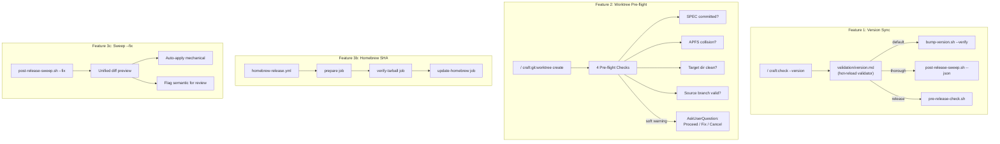

# SPEC: Insights-Driven Improvements v2.32.0

**Status:** approved
**Created:** 2026-02-27
**From Brainstorm:** BRAINSTORM-craft-insights-2026-02-27.md
**Source Data:** 327 sessions, 6 weeks of insights analysis

---

## Overview

Four targeted improvements to Craft's release and development workflow, driven by insights data showing version drift as the #1 CI failure cause (48 wrong_approach events) and worktree friction as the #2 pain point (40+ git friction events). The improvements extend existing infrastructure — no new scripts, commands, or major architectural changes. Total estimated effort: ~2.75h across 4 features shipping together in v2.32.0.

---

## Primary User Story

**As a** Craft plugin developer (self),
**I want** version consistency checks integrated into my existing pre-flight workflow, worktree creation to catch common mistakes before they happen, and the release pipeline to handle SHA computation and stale-ref repair automatically,
**so that** version drift stops being the #1 CI failure cause and worktree friction drops to near-zero.

### Acceptance Criteria

- [ ] `/craft:check --version` runs `bump-version.sh --verify` and reports Tier 1 drift
- [ ] `/craft:check --version` in thorough mode additionally runs `post-release-sweep.sh --json`
- [ ] `/craft:check --for pr` auto-includes basic version consistency check
- [ ] `/craft:check --for release` auto-includes full version audit (Tier 1+2+3)
- [ ] New hot-reload validator file exists at `.claude-plugin/skills/validation/version.md`
- [ ] `/craft:git:worktree create` runs 4 pre-flight checks before creating
- [ ] Pre-flight warnings show soft confirmation (proceed anyway / cancel)
- [ ] `homebrew-release.yml` includes `verify-tarball` job with 45s retry window
- [ ] `post-release-sweep.sh --fix` shows unified diff and auto-applies mechanical fixes
- [ ] All existing tests pass unchanged
- [ ] Dogfood test covers `/craft:check --version` validator discovery

---

## Secondary User Stories

**As a** developer creating a worktree, **I want** the create command to warn me about APFS case collisions and stale directories, **so that** I don't hit cryptic git errors 10 minutes into my work.

**As a** developer releasing a new version, **I want** the Homebrew formula SHA to update automatically without race conditions, **so that** `brew install` works immediately after release.

**As a** developer after a release, **I want** `post-release-sweep.sh --fix` to auto-repair mechanical drift with a single confirmation, **so that** I don't manually edit 16 files.

---

## Architecture

### Feature Integration Map



### Mode-Aware Version Checking

| Context | Scope | Tool Delegated To | Speed |
|---------|-------|-------------------|-------|
| `/craft:check --version` | Tier 1 (13 files) | `bump-version.sh --verify` | < 2s |
| `/craft:check --version` thorough | Tier 1+2 (~29 files) | `post-release-sweep.sh --json` | < 5s |
| `/craft:check --for pr` | Tier 1 (auto-included) | `bump-version.sh --verify` | < 2s |
| `/craft:check --for release` | Tier 1+2+3 (full audit) | `pre-release-check.sh` | < 10s |

---

## API Design

N/A — No API changes. All features extend existing CLI commands and CI workflows.

---

## Data Models

N/A — No new data models. Version validator uses existing script output formats. Pre-flight checks use git and filesystem queries.

---

## Dependencies

| Dependency | Type | Status | Notes |
|------------|------|--------|-------|
| `bump-version.sh` | Existing script | Available | Has `--verify` flag |
| `post-release-sweep.sh` | Existing script | Available | Has `--json` flag, needs `--fix` enhancement |
| `pre-release-check.sh` | Existing script | Available | 9 checks, used by release pipeline |
| `version-sync.sh` | Existing script | Available | Multi-project-type detection |
| Hot-reload validator system | Existing infra | Available | 3 validators exist, pattern established |
| `worktree.md` Step 0/0.5 pattern | Existing UX | Available | AskUserQuestion integration ready |
| `homebrew-release.yml` | Existing CI | Available | Needs `verify-tarball` job added |
| `curl`, `sha256sum`, `jq` | System tools | Available | Used in CI runners |

---

## UI/UX Specifications

### Feature 1: Version Check Output

```
╭─ /craft:check --version ────────────────────────╮
│ Project: craft (Claude Code Plugin)             │
│ Mode: default                                   │
├─────────────────────────────────────────────────┤
│ Source of Truth:                                │
│   .claude-plugin/plugin.json → v2.32.0          │
│                                                 │
│ Tier 1 Files (13):                              │
│ ✓ plugin.json            v2.32.0                │
│ ✓ package.json           v2.32.0                │
│ ✓ CLAUDE.md              v2.32.0                │
│ ✓ README.md              v2.32.0                │
│ ... (9 more)                                    │
│                                                 │
│ STATUS: ALL CONSISTENT ✓                        │
├─────────────────────────────────────────────────┤
│ Tip: Use --thorough for Tier 2+3 scan           │
╰─────────────────────────────────────────────────╯
```

### Feature 2: Worktree Pre-flight Output

```
┌─────────────────────────────────────────────────┐
│ WORKTREE SETUP PLAN                             │
├─────────────────────────────────────────────────┤
│ Project:  craft                                 │
│ Branch:   feature/auth                          │
│ Location: ~/.git-worktrees/craft/feature-auth   │
│                                                 │
│ Pre-Flight Checks:                              │
│ ✓ SPEC committed    (ORCHESTRATE-auth.md)       │
│ ✓ APFS collision    (clear)                     │
│ ✓ Target dir        (clean)                     │
│ i Source branch     (will create from dev)       │
│                                                 │
│ Steps: 4 (create dir, branch, npm i, init)      │
└─────────────────────────────────────────────────┘
```

**Soft warning variant (when issues found):**

```
│ Pre-Flight Checks:                              │
│ ! SPEC uncommitted   (ORCHESTRATE-auth.md)      │
│ ✓ APFS collision    (clear)                     │
│ ! Target dir        (exists, 3 files)           │
│ ✓ Source branch     (dev, up to date)            │
│                                                 │
│ 2 WARNINGS — see details above                  │

AskUserQuestion:
  "2 pre-flight warnings found. How to proceed?"
  ○ Proceed anyway (2 warnings)
  ○ Fix issues first (exit)
  ○ Cancel worktree creation
```

### Feature 3c: Sweep --fix Output

```
╭─ post-release-sweep.sh --fix ───────────────────╮
│ Version: v2.32.0                                │
│ Tier 2 stale refs: 8 files                      │
├─────────────────────────────────────────────────┤
│ Unified Diff Preview:                           │
│                                                 │
│ --- docs/reference/configuration.md             │
│ +++ docs/reference/configuration.md             │
│ @@ -12,1 +12,1 @@                               │
│ -across 106 files                               │
│ +across 107 files                               │
│                                                 │
│ --- docs/REFCARD.md                             │
│ +++ docs/REFCARD.md                             │
│ @@ -3,1 +3,1 @@                                 │
│ -Craft Toolkit v2.31.0                          │
│ +Craft Toolkit v2.32.0                          │
│                                                 │
│ ... (6 more files)                              │
│                                                 │
│ Mechanical fixes: 8 files                       │
│ Semantic (manual review): 2 files               │
│   - README.md (tagline)                         │
│   - VERSION-HISTORY.md (entry)                  │
├─────────────────────────────────────────────────┤
│ Apply all mechanical fixes? (y/n)               │
╰─────────────────────────────────────────────────╯
```

### Accessibility

N/A — CLI-only output. Uses Unicode box-drawing characters consistent with existing Craft command output. Color codes follow existing `RED/GREEN/YELLOW/CYAN` palette in scripts.

---

## Implementation Plan

### Increment 1: Version Sync Validator (~30 min)

| Step | What | Files |
|------|------|-------|
| 1 | Create hot-reload validator file | `.claude-plugin/skills/validation/version.md` |
| 2 | Add `--version` flag to check command frontmatter | `commands/check.md` |
| 3 | Wire mode-aware delegation (default/thorough/release) | `commands/check.md` |
| 4 | Add to `--for pr` and `--for release` auto-include lists | `commands/check.md` |
| 5 | Test: validator discovered by `/craft:check` | Manual + dogfood |

### Increment 2: Worktree Pre-flight (~1.5h)

| Step | What | Files |
|------|------|-------|
| 1 | Add 4 check functions to worktree create flow | `commands/git/worktree.md` |
| 2 | Integrate checks into Step 0 display | `commands/git/worktree.md` |
| 3 | Add soft-warning AskUserQuestion in Step 0.5 | `commands/git/worktree.md` |
| 4 | Handle "proceed anyway" vs "fix first" vs "cancel" | `commands/git/worktree.md` |
| 5 | Test: each check triggers correctly | Manual testing |

**Check implementations:**

```bash
# Check 1: SPEC committed
git ls-files --error-unmatch ORCHESTRATE-*.md 2>/dev/null

# Check 2: APFS case collision
find "$(dirname "$TARGET_DIR")" -maxdepth 1 -iname "$(basename "$TARGET_DIR")" 2>/dev/null

# Check 3: Target dir clean
[ ! -d "$TARGET_DIR" ] || [ -z "$(ls -A "$TARGET_DIR")" ]

# Check 4: Source branch valid (branching from dev)
[ "$(git rev-parse --abbrev-ref HEAD)" = "dev" ] || warn "Not on dev"
```

### Increment 3: Homebrew SHA Race Fix (~30 min)

| Step | What | Files |
|------|------|-------|
| 1 | Add `verify-tarball` job between prepare and update-homebrew | `.github/workflows/homebrew-release.yml` |
| 2 | 15 retries x 3s = 45s max wait with HTTP status check | `.github/workflows/homebrew-release.yml` |
| 3 | Add `needs: [prepare, verify-tarball]` dependency | `.github/workflows/homebrew-release.yml` |
| 4 | Test: trigger workflow manually, verify tarball check passes | Manual via `workflow_dispatch` |

### Increment 4: Sweep --fix (~30 min)

| Step | What | Files |
|------|------|-------|
| 1 | Add `--fix` flag to post-release-sweep.sh | `scripts/post-release-sweep.sh` |
| 2 | Collect all mechanical diffs into unified preview | `scripts/post-release-sweep.sh` |
| 3 | Apply mechanical fixes on confirmation, flag semantic items | `scripts/post-release-sweep.sh` |
| 4 | Test: run with stale refs, verify diff preview + apply | Manual testing |

---

## Open Questions

All resolved.

1. ~~**CI version check on PRs:**~~ **Resolved: Warn only.** Feature branches haven't bumped versions yet, so Tier 1 mismatch is expected. Show drift info but don't fail the check.
2. ~~**Worktree pre-flight auto-run:**~~ **Resolved: Auto-run, show in Step 0.** Checks run silently on every `create`, results appear in the setup plan display. No extra user action required.

---

## Review Checklist

- [x] All 4 features scoped to extend existing infrastructure (no new scripts/commands)
- [x] Version validator follows hot-reload pattern (`.claude-plugin/skills/validation/`)
- [x] Worktree pre-flight uses soft warnings, not hard blocks
- [x] Homebrew SHA fix addresses race condition with 45s window
- [x] Sweep --fix separates mechanical (auto) from semantic (manual) fixes
- [x] No breaking changes to existing commands or scripts
- [x] Effort estimates reviewed against agent analysis

---

## Implementation Notes

- **Version validator** delegates to existing scripts — no version-scanning logic to write. The validator file is mostly a frontmatter + prompt that tells Claude which script to call per mode.
- **Worktree pre-flight** checks are 4 one-liner shell commands. The complexity is in the UX (Step 0 display + Step 0.5 soft-warning flow), not the detection logic.
- **Homebrew SHA** fix is a new CI job, not a script change. The SHA computation itself is correct; the issue is timing.
- **Sweep --fix** already has the detection logic in `post-release-sweep.sh`. Adding `--fix` means collecting detected items into a diff and applying via `sed` (which the script already uses for detection).
- All 4 features are independent and can be developed in parallel worktrees if desired, though shipping as one release (v2.32.0) is the plan.

---

## History

| Date | Event |
|------|-------|
| 2026-02-27 | Brainstorm created from 327-session insights analysis |
| 2026-02-27 | Brainstorm reviewed: 5 features → 4 selected for v2.32.0, 1 deferred, 1 deprioritized |
| 2026-02-27 | Spec captured with agent-validated integration points |
| 2026-02-27 | Open questions resolved, spec approved |

---

## Deferred Items

| Feature | Target | Reason |
|---------|--------|--------|
| CI Failure Auto-Diagnosis (3a) | v2.33.0+ | Most patterns already addressed by other features |
| Headless Doc Sync (4) | v2.34.0 | Needs Feature 1 stable first; prototype scope only |
| Parallel Doc Agents (5) | Backlog | Complexity likely exceeds time saved; revisit after Feature 4 |
| Pre-commit Hook (Feature 1, L1) | Maybe never | L2+L3 should reduce drift to near-zero; hook adds commit friction |
| Worktree overlap-edit check | Maybe v2.33.0 | Requires ORCHESTRATE file parsing; heuristic, not deterministic |
