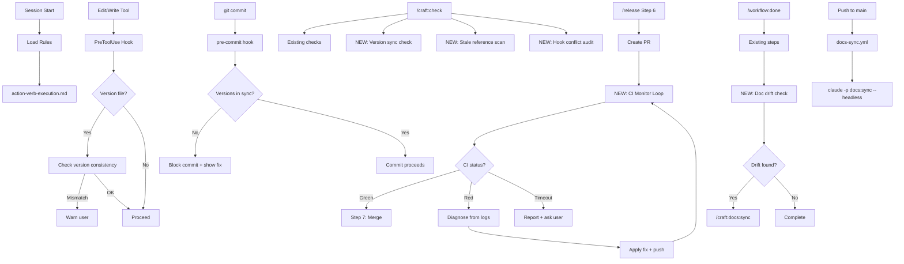

# SPEC: Insights-Driven Craft Command Updates

**Status:** draft
**Created:** 2026-02-18
**From Brainstorm:** `BRAINSTORM-insights-integration-2026-02-18.md`
**Author:** DT + Claude

---

## Overview

Update existing craft commands with enhancements identified by the Claude Code Insights report (341 sessions, 613 hours analyzed). Four priority areas: version sync hooks (belt-and-suspenders), action-verb execution rule (global), pre-flight friction detection (`/craft:check`), and headless doc-sync automation (CI + `/workflow:done` + manual). Also adds a CI monitoring loop to `/release` for fully autonomous releases.

---

## Primary User Story

**As a** developer running 55+ release sessions and 40+ doc-update sessions with Claude Code,
**I want** automated friction prevention built into my existing workflow commands,
**So that** version drift, stale docs, wrong-approach planning, and manual CI monitoring are eliminated without adding new commands to remember.

### Acceptance Criteria

- [ ] `/craft:check --for commit` validates version consistency across all known version files
- [ ] `/craft:check --for pr` scans for stale references from recent renames
- [ ] `/craft:check --for release` audits git hook compatibility with release operations
- [ ] Version sync PreToolUse hook warns before introducing version drift in-session
- [ ] Git pre-commit hook blocks commits with version mismatches
- [ ] Version file discovery uses convention-based patterns (package.json, plugin.json, pyproject.toml, CLAUDE.md, source constants, test expectations)
- [ ] `/release` includes CI monitoring loop: poll → diagnose → fix → retry (max 3 cycles)
- [ ] CI monitoring timeout is configurable per project (default 10 min)
- [ ] `/workflow:done` detects doc drift and triggers `/craft:docs:sync` when needed
- [ ] `/craft:docs:sync --headless` runs non-interactively for CI automation
- [ ] `docs-sync.yml` GitHub Actions workflow triggers on push to main
- [ ] Global `~/.claude/rules/action-verb-execution.md` enforces execute-over-plan behavior
- [ ] All 4 documentation deliverables completed (command refs, tutorial, refcard, architecture doc)

---

## Secondary User Stories

### Release Engineer

**As a** developer running end-to-end release pipelines,
**I want** Claude to monitor CI autonomously after PR creation,
**So that** I don't have to manually poll, diagnose, and retry when CI fails mid-release.

### Multi-Project Developer

**As a** developer managing 16+ projects,
**I want** version sync to auto-discover version files using conventions,
**So that** I don't need per-project configuration for standard project types.

### Documentation Maintainer

**As a** developer whose docs span 15+ files per feature,
**I want** automated doc-sync after merges,
**So that** documentation never falls behind feature changes.

---

## Architecture



### Component Map

```
~/.claude/
├── rules/
│   └── action-verb-execution.md     # NEW: global rule
├── hooks/
│   └── version-sync-hook.sh         # NEW: PreToolUse hook
└── settings.json                     # Hook registration

craft/
├── commands/
│   ├── check.md                      # ENHANCED: version sync, stale refs, hook audit
│   └── workflow/done.md              # ENHANCED: doc drift detection
├── skills/release/SKILL.md           # ENHANCED: CI monitoring loop
├── commands/docs/sync.md             # ENHANCED: --headless flag
├── scripts/
│   ├── version-sync.sh               # NEW: version consistency checker
│   └── ci-monitor.sh                 # NEW: CI polling + diagnosis
├── .github/workflows/
│   └── docs-sync.yml                 # NEW: post-merge doc sync
└── .claude/
    └── release-config.json           # NEW: per-project CI timeout config
```

---

## API Design

### `/craft:check` — New Checks

| Flag | New Check | What it validates |
|------|-----------|-------------------|
| `--for commit` | Version consistency | All version files match (package.json, plugin.json, CLAUDE.md, source constants, test expectations) |
| `--for pr` | Stale reference scan | `git diff --name-status` to find renames, then grep for old names in docs/ |
| `--for pr` | Hook conflict audit | Parse `.githooks/` and `.husky/` for rules that might block the PR workflow |
| `--for release` | All of the above | Plus: release-specific checks (clean tree, branch validation, CI status) |

**Version Consistency Check Detail:**

```bash
# Convention-based discovery
VERSION_FILES=(
    "package.json:version"           # Node.js
    "plugin.json:version"            # Claude Code plugin
    ".claude-plugin/plugin.json:version"  # Craft-style plugin
    "pyproject.toml:version"         # Python
    "DESCRIPTION:Version"            # R package
    "Cargo.toml:version"             # Rust
    "CLAUDE.md:Current Version"      # CLAUDE.md line
)

# Source code constants (grep-based)
SOURCE_PATTERNS=(
    "VERSION\s*=\s*['\"]"            # Python/Ruby/JS
    "version:\s*['\"]"               # YAML configs
    "__version__\s*=\s*['\"]"        # Python dunder
)

# Test expectations (grep-based)
TEST_PATTERNS=(
    "assert.*version.*['\"]"         # Test assertions
    "expect.*version.*['\"]"         # Jest/Vitest
    "\.to_equal.*['\"]v"             # R testthat
)
```

**Output — Version Check:**

```
Version Consistency Check
=========================
Source of truth: package.json → v2.21.0

  ✅ plugin.json: v2.21.0
  ✅ .claude-plugin/plugin.json: v2.21.0
  ✅ CLAUDE.md: v2.21.0
  ⚠  src/index.ts (VERSION = "2.20.0") — MISMATCH
  ⚠  tests/e2e/version.test.ts (expect "2.20.0") — MISMATCH

Fix: Update 2 files to v2.21.0
```

**Output — Stale Reference Scan:**

```
Stale Reference Scan
====================
Renames detected (git diff --name-status):
  R100  commands/old-name.md → commands/new-name.md

Scanning for stale references to "old-name"...
  ⚠  docs/commands/index.md:42 — references "old-name"
  ⚠  docs/REFCARD.md:18 — references "/craft:old-name"
  ⚠  README.md:55 — references "old-name command"

Fix: Update 3 files with new references
```

### `/release` — CI Monitoring Loop (Step 6.5)

```
┌─────────────────────────────────────────────────────────────┐
│ Step 6.5: CI Monitoring                                     │
├─────────────────────────────────────────────────────────────┤
│                                                             │
│ Polling CI status for PR #85...                             │
│                                                             │
│ [Poll 1] ⏳ In progress (45s elapsed)                       │
│ [Poll 2] ⏳ In progress (75s elapsed)                       │
│ [Poll 3] ❌ Failed — "test_version_check" (105s elapsed)    │
│                                                             │
│ Diagnosing failure...                                       │
│   Root cause: version string "2.20.0" in tests/e2e/ver.ts   │
│   Expected: "2.21.0" (matches package.json)                 │
│                                                             │
│ Applying fix...                                             │
│   ✅ Updated tests/e2e/ver.ts: "2.20.0" → "2.21.0"         │
│   ✅ Committed: "fix: sync version in E2E test"             │
│   ✅ Pushed to dev                                          │
│                                                             │
│ Re-polling CI... (retry 1/3)                                │
│ [Poll 1] ⏳ In progress                                     │
│ [Poll 2] ✅ All checks passed (180s total)                   │
│                                                             │
│ Proceeding to Step 7: Merge PR                              │
│                                                             │
└─────────────────────────────────────────────────────────────┘
```

**CI Monitor Algorithm:**

```python
def ci_monitor(pr_number, config):
    timeout = config.get("ci_timeout", 600)  # default 10 min
    max_retries = config.get("ci_max_retries", 3)
    poll_interval = 30  # seconds
    retries = 0

    while retries <= max_retries:
        elapsed = 0
        while elapsed < timeout:
            status = gh_run_status(pr_number)

            if status == "success":
                return "green"
            elif status == "failure":
                break
            elif status == "in_progress":
                sleep(poll_interval)
                elapsed += poll_interval

        if status == "failure" and retries < max_retries:
            logs = gh_run_view_log_failed(pr_number)
            diagnosis = diagnose_failure(logs)
            fix = generate_fix(diagnosis)
            apply_fix(fix)
            commit_and_push(f"fix: {diagnosis.summary}")
            retries += 1
        elif elapsed >= timeout:
            return "timeout"
        else:
            return "failed_after_retries"

    return "failed_after_retries"
```

**Configuration (`release-config.json`):**

```json
{
    "ci_timeout": 600,
    "ci_max_retries": 3,
    "ci_poll_interval": 30,
    "ci_auto_fix_categories": [
        "version_mismatch",
        "lint_failure",
        "changelog_format"
    ],
    "ci_ask_before_fix": [
        "test_failure",
        "security_audit",
        "build_failure"
    ]
}
```

### `/workflow:done` — Doc Drift Detection

New step after existing session capture:

```
Step NEW: Doc Drift Detection
==============================
Checking for documentation drift...

Changed files this session:
  commands/check.md (modified)
  commands/workflow/done.md (modified)

Cross-referencing against documentation:
  ⚠  docs/commands/check.md — may need update (check.md changed)
  ⚠  docs/REFCARD.md — may reference old check behavior
  ✅ docs/commands/workflow/done.md — already up to date

Run /craft:docs:sync to update? [Y/n]
```

### `/craft:docs:sync --headless`

New flag for non-interactive operation:

| Flag | Behavior |
|------|----------|
| (none) | Interactive — shows changes, asks for approval |
| `--headless` | Auto-approve all changes, commit with standard message |
| `--headless --dry-run` | Show what would change without modifying |

### Action-Verb Execution Rule

**File:** `~/.claude/rules/action-verb-execution.md`

```markdown
# Action Verb Execution Rule

## When This Applies

Always. This is a global behavioral rule.

## Rule

When the user uses action verbs, execute the task immediately:

**Execute immediately:** write, fix, add, create, update, delete, run,
test, commit, push, deploy, remove, rename, move, copy, install, build,
lint, format, release, merge, rebase, sync, clean, check

**Plan/investigate first:** plan, design, investigate, analyze, brainstorm,
research, explore, compare, evaluate, audit, review, assess, survey

## Examples

❌ DON'T:
  User: "Fix the typo in README"
  Claude: "Let me analyze the README first and create a plan..."

✅ DO:
  User: "Fix the typo in README"
  Claude: [Opens README, fixes typo, reports done]

❌ DON'T:
  User: "Add a logout button"
  Claude: "Should I enter plan mode to design the logout flow?"

✅ DO:
  User: "Add a logout button"
  Claude: [Finds auth component, adds button, reports done]

## Exception

If the request is genuinely ambiguous (multiple valid interpretations),
ask ONE clarifying question, then execute. Do not ask multiple rounds
of questions.
```

### Version Sync Hook

**File:** `~/.claude/hooks/version-sync-hook.sh`

**Registration in `~/.claude/settings.json`:**

```json
{
    "hooks": {
        "PreToolUse": [
            {
                "matcher": "Edit|Write",
                "hooks": [
                    {
                        "type": "command",
                        "command": "~/.claude/hooks/version-sync-hook.sh \"$TOOL_INPUT\""
                    }
                ]
            }
        ]
    }
}
```

**Hook logic:**

```bash
#!/bin/bash
# version-sync-hook.sh
# Checks if an edit introduces version drift

TOOL_INPUT="$1"
FILE_PATH=$(echo "$TOOL_INPUT" | jq -r '.file_path // empty')

# Only check version-sensitive files
VERSION_PATTERNS="package.json|plugin.json|pyproject.toml|CLAUDE.md|VERSION|version"
if ! echo "$FILE_PATH" | grep -qiE "$VERSION_PATTERNS"; then
    exit 0  # Not a version file, skip
fi

# Find source of truth
if [ -f package.json ]; then
    SOT_VERSION=$(jq -r .version package.json)
elif [ -f pyproject.toml ]; then
    SOT_VERSION=$(grep '^version' pyproject.toml | head -1 | sed 's/.*"\(.*\)"/\1/')
fi

# Check if the edit contains a different version
NEW_CONTENT=$(echo "$TOOL_INPUT" | jq -r '.new_string // .content // empty')
if echo "$NEW_CONTENT" | grep -qE "[0-9]+\.[0-9]+\.[0-9]+" ; then
    EDIT_VERSION=$(echo "$NEW_CONTENT" | grep -oE "[0-9]+\.[0-9]+\.[0-9]+" | head -1)
    if [ -n "$SOT_VERSION" ] && [ "$EDIT_VERSION" != "$SOT_VERSION" ]; then
        echo "⚠ VERSION DRIFT: Editing $FILE_PATH with v$EDIT_VERSION but source of truth is v$SOT_VERSION"
        echo "  Source: package.json → $SOT_VERSION"
        echo "  Consider updating the source of truth first, or use the same version."
    fi
fi

exit 0  # Always allow (warning only, not blocking)
```

**Git pre-commit hook (`scripts/version-sync-precommit.sh`):**

```bash
#!/bin/bash
# version-sync-precommit.sh
# Blocks commits with version mismatches

# Find source of truth version
if [ -f package.json ]; then
    SOT=$(jq -r .version package.json)
    SOT_FILE="package.json"
elif [ -f pyproject.toml ]; then
    SOT=$(grep '^version' pyproject.toml | head -1 | sed 's/.*"\(.*\)"/\1/')
    SOT_FILE="pyproject.toml"
else
    exit 0  # No version file, skip
fi

ERRORS=0

# Check staged files for version mismatches
for FILE in $(git diff --cached --name-only); do
    case "$FILE" in
        plugin.json|.claude-plugin/plugin.json)
            FILE_VER=$(git show ":$FILE" | jq -r .version 2>/dev/null)
            ;;
        CLAUDE.md)
            FILE_VER=$(git show ":$FILE" | grep -oP 'Current Version:\s*v?\K[0-9.]+' | head -1)
            ;;
        *.py)
            FILE_VER=$(git show ":$FILE" | grep -oP '(?:__version__|VERSION)\s*=\s*["\x27]\K[0-9.]+' | head -1)
            ;;
        *.ts|*.js)
            FILE_VER=$(git show ":$FILE" | grep -oP 'VERSION\s*=\s*["\x27]\K[0-9.]+' | head -1)
            ;;
        *)
            continue
            ;;
    esac

    if [ -n "$FILE_VER" ] && [ "$FILE_VER" != "$SOT" ]; then
        echo "❌ Version mismatch: $FILE has v$FILE_VER (expected v$SOT from $SOT_FILE)"
        ERRORS=$((ERRORS + 1))
    fi
done

if [ $ERRORS -gt 0 ]; then
    echo ""
    echo "Fix: Update the $ERRORS file(s) above to v$SOT"
    echo "Or update $SOT_FILE if the version should change."
    exit 1
fi

exit 0
```

### GitHub Actions Workflow (`docs-sync.yml`)

```yaml
name: Doc Sync

on:
  push:
    branches: [main]
  workflow_dispatch:

jobs:
  sync-docs:
    runs-on: ubuntu-latest
    permissions:
      contents: write

    steps:
      - uses: actions/checkout@v4

      - name: Install Claude Code
        run: npm install -g @anthropic-ai/claude-code

      - name: Run doc sync
        env:
          ANTHROPIC_API_KEY: ${{ secrets.ANTHROPIC_API_KEY }}
        run: |
          claude -p "Run /craft:docs:sync --headless. Update any stale version numbers, command references, and feature descriptions to match the current project state. Commit with message 'docs: auto-sync documentation after merge'." \
            --allowedTools "Read,Edit,Write,Bash,Grep"

      - name: Push changes
        run: |
          git config user.name "github-actions[bot]"
          git config user.email "github-actions[bot]@users.noreply.github.com"
          git push
```

---

## Data Models

N/A - No data model changes. File-based configuration only.

**Configuration file:** `.claude/release-config.json`

```json
{
    "ci_timeout": 600,
    "ci_max_retries": 3,
    "ci_poll_interval": 30,
    "ci_auto_fix_categories": ["version_mismatch", "lint_failure", "changelog_format"],
    "ci_ask_before_fix": ["test_failure", "security_audit", "build_failure"],
    "version_sync": {
        "source_of_truth": "auto",
        "additional_files": [],
        "monorepo_strategy": "root_is_truth"
    }
}
```

---

## Dependencies

| Dependency | Purpose | Required? |
|------------|---------|-----------|
| `gh` CLI | CI monitoring (gh run list/view) | Yes |
| `jq` | JSON parsing in hooks | Yes |
| `claude` CLI | Headless doc-sync in CI | Yes (for CI workflow) |
| `scripts/version-sync.sh` | NEW: version consistency checker | Yes (create) |
| `scripts/ci-monitor.sh` | NEW: CI polling + diagnosis | Yes (create) |

---

## UI/UX Specifications

### `/craft:check` Enhanced Output

```
╭─ Pre-flight Check (--for pr) ──────────────────────────────╮
│                                                             │
│ Existing Checks:                                            │
│   ✅ Tests pass (1575/1575)                                 │
│   ✅ Markdown lint clean                                    │
│   ✅ Links valid                                            │
│   ✅ Counts accurate                                        │
│                                                             │
│ NEW Checks:                                                 │
│   ✅ Version consistency (v2.21.0 across 5 files)           │
│   ⚠  Stale references (2 files reference old command name) │
│   ✅ Hook compatibility (no conflicts detected)             │
│   ✅ CLAUDE.md health (82 lines, budget: 100)               │
│                                                             │
│ Result: ⚠ 1 warning — fix stale references before PR       │
│                                                             │
╰─────────────────────────────────────────────────────────────╯
```

### Version Sync Hook Warning (In-Session)

```
⚠ VERSION DRIFT: Editing CLAUDE.md with v2.20.0 but source of truth is v2.21.0
  Source: package.json → 2.21.0
  Consider updating the source of truth first, or use the same version.
```

### Pre-Commit Block

```
❌ Version mismatch: src/index.ts has v2.20.0 (expected v2.21.0 from package.json)
❌ Version mismatch: tests/e2e/version.test.ts has v2.20.0 (expected v2.21.0 from package.json)

Fix: Update the 2 file(s) above to v2.21.0
Or update package.json if the version should change.
```

---

## Documentation Deliverables

### 1. Updated Command Reference Pages

| File | Changes |
|------|---------|
| `docs/commands/check.md` | Add version sync, stale ref scan, hook audit sections |
| `docs/commands/workflow/done.md` | Add doc drift detection step |
| `docs/commands/docs/sync.md` | Add `--headless` flag documentation |
| `docs/skills/release.md` | Add CI monitoring loop (Step 6.5) documentation |

### 2. New Tutorial: Version Sync Setup

**File:** `docs/tutorials/TUTORIAL-version-sync-setup.md`

**Contents:**

- What version drift is and why it causes CI failures
- Setting up the PreToolUse hook (copy script, register in settings.json)
- Setting up the git pre-commit hook (copy script, enable in .githooks/)
- Testing the setup (introduce deliberate drift, verify detection)
- Configuring for different project types (Node, Python, R, Rust)
- Monorepo considerations (root version as source of truth)
- Troubleshooting (false positives, excluding files)

### 3. Updated Refcard

**File:** `docs/REFCARD.md` — Add entries:

| Command | New Behavior |
|---------|-------------|
| `/craft:check --for commit` | + Version consistency check |
| `/craft:check --for pr` | + Stale reference scan, hook audit |
| `/craft:check --for release` | + All new checks combined |
| `/release` | + CI monitoring loop (Step 6.5) |
| `/workflow:done` | + Doc drift detection |
| `/craft:docs:sync --headless` | Non-interactive mode for CI |

### 4. Architecture Doc: CI Monitoring

**File:** `docs/architecture/ci-monitoring.md`

**Contents:**

- Polling loop design (30s interval, configurable timeout)
- Failure diagnosis strategy (log parsing, pattern matching)
- Auto-fix categories vs ask-before-fix categories
- Retry strategy (max 3, escalate to user)
- Configuration via release-config.json
- Sequence diagram of the full flow
- Known failure patterns and their fixes
- Security considerations (what Claude can and cannot auto-fix)

---

## Open Questions

1. ~~Should the action-verb rule be global or per-project?~~ **RESOLVED:** Global (`~/.claude/rules/`)
2. ~~Should version sync be convention-based or config-based?~~ **RESOLVED:** Convention-based (known patterns)
3. ~~Should CI timeout be fixed or configurable?~~ **RESOLVED:** Configurable per project (default 10 min)
4. ~~Monorepo handling?~~ **RESOLVED:** Root version is source of truth

---

## Review Checklist

- [ ] Spec reviewed by stakeholder
- [ ] Architecture diagram accurate
- [ ] All 6 enhancement areas covered
- [ ] Version sync patterns cover all project types (Node, Python, R, Rust, Claude plugin)
- [ ] CI monitoring algorithm handles edge cases (timeout, max retries, partial failures)
- [ ] Documentation deliverables listed with clear scope
- [ ] No breaking changes to existing command behavior
- [ ] Backward compatible (new flags are opt-in or additive)
- [ ] Global rule doesn't conflict with existing project-specific rules

---

## Implementation Notes

### Phase 1: Rules and Quick Wins (< 30 min)

- Create `~/.claude/rules/action-verb-execution.md` (global rule)
- Test with a few action-verb prompts to verify behavior change

### Phase 2: Version Sync (1-2 hours)

- Create `scripts/version-sync.sh` (convention-based discovery)
- Create `~/.claude/hooks/version-sync-hook.sh` (PreToolUse)
- Register hook in `~/.claude/settings.json`
- Create `scripts/version-sync-precommit.sh` (git pre-commit)
- Add version consistency check to `/craft:check`
- Write tutorial: `docs/tutorials/TUTORIAL-version-sync-setup.md`

### Phase 3: `/craft:check` Enhancements (1 hour)

- Add stale reference scan to `--for pr`
- Add hook conflict audit to `--for pr` and `--for release`
- Add CLAUDE.md health check (from claude-md-refactor spec)
- Update `docs/commands/check.md`
- Update `docs/REFCARD.md`

### Phase 4: `/release` CI Monitoring (1-2 hours)

- Create `scripts/ci-monitor.sh` (polling + diagnosis)
- Add Step 6.5 to `/release` SKILL.md
- Create `.claude/release-config.json` schema
- Write architecture doc: `docs/architecture/ci-monitoring.md`
- Update release skill documentation

### Phase 5: Doc Sync Automation (1 hour)

- Add doc drift detection to `/workflow:done`
- Add `--headless` flag to `/craft:docs:sync`
- Create `.github/workflows/docs-sync.yml`
- Update `docs/commands/workflow/done.md`
- Update `docs/commands/docs/sync.md`

### Phase 6: Integration Testing

- End-to-end test: introduce version drift → check catches it → hook warns → pre-commit blocks
- End-to-end test: release with CI failure → monitor diagnoses → auto-fix → retry succeeds
- End-to-end test: feature merge → done triggers doc sync → headless sync updates docs

---

## History

| Date | Change |
|------|--------|
| 2026-02-18 | Initial draft from deep brainstorm (insights report integration) |
