# SPEC: Interactive Markdownlint List Spacing Enforcement

**Status:** draft
**Created:** 2026-01-19
**From Brainstorm:** Deep analysis with feature focus
**Priority:** High (documentation quality consistency)

---

## Overview

Enhance Craft's `/craft:docs:lint` command to strictly enforce MD030 (spaces after list markers) and MD032 (blank lines around lists) for consistent, portable documentation. This specification addresses list spacing violations that break rendering in various markdown processors.

**Key Benefits:**
- Consistent list formatting across 100+ command/skill/agent files
- Portable documentation (works in GitHub, MkDocs, VS Code)
- Auto-fix capability prevents manual cleanup
- Gradual migration path for existing violations

---

## Primary User Story

**As a** Craft plugin developer
**I want** automatic enforcement of list spacing rules
**So that** all documentation renders consistently across platforms without manual formatting

**Acceptance Criteria:**
1. ✅ `/craft:docs:lint` automatically checks MD030 and MD032
2. ✅ `--fix` flag auto-corrects spacing violations
3. ✅ Project-wide marker style enforced (either `-` or `*` consistently)
4. ✅ Existing files fixed gradually (as edited, not bulk)
5. ✅ Performance < 10s for 100+ files (balanced mode)

---

## Secondary User Stories

### Story 2: Migration Path
**As a** documentation maintainer
**I want** gradual migration without breaking existing docs
**So that** violations are fixed incrementally without disruption

### Story 3: Developer Experience
**As a** command author
**I want** clear error messages with auto-fix suggestions
**So that** I can quickly fix spacing issues without learning rules

---

## Architecture

### Current State


**Problem:** MD030 not explicitly configured - relies on `"default": true` which may not enforce strict spacing.

### Proposed State


**Solution:** Explicit MD030 configuration with auto-fix integration.

---

## Technical Requirements

### 1. Configuration Changes

**File:** `.markdownlint.json`

```json
{
  "$schema": "https://raw.githubusercontent.com/DavidAnson/markdownlint/main/schema/markdownlint-config-schema.json",
  "default": true,

  // EXISTING RULES (keep as-is)
  "MD013": false,  // Line length (disabled for long examples)
  "MD033": {
    "allowed_elements": [
      "antml:*", "commentary", "example", "user", "response",
      "antml:function_calls", "antml:invoke", "antml:parameter"
    ]
  },
  "MD024": { "siblings_only": true },  // Duplicate headers
  "MD041": false,  // First line heading (disabled for frontmatter)
  "MD049": false,  // Emphasis style
  "MD050": false,  // Strong style

  // NEW RULES (add these)
  "MD030": {
    "ul_single": 1,    // Unordered lists: 1 space after marker
    "ol_single": 1,    // Ordered lists: 1 space after marker
    "ul_multi": 1,     // Multi-paragraph lists: 1 space
    "ol_multi": 1      // Multi-paragraph ordered: 1 space
  },
  "MD004": {
    "style": "dash"    // Enforce '-' marker consistently (not '*' or '+')
  },
  "MD032": true        // Already enabled, but make explicit for clarity
}
```

**Why MD030 Needs Explicit Config:**
- Default behavior varies between markdownlint versions
- Explicit config ensures consistent enforcement
- `ul_single: 1` enforces exactly 1 space after `-` or `*`
- `ol_single: 1` enforces exactly 1 space after `1.` or `10.`

**Why MD004:**
- Craft docs currently mix `-` and `*` markers
- `"style": "dash"` enforces `-` consistently
- Makes docs more portable (some parsers prefer `-`)

### 2. Command Integration

**File:** `commands/docs/lint.md`

**Add to Critical Rules section (line 78-94):**

```markdown
### Critical Rules (Always Enabled)

```javascript
const criticalRules = {
  // List formatting - CRITICAL (breaks rendering)
  "MD030": {          // NEW: Spaces after list marker
    "ul_single": 1,   // Unordered: exactly 1 space
    "ol_single": 1,   // Ordered: exactly 1 space
    "ul_multi": 1,    // Multi-paragraph: 1 space
    "ol_multi": 1     // Multi-ordered: 1 space
  },
  "MD032": true,      // Blank lines around lists (existing)
  "MD004": {          // NEW: Consistent list marker style
    "style": "dash"   // Use '-' not '*' or '+'
  },

  // Code fence formatting (existing)
  "MD040": true,      // Code fence language tag required

  // Link formatting (existing)
  "MD011": true,      // Reversed link syntax [](text)[url]
  "MD042": true,      // No empty links
  "MD051": true,      // Link fragments should be valid

  // Trailing whitespace (existing)
  "MD009": true,      // No trailing spaces
  "MD010": true,      // No hard tabs
};
```
```

**Update Auto-Fix Rules table (line 313-325):**

```markdown
| Issue | Rule | Fix Applied |
|-------|------|-------------|
| Trailing spaces | MD009 | Remove spaces at line end |
| Hard tabs | MD010 | Convert to spaces |
| Blank lines around lists | MD032 | Add blank line before/after |
| **List spacing** | **MD030** | **Normalize to 1 space after marker** |
| **Inconsistent marker** | **MD004** | **Change to '-' consistently** |
| Code fence language | MD040 | Detect & add language tag |
| Multiple blank lines | MD012 | Reduce to single blank line |
```

### 3. Error Message Improvements

**Current error output (generic):**
```
docs/test.md:21:1: MD030 - Spaces after list markers
```

**Proposed error output (specific):**
```
docs/test.md:21:1: MD030 - List spacing violation
  Found:    -  Item with 2 spaces
  Expected: - Item with 1 space
  Auto-fixable: Yes

  Context (lines 20-22):
    20: ## Example List
    21: -  Item 1 (wrong: 2 spaces)
    22: -  Item 2

  Fix:
    21: - Item 1 (correct: 1 space)
    22: - Item 2
```

### 4. Migration Strategy

**Phase 1: Detection (Week 1)**
- Run `/craft:docs:lint` without `--fix`
- Generate violation report
- Identify files with most violations

**Phase 2: Configuration (Week 1)**
- Update `.markdownlint.json` with new rules
- Test on sample files
- Verify auto-fix behavior

**Phase 3: Gradual Fix (Ongoing)**
- Fix files as they're edited (not bulk)
- Pre-commit hook prevents new violations
- Monthly report tracks progress

**Phase 4: Enforcement (Week 4)**
- Enable strict mode in CI/CD
- Block PRs with violations
- All docs compliant

### 5. Performance Optimization

**Target:** < 10s for 100+ markdown files

**Strategy: Balanced Approach**
- Fast path: Cache results for unchanged files (80% hit rate)
- Smart detection: Skip files with no lists (20% skip rate)
- Parallel processing: Batch files in groups of 10
- Incremental linting: Only changed files in Git worktree

**Implementation:**

```bash
# commands/docs/lint.md Step 2 enhancement

if [ "$mode" = "optimize" ] || [ "$mode" = "release" ]; then
  # Parallel processing for large doc sets
  find docs/ -name "*.md" -print0 | \
    xargs -0 -P 4 -n 10 markdownlint-cli2 --config .markdownlint.json
else
  # Sequential for default/debug (simpler error reporting)
  markdownlint-cli2 --config .markdownlint.json "docs/**/*.md"
fi
```

---

## API Design

N/A - No API changes (configuration-only enhancement)

---

## Data Models

N/A - No data model changes

---

## Dependencies

### Existing Dependencies
- ✅ `markdownlint-cli2@^0.14.0` (already in package.json)
- ✅ `.markdownlint.json` (already exists)

### New Dependencies
- None (uses existing tooling)

### Dev Dependencies
```json
{
  "devDependencies": {
    "markdownlint-cli2": "^0.14.0",  // existing
    "markdown-link-check": "^3.12.2"  // existing
  }
}
```

---

## UI/UX Specifications

### User Flow: Detecting Violations

```mermaid
sequenceDiagram
    participant Dev as Developer
    participant CLI as /craft:docs:lint
    participant ML as markdownlint-cli2
    participant Out as Terminal Output

    Dev->>CLI: /craft:docs:lint
    CLI->>ML: Check docs/*.md
    ML->>ML: Apply .markdownlint.json rules
    ML-->>CLI: Found 23 violations
    CLI->>Out: Display violations

    Out->>Dev: Show grouped report:
    Out->>Dev: • MD030: 15 files (list spacing)
    Out->>Dev: • MD004: 8 files (marker style)
    Out->>Dev: • MD032: 3 files (blank lines)
    Out->>Dev:
    Out->>Dev: All auto-fixable! Run with --fix

    Dev->>CLI: /craft:docs:lint --fix
    CLI->>ML: Auto-fix violations
    ML->>ML: Normalize spacing to 1
    ML->>ML: Change markers to '-'
    ML->>ML: Add blank lines
    ML-->>CLI: Fixed 23 issues
    CLI->>Out: Show diff summary

    Out->>Dev: ✓ Fixed 15 MD030 (list spacing)
    Out->>Dev: ✓ Fixed 8 MD004 (markers)
    Out->>Dev: ✓ Fixed 3 MD032 (blank lines)
    Out->>Dev:
    Out->>Dev: Review with: git diff
```



### Terminal Output Examples

#### Violation Report (No --fix)

```
┌─────────────────────────────────────────────────────────────┐
│ /craft:docs:lint (default mode)                             │
├─────────────────────────────────────────────────────────────┤
│                                                             │
│ ✓ Checked: 108 markdown files (3.2s)                        │
│                                                             │
│ ✗ List Spacing Violations (23 issues):                      │
│                                                             │
│   MD030 - Spaces after list markers (15 files):            │
│     commands/do.md:45 - Found 2 spaces, expected 1          │
│     commands/check.md:78 - Found 2 spaces, expected 1       │
│     skills/brainstorm.md:112 - Found 3 spaces, expected 1   │
│     ... 12 more files                                       │
│                                                             │
│   MD004 - Inconsistent marker style (8 files):             │
│     agents/orchestrator.md:34 - Uses '*', should be '-'     │
│     commands/hub.md:56 - Uses '+', should be '-'            │
│     ... 6 more files                                        │
│                                                             │
│   MD032 - Missing blank lines (3 files):                    │
│     docs/guide/setup.md:21 - Missing blank before list      │
│     ... 2 more files                                        │
│                                                             │
│ ─────────────────────────────────────────────────────────── │
│                                                             │
│ 💡 All 23 issues are auto-fixable!                          │
│                                                             │
│ Run with --fix to apply fixes:                              │
│   /craft:docs:lint --fix                                    │
│                                                             │
│ Exit code: 0 (auto-fixable)                                 │
│ Time: 3.2s / 10s budget                                     │
│                                                             │
└─────────────────────────────────────────────────────────────┘
```

#### Auto-Fix Report (With --fix)

```
┌─────────────────────────────────────────────────────────────┐
│ 🔧 AUTO-FIXING LIST SPACING VIOLATIONS...                    │
├─────────────────────────────────────────────────────────────┤
│                                                             │
│ ✓ MD030: Normalized list spacing (15 files)                 │
│   commands/do.md:45      -  Item → - Item                   │
│   commands/check.md:78   -   Item → - Item                  │
│   skills/brainstorm.md   Multiple fixes (8 locations)       │
│   ... 12 more files                                         │
│                                                             │
│ ✓ MD004: Changed markers to '-' (8 files)                   │
│   agents/orchestrator.md:34  * Item → - Item                │
│   commands/hub.md:56         + Item → - Item                │
│   ... 6 more files                                          │
│                                                             │
│ ✓ MD032: Added blank lines (3 files)                        │
│   docs/guide/setup.md:21  Added blank before list           │
│   ... 2 more files                                          │
│                                                             │
│ ─────────────────────────────────────────────────────────── │
│                                                             │
│ Summary:                                                    │
│   Files modified: 23                                        │
│   Issues fixed: 23                                          │
│   Time: 4.1s / 10s budget                                   │
│                                                             │
│ Review changes:                                             │
│   git diff                                                  │
│                                                             │
│ Commit changes:                                             │
│   git add -A                                                │
│   git commit -m "fix: normalize list spacing (MD030/MD004)" │
│                                                             │
│ Exit code: 0 (all fixed)                                    │
│                                                             │
└─────────────────────────────────────────────────────────────┘
```

### Accessibility Checklist

- ✅ **Color-blind friendly:** Uses symbols (✓/✗) not just color
- ✅ **Screen reader compatible:** Plain text output (no fancy graphics)
- ✅ **Clear hierarchy:** Headers, sections, bullet lists
- ✅ **Keyboard-only navigation:** No mouse required
- ✅ **Exit codes:** Machine-readable success/failure

---

## Open Questions

1. **Should we enforce MD030 on existing files immediately or gradually?**
   - **Answer (from user input):** Gradual migration (fix files as edited)
   - **Action:** Add pre-commit hook to prevent new violations, but don't bulk-fix existing files

2. **What if a file intentionally uses multiple spaces for alignment?**
   - **Proposed solution:** Use inline disable comments
   ```markdown
   <!-- markdownlint-disable MD030 -->
   - Item 1   aligned intentionally
   - Item 2   aligned intentionally
   <!-- markdownlint-enable MD030 -->
   ```

3. **Should nested lists follow different spacing rules?**
   - **Answer (from user input):** Same rules for all levels
   - **Action:** `ul_single: 1` applies to all nesting levels

4. **Performance impact on CI/CD pipeline?**
   - **Measurement needed:** Benchmark current vs proposed config
   - **Target:** No more than 10% increase in CI time
   - **Mitigation:** Cache markdownlint results between runs

---

## Review Checklist

- [ ] Configuration tested on sample files
- [ ] Auto-fix verified (before/after diff)
- [ ] Performance benchmarked (100+ files)
- [ ] Migration strategy documented
- [ ] Error messages clear and actionable
- [ ] Git workflow integration tested
- [ ] CI/CD pipeline updated
- [ ] Documentation updated (commands/docs/lint.md)
- [ ] Unit tests added (test MD030 detection)
- [ ] Integration tests added (test auto-fix)

---

## Implementation Notes

### Phase 1: Configuration Update (1-2 hours)

1. **Update `.markdownlint.json`:**
   - Add explicit MD030 configuration
   - Add MD004 marker style enforcement
   - Keep existing relaxed rules

2. **Test on sample files:**
   ```bash
   # Create test file with violations
   echo "## Test\n-  Item with 2 spaces\n* Different marker" > test.md

   # Run linter
   npx markdownlint-cli2 --config .markdownlint.json test.md

   # Verify errors detected
   # Expected: MD030 and MD004 violations

   # Run with fix
   npx markdownlint-cli2 --fix --config .markdownlint.json test.md

   # Verify fixed
   cat test.md
   # Expected: "- Item with 1 space\n- Different marker"
   ```

3. **Update command documentation:**
   - Add MD030 and MD004 to critical rules section
   - Update auto-fix table
   - Add examples of violations and fixes

### Phase 2: Command Integration (2-3 hours)

1. **Enhance error reporting:**
   - Group violations by rule (MD030, MD004, MD032)
   - Show before/after for auto-fixable issues
   - Include file context (3 lines before/after)

2. **Add performance optimization:**
   - Implement file caching (skip unchanged files)
   - Add parallel processing for optimize mode
   - Benchmark and document performance

3. **Update dry-run output:**
   - Show MD030/MD004 in rules enabled section
   - Display expected time impact

### Phase 3: Migration Execution (Ongoing)

1. **Generate baseline report:**
   ```bash
   /craft:docs:lint > docs/LINT-BASELINE-2026-01-19.txt
   ```

2. **Fix high-priority files first:**
   - CLAUDE.md (project overview)
   - README.md (entry point)
   - commands/do.md (most-used command)

3. **Set up pre-commit hook:**
   ```bash
   # .git/hooks/pre-commit
   #!/bin/bash
   npx markdownlint-cli2 --config .markdownlint.json $(git diff --cached --name-only --diff-filter=ACM | grep '.md$')
   ```

4. **Monthly progress tracking:**
   - Run full lint report
   - Track violations over time
   - Celebrate milestones (90% compliant, 100% compliant)

### Phase 4: CI/CD Integration (1 hour)

1. **Update `.github/workflows/docs-quality.yml`:**
   ```yaml
   - name: Run markdown linting
     run: npx markdownlint-cli2 --config .markdownlint.json "docs/**/*.md" "*.md"
   ```

2. **Add status badge to README:**
   ```markdown
   
   ```

---

## History

| Date | Change | Author |
|------|--------|--------|
| 2026-01-19 | Initial spec from deep brainstorm | Claude (via /craft:workflow:brainstorm) |
| TBD | Implementation started | - |
| TBD | Phase 1 complete (config) | - |
| TBD | Phase 2 complete (integration) | - |
| TBD | Phase 3 complete (migration) | - |
| TBD | Phase 4 complete (enforcement) | - |

---

## References

- [markdownlint Rule MD030](https://github.com/DavidAnson/markdownlint/blob/main/doc/md030.md)
- [markdownlint Rule MD032](https://github.com/DavidAnson/markdownlint/blob/main/doc/md032.md)
- [markdownlint Rule MD004](https://github.com/DavidAnson/markdownlint/blob/main/doc/md004.md)
- [Craft `/craft:docs:lint` command](commands/docs/lint.md)
- [Existing `.markdownlint.json` config](.markdownlint.json)
