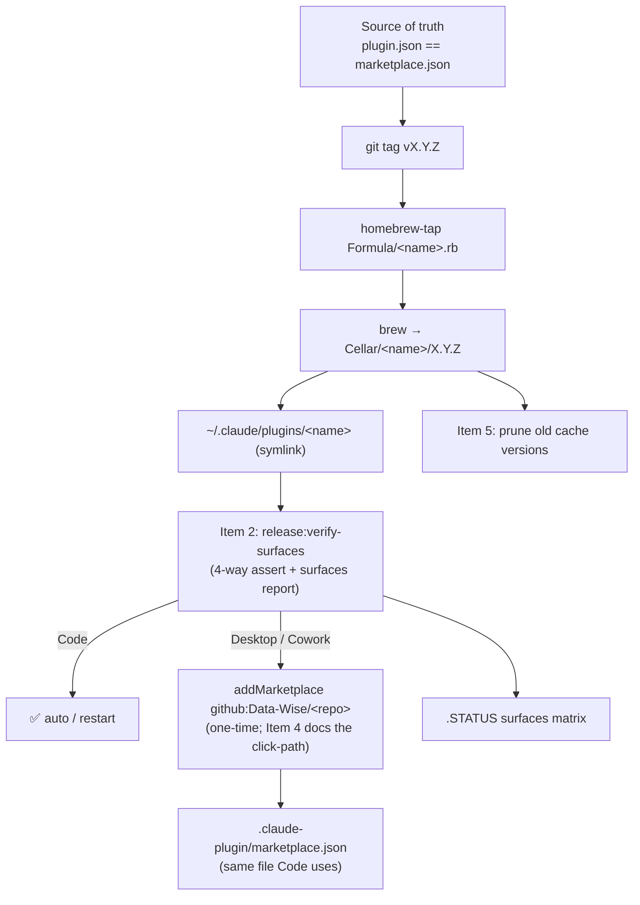

# SPEC: Multi-surface release — keep Code / Desktop / Cowork on one version

**Status:** approved — all 5 items actionable. Item 1 spike RESOLVED 2026-06-15 (Desktop/Cowork supports custom GitHub marketplaces by `owner/repo` → `.claude-plugin/marketplace.json`)
**Created:** 2026-06-15
**Reviewed:** 2026-06-15 (validation: acceptance/technical/deps pass; the lone blocking question — the Desktop spike — has since been answered YES, see Open Questions #1)
**From Brainstorm:** `~/brainstorms/BRAINSTORM-craft-desktop-release-2026-06-15.md` (deep + save)
**Author:** dt + Claude
**Related:** `docs/specs/SPEC-desktop-release-pipeline-2026-02-24.md` (Tauri *cask apps* — different topic),
`docs/guide/desktop-release.md`, `.github/workflows/homebrew-release.yml`, `skills/release/SKILL.md`

---

## Overview

Craft's release pipeline reliably reaches **Claude Code** (via `~/.claude/plugins/<name>` + a
local marketplace Code auto-updates on session start) but **nothing else**. Investigation proved
Claude Code and Claude Desktop / Cowork use **separate plugin registries** — Cowork's is
session-scoped and subscribes only to Anthropic's curated `knowledge-work-plugins`. So a craft
release has no shared store to "land on" for Desktop.

This spec captures the work to (a) make versioning a single verifiable source of truth across every
distribution target, (b) close the Code-side refresh lag that masquerades as "drift," and (c) handle
Desktop honestly — a documented GUI step gated on a one-time capability spike, never an unsafe file
write into Desktop's store.

**Update (Item 1 spike, 2026-06-15):** the Desktop/Cowork store is **account/org-scoped and
persistent** (not per-chat-session — there is one long-lived `cowork_plugins` store), and the
Claude.app native host exposes an `addMarketplace(owner/repo)` capability that reads
`.claude-plugin/marketplace.json` — the same engine and format Claude Code uses. So Desktop parity
**is** achievable via the marketplace craft already publishes. The earlier "session-scoped + curated,
not deliverable" framing was wrong and is corrected throughout.

**Non-goal:** writing directly into Desktop's store files. Registration goes through the supported
`addMarketplace` path (one-time, via the Desktop UI), never a hand-edit of its JSON.

---

## Marketplace finding (answers "is there a marketplace on Data-Wise GitHub?")

- **No dedicated/aggregator marketplace repo exists.** `gh repo list Data-Wise` shows no repo named
  `*marketplace*`.
- The marketplace mechanism is **per-plugin-repo**: `craft`, `scholar`, `rforge`, and `himalaya-mcp`
  each ship `.claude-plugin/marketplace.json` and are addable as `github:Data-Wise/<repo>`.
  `known_marketplaces.json` confirms `Data-Wise/rforge` and `Data-Wise/himalaya-mcp` are already
  subscribed this way; craft is added as `github:Data-Wise/craft`.
- **`Data-Wise/claude-plugins`** ("Official Claude Code plugins") and **`Data-Wise/homebrew-tap`**
  exist and are candidate hubs for an aggregator marketplace if one is ever wanted.
- **Implication for the design:** the "single Git-backed source of truth" already exists per repo.
  An aggregator marketplace repo is *optional*, only worth building if the Desktop spike (Item 1)
  proves Desktop can subscribe to a GitHub marketplace by owner/repo.

---

## Decisions (locked 2026-06-15, via `/spec:review` grill)

| # | Decision | Choice |
|---|----------|--------|
| D1 | **Trigger** | **Context-aware, auto** — `verify-surfaces` fires in the release pipeline whenever `.claude-plugin/plugin.json` is present (matches `ci:detect` / `dist:homebrew` auto-detect). Only escape hatch is `--skip-surfaces`; no opt-in flag. |
| D2 | **On version mismatch** | **Block real targets, warn Desktop** — hard-fail when `plugin.json` / `marketplace.json` / git tag / formula / Code-registered disagree (craft controls those); Desktop is a *warn* (one-time manual add, not auto-verifiable). |
| D3 | **Desktop registration** | **Print the one-time step** at release: `claude plugin marketplace add <Data-Wise aggregator>` (or `github:Data-Wise/<repo>`) + click-path. No native-app automation; no writes to Desktop store. |
| D4 | **Scope** | **All Data-Wise plugins** — design generically (craft, scholar, rforge, himalaya-mcp); they share `plugin.json` + `marketplace.json` + tap. rforge's drift proves the need. |
| D5 | **Aggregator marketplace** | **Yes — one Data-Wise marketplace** (new Item 6). User adds it ONCE in Desktop → all current + future plugins. Single source, no per-repo add fan-out. |
| D6 | **Item 2 build vs reuse** | **Reuse `claude plugin tag`** (it already validates `plugin.json` ↔ enclosing marketplace entry agree); craft adds only the tag ↔ formula ↔ brew ↔ Code-registered legs. |
| D7 | **Cache-prune retention** | **Keep current + 2 most recent**; prune older `local-plugins/<name>/<ver>` dirs; always report what was removed. |

**CLI facts confirmed (`claude plugin --help`):** `update <plugin>` (Item 3 = `claude plugin update rforge`), `install`, `marketplace` (add/manage), `tag` (validates plugin.json↔marketplace), `prune` (deps GC — distinct from D7's version-cache prune).

---

## Primary User Story

**As a** maintainer releasing a Data-Wise plugin,
**I want** one release to put the same version on every surface I can reach, and to *tell me
plainly* which surfaces it can't reach automatically,
**so that** Code/Desktop/Cowork never silently drift and I'm never guessing where a version landed.

### Acceptance Criteria

- [ ] A release fails loud if `plugin.json` ≠ `marketplace.json` ≠ git tag `vX.Y.Z` ≠ tap
      `Formula/<name>.rb` version (four-way agreement).
- [ ] After release, a **surfaces report** prints per-surface status: Code (auto / restart),
      Desktop Chat (GUI step or N/A), Cowork (N/A + reason).
- [ ] `.STATUS` carries a **surfaces matrix** (plugin × {Code, Desktop, Cowork} × version) that the
      release updates.
- [ ] The Code-side refresh lag is eliminated or surfaced: rforge (currently Code 2.6.0 vs brew
      2.13.0) reads 2.13.0 after the fix, OR the report flags the lag explicitly.
- [ ] The Desktop GUI step is documented with a verified click-path (post Item 1 spike), or the docs
      state plainly that Desktop parity is not craft-deliverable today.
- [ ] No craft code writes into `~/Library/Application Support/Claude/**` (safety invariant).

---

## Scope — work items (ranked)

### Item 1 — Desktop-marketplace capability spike ✅ DONE (2026-06-15)

**Effort:** spent ~20 min · **Type:** investigation, no code.
**Result: YES** — Desktop/Cowork supports adding a custom GitHub marketplace by `owner/repo`
(reads `.claude-plugin/marketplace.json`), same engine as Code, persistent account/org-scoped store
(see Open Questions #1 for the app-bundle evidence). Desktop parity = **one-time "add marketplace"
(`github:Data-Wise/<repo>`) + updates flow from `marketplace.json`.** Residual handed to Item 4:
confirm the exact in-app click-path (human GUI check).

### Item 2 — `release:verify-surfaces` (highest ROI)

**Effort:** ~1–2 h · **Type:** new release sub-step (extend `post-release-sweep.sh`).
Slots in **after Step 13 (verify downstream), within/before Step 13.5**.

- **D1 trigger:** auto-fires when `.claude-plugin/plugin.json` present; `--skip-surfaces` to bypass.
- **D6 reuse:** call `claude plugin tag` to validate `plugin.json` ↔ marketplace-entry agreement;
  craft adds the remaining legs — **tag ↔ `Formula/<name>.rb` ↔ brew-installed ↔ Code-registered
  (`installed_plugins.json`)**.
- **D2 behavior:** block on mismatch of any *craft-controlled* leg; **warn** (don't block) on the
  Desktop leg (manual, not auto-verifiable).
- Emit the **surfaces report** and update the `.STATUS` surfaces matrix.
- Read-only except the repo's own `.STATUS`. Would have caught rforge.

### Item 3 — Fix the rforge Code-refresh lag *(separate, small)*

**Effort:** ~10 min · **Type:** ops, not a craft code change.
Code registered rforge 2.6.0 vs brew 2.13.0 — a stale `local-plugins` cache entry. **Confirmed
scriptable:** `claude plugin update rforge` (verb verified in `claude plugin --help`; restart to
apply). Tracked here so it isn't lost; can run standalone anytime.

### Item 4 — Document the real Desktop release step *(unblocked by Item 1)*

**Effort:** ~30 min · **Type:** docs.
`docs/guide/desktop-release.md` currently covers Tauri *cask apps*, not *plugin registration*. Add a
"Desktop plugin install" section: the one-time `addMarketplace` step pointing at
`github:Data-Wise/<repo>` (→ `.claude-plugin/marketplace.json`), with the exact in-app click-path
(confirm once in the Desktop UI — capability already verified in Item 1).

### Item 5 — Cache-prune step

**Effort:** ~30 min · **Type:** new release/maintenance sub-step.
GC stale `~/.claude/plugins/cache/local-plugins/<name>/<oldversion>/` dirs (scholar alone has
2.17.0–2.24.0). **D7:** keep **current + 2 most recent**; always report what was pruned (no silent
deletion). Distinct from `claude plugin prune` (that GCs unused *dependency plugins*, not version
cache).

### Item 6 — Data-Wise aggregator marketplace *(new — from D5)*

**Effort:** ~1 h · **Type:** new repo/manifest + release wiring.
Publish **one** `.claude-plugin/marketplace.json` listing all Data-Wise plugins (craft, scholar,
rforge, himalaya-mcp) — in `Data-Wise/claude-plugins` or a dedicated marketplace repo. Then:

- Code & Desktop each add it **once** (`claude plugin marketplace add Data-Wise/<aggregator>`); all
  current + future plugins flow from it.
- Each plugin's release updates its entry in the aggregator (single source of truth across plugins).
- **Drift caution:** the aggregator entry becomes a 5th version leg — `verify-surfaces` (Item 2)
  must include it, or per-repo `marketplace.json` and the aggregator will diverge.

---

## Architecture



---

## API Design

N/A — no HTTP/RPC API. The "interfaces" are CLI/release steps and JSON files
(`plugin.json`, `marketplace.json`, `installed_plugins.json`, `.STATUS`).

## Data Models

**Surfaces matrix** (new, in `.STATUS`), conceptually:

| plugin | code | desktop_chat | cowork | released | drift |
|--------|------|--------------|--------|----------|-------|
| craft  | 2.37.0 | gui:added | n/a | 2.37.0 | no |

`verify-surfaces` reads version sources read-only; the only file it writes is the repo's own
`.STATUS`.

---

## Dependencies

- Existing: `scripts/post-release-sweep.sh`, `scripts/bump-version.sh`, `skills/release/SKILL.md`,
  `.github/workflows/homebrew-release.yml`, `jq`/`python3`, `gh`.
- **`claude` CLI verbs (confirmed via `claude plugin --help`):** `tag` (validates
  plugin.json↔marketplace), `update <plugin>`, `install`, `marketplace` (add/manage), `prune`.
  Item 2 reuses `tag`; Item 3 uses `update`; Items 4/6 use `marketplace add`.
- Desktop capability to add a custom GitHub marketplace by owner/repo: **confirmed** (Item 1 spike).
  Residual: exact in-app click-path (human GUI check, Item 4).

---

## UI/UX Specifications

CLI-only. The surfaces report should be ADHD-friendly: one line per surface, ✅/⚠️/N-A glyph, the
version, and the next action. Example:

```
Surfaces for craft v2.37.0
  ✅ Code           2.37.0  (auto; `claude plugin update craft` / restart to apply)
  ⚠️ Desktop/Cowork add once: claude plugin marketplace add Data-Wise/<aggregator>
                    then updates flow from marketplace.json (see desktop-release.md)
```

Accessibility: plain-text glyphs with text labels (no color-only meaning).

---

## Open Questions

1. ~~**(Item 1, blocking)** Can Desktop add a custom GitHub marketplace by owner/repo?~~
   **RESOLVED 2026-06-15 — YES.** Evidence (read-only, from `/Applications/Claude.app/Contents/
   Resources/app.asar`): the Cowork native host (`cowork_host_native_ts`) implements
   `addMarketplace`/`removeMarketplace`; the input schema is *"GitHub repository in owner/repo
   format"* with optional `ref` and `path` (defaults to `.claude-plugin/marketplace.json`); a
   "remote" marketplace variant also exists. The store schema (`known_marketplaces.json`,
   `version: 2`, `source:{source:"github",repo}`) is identical to Code's and is account/org-scoped
   (persistent). → Desktop parity is achievable via `github:Data-Wise/craft`. **Residual:** confirm
   the exact in-app click-path / command (Item 4) — a human GUI check, since browser-automation
   tools can't drive the native app.
2. ~~Does the `claude` CLI have a `plugin update` verb?~~ **RESOLVED — YES** (`claude plugin update
   <plugin>`; restart to apply). Also `tag`, `install`, `marketplace`, `prune`.
3. ~~Aggregator vs per-repo marketplace?~~ **RESOLVED (D5) — aggregator** (Item 6): one Data-Wise
   marketplace, added once per surface.
4. ~~Block vs warn on mismatch?~~ **RESOLVED (D2) — block craft-controlled legs, warn Desktop.**
5. ~~Cache-prune retention?~~ **RESOLVED (D7) — keep current + 2 most recent, report.**
6. *(still open)* Where should the aggregator live — reuse `Data-Wise/claude-plugins` or a new
   dedicated `Data-Wise/marketplace` repo? (Item 6 implementation detail.)
7. *(still open, Item 4)* Exact Desktop in-app click-path for `marketplace add` — needs one human
   GUI confirmation.

---

## Review Checklist

- [ ] Item 1 spike resolved (Desktop capability known) before building Items 4 / aggregator.
- [ ] `verify-surfaces` four-way assert proven on a real release (red on a forced mismatch).
- [ ] Safety invariant tested: no write under `~/Library/Application Support/Claude/`.
- [ ] rforge reads 2.13.0 in Code after Item 3.
- [ ] `.STATUS` surfaces matrix renders and updates on release.
- [ ] `docs/guide/desktop-release.md` updated (plugin vs cask sections distinct).
- [ ] Cache-prune reports (never silently deletes).

---

## Implementation Notes

- **Sequencing:** Item 1 (spike) → Item 2 (verify-surfaces) → Item 3 (rforge, parallel) →
  Item 4 (docs, gated on 1) → Item 5 (prune). Items 2/3/5 don't depend on the Item 1 outcome.
- **Reuse, don't rebuild:** extend `post-release-sweep.sh` rather than a new top-level script; it
  already runs at Step 13.5 and already classifies drift tiers.
- **Single source of truth is already there:** `plugin.json`/`marketplace.json` per repo. This spec
  adds *verification + reporting*, not a new versioning system.
- **The "scholar drift" that motivated this is already healed** (Code self-updated 2.22→2.24 on
  session start); the real lingering lag is rforge. Don't re-fix scholar.
- **Spec-only:** no code in this change. Implementation requires a feature worktree per craft
  workflow.

---

## History

- 2026-06-15 — Initial draft from deep brainstorm + live investigation (Code/Desktop store split
  confirmed read-only; marketplace inventory via `gh repo list Data-Wise`).
- 2026-06-15 — Reviewed (`/spec:review`). Validation passed on acceptance criteria, technical
  requirements, and dependencies; Open Question #1 (Desktop-marketplace spike) flagged as blocking.
  Status → approved (partial): Items 2/3/5 ready; Items 1 & 4 gated.
- 2026-06-15 — **Item 1 spike run and RESOLVED (YES).** Read-only evidence from `Claude.app`
  (`app.asar`): Cowork native host exposes `addMarketplace(owner/repo → .claude-plugin/marketplace
  .json)`; store schema identical to Code and account/org-scoped (persistent). Corrected the prior
  "session-scoped + curated, not deliverable" framing. **Status → approved (all items actionable).**
- 2026-06-15 — **Grilled the design (`/spec:review` round 2); D1–D7 locked** (see Decisions).
  Added **Item 6 (Data-Wise aggregator marketplace)** from D5. Confirmed `claude plugin`
  verbs (`tag`/`update`/`install`/`marketplace`/`prune`) — Item 2 reuses `tag`, Item 3 = `update`,
  Items 4/6 use `marketplace add`. Open questions 2–5 resolved; 6–7 (aggregator repo location, exact
  Desktop click-path) remain.
