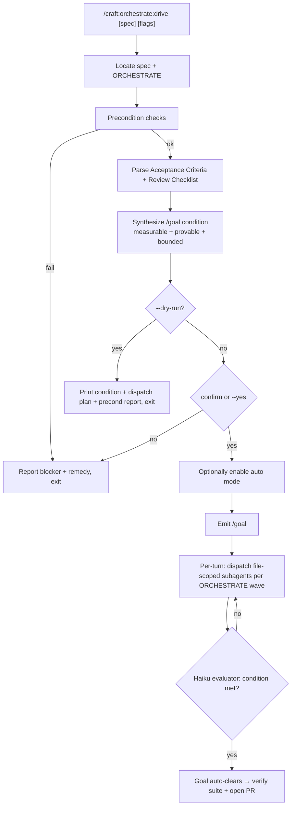

# SPEC: `/craft:orchestrate:drive` — Spec-Driven Autonomous Implementation Loop

**Status:** draft
**Created:** 2026-06-03
**From Brainstorm:** interactive session (flow-cli tok-autosync discussion → generalized)
**Author:** dt + Claude

---

## Overview

A new craft command that drives an approved SPEC to completion using
Claude Code's **built-in `/goal`** command as the turn-loop engine,
combined with auto mode and file-scoped subagent dispatch. It is the
missing *execution* step in craft's existing pipeline:

```
/brainstorm → SPEC → /craft:orchestrate:plan (worktree + ORCHESTRATE) → /craft:orchestrate:drive → PR
```

Where `/craft:orchestrate` handles free-form tasks via multi-agent
fan-out with its own monitoring, `drive` is spec-anchored: it derives a
**well-formed `/goal` completion condition** from the spec's acceptance
criteria, sets it, and lets Claude Code's native per-turn evaluator keep
working until the condition holds — then verifies and opens a PR.

---

## Primary User Story

**As a** craft user with an approved spec and an ORCHESTRATE plan,
**I want** a single command that sets up an autonomous `/goal`-driven
loop to implement the spec to completion (tests passing, criteria met),
**so that** I don't hand-prompt each turn and the end state is verified
by a fresh evaluator rather than asserted by the implementing model.

### Acceptance Criteria

- [ ] `/craft:orchestrate:drive [spec]` locates the spec (arg, or
      newest `docs/specs/SPEC-*.md`, or the one referenced by the
      worktree's `ORCHESTRATE-*.md`).
- [ ] It extracts the spec's **Acceptance Criteria** and **Review
      Checklist** and synthesizes a `/goal` condition that (a) names one
      or more measurable end states, (b) states how Claude must *prove*
      each in the transcript (since the `/goal` evaluator cannot run
      commands or read files), and (c) includes a turn/time bound.
- [ ] It surfaces the proposed condition for confirmation before
      activating (unless `--yes`).
- [ ] It checks preconditions and warns/blocks clearly: not in a
      worktree on `feature/*`; `/goal` unavailable (Claude Code
      < v2.1.139, `disableAllHooks`, or `allowManagedHooksOnly`); auto
      mode off.
- [ ] `--dry-run` prints the derived condition, the agent-dispatch plan
      from ORCHESTRATE, and the precondition report — without setting a
      goal.
- [ ] On activation it (optionally) enables auto mode and emits the
      `/goal <condition>` directive; per turn it dispatches file-scoped
      subagents per ORCHESTRATE wave.
- [ ] Documented exit paths: condition met (goal auto-clears →
      verify+PR), `--max-turns` bound hit, or user `/goal clear`.

---

## Secondary User Stories

- **As a** user without an ORCHESTRATE file, **I want** `drive` to fall
  back to deriving phases directly from the spec, so it works on a bare
  approved spec.
- **As a** cautious user, **I want** `--dry-run` and a confirm gate so I
  can audit the goal condition before any unattended turns run.
- **As a** user mid-run, **I want** the standard `/goal` status
  (`/goal` no-arg) and `/goal clear` to work normally — `drive` must not
  shadow them.

---

## Architecture



**Boundary:** `drive` is a *thin orchestration wrapper* around the native
`/goal` mechanism. It owns: spec→condition translation, precondition
gating, dispatch planning. It does NOT reimplement the turn loop or the
evaluator — those are Claude Code built-ins.

---

## API Design

Command: `/craft:orchestrate:drive [spec] [flags]`
File: `commands/orchestrate/drive.md` (auto-discovered by `_discovery.py`).

| Argument / Flag | Required | Default | Purpose |
|---|---|---|---|
| `spec` (positional) | no | newest `docs/specs/SPEC-*.md` or ORCHESTRATE-referenced | Spec to drive. |
| `--dry-run` / `-n` | no | false | Print condition + plan + precond report; no goal set. |
| `--yes` / `-y` | no | false | Skip the condition-confirm gate. |
| `--max-turns <N>` | no | 25 | Turn bound folded into the condition's stop clause. |
| `--no-auto` | no | false | Don't enable auto mode (user approves tools per turn). |
| `--agents <n>` | no | 1 | Max concurrent file-scoped subagents per turn. |
| `--condition "<text>"` | no | derived | Override the synthesized condition entirely. |

**Derived-condition template** (the command's core logic):
> `<criteria restated as end states> — prove each by showing the
> relevant command output in the transcript (e.g. test runner exit,
> git status). Do not change <stated constraints>. Or stop after
> <max-turns> turns.`

---

## Data Models

N/A — no persistent data model. Reads existing `docs/specs/SPEC-*.md`
and `ORCHESTRATE-*.md` (Markdown); produces a transient `/goal`
condition string (≤ 4000 chars, per the `/goal` limit). No new state
files.

---

## UI/UX Specifications

**Dry-run output (illustrative):**

```
╭─ /craft:orchestrate:drive (dry run) ─────────────────────────╮
│ Spec:        SPEC-tok-autosync-2026-06-03.md                 │
│ Orchestrate: ORCHESTRATE-tok-autosync.md (5 waves)           │
│ Preconds:    ✓ worktree feature/* · ✓ /goal v2.1.139+        │
│              ⚠ auto mode OFF (will enable, or pass --no-auto) │
├──────────────────────────────────────────────────────────────┤
│ Derived /goal condition:                                     │
│  "All ORCHESTRATE phases implemented and ./tests/run-all.sh  │
│   output shows the full suite passing incl. the new test     │
│   file, and source flow.plugin.zsh runs clean — prove each   │
│   by showing command output. Do not change tok sync gh.      │
│   Or stop after 25 turns."                                   │
├──────────────────────────────────────────────────────────────┤
│ Per-turn dispatch: 1 file-scoped agent, wave order lib →     │
│ tests → dispatcher → plugin → docs                           │
╰──────────────────────────────────────────────────────────────╯
```

- Reuse craft's ADHD-friendly boxed output and status glyphs.
- Honor `NO_COLOR`.
- Confirm gate defaults to **No**.
- Accessibility: every precondition line prefixed ✓ / ⚠ / ✗.

---

## Security Constraints

| Constraint | Enforcement |
|---|---|
| Never auto-enable auto mode silently | Auto-mode enablement is shown in dry-run and confirm; `--no-auto` opts out. |
| Respect hook policy | If `disableAllHooks` / `allowManagedHooksOnly` set, `/goal` is unavailable — detect and report, never attempt to bypass. |
| Bounded runs | Condition always carries a turn/time stop clause (`--max-turns`). |
| Trust gate | `/goal` requires an accepted-trust workspace; surface the requirement rather than failing silently. |
| No secret/credential handling | `drive` is workflow-only; it never reads or writes tokens. |

---

## Open Questions

1. **Name.** `/craft:orchestrate:drive` (recommended — sits beside
   `orchestrate:plan` / `orchestrate:resume`). Alternatives:
   `/craft:workflow:autopilot`, `/craft:orchestrate:goal-launch`.
   *Recommendation: `orchestrate:drive`.*
2. **Auto mode enablement** — should `drive` toggle auto mode itself, or
   only *require* it be on and instruct the user? *Recommendation:
   require + offer to enable behind the confirm gate.*
3. **Single vs multi-agent default** — default `--agents 1` (lowest
   entry cost, matches subagent-driven-development) vs scale by wave?
   *Recommendation: default 1, allow override.*
4. **Verify/PR step** — should `drive` itself open the PR on success, or
   stop at "condition met" and let the user run `/craft:code:release` /
   `gh pr create`? *Recommendation: stop at verified green + print the
   PR command; opening the PR is the user's outward-facing call.*

---

## Review Checklist

- [ ] Command frontmatter valid; `_discovery.py` picks it up; counts
      updated via `scripts/validate-counts.sh`.
- [ ] Does not shadow native `/goal`, `/goal clear`, `/goal` status.
- [ ] Precondition detection accurate (worktree, `/goal` availability,
      auto mode, trust).
- [ ] Derived condition always measurable + provable-in-transcript +
      bounded.
- [ ] `--dry-run` performs zero side effects (no goal set, no auto-mode
      change).
- [ ] Confirm gate defaults to No; `--yes` bypasses.
- [ ] Complements (does not duplicate) `/craft:orchestrate`.
- [ ] Docs mirrored to `docs/commands/`; CLAUDE.md Active Work updated.

---

## Implementation Notes

- **File:** `commands/orchestrate/drive.md` + mirror in `docs/commands/`.
- **No manual registration** — `_discovery.py` scans recursively; only a
  command-count bump (`scripts/validate-counts.sh`) is needed.
- **Pipeline placement:** document as the step after
  `/craft:orchestrate:plan`; cross-link both directions.
- **Relationship to `/craft:orchestrate`:** `orchestrate` = free-form,
  multi-agent, self-monitored; `drive` = spec-anchored, native-`/goal`
  loop, lower entry cost. State this explicitly in both command docs to
  prevent user confusion.
- **`/goal` facts to honor** (Claude Code ≥ v2.1.139): evaluator is a
  small fast model that reads only the transcript and runs no tools;
  goal auto-clears on success; condition ≤ 4000 chars; restored on
  `--resume`/`--continue` with counters reset.
- **Branch workflow:** implement on `feature/*` off craft's `dev`; this
  spec lands on `dev`. Delete any ORCHESTRATE file on merge to `dev`.

---

## History

| Date | Event |
|---|---|
| 2026-06-03 | Initial draft. Generalized from a flow-cli session exploring `/goal` + agents + ultracode; scoped as a spec-driven autonomous loop command complementing `/craft:orchestrate`. |
