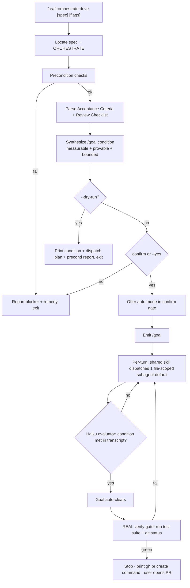
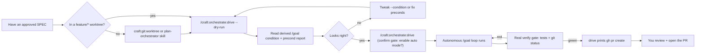

# SPEC: `/craft:orchestrate:drive` — Spec-Driven Autonomous Implementation Loop

**Status:** draft (design-revised 2026-06-03)
**Created:** 2026-06-03
**From Brainstorm:** interactive session (flow-cli tok-autosync discussion → generalized); revised via overlap-analysis brainstorm 2026-06-03
**Author:** dt + Claude

---

## Overview

A **thin** craft command that drives an approved SPEC to completion using
Claude Code's **built-in `/goal`** command as the turn-loop engine,
combined with auto mode and file-scoped subagent dispatch. It is the
missing *execution* step in craft's existing pipeline:

```
/brainstorm → SPEC → plan-orchestrator skill (optional) → /craft:orchestrate:drive → verified green → user opens PR
```

> **Note:** the former `/craft:orchestrate:plan` command is deprecated
> (→ `skills/orchestration/plan-orchestrator/`). `drive` does NOT depend
> on it: it works from a bare approved SPEC, deriving phases via the
> shared orchestration skill when no `ORCHESTRATE-*.md` exists.

Where `/craft:orchestrate` handles free-form tasks via multi-agent
fan-out with its own monitoring, `drive` is spec-anchored and uses a
fundamentally different control flow — an **iterative `/goal` turn-loop**
(work until a condition holds) rather than fan-out-and-converge. That
distinct control flow is why `drive` is a separate surface rather than a
flag on `orchestrate`. It derives a **well-formed `/goal` completion
condition** from the spec's acceptance criteria, sets it, lets Claude
Code's native per-turn evaluator iterate — then runs a **real verify
gate** (actual test suite, not transcript-asserted) and stops at
verified green, printing the PR command for the user to run.

### Division of responsibility (thin command + shared skill)

| Owned by `drive` (the command) | Owned by `skills/orchestration/*` (shared) |
|---|---|
| Spec → `/goal` condition synthesis | Parse-or-derive ORCHESTRATE phases/file-scopes |
| Precondition gating (worktree, `/goal`, auto mode, trust) | File-scoped subagent dispatch |
| Confirm gate + auto-mode offer | **Real verify pass** (test suite + git status) |
| `--dry-run` reporting | (reusable by `orchestrate --swarm` in future) |

`drive` re-specifies none of the dispatch/verify body — it calls the
shared skill. This keeps it aligned with craft's commands→skills
direction (v2.34.0) and avoids duplicating `orchestrate --swarm`.

---

## Primary User Story

**As a** craft user with an approved spec and an ORCHESTRATE plan,
**I want** a single command that sets up an autonomous `/goal`-driven
loop to implement the spec to completion (tests passing, criteria met),
**so that** I don't hand-prompt each turn and the end state is verified
by a fresh evaluator rather than asserted by the implementing model.

### Acceptance Criteria

- [ ] `/craft:orchestrate:drive [spec]` locates the spec (arg, or
      newest `docs/specs/SPEC-*.md`, or the one referenced by the
      worktree's `ORCHESTRATE-*.md`).
- [ ] Works from a **bare approved SPEC**: if no `ORCHESTRATE-*.md`
      exists, the shared orchestration skill derives phases/file-scopes
      from the spec. An ORCHESTRATE file is used when present but never
      required.
- [ ] It extracts the spec's **Acceptance Criteria** and **Review
      Checklist** and synthesizes a `/goal` condition that (a) names one
      or more measurable end states, (b) states how Claude must *prove*
      each in the transcript (since the `/goal` evaluator cannot run
      commands or read files), and (c) includes a turn/time bound.
- [ ] It surfaces the proposed condition for confirmation before
      activating (unless `--yes`); confirm gate defaults to **No**.
- [ ] It checks preconditions and warns/blocks clearly: not in a
      worktree on `feature/*`; `/goal` unavailable (Claude Code
      < v2.1.139, `disableAllHooks`, or `allowManagedHooksOnly`); auto
      mode off.
- [ ] Auto mode is **required but never enabled silently**: if off,
      `drive` offers to enable it inside the confirm gate; `--no-auto`
      opts out (per-tool approval).
- [ ] `--dry-run` prints the derived condition, the agent-dispatch plan,
      and the precondition report — with **zero side effects** (no goal
      set, no auto-mode change).
- [ ] On activation it emits the `/goal <condition>` directive; per turn
      it dispatches **one** file-scoped subagent by default (`--agents N`
      to scale), delegating dispatch to the shared skill.
- [ ] **Two-stage termination:** the `/goal` evaluator drives iteration;
      on goal-clear, `drive` runs a **real verify pass** (actual test
      suite + git status via the shared skill) as the true arbiter
      before declaring done. Guards against fabricated/stale transcript
      evidence.
- [ ] On verified green, `drive` **stops and prints the `gh pr create`
      command** — it does NOT open the PR (outward-facing = user's call).
- [ ] Documented exit paths: condition met (goal auto-clears →
      **real verify** → green handoff), `--max-turns` bound hit, or user
      `/goal clear`.

---

## Secondary User Stories

- **As a** user without an ORCHESTRATE file, **I want** `drive` to fall
  back to deriving phases directly from the spec, so it works on a bare
  approved spec.
- **As a** cautious user, **I want** `--dry-run` and a confirm gate so I
  can audit the goal condition before any unattended turns run.
- **As a** user mid-run, **I want** the standard `/goal` status
  (`/goal` no-arg) and `/goal clear` to work normally — `drive` must not
  shadow them.

---

## Architecture



**Boundary:** `drive` is a *thin orchestration wrapper*. It owns ONLY:
spec→`/goal`-condition translation, precondition gating, and the confirm
gate. It does NOT reimplement the turn loop or evaluator (Claude Code
built-ins), and it does NOT reimplement dispatch/verify — those live in
the shared `skills/orchestration/*` body that `orchestrate --swarm` can
also adopt. The `/goal` evaluator is transcript-only and therefore
advisory; the **real verify gate** is the authoritative "done" check.

---

## API Design

Command: `/craft:orchestrate:drive [spec] [flags]`
File: `commands/orchestrate/drive.md` (auto-discovered by `_discovery.py`).

| Argument / Flag | Required | Default | Purpose |
|---|---|---|---|
| `spec` (positional) | no | newest `docs/specs/SPEC-*.md` or ORCHESTRATE-referenced | Spec to drive. |
| `--dry-run` / `-n` | no | false | Print condition + plan + precond report; no goal set. |
| `--yes` / `-y` | no | false | Skip the condition-confirm gate. |
| `--max-turns <N>` | no | 25 | Turn bound folded into the condition's stop clause. |
| `--no-auto` | no | false | Don't enable auto mode (user approves tools per turn). |
| `--agents <n>` | no | 1 | Max concurrent file-scoped subagents per turn. |
| `--condition "<text>"` | no | derived | Override the synthesized condition entirely. |

**Derived-condition template** (the command's core logic):
> `<criteria restated as end states> — prove each by showing the
> relevant command output in the transcript (e.g. test runner exit,
> git status). Do not change <stated constraints>. Or stop after
> <max-turns> turns.`

---

## Data Models

N/A — no persistent data model. Reads existing `docs/specs/SPEC-*.md`
and `ORCHESTRATE-*.md` (Markdown); produces a transient `/goal`
condition string (≤ 4000 chars, per the `/goal` limit). No new state
files.

---

## UI/UX Specifications

**Dry-run output (illustrative):**

```
╭─ /craft:orchestrate:drive (dry run) ─────────────────────────╮
│ Spec:        SPEC-tok-autosync-2026-06-03.md                 │
│ Orchestrate: ORCHESTRATE-tok-autosync.md (5 waves)           │
│ Preconds:    ✓ worktree feature/* · ✓ /goal v2.1.139+        │
│              ⚠ auto mode OFF (will enable, or pass --no-auto) │
├──────────────────────────────────────────────────────────────┤
│ Derived /goal condition:                                     │
│  "All ORCHESTRATE phases implemented and ./tests/run-all.sh  │
│   output shows the full suite passing incl. the new test     │
│   file, and source flow.plugin.zsh runs clean — prove each   │
│   by showing command output. Do not change tok sync gh.      │
│   Or stop after 25 turns."                                   │
├──────────────────────────────────────────────────────────────┤
│ Per-turn dispatch: 1 file-scoped agent, wave order lib →     │
│ tests → dispatcher → plugin → docs                           │
├──────────────────────────────────────────────────────────────┤
│ On goal-clear: REAL verify gate runs ./tests/run-all.sh,     │
│ then STOPS at green and prints:  gh pr create --base dev      │
│ (drive never opens the PR itself)                            │
╰──────────────────────────────────────────────────────────────╯
```

- Reuse craft's ADHD-friendly boxed output and status glyphs.
- Honor `NO_COLOR`.
- Confirm gate defaults to **No**.
- Accessibility: every precondition line prefixed ✓ / ⚠ / ✗.

---

## Security Constraints

| Constraint | Enforcement |
|---|---|
| Never auto-enable auto mode silently | Auto-mode enablement is shown in dry-run and confirm; `--no-auto` opts out. |
| Respect hook policy | If `disableAllHooks` / `allowManagedHooksOnly` set, `/goal` is unavailable — detect and report, never attempt to bypass. |
| Bounded runs | Condition always carries a turn/time stop clause (`--max-turns`). |
| Trust gate | `/goal` requires an accepted-trust workspace; surface the requirement rather than failing silently. |
| No secret/credential handling | `drive` is workflow-only; it never reads or writes tokens. |

---

## Resolved Decisions (brainstorm 2026-06-03)

All four original open questions are now resolved:

1. **Name** → `/craft:orchestrate:drive` (sits beside
   `orchestrate:resume`; `orchestrate:plan` is deprecated).
2. **Command shape** → **separate thin command + shared skill**, not a
   flag on `orchestrate`. Rationale: the `/goal` turn-loop is a distinct
   control flow from swarm's fan-out-and-converge, and craft's
   commands→skills direction favors extracting the shared body.
3. **Termination trust** → **two-stage**: `/goal` evaluator drives
   iteration; a **real verify gate** is the authoritative arbiter. The
   transcript-only evaluator alone was insufficient (can't distinguish
   real from fabricated command output).
4. **Upstream** → **self-sufficient on a bare spec**; phase-derivation
   lives in the shared skill. Stop documenting deprecated
   `orchestrate:plan` as the upstream step.
5. **Exit boundary** → **stop at verified green**, print `gh pr create`;
   user opens the PR. No auto-publish.
6. **Auto mode** → **require + offer to enable in the confirm gate**;
   never silent; `--no-auto` opts out.
7. **Concurrency** → **default `--agents 1`**, scale with `--agents N`;
   keeps the transcript linear for the evaluator.

---

## Documentation Deliverables

`drive` ships with a full documentation surface mirroring craft's
conventions. Each artifact has a distinct audience and altitude.

| Artifact | Path | Audience | Purpose |
|---|---|---|---|
| **Command reference** | `commands/orchestrate/drive.md` | LLM + power user | Authoritative behavior, flags, MANDATORY execution steps (the command IS its doc). |
| **Site mirror** | `docs/commands/orchestrate-drive.md` | Web reader | Human-readable summary, rendered in MkDocs nav. |
| **Help page** | `docs/help/orchestrate-drive.md` (or `/craft:docs:help` output) | Stuck user | Quick "what/when/how", troubleshooting table, precondition failures + remedies. |
| **Tutorial** | `docs/tutorials/TUTORIAL-orchestrate-drive.md` | First-timer | End-to-end walkthrough: brainstorm → SPEC → drive → green → PR, on a toy spec. |
| **Cookbook recipe** | `docs/cookbook/recipes/drive-a-spec-to-green.md` | Task-focused | Copy-paste recipe: the 4 commands, dry-run first, the confirm gate, reading the verify gate. |
| **Flowchart (pipeline)** | embedded in tutorial + command doc | Visual learner | The user-journey diagram below + the Architecture mermaid. |
| **REFCARD row** | `docs/REFCARD.md` orchestrate section | Scanner | One-line entry beside `orchestrate` / `orchestrate:resume`. |
| **CHANGELOG** | `[Unreleased]` → release | Everyone | Feature entry. |
| **CLAUDE.md Active Work** | `CLAUDE.md` | Maintainer | Command count, one-line capability note. |

### User-journey flowchart (for tutorial + help page)



### Documentation principles for this command

- **Lead the tutorial with `--dry-run`.** The first thing a new user
  should learn is to preview the derived condition before any
  autonomous turn runs. Safety-first framing.
- **Help page must enumerate every precondition failure** (no worktree,
  `/goal` unavailable by version/hook-policy, auto mode off, untrusted
  workspace) with its exact remedy — these are the top support questions
  for an autonomous command.
- **Cross-link the swarm distinction in both directions.** `drive`'s doc
  links to `orchestrate --swarm` and vice versa, each stating when to
  pick which (turn-loop vs fan-out). Prevents the "two commands run an
  ORCHESTRATE file — which do I use?" confusion.
- **Never document auto-opening a PR.** All examples end at the green
  handoff + printed `gh pr create`, reinforcing the human publish gate.

## Review Checklist

- [ ] Command frontmatter valid; `_discovery.py` picks it up; counts
      updated via `scripts/validate-counts.sh`.
- [ ] Does not shadow native `/goal`, `/goal clear`, `/goal` status.
- [ ] Precondition detection accurate (worktree, `/goal` availability,
      auto mode, trust).
- [ ] Derived condition always measurable + provable-in-transcript +
      bounded.
- [ ] `--dry-run` performs zero side effects (no goal set, no auto-mode
      change).
- [ ] Confirm gate defaults to No; `--yes` bypasses.
- [ ] Complements (does not duplicate) `/craft:orchestrate`; shared
      dispatch/verify body lives in `skills/orchestration/*`.
- [ ] Two-stage termination: real verify gate runs after goal-clear and
      is the authoritative "done".
- [ ] Stops at verified green + prints `gh pr create`; never auto-opens
      a PR.
- [ ] Works from a bare spec (no ORCHESTRATE required).
- [ ] **Documentation deliverables complete** (per table above): command
      ref, site mirror, help page, tutorial, cookbook recipe, REFCARD
      row, both flowcharts, CHANGELOG, CLAUDE.md.
- [ ] Help page enumerates every precondition failure + remedy.
- [ ] Swarm-vs-drive distinction cross-linked both directions.
- [ ] No doc example shows auto-opening a PR.

---

## Implementation Notes

- **Files:** thin command `commands/orchestrate/drive.md` + mirror in
  `docs/commands/`; shared body in `skills/orchestration/*` (parse/derive
  ORCHESTRATE, file-scoped dispatch, real verify pass).
- **No manual registration** — `_discovery.py` scans recursively; only a
  command-count bump (`scripts/validate-counts.sh`) is needed. Skill
  count bump if a new skill dir is added.
- **Pipeline placement:** document as the step after the
  `plan-orchestrator` skill (NOT the deprecated `orchestrate:plan`);
  cross-link both directions.
- **Relationship to `/craft:orchestrate`:** `orchestrate` = free-form,
  multi-agent, self-monitored, fan-out-and-converge; `drive` =
  spec-anchored, native-`/goal` turn-loop, real-verify arbiter, lower
  entry cost. State this explicitly in both command docs to prevent user
  confusion.
- **Shared skill reuse:** design the dispatch/verify skill so
  `orchestrate --swarm` can adopt it later, removing the current
  duplication. Not required for v1 of `drive`, but the boundary should
  not preclude it.
- **`/goal` facts to honor** (Claude Code ≥ v2.1.139): evaluator is a
  small fast model that reads only the transcript and runs no tools;
  goal auto-clears on success; condition ≤ 4000 chars; restored on
  `--resume`/`--continue` with counters reset.
- **Branch workflow:** implement on `feature/*` off craft's `dev`; this
  spec lands on `dev`. Delete any ORCHESTRATE file on merge to `dev`.

---

## History

| Date | Event |
|---|---|
| 2026-06-03 | Initial draft. Generalized from a flow-cli session exploring `/goal` + agents + ultracode; scoped as a spec-driven autonomous loop command complementing `/craft:orchestrate`. |
| 2026-06-03 | Design-revised after overlap-analysis brainstorm. Resolved all open questions: thin command + shared `skills/orchestration/*`; two-stage termination with a real verify gate; self-sufficient on a bare spec; stop at verified green (no auto-PR); require+offer auto mode; default `--agents 1`. Removed deprecated `orchestrate:plan` from the pipeline. Added Documentation Deliverables section + user-journey flowchart. |
