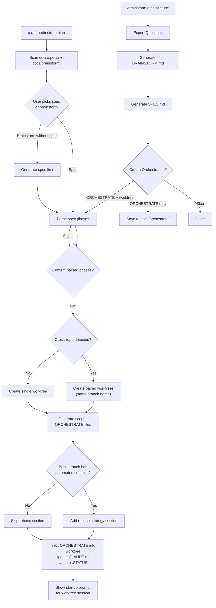
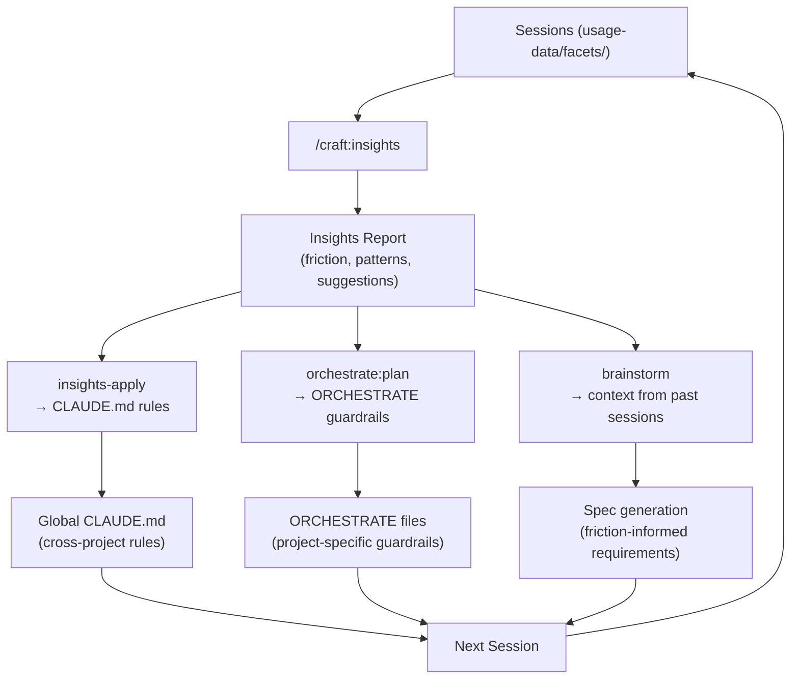

# SPEC: Orchestrate-Worktree Pipeline & Doc Revisions

> **Date:** 2026-02-15
> **Branch:** `feature/orchestrate-pipeline` (from `dev`)
> **Status:** Draft
> **Version Target:** v2.20.0
> **From Brainstorm:** N/A (direct user request during homebrew refactor session)

## Summary

Four connected improvements: (1) revise docs/guides/refcards to clarify what orchestrate, swarm, and ORCHESTRATE files actually do, (2) add an interactive pipeline from brainstorm spec completion to ORCHESTRATE file creation and worktree setup, (3) clarify swarm + worktree integration with practical examples, (4) integrate insights workflow with brainstorm/orchestrate pipeline and document the full insights lifecycle.

## Problem Statement

1. **Docs are unclear about recent additions.** The REFCARD mentions `--swarm` and ORCHESTRATE files but doesn't explain what they do or when to use them. A user reading the docs can't distinguish between `--swarm` (agent-per-worktree parallelism) and manual worktree creation (`/craft:git:worktree`).

2. **No pipeline from spec to worktree.** After `/brainstorm save` creates a spec, the user must manually: (a) decide on an ORCHESTRATE file, (b) create a worktree, (c) copy the ORCHESTRATE file into it, (d) set up cross-repo references. This should be interactive.

3. **Swarm + worktree relationship is confusing.** Swarm creates temporary agent worktrees (auto-managed, auto-cleaned). Manual worktrees are long-lived development environments. The docs don't distinguish these clearly.

4. **Insights workflow is disconnected.** The `insights-apply` skill exists but: (a) there's no `/insights` command to generate reports, (b) insights aren't integrated with brainstorm or orchestrate, (c) the insights workflow isn't documented in REFCARD or getting-started, (d) session friction data (wrong-approach: 21 events, 44% of all friction) could feed back into ORCHESTRATE file generation to add context-setting sections that prevent common errors.

## Decisions (from 16 expert questions)

| # | Decision | Choice | Rationale |
|---|----------|--------|-----------|
| 1 | Standalone command? | Both pipeline + standalone | `/craft:orchestrate:plan` for existing specs + brainstorm integration |
| 2 | Cross-repo branch names | Same name enforced | `feature/X` in both repos — easy to track |
| 3 | Auto-update .STATUS? | Yes, always | Add worktree entry to .STATUS on creation |
| 4 | ORCHESTRATE location (no worktree) | `docs/orchestrate/` | Dedicated directory, not repo root |
| 5 | Swarm + ORCHESTRATE integration | Read ORCHESTRATE if present | Swarm maps agents to phases from ORCHESTRATE |
| 6 | Session instruction detail | Full (like homebrew-tap) | Step-by-step, startup prompt, commit strategy, verification |
| 7 | Plugin scope | Both plugins | Modify workflow/brainstorm + craft/orchestrate + craft/worktree |
| 8 | Standalone command name | `/craft:orchestrate:plan` | Emphasizes planning aspect |
| 9 | Rebase strategy | Auto-detect base branch activity | Check for recent automated commits on base branch |
| 10 | Mermaid diagram | Full end-to-end in REFCARD + tutorial | brainstorm → spec → ORCHESTRATE → worktree → implement → PR |
| 11 | Unclear phase parsing | Interactive | Show parsed phases, ask user to confirm/adjust |
| 12 | Resume from existing spec | Yes via `/craft:orchestrate:plan` | Scan `docs/specs/` + accept path argument |
| 13 | Resume section in ORCHESTRATE | Yes with startup prompt | Copy-paste prompt + CLAUDE.md pointer + session notes |
| 14 | Cross-repo references | Bidirectional | Each ORCHESTRATE points to companion worktree + its ORCHESTRATE |
| 15 | Discovery scope | Both specs + brainstorms | Scan SPEC-*.md and BRAINSTORM-*.md, offer spec gen from brainstorm |
| 16 | ORCHESTRATE git tracking | Committed in worktree, gitignored in main | Only exist in feature worktrees, cleaned on merge |

## Requirements

### Increment 1: Doc Revisions (on dev — no code changes)

Update existing docs to clarify orchestrate/swarm/worktree integration:

- [ ] 1.1 **REFCARD.md**: Add "Orchestrate + Worktree Pipeline" section with Mermaid diagram showing full flow
- [ ] 1.2 **REFCARD.md**: Clarify `--swarm` vs manual worktrees with comparison table
- [ ] 1.3 **getting-started.md**: Add "Complex Feature Workflow" section showing the pipeline
- [ ] 1.4 **orchestrate.md (docs/)**: Add "When to Use What" comparison table
- [ ] 1.5 **REFCARD-GIT-WORKTREE.md**: Add "Worktree Types" section (manual vs swarm vs cross-repo)
- [ ] 1.6 **interactive-orchestration.md**: Add practical end-to-end example
- [ ] 1.7 **TUTORIAL-worktree-setup.md**: Add "After Brainstorm" section showing ORCHESTRATE file creation

### Increment 2: Spec → ORCHESTRATE → Worktree Pipeline (feature branch)

#### 2a: `/craft:orchestrate:plan` standalone command

- [ ] 2.1 Create `commands/orchestrate/plan.md` with frontmatter and execution behavior
- [ ] 2.2 Scan `docs/specs/` for SPEC-*.md files, show list with dates and status
- [ ] 2.3 Also scan for BRAINSTORM-*.md without matching specs, offer to generate spec first
- [ ] 2.4 Accept path argument: `/craft:orchestrate:plan docs/specs/SPEC-auth.md`
- [ ] 2.5 Parse spec for phases/increments (interactive: show parsed phases, let user adjust)
- [ ] 2.6 Generate ORCHESTRATE file with full session instructions
- [ ] 2.7 Detect cross-repo work (paths referencing `~/projects/dev-tools/<other-repo>/`)
- [ ] 2.8 For cross-repo: enforce same branch name, create paired worktrees with bidirectional references
- [ ] 2.9 Auto-detect rebase strategy: check if base branch has recent automated commits
- [ ] 2.10 Auto-update `.STATUS` in main repo with worktree entry
- [ ] 2.11 Add ORCHESTRATE to `.gitignore` in main repo (committed only in worktrees)

#### 2b: Brainstorm integration (workflow plugin)

- [ ] 2.12 Add Step 6 to brainstorm skill: "Create Orchestration?" prompt after spec capture
- [ ] 2.13 When "ORCHESTRATE + worktree" selected, invoke `/craft:orchestrate:plan` with spec path
- [ ] 2.14 When "ORCHESTRATE only" selected, save to `docs/orchestrate/` directory
- [ ] 2.15 Update brainstorm SKILL.md documentation with new Step 6

### Increment 3: Swarm + Worktree Clarity (feature branch)

- [ ] 3.1 Add "Worktree Types" taxonomy to `commands/orchestrate.md`
- [ ] 3.2 Update swarm mode to read ORCHESTRATE file if present (map agents to phases)
- [ ] 3.3 Add `--swarm` practical example with ORCHESTRATE agent-to-file mapping
- [ ] 3.4 Document when to use swarm vs manual worktrees vs cross-repo worktrees
- [ ] 3.5 Add swarm dry-run example showing worktree creation plan

### Increment 4: Insights Workflow Integration (feature branch)

#### 4a: `/craft:insights` command (NEW — currently missing)

- [ ] 4.1 Create `commands/workflow/insights.md` — generates insights report from `~/.claude/usage-data/facets/`
- [ ] 4.2 Aggregate session facets: friction patterns, goal categories, outcomes, satisfaction
- [ ] 4.3 Output formatted report with sections: friction summary, top patterns, CLAUDE.md suggestions
- [ ] 4.4 Support `--format html|terminal|json` (terminal default, html saves to usage-data/)
- [ ] 4.5 Add `--since <days>` filter (default: 30 days)

#### 4b: Insights → ORCHESTRATE integration

- [ ] 4.6 When generating ORCHESTRATE files (Increment 2), check insights for project-specific friction
- [ ] 4.7 Auto-add "Context Setting" section to ORCHESTRATE based on top friction patterns:
  - Wrong branch/directory → add explicit CWD verification step
  - Wrong approach → add "Read ORCHESTRATE and spec BEFORE acting" rule
  - Worktree file misplacement → add "All files in THIS worktree only" warning
- [ ] 4.8 Add "Friction Prevention" section to generated ORCHESTRATE files with project-specific guardrails

#### 4c: Insights → Brainstorm integration

- [ ] 4.9 When brainstorm starts, check insights for relevant session patterns on the same topic
- [ ] 4.10 Show "Previous session insights" summary if related sessions exist (friction, outcomes)
- [ ] 4.11 Factor friction patterns into spec generation (e.g., if testing friction is high, add explicit test steps)

#### 4d: Documentation

- [ ] 4.12 Add `/craft:insights` to REFCARD.md workflow commands section
- [ ] 4.13 Add "Insights Lifecycle" section to getting-started.md: generate → review → apply → orchestrate
- [ ] 4.14 Update insights-improvements-guide.md with `/craft:insights` command and integration flow
- [ ] 4.15 Add Mermaid diagram: session data → insights → CLAUDE.md rules + ORCHESTRATE guardrails
- [ ] 4.16 Document insights-apply integration with brainstorm pipeline in TUTORIAL-insights-workflow.md

#### 4e: Cross-command integration

- [ ] 4.17 Update `/craft:do` routing to recognize insights-related keywords → route to `/craft:insights`
- [ ] 4.18 Add `/craft:insights` to `/craft:hub` discovery
- [ ] 4.19 Add insights summary to `/craft:check --context` output (friction count, top pattern)

## Design

### Pipeline Flow



### AskUserQuestion: Create Orchestration? (Step 6 of brainstorm)

```json
{
  "questions": [{
    "question": "Create orchestration infrastructure for this spec?",
    "header": "Orchestrate",
    "multiSelect": false,
    "options": [
      {
        "label": "ORCHESTRATE + worktree (Recommended)",
        "description": "Generate ORCHESTRATE file, create git worktree, update .STATUS and CLAUDE.md."
      },
      {
        "label": "ORCHESTRATE only",
        "description": "Generate ORCHESTRATE file to docs/orchestrate/ without creating a worktree."
      },
      {
        "label": "Skip",
        "description": "Keep spec only, set up orchestration later with /craft:orchestrate:plan."
      }
    ]
  }]
}
```

### Cross-Repo Detection & Paired Worktrees

When the spec references paths in `~/projects/dev-tools/<other-repo>/`:

```json
{
  "questions": [{
    "question": "Spec touches multiple repos. Create paired worktrees?",
    "header": "Cross-Repo",
    "multiSelect": false,
    "options": [
      {
        "label": "Paired worktrees (Recommended)",
        "description": "Same branch name in each repo, scoped ORCHESTRATE files, bidirectional references."
      },
      {
        "label": "Primary repo only",
        "description": "Create worktree only in the current repo."
      },
      {
        "label": "Skip worktrees",
        "description": "Just create ORCHESTRATE files, no worktrees."
      }
    ]
  }]
}
```

**Branch name enforcement:** Cross-repo worktrees MUST use the same branch name (e.g., `feature/homebrew-refactor` in both craft and homebrew-tap). This is enforced, not suggested.

### Rebase Strategy Auto-Detection

```python
def needs_rebase_strategy(repo_path, base_branch):
    """Check if base branch receives automated commits."""
    # Count commits in last 30 days by bots/CI
    recent = git_log(base_branch, since="30 days ago")
    automated_patterns = ["update to v", "bump version", "auto-merge", "bot"]
    automated_count = sum(1 for c in recent if any(p in c.lower() for p in automated_patterns))

    # If >5 automated commits in 30 days, add rebase section
    return automated_count > 5
```

If detected, the ORCHESTRATE file gets a "Rebase Strategy" section with:

- Pre-session rebase commands
- Conflict resolution rules (CI owns version/SHA, feature owns structure)
- "Never drift more than a few days" rule

### ORCHESTRATE File Generation

Parse spec for phases, generate with full session instructions:

**Template sections:**

1. Header (branch, base, worktree, companion, spec)
2. Objective (from spec summary)
3. Phase Overview table (from spec increments)
4. Phase details with checklists (from spec tasks)
5. Codified patterns (if applicable)
6. Acceptance criteria (from spec)
7. Rebase strategy (if auto-detected)
8. Session instructions with:
   - Context (what repo, what phases, where companion lives)
   - Startup prompt (copy-paste ready)
   - Phase-by-phase step-by-step instructions
   - Commit strategy
   - Verification commands
9. How to Resume section
10. Companion worktree reference (if cross-repo)

### `/craft:orchestrate:plan` Standalone Command

```bash
# No arguments: scan and discover
/craft:orchestrate:plan
# Shows: recent specs + brainstorms, user picks one

# With spec path
/craft:orchestrate:plan docs/specs/SPEC-auth-2026-02-15.md
# Parses spec, generates ORCHESTRATE + worktree

# With brainstorm (no matching spec)
/craft:orchestrate:plan docs/brainstorm/BRAINSTORM-auth-2026-02-15.md
# Offers to generate spec first, then ORCHESTRATE + worktree
```

### Worktree Types Taxonomy

| Type | Created By | Lifetime | Branch Pattern | Cleanup | ORCHESTRATE |
|------|-----------|----------|---------------|---------|-------------|
| **Manual** | `/craft:git:worktree create` | Long-lived | `feature/*` | `/craft:git:worktree clean` | Optional |
| **Pipeline** | `/craft:orchestrate:plan` or brainstorm pipeline | Long-lived | `feature/*` | Manual | Always (auto-generated) |
| **Swarm** | `/craft:orchestrate --swarm` | Short-lived | `swarm-*` | Auto-cleaned | Reads existing |
| **Cross-Repo** | Pipeline (multi-repo spec) | Long-lived | `feature/*` (same name) | Manual per-repo | Scoped per-repo |

### Swarm + ORCHESTRATE Integration

When `--swarm` is used and an ORCHESTRATE file exists:

```
1. Read ORCHESTRATE file phases
2. Map agents to phases:
   - Each phase → one swarm agent
   - File scope from phase's "Key files" section
3. Create swarm worktrees per agent/phase
4. Launch agents with phase-specific instructions
5. Converge and merge
```

### Insights Lifecycle Flow



### Insights → ORCHESTRATE Friction Prevention

When generating ORCHESTRATE files, query insights facets for the current project:

```python
def get_friction_guardrails(project_path, facets_dir):
    """Extract project-relevant friction patterns for ORCHESTRATE."""
    project_name = os.path.basename(project_path)
    guardrails = []

    for facet in load_facets(facets_dir):
        friction = facet.get('friction_counts', {})

        if friction.get('wrong_approach', 0) > 0:
            guardrails.append({
                'type': 'context_verification',
                'rule': 'Read ORCHESTRATE + spec BEFORE any action',
                'source': f"{friction['wrong_approach']} wrong-approach events"
            })

        if friction.get('buggy_code', 0) > 0:
            guardrails.append({
                'type': 'testing',
                'rule': 'Run tests after EACH phase, not just at the end',
                'source': f"{friction['buggy_code']} buggy-code events"
            })

    return deduplicate(guardrails)
```

Generated ORCHESTRATE "Friction Prevention" section example:

```markdown
## Friction Prevention (from insights)

Based on 82 analyzed sessions (21 wrong-approach events):

- **Context first**: Read this ORCHESTRATE file and the spec BEFORE starting work
- **Verify location**: Confirm CWD is the worktree, not the main repo
- **No autonomous starts**: After creating worktree, STOP and confirm before coding
- **Test per phase**: Run verification after each phase, not just at the end
```

### `/craft:insights` Command Design

```bash
# Terminal report (default)
/craft:insights
# Shows: friction summary, top patterns, CLAUDE.md suggestions

# HTML report
/craft:insights --format html
# Saves to ~/.claude/usage-data/report.html

# Recent only
/craft:insights --since 7
# Last 7 days of sessions

# JSON for automation
/craft:insights --format json
# Machine-readable output
```

Output format:

```
┌───────────────────────────────────────────────────────────────┐
│ INSIGHTS REPORT (82 sessions, last 30 days)                   │
├───────────────────────────────────────────────────────────────┤
│                                                               │
│ Outcomes:                                                     │
│   ✅ Fully achieved:    54 (66%)                               │
│   ⚠️  Mostly achieved:   16 (20%)                               │
│   ❌ Not achieved:       3 (4%)                                │
│                                                               │
│ Top Friction Patterns:                                        │
│   1. wrong_approach     21 events (44%)                       │
│   2. buggy_code         13 events (27%)                       │
│   3. tool_limitation     7 events (15%)                       │
│                                                               │
│ CLAUDE.md Suggestions:  4 pending                             │
│                                                               │
├───────────────────────────────────────────────────────────────┤
│ Next: /craft:insights:apply  → Apply suggestions to CLAUDE.md │
│       /craft:orchestrate:plan → Generate guardrails in ORCH   │
└───────────────────────────────────────────────────────────────┘
```

### Git Tracking

- **Main repo**: Add `ORCHESTRATE-*.md` to `.gitignore`
- **Worktrees**: ORCHESTRATE files are committed (they're on feature branches)
- **On merge**: ORCHESTRATE files don't reach `dev`/`main` (they're feature-branch artifacts)

## Key Files

| File | Change | Increment |
|------|--------|-----------|
| `docs/REFCARD.md` | Add pipeline section + Mermaid diagram, clarify swarm | 1 |
| `docs/guide/getting-started.md` | Add "Complex Feature Workflow" section | 1 |
| `docs/guide/orchestrator.md` | Add "When to Use What" table | 1 |
| `docs/reference/REFCARD-GIT-WORKTREE.md` | Add "Worktree Types" section | 1 |
| `docs/tutorials/interactive-orchestration.md` | Add end-to-end example | 1 |
| `docs/tutorials/TUTORIAL-worktree-setup.md` | Add "After Brainstorm" section | 1 |
| `commands/orchestrate/plan.md` | **NEW** — standalone command | 2 |
| `commands/orchestrate.md` | Add worktree types, update swarm section | 3 |
| `commands/workflow/insights.md` | **NEW** — insights report command | 4 |
| `skills/insights-apply/SKILL.md` | Update with `/craft:insights` integration | 4 |
| `skills/workflow/brainstorm/SKILL.md` (workflow plugin) | Add Step 6 + insights context | 2, 4 |
| `commands/do.md` | Add insights routing | 4 |
| `commands/hub.md` | Add insights to discovery | 4 |
| `commands/check.md` | Add insights to --context | 4 |
| `.gitignore` | Add `ORCHESTRATE-*.md` | 2 |

## Acceptance Criteria

- [ ] REFCARD explains the full pipeline with Mermaid diagram (end-to-end)
- [ ] "When to use what" is clear: swarm vs manual worktree vs pipeline vs cross-repo
- [ ] After `/brainstorm save`, user is offered ORCHESTRATE + worktree creation
- [ ] `/craft:orchestrate:plan` discovers specs and brainstorms, generates ORCHESTRATE + worktree
- [ ] Cross-repo specs auto-detect, enforce same branch name, create paired worktrees
- [ ] Generated ORCHESTRATE files have full session instructions (startup prompt, step-by-step, commit strategy)
- [ ] ORCHESTRATE files include rebase strategy when base branch has automated updates
- [ ] .STATUS auto-updated with worktree entry on creation
- [ ] CLAUDE.md in worktree auto-references ORCHESTRATE file
- [ ] Swarm mode reads ORCHESTRATE file and maps agents to phases
- [ ] ORCHESTRATE files committed in worktrees, gitignored in main
- [ ] Bidirectional cross-references in paired worktree ORCHESTRATE files
- [ ] `/craft:insights` command generates report from facets data (terminal + html + json)
- [ ] ORCHESTRATE files include "Friction Prevention" section from insights data
- [ ] Brainstorm shows relevant past session patterns when starting on a known topic
- [ ] `/craft:insights` discoverable via `/craft:hub` and routable via `/craft:do`
- [ ] `/craft:check --context` includes insights friction summary
- [ ] Insights lifecycle documented: session → facets → report → CLAUDE.md + ORCHESTRATE + brainstorm

## Implementation Notes

- Increment 1 (doc revisions) can land on `dev` directly — no code changes, only .md files
- Increments 2-4 need feature branch `feature/orchestrate-pipeline` since they modify commands/skills
- Increment 4 is independent of 2-3 and can be developed in parallel
- The brainstorm skill lives in the `workflow` plugin (`~/.claude/plugins/workflow/`), not in craft
- Keep ORCHESTRATE generation simple — parse markdown headers and checkbox lists, interactive confirmation
- Cross-repo detection: regex for `~/projects/dev-tools/<name>/` paths in spec files
- `.STATUS` update format matches existing worktree table pattern

## Review Checklist

- [ ] All doc links valid
- [ ] Examples are copy-pasteable
- [ ] No duplication between REFCARD and guides
- [ ] Worktree types table is consistent across all docs
- [ ] Pipeline flow matches actual implementation
- [ ] Mermaid diagram renders correctly

## History

| Date | Change |
|------|--------|
| 2026-02-15 | Initial spec — 16 expert questions resolved, all decisions captured |
| 2026-02-15 | Added Increment 4: Insights workflow integration (from insights analysis of 82 sessions) |
