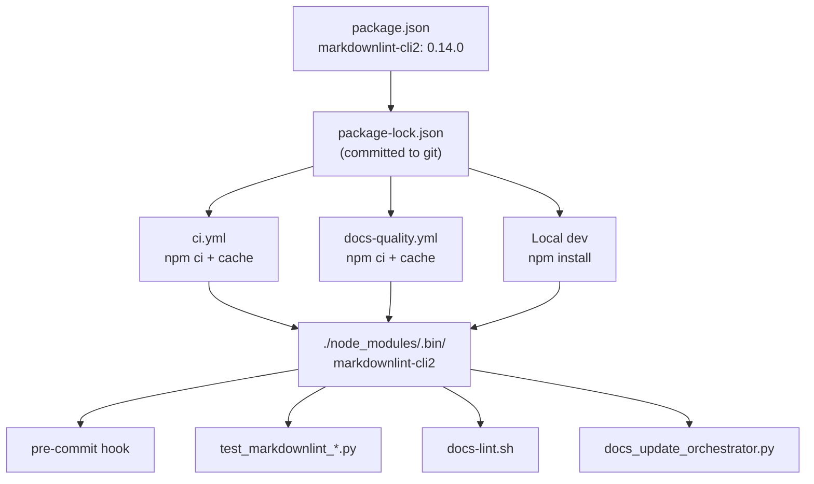

# SPEC: Pin markdownlint-cli2 in CI

**Status:** draft
**Created:** 2026-02-26
**From Brainstorm:** BRAINSTORM-pin-markdownlint-ci-2026-02-26.md

---

## Overview

Pin `markdownlint-cli2` as an exact-version devDependency, commit `package-lock.json`, and update all 10 files that invoke markdownlint to use the local install instead of `npx -y` (which downloads from npm every time). This eliminates CI flakiness caused by npm registry HTTP 403 rate-limiting on GitHub Actions runners.

---

## Primary User Story

**As a** craft plugin maintainer pushing code to CI,
**I want** markdownlint to always resolve from a local pinned install,
**so that** CI never fails due to npm registry transient errors.

### Acceptance Criteria

- [ ] `package.json` pins `markdownlint-cli2` to exact `0.14.0`
- [ ] `package-lock.json` committed to git
- [ ] `npm ci` used in both `ci.yml` and `docs-quality.yml`
- [ ] `actions/setup-node` with `cache: 'npm'` in both workflows
- [ ] All `npx -y markdownlint-cli2` calls replaced with `npx markdownlint-cli2` (no -y)
- [ ] `scripts/docs-lint.sh` checks local `./node_modules/.bin/` first
- [ ] Pre-commit hook uses local install (no -y flag)
- [ ] All existing tests pass after changes
- [ ] CI runs without npm 403 errors (verify with 2+ consecutive runs)

---

## Secondary User Stories

**As a** developer running tests locally, **I want** markdownlint tests to use my local install, **so that** they don't fail when my network is unreliable.

**As a** CI pipeline operator, **I want** deterministic npm installs via `npm ci`, **so that** builds are reproducible and faster.

---

## Architecture

### Dependency Resolution Flow



### Binary Resolution Priority Chain

Every system that invokes markdownlint follows this resolution order:

```
1. ./node_modules/.bin/markdownlint-cli2  (local install via npm ci/install)
2. $(which markdownlint-cli2)             (global install, if present)
3. npx markdownlint-cli2                  (download fallback -- LAST RESORT)
```

The key change: removing `-y` from `npx` calls. The `-y` flag means "auto-download without prompting." Without it, `npx` checks `./node_modules/.bin/` first (the local install from `npm ci`), then global, and only prompts if nothing is found.

### How markdownlint is currently invoked (before)

| System | Invocation | Problem |
|--------|-----------|---------|
| CI docs-quality | `npm install --save-dev markdownlint-cli2` then `npx markdownlint-cli2` | Installs from scratch every run, no cache |
| CI main (ci.yml) | No Node.js setup -- tests use `npx -y` | Downloads on every test run |
| Pre-commit hook | `npx -y markdownlint-cli2` | Downloads if not cached by npx |
| docs-lint.sh | Global check, fallback to `npx markdownlint-cli2` | Skips local install |
| Tests (28 calls) | `["npx", "-y", "markdownlint-cli2", ...]` | Each test invocation may download |
| docs_update_orchestrator.py | `["npx", "markdownlint-cli2", ...]` | Already no -y (good) |

### How markdownlint will be invoked (after)

| System | Invocation | Benefit |
|--------|-----------|---------|
| CI docs-quality | `npm ci` (cached) then `npx markdownlint-cli2` | Deterministic, cached, no registry dependency |
| CI main (ci.yml) | `npm ci` (cached) then tests use `npx markdownlint-cli2` | Same binary as local dev |
| Pre-commit hook | `npx markdownlint-cli2` (finds local) | No download, instant resolution |
| docs-lint.sh | `./node_modules/.bin/markdownlint-cli2` first | Direct path, zero lookup overhead |
| Tests (28 calls) | `["npx", "markdownlint-cli2", ...]` | Uses local install, no network |
| docs_update_orchestrator.py | `["npx", "markdownlint-cli2", ...]` | Unchanged (already correct) |

### Pre-commit vs npm: Two Independent Systems

```
Pre-commit ecosystem:          npm ecosystem:
.pre-commit-config.yaml        package.json
  rev: v0.14.0                   "0.14.0"
  (manages own virtualenv)       (npm ci -> node_modules/)
  (runs on git commit)           (used by CI, tests, scripts)
```

These are deliberately independent. Pre-commit downloads its own copy of markdownlint-cli2 into `~/.cache/pre-commit/`. The npm install goes into `./node_modules/`. Both are pinned to v0.14.0 but installed separately. This is correct -- pre-commit's isolation model expects this.

---

## API Design

N/A -- No API changes. This is an infrastructure/tooling change.

---

## Data Models

N/A -- No data model changes.

---

## Dependencies

| Dependency | Version | Purpose |
|------------|---------|---------|
| `markdownlint-cli2` | `0.14.0` (exact) | Markdown linting CLI |
| `markdown-link-check` | `^3.12.2` (existing) | Link validation |
| `actions/setup-node@v4` | Latest | CI Node.js setup with npm cache |

### Why exact pinning

Semver caret ranges (`^0.14.0`) can resolve to any `0.14.x` or even `0.15.x` for pre-1.0 packages. This means:

- Different CI runs could use different versions
- A minor update could change linting behavior, causing surprise failures
- Debugging becomes harder ("it passed yesterday, what changed?")

Exact pinning (`0.14.0`) ensures every environment uses the identical binary. Updates are intentional -- bump the version in `package.json`, regenerate `package-lock.json`, verify, commit.

### Why `npm ci` over `npm install`

| Aspect | `npm install` | `npm ci` |
|--------|--------------|----------|
| Speed | Slower (resolves ranges) | 2-3x faster (reads lockfile directly) |
| Determinism | May resolve differently | Exact lockfile reproduction |
| Lockfile | May update it | Fails if out of sync (good!) |
| node_modules | Merges with existing | Deletes and reinstalls (clean) |
| CI suitability | Acceptable | Best practice |

`npm ci` requires `package-lock.json` in git. This is why committing the lockfile is a prerequisite.

---

## UI/UX Specifications

N/A -- CLI/CI tooling only. No user-facing UI changes.

**Developer experience improvement:** After this change, running `npm install` once locally means all markdownlint invocations (tests, hooks, scripts) work offline. Previously, `npx -y` could fail without network access.

---

## Security Constraints

| Constraint | Enforcement |
|------------|-------------|
| Lockfile integrity | `npm ci` fails if lockfile doesn't match package.json |
| No arbitrary downloads in CI | Remove all `npx -y` (auto-download) from CI paths |
| Pinned version | Exact `0.14.0` prevents supply chain drift |
| Dependency audit | `npm audit` can verify known vulnerabilities in locked deps |

### Supply chain considerations

- **Before:** Every CI run downloads whatever `^0.14.0` resolves to at that moment. A compromised npm publish could affect CI without any code change.
- **After:** CI uses the exact version locked in `package-lock.json`. A supply chain attack would require modifying the lockfile (visible in PR diff) or compromising the specific locked version (unlikely for an already-published version).

---

## Open Questions

1. **Is `package-lock.json` in `.gitignore`?** -- Need to check and remove if so. (Initial investigation shows `.gitignore` has `node_modules/` but NOT `package-lock.json`, so lockfile should be committable.)
2. **Pre-commit isolation** -- `.pre-commit-config.yaml` manages its own copy of markdownlint-cli2 (rev: v0.14.0). This is independent and fine -- pre-commit's virtualenv is separate from node_modules. No changes needed to `.pre-commit-config.yaml`.

---

## Review Checklist

- [ ] `package.json` version is exact `0.14.0` (no caret/tilde)
- [ ] `package-lock.json` committed and not in `.gitignore`
- [ ] `ci.yml` has `setup-node` with `cache: 'npm'` and `npm ci`
- [ ] `docs-quality.yml` uses `npm ci` instead of `npm install --save-dev`
- [ ] Zero occurrences of `npx -y markdownlint-cli2` in codebase
- [ ] `docs-lint.sh` checks `./node_modules/.bin/` first
- [ ] All 112 tests still pass
- [ ] CI green on 2+ consecutive runs (no flakes)

---

## Implementation Notes

### File Change Summary

| File | Change |
|------|--------|
| `package.json` | Pin `"0.14.0"` (remove `^`) |
| `package-lock.json` | Commit to git |
| `.gitignore` | Remove `package-lock.json` if present |
| `.github/workflows/ci.yml` | Add Node.js setup + `npm ci` + cache |
| `.github/workflows/docs-quality.yml` | Replace `npm install` with `npm ci` + cache |
| `scripts/hooks/pre-commit-markdownlint.sh` | Remove `-y` from 3 `npx` calls |
| `scripts/docs-lint.sh` | Add local `./node_modules/.bin/` check first |
| `tests/test_markdownlint_list_spacing_unit.py` | Remove `-y` from 14 calls |
| `tests/test_markdownlint_list_spacing_e2e.py` | Remove `-y` from 10 calls |
| `tests/test_markdownlint_list_spacing_validation.py` | Remove `-y` from 4 calls |
| `utils/docs_update_orchestrator.py` | Remove `-y` from 1 call |

### Increments

| # | Deliverable | Effort | Risk |
|---|-------------|--------|------|
| 1 | Pin version + commit lockfile + update .gitignore | 10 min | Low |
| 2 | Update CI workflows (ci.yml + docs-quality.yml) | 15 min | Low |
| 3 | Update hook + script + utils | 10 min | Low |
| 4 | Update test files (28+ calls) | 15 min | Low |
| 5 | Verify: full test suite + CI run | 10 min | Low |

**Total: ~60 min (1 session)**

---

## History

| Date | Event |
|------|-------|
| 2026-02-26 | v2.28.0 release hit npm 403 flake in CI |
| 2026-02-26 | Brainstorm: deep feature analysis with 10 questions |
| 2026-02-26 | Spec created from brainstorm |
