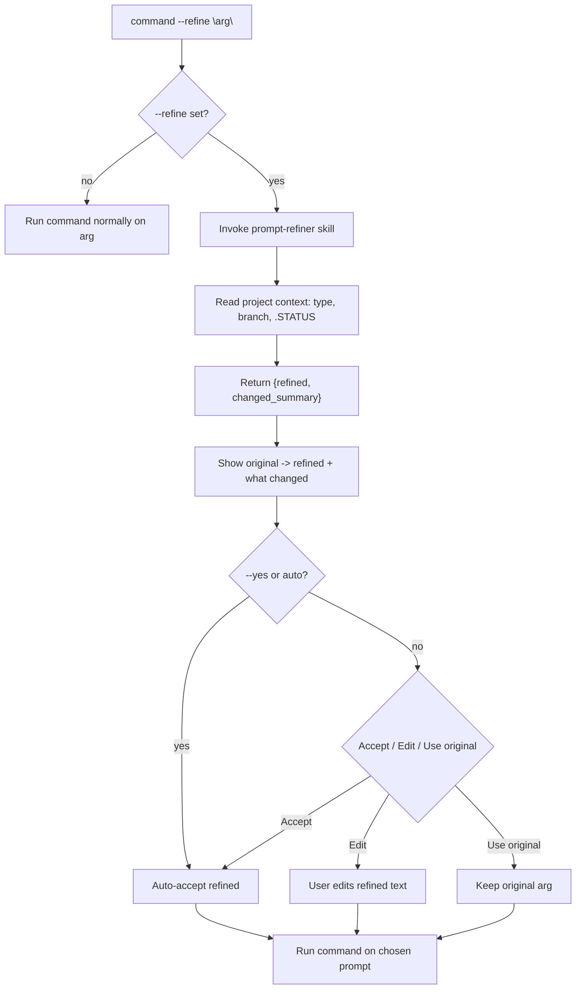

# SPEC: `--refine` flag — universal prompt pre-processor

**Status:** draft
**Created:** 2026-06-03
**From Brainstorm:** interactive `/workflow:brainstorm` session 2026-06-03
**Author:** dt + Claude

---

## Overview

A `--refine` flag added to craft's prompt-driven commands. Before a
command acts, `--refine` runs the user's natural-language argument through
a shared **prompt-refiner skill**, shows a before/after with a one-line
"what changed", and proceeds on the version the user approves. It rescues
the prompt-engineering logic of the deprecated `/craft:workflow:refine`
command by extracting it into a skill that many commands share, rather
than letting it die with the command.

Refine target is the **input prompt, pre-run** (not the command's
generated output). One shared skill backs every command, so the flag
behaves identically everywhere.

---

## Primary User Story

**As a** craft user who types a vague request,
**I want** `--refine` to sharpen my prompt (with my approval) before the
command runs,
**so that** brainstorms, routing, orchestration, and planning act on a
well-formed prompt instead of my first rough phrasing — without me
learning prompt engineering by hand.

### Acceptance Criteria

- [ ] `--refine` is accepted by `brainstorm`, `do`, `orchestrate`,
      `plan:feature`, and `arch:plan`.
- [ ] When set, the command routes the argument through the shared
      prompt-refiner skill, which returns `{ refined, changed_summary }`.
- [ ] The user sees **original → refined** plus a one-line "what changed",
      then an interactive **Accept (Recommended) · Edit · Use original**
      choice; the command proceeds on the chosen text.
- [ ] **Edit** lets the user hand-tweak the refined prompt before running.
- [ ] `--refine` combined with `--yes` / auto mode **auto-accepts** the
      refined version (documented), so unattended runs still work.
- [ ] The refiner reads project context (project type, branch, `.STATUS`)
      to ground the rewrite — same context sources the old `/refine` used.
- [ ] The refiner NEVER executes the prompt or any tool; it only rewrites
      text.
- [ ] Behavior is identical across all five commands (one skill, one
      shared flag step) — verified by a dogfood test.

---

## Secondary User Stories

- **As a** power user, **I want** `--refine` + `--yes` to skip the confirm
  and run on the refined prompt, so scripted/auto flows aren't blocked.
- **As a** user who liked `/refine` standalone, **I want** the deprecated
  command's "refine and print" behavior preserved as the skill invoked
  with no downstream command, so nothing is lost in the sunset.
- **As a** maintainer, **I want** a single skill so the five commands
  cannot drift into five subtly different refiners.

---

## Architecture



**Boundary:** the flag is a thin pre-processor. Each command owns only:
"if `--refine`, call the skill, run the shared confirm step, swap in the
chosen prompt." All refining intelligence + context-reading lives in the
shared skill.

---

## API Design

**Flag (added to 5 commands):**

| Flag | Default | Purpose |
|---|---|---|
| `--refine` | false | Pre-process the argument through the prompt-refiner skill before acting. |

**Shared skill interface** (`skills/workflow/prompt-refiner/`):

| In | Out |
|---|---|
| `prompt` (raw arg), `context` (project type, branch, `.STATUS`) | `{ refined: str, changed_summary: str }` |

**Standalone use (sunset path for `/refine`):** invoking the skill with no
downstream command = "refine and print" — preserves the old command's
behavior.

---

## Data Models

N/A — no persistent data. The refiner produces a transient
`{ refined, changed_summary }` and the chosen prompt string. No new state
files.

---

## Dependencies

- Existing `skills/workflow/adhd-workflow/` (the deprecated `/refine`
  replacement) — `prompt-refiner` either lives beside it or folds into it.
- `AskUserQuestion` for the Accept/Edit/Use-original picker.
- No new external libraries.

---

## Documentation Deliverables

| Artifact | Path | Purpose |
|---|---|---|
| **Skill** | `skills/workflow/prompt-refiner/SKILL.md` | The refiner itself + when it activates. |
| **Flag docs (×5)** | each command's `.md` + `docs/commands/*` mirror | Document `--refine` in `brainstorm`, `do`, `orchestrate`, `plan:feature`, `arch:plan`. |
| **Help page** | `docs/help/refine-flag.md` | What/when/how; the Accept/Edit/Use-original flow; `--yes` auto-accept note. |
| **Tutorial** | `docs/tutorials/TUTORIAL-refine-flag.md` | Walk a vague prompt → refined → brainstorm, end to end. |
| **Cookbook recipe** | `docs/cookbook/recipes/refine-before-running.md` | Copy-paste: `--refine` on each of the 5 commands. |
| **Migration note** | `commands/workflow/refine.md` + REFCARD | Document `/refine` (deprecated) → `--refine` flag + `prompt-refiner` skill. |
| **REFCARD row** | `docs/REFCARD.md` | One-line `--refine` entry. |
| **CHANGELOG** | `CHANGELOG.md` + `docs/CHANGELOG.md` (mirror) | Feature entry under `[Unreleased]`. |
| **Counts + CLAUDE.md** | `.claude-plugin/plugin.json`, `CLAUDE.md` | Skill count +1; capability note. |
| **Flowchart** | embedded in tutorial + help | The Architecture diagram above (quoted Mermaid labels — leading-slash labels fail the Mermaid pre-commit check). |

### Documentation principles

- **Lead docs with the before/after**: the value is visible in one
  example — show a real vague→sharp rewrite first.
- **Document `--yes` auto-accept prominently**: it's the one place
  `--refine` acts without a confirm; users running unattended must know.
- **Cross-link the `/refine` sunset both ways**: old command doc → flag;
  flag docs → "replaces the standalone `/refine`".

---

## Testing

### Unit (`tests/test_craft_plugin.py`)

- [ ] `test_prompt_refiner_skill_exists` — skill dir + valid frontmatter
      (`name: prompt-refiner`, has description).
- [ ] `test_refine_flag_documented` — each of the 5 command `.md` files
      contains a `--refine` flag entry in frontmatter/arguments.
- [ ] Skill-suite invariants still pass (frontmatter, unique triggers,
      non-trivial body) with the new skill.

### E2E (`tests/test_plugin_e2e.py`)

- [ ] `test_refine_flag_in_five_commands` — assert the 5 target commands
      declare `--refine`; assert no OTHER command silently added it
      (scope guard).
- [ ] Skill count in `plugin.json` matches file count (existing
      count-matches e2e test covers this once counts synced).
- [ ] `docs/commands/*` mirrors for the 5 commands mention `--refine`.

### Dogfood (`tests/test_plugin_dogfood.py`)

- [ ] `test_refine_behavior_consistent` — the `--refine` step text
      (skill call + Accept/Edit/Use-original confirm) is sourced from one
      shared snippet, not five hand-written copies — guards against
      behavioral drift across commands.
- [ ] `test_refine_help_examples_valid` — help/tutorial/cookbook examples
      reference the real flag + real command names.

### Verification commands

```bash
python3 tests/test_craft_plugin.py
python3 -m pytest tests/test_plugin_e2e.py tests/test_plugin_dogfood.py -q
./scripts/validate-counts.sh
mkdocs build --strict
```

---

## UI/UX Specifications

**Before/after display (illustrative):**

```
╭─ --refine ───────────────────────────────────────────────╮
│ Original:  add auth                                       │
│ Refined:   Design a session-based auth flow for the craft │
│            CLI — login/logout, token storage, tests.      │
│ Changed:   added scope (CLI), specifics (sessions, tests) │
╰───────────────────────────────────────────────────────────╯
```

Then `AskUserQuestion`:

| Option | Effect |
|---|---|
| **Accept (Recommended)** | Run on the refined prompt. |
| **Edit** | Open the refined text for hand-tweaks, then run. |
| **Use original** | Discard refinement, run on the original. |

- Reuse craft's boxed ADHD-friendly output; honor `NO_COLOR`.
- With `--yes`/auto: skip the picker, print "refined (auto-accepted)".
- Accessibility: label original/refined/changed lines explicitly.

---

## Security Constraints

| Constraint | Enforcement |
|---|---|
| Refiner never executes the prompt | Skill rewrites text only; no tool calls. |
| No silent reinterpretation | Confirm gate unless `--yes`/auto (then documented + announced). |
| Context read-only | Refiner reads project type/branch/`.STATUS`; never writes. |
| No secret handling | Refiner is text-only; never touches tokens. |

---

## Resolved Decisions (brainstorm 2026-06-03)

1. **Skill home** → **new `skills/workflow/prompt-refiner/`** (not folded
   into `adhd-workflow`). Single responsibility, isolated tests, clean to
   call from 5 commands. Skill count +1.
2. **Edit UX** → **inline text prompt** (not `$EDITOR`). Works in every
   harness context (terminal, web, IDE headless); no interactive
   dependency the harness can't satisfy.
3. **Refine on no-arg interactive commands** → when `/brainstorm --refine`
   has no topic yet, refine the topic **after** the user provides it.

---

## Review Checklist

- [ ] `--refine` flag in all 5 commands; no others (scope guard test).
- [ ] One shared `prompt-refiner` skill; no per-command refine logic.
- [ ] Before/after + Accept/Edit/Use-original confirm; `--yes` auto-accepts.
- [ ] Refiner reads context, never executes, never writes.
- [ ] `/refine` sunset documented → flag + skill; standalone behavior kept.
- [ ] Docs complete: skill, 5 flag docs + mirrors, help, tutorial,
      cookbook, REFCARD, CHANGELOG (both), counts, CLAUDE.md.
- [ ] Tests: unit + e2e + dogfood per the Testing section; strict site
      build clean.
- [ ] Counts synced (`validate-counts.sh`); CLAUDE.md updated.

---

## Implementation Notes

- **Skill:** `skills/workflow/prompt-refiner/SKILL.md` — single source of
  truth for refining + context-reading.
- **Shared flag step:** author the "if `--refine` → call skill → confirm →
  swap prompt" block once and reference it from each command doc, so the
  dogfood consistency test passes.
- **Counts:** skill count +1 → bump `plugin.json` + CLAUDE.md; run
  `validate-counts.sh`. No command count change (flag, not new command).
- **Branch workflow:** implement on `feature/*` off `dev`; this spec lands
  on `dev`. Mirror CHANGELOG in both root + `docs/`.
- **Sequencing vs orchestrate:drive:** independent feature; can proceed in
  parallel on its own worktree.

---

## History

| Date | Event |
|---|---|
| 2026-06-03 | Initial draft from interactive brainstorm. Decisions: refine the input pre-run; one shared `prompt-refiner` skill (rescues deprecated `/refine`); before/after + Accept/Edit/Use-original confirm with `--yes` auto-accept; rollout to brainstorm/do/orchestrate/plan:feature/arch:plan. Added Documentation Deliverables + Testing (unit/e2e/dogfood) + help files per request. |
| 2026-06-03 | Resolved open questions: separate `prompt-refiner` skill (not folded into adhd-workflow); inline-text edit (not `$EDITOR`); refine after topic capture on no-arg interactive commands. |
