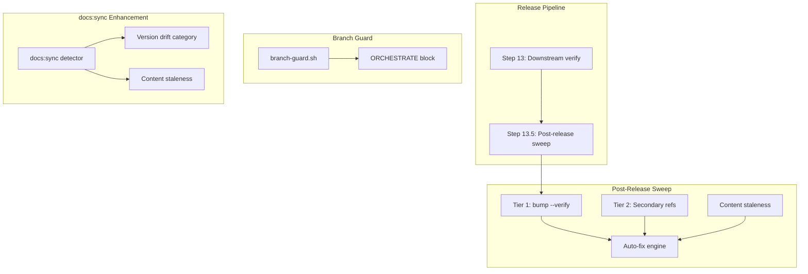
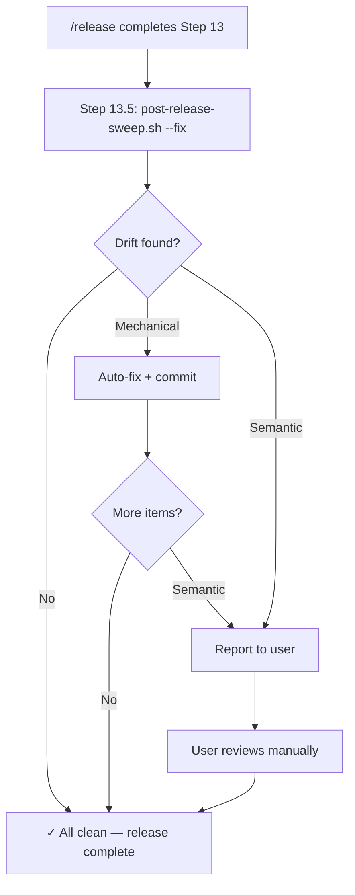

# SPEC: Release Pipeline Hardening v2

**Date:** 2026-02-23
**Status:** Draft
**Focus:** Feature (Post-Release Sweep + ORCHESTRATE Guard + docs:sync Enhancement)
**Priority:** High (prevents recurring post-release drift)
**From Brainstorm:** BRAINSTORM-release-pipeline-hardening-v2-2026-02-23.md

---

## Overview

The release pipeline (13 steps) handles Tier 1 version references via `bump-version.sh`, but Tier 2 secondary references silently drift between releases. This spec covers three linked improvements: (1) a post-release sweep script that catches and auto-fixes Tier 2 drift, (2) a branch guard rule that prevents ORCHESTRATE files from leaking to dev, and (3) integration of version drift detection into `/craft:docs:sync` — including flagging stale `index.md` and `README.md` content.

---

## Primary User Story

**As a** developer releasing a new version of Craft,
**I want** the release pipeline to automatically catch and fix all version drift — not just Tier 1,
**So that** post-release cleanup sessions become unnecessary and secondary references never go stale.

### Acceptance Criteria

- [ ] Running `post-release-sweep.sh` after a release finds zero drift items
- [ ] Running `post-release-sweep.sh --fix` auto-corrects mechanical items and reports semantic items
- [ ] ORCHESTRATE files cannot be committed on `dev` (hard block by branch guard)
- [ ] `/craft:docs:sync` flags version drift alongside content staleness
- [ ] `docs/index.md` and `README.md` staleness is detected by both sweep and docs:sync
- [ ] All existing tests pass (109 core tests)
- [ ] New tests cover all three features

---

## Secondary User Stories

**As a** developer finishing a feature branch,
**I want** the worktree cleanup to reliably remove ORCHESTRATE files,
**So that** they never leak into `dev` via PR merge.

**As a** developer running `/craft:docs:sync` between releases,
**I want** it to detect version drift in docs alongside content staleness,
**So that** I get a single unified report of what's outdated.

---

## Architecture

### Component Overview



### Post-Release Sweep Script (`scripts/post-release-sweep.sh`)

**Purpose:** Single script that validates ALL version references — Tier 1 (via existing `bump-version.sh --verify`) and Tier 2+3 (new logic).

**Interface:**

```bash
# Default: report only (safe)
./scripts/post-release-sweep.sh

# Auto-fix mechanical items, report semantic items
./scripts/post-release-sweep.sh --fix

# Explicit dry-run (same as default)
./scripts/post-release-sweep.sh --dry-run

# Target specific version (default: read from plugin.json)
./scripts/post-release-sweep.sh --version 2.27.0

# JSON output for CI integration
./scripts/post-release-sweep.sh --json
```

**Phases:**

| Phase | What | Files Checked | Auto-fixable? |
|-------|------|---------------|---------------|
| 1. Tier 1 | Run `bump-version.sh --verify` | 13 managed files | Yes (run bump-version.sh) |
| 2. Tier 2 — .STATUS | Version field, milestone, stale sessions older than 7 days | `.STATUS` | Partially (version yes, sessions need judgment) |
| 3. Tier 2 — CLAUDE.md | Duplicate install lines, stale examples, old version refs | `CLAUDE.md` | Yes (sed patterns) |
| 4. Tier 2 — Test files | Hardcoded dates, stale counts | `tests/*.py`, `tests/*.sh` | Partially (counts yes, dates need context) |
| 5. Tier 2 — Docs guides | Example commands with old versions | `docs/guide/*.md` | Yes (version substitution) |
| 6. Tier 3 — Content | Feature highlights vs CHANGELOG, tagline freshness | `docs/index.md`, `README.md`, `mkdocs.yml` | No (needs human judgment) |

**Exit codes:**

| Code | Meaning |
|------|---------|
| 0 | All clean — no drift found |
| 1 | Drift found (report mode) or fix failed |
| 2 | Usage error |

**Output format (report mode):**

```text
Post-Release Sweep v2.27.0
══════════════════════════

Phase 1: Tier 1 (bump-version.sh --verify)
  ✓ All 13 files consistent

Phase 2: .STATUS
  ✗ Stale session entries older than 7 days (3 found)
  ✓ Version field: 2.27.0

Phase 3: CLAUDE.md
  ✓ No duplicate lines
  ✓ Version references current

Phase 4: Test files
  ✗ tests/test_craft_plugin.py:42 — hardcoded date "2026-02-21"
  ✓ Test counts match

Phase 5: Docs guides
  ✗ docs/guide/homebrew-automation.md:18 — "v2.26.0" (expected v2.27.0)
  ✗ docs/guide/badge-management.md:34 — "v2.26.0" (expected v2.27.0)

Phase 6: Content staleness (requires human review)
  ⚠ docs/index.md — feature highlights may need updating
  ⚠ README.md — tagline references "107 commands" (verify current)

══════════════════════════
Results: 3 auto-fixable, 2 need review, 8 clean
Run with --fix to auto-correct fixable items.
```

### Tier 2 File Registry

The sweep script maintains a registry of files to check beyond Tier 1:

```bash
# Tier 2: Mechanical version refs (auto-fixable)
TIER2_VERSION_FILES=(
    ".STATUS"
    "CLAUDE.md"
    "docs/guide/homebrew-automation.md"
    "docs/guide/badge-management.md"
    "docs/reference/REFCARD-RELEASE.md"
)

# Tier 2: Date/count refs (partially auto-fixable)
TIER2_COUNT_FILES=(
    "tests/test_craft_plugin.py"
    "tests/test_plugin_e2e.py"
    "docs/guide/getting-started.md"
)

# Tier 3: Content staleness (human judgment)
TIER3_CONTENT_FILES=(
    "docs/index.md"
    "README.md"
    "mkdocs.yml"
    "docs/VERSION-HISTORY.md"
)
```

### Branch Guard ORCHESTRATE Block

**Location:** `scripts/branch-guard.sh`, new section after existing smart-mode checks.

**Behavior:**

| Condition | Action |
|-----------|--------|
| Branch is `dev` AND file matches `ORCHESTRATE-*.md` | Hard block (exit 2) |
| Branch is `main` | Already blocked by `block-all` |
| Branch is `feature/*` | Allow (ORCHESTRATE files belong here) |

**Implementation approach:**

```bash
# Section 9: ORCHESTRATE file protection on dev
if [[ "$BRANCH" == "dev" || "$BRANCH" == "develop" ]]; then
    if [[ "$TOOL_NAME" == "Write" || "$TOOL_NAME" == "Edit" ]]; then
        if [[ "$FILE_PATH" =~ ORCHESTRATE-.*\.md$ ]]; then
            block "$(_box \
                "${_R}${_B}BLOCKED: ORCHESTRATE file on dev${_N}" \
                "---" \
                "" \
                "ORCHESTRATE files are working artifacts that belong" \
                "on feature branches, not on dev." \
                "" \
                "${_D}How to fix:${_N}" \
                "  ${_Y}→${_N} Use /craft:git:worktree finish to clean up" \
                "  ${_Y}→${_N} Or: git rm ORCHESTRATE-*.md on the feature branch" \
                "" \
            )"
        fi
    fi
    # Also check Bash tool for git add of ORCHESTRATE files
    if [[ "$TOOL_NAME" == "Bash" ]]; then
        if [[ "$COMMAND" =~ git\ add.*ORCHESTRATE ]]; then
            block "$(_box \
                "${_R}${_B}BLOCKED: Staging ORCHESTRATE file on dev${_N}" \
                "---" \
                "ORCHESTRATE files should not be committed to dev." \
                "${_Y}→${_N} Remove from staging: git reset ORCHESTRATE-*.md" \
            )"
        fi
    fi
fi
```

**Teaching message (first encounter):**

```
╔═════════════════════════════════════════════════════════════╗
║ BLOCKED: ORCHESTRATE file on dev                           ║
╠═════════════════════════════════════════════════════════════╣
║                                                            ║
║ ORCHESTRATE files are working artifacts that belong        ║
║ on feature branches, not on dev.                           ║
║                                                            ║
║ How to fix:                                                ║
║   → Use /craft:git:worktree finish to clean up             ║
║   → Or: git rm ORCHESTRATE-*.md on the feature branch      ║
║                                                            ║
╚═════════════════════════════════════════════════════════════╝
```

### `/craft:git:clean` Enhancement

**Current behavior:** Warns about ORCHESTRATE files on dev.
**New behavior:** Auto-removes them as part of cleanup pass.

```bash
# In cleanup flow, after detecting ORCHESTRATE files:
orchestrate_files=$(ls ORCHESTRATE-*.md 2>/dev/null)
if [ -n "$orchestrate_files" ]; then
    echo "📋 Found ORCHESTRATE files (working artifacts):"
    echo "   $orchestrate_files"
    echo "   Auto-removing from dev..."
    git rm $orchestrate_files
    git commit -m "chore: remove ORCHESTRATE files (merge cleanup)"
fi
```

### `/craft:docs:sync` Enhancement

**New detection category:** "Version Drift"

Added alongside existing categories (stale docs, broken links, etc.):

1. Run `bump-version.sh --verify` — report any Tier 1 drift
2. Check Tier 2 files for old version strings
3. Check `docs/index.md` for:
   - Stale feature highlights (compare against latest CHANGELOG entry)
   - Old version in info box
   - Outdated count strings
4. Check `README.md` for:
   - Stale version badge
   - Outdated feature list
   - Old count strings

**Output integration:**

```text
/craft:docs:sync report
═══════════════════════

📄 Stale docs: 2 files
  - docs/guide/homebrew-automation.md (modified 14 days ago)
  - docs/tutorials/TUTORIAL-worktree-setup.md (outdated)

🔢 Version drift: 3 items
  - .STATUS: milestone says "v2.26.0" (current: v2.27.0)
  - docs/guide/badge-management.md: example uses v2.26.0
  - docs/index.md: feature highlights outdated

📊 Content staleness: 2 items
  - README.md: feature list may need updating
  - docs/index.md: info box version current but highlights stale
```

### Release Skill Step 13.5

Added to `skills/release/SKILL.md` after Step 13:

```markdown
## Step 13.5: Post-Release Sweep

After downstream verification passes, run the post-release sweep to catch Tier 2+ drift:

| Mode | Command |
|------|---------|
| Normal | `./scripts/post-release-sweep.sh --fix` |
| Autonomous | Same (auto-fix is safe for mechanical items) |
| Dry-run | `./scripts/post-release-sweep.sh` (report only) |

### Behavior

1. Run sweep with --fix
2. If fixes applied: stage, commit (`chore: post-release sweep fixes`), push to dev
3. If semantic items found: report to user for manual review
4. If all clean: report "No drift found" and continue

### On Failure

If sweep finds unfixable drift:
- Report items to user
- Do NOT block the release (it's already published)
- Mark as follow-up item in .STATUS
```

---

## API Design

N/A — No API changes. All components are CLI scripts and skill definitions.

---

## Data Models

N/A — No data model changes. The sweep script uses the existing file registry pattern established by `bump-version.sh`.

---

## Dependencies

| Dependency | Purpose | Already Available? |
|------------|---------|-------------------|
| `bash` | Script execution | Yes |
| `sed` (BSD) | Auto-fix substitutions | Yes |
| `grep` | Pattern matching | Yes |
| `python3` | JSON parsing (existing pattern) | Yes |
| `jq` | JSON parsing (preferred, optional) | Yes |
| `bump-version.sh` | Tier 1 verification | Yes |
| `formatting.sh` | Terminal formatting | Yes |
| `branch-guard.sh` | ORCHESTRATE block (extends existing) | Yes |

No new external dependencies required.

---

## UI/UX Specifications

N/A — CLI only. All output follows existing formatting conventions using `formatting.sh` box-drawing helpers.

### User Flow



### Accessibility

N/A — Terminal CLI tool. Uses existing color conventions with `$NC` reset for screen readers.

---

## Open Questions

1. **Sweep file registry:** Should the script maintain a hardcoded list of Tier 2 files, or discover them dynamically via grep? Hardcoded is more reliable and faster; dynamic catches new files but may false-positive.
   - **Recommendation:** Hardcoded registry with a `--discover` flag for ad-hoc scanning.

2. **Step 13.5 auto-commit:** Should the sweep auto-commit fixes on dev, or leave them staged?
   - **Recommendation:** Auto-commit with standard message (`chore: post-release sweep fixes`). It's mechanical.

3. **docs:sync boundary:** How to distinguish "version drift" (mechanical, auto-fixable) from "content staleness" (requires judgment)?
   - **Recommendation:** Version drift = any string matching `vX.Y.Z` or `X commands` patterns. Content staleness = feature highlights, taglines, descriptions. Report them in separate sections.

---

## Review Checklist

- [ ] Spec reviewed by author
- [ ] Architecture diagram reviewed
- [ ] All acceptance criteria are testable
- [ ] Dependencies verified available
- [ ] No security implications (scripts run locally, no external calls)
- [ ] Backward compatibility: no breaking changes to existing scripts
- [ ] Documentation plan covers all affected files

---

## Implementation Notes

### Key Considerations

1. **`post-release-sweep.sh` should share `formatting.sh`** — same terminal output conventions as `bump-version.sh` and `pre-release-check.sh`.

2. **Branch guard ORCHESTRATE check should be a hard block, not smart-mode** — no confirmation prompt, no session counting. ORCHESTRATE files on dev are always wrong.

3. **Tier 2 version matching** — use the same `sed` patterns from `bump-version.sh` where possible. Don't reinvent regex for version strings.

4. **`docs/index.md` and `README.md` content staleness** — the sweep can't auto-fix these (needs human judgment), but can flag them by comparing against CHANGELOG latest entry timestamp.

5. **Test strategy:** Unit tests for the sweep script (mock files with stale versions), dogfood test for branch guard (attempt ORCHESTRATE commit on dev), integration test for docs:sync enhancement.

### Files to Create/Modify

| File | Action | Lines (est.) |
|------|--------|-------------|
| `scripts/post-release-sweep.sh` | CREATE | ~250 |
| `scripts/branch-guard.sh` | MODIFY | +30 |
| `commands/git/clean.md` | MODIFY | +10 |
| `commands/git/worktree.md` | MODIFY (harden 2.5) | +5 |
| `skills/release/SKILL.md` | MODIFY | +25 |
| `commands/docs/sync.md` | MODIFY | +40 |
| `tests/test_post_release_sweep.sh` | CREATE | ~100 |
| `tests/test_branch_guard.sh` | MODIFY | +20 |
| `tests/test_branch_guard_dogfood.py` | MODIFY | +15 |
| `CLAUDE.md` | MODIFY | +3 |
| `.STATUS` | MODIFY | +5 |
| `CHANGELOG.md` | MODIFY | +10 |
| `docs/guide/branch-guard-smart-mode.md` | MODIFY | +15 |
| `docs/reference/REFCARD-RELEASE.md` | MODIFY | +10 |

**Estimated total:** ~540 lines new/modified

### Validation Plan

| Test Type | What | Command |
|-----------|------|---------|
| Unit | Sweep script phases | `bash tests/test_post_release_sweep.sh` |
| Unit | Branch guard ORCHESTRATE block | `bash tests/test_branch_guard.sh` |
| Dogfood | Branch guard on dev branch | `python3 -m pytest tests/test_branch_guard_dogfood.py -v` |
| Integration | docs:sync version drift | `python3 tests/test_integration_docs_sync.py` |
| E2E | Full release pipeline with Step 13.5 | Manual: `/release -n` (dry-run) |
| Regression | All existing tests | `python3 tests/test_craft_plugin.py && python3 -m pytest tests/test_plugin_e2e.py -v` |

### Documentation Plan

| Document | Update |
|----------|--------|
| `docs/guide/branch-guard-smart-mode.md` | Add ORCHESTRATE guard section |
| `docs/reference/REFCARD-RELEASE.md` | Add Step 13.5 to pipeline reference |
| `docs/workflows/git-feature-workflow.md` | Note ORCHESTRATE auto-cleanup |
| `docs/commands/git/clean.md` | Update behavior description |
| `docs/commands/git/worktree.md` | Update finish step description |
| `CHANGELOG.md` | Add [Unreleased] entries |
| `CLAUDE.md` | Add sweep to quick commands table |

---

## History

| Date | Change |
|------|--------|
| 2026-02-23 | Initial spec from deep feature brainstorm |
