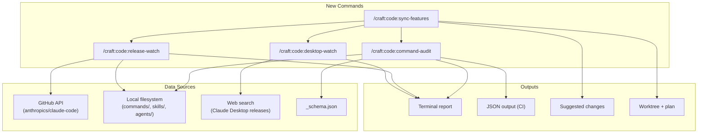

# SPEC: Release Watcher & Command Sync System

**Status:** draft
**Created:** 2026-02-21
**From Brainstorm:** `BRAINSTORM-release-watcher-2026-02-21.md`
**Primary User:** Plugin maintainer (keeping craft aligned with Claude Code/Desktop releases)

---

## Overview

A suite of 4 commands that automate tracking Claude Code and Claude Desktop releases, auditing craft commands for compliance, and interactively adopting new capabilities. Replaces the current manual process of reading changelogs and cross-referencing craft's 108 commands.

---

## Primary User Story

**As a** craft plugin maintainer,
**I want to** automatically detect when Claude Code or Claude Desktop releases introduce new capabilities, deprecations, or breaking changes,
**So that** I can keep craft's commands, agents, and hooks aligned without manually reading every changelog.

### Acceptance Criteria

- [ ] `command-audit` validates all frontmatter against `_schema.json` and reports errors
- [ ] `command-audit` detects deprecated commands still present
- [ ] `command-audit` reports a health score (0-100)
- [ ] `release-watch` fetches latest Claude Code releases via GitHub API
- [ ] `release-watch` identifies plugin-relevant changes (hooks, agents, schema, deprecations)
- [ ] `release-watch` cross-references findings against current craft state
- [ ] `desktop-watch` reports latest Claude Desktop features relevant to plugins
- [ ] `sync-features` presents actionable items interactively and can generate code

---

## Secondary User Stories

**As a** craft contributor, I want `command-audit` to run in CI so PRs with invalid frontmatter are caught automatically.

**As a** craft maintainer preparing a release, I want `release-watch` to tell me which Claude Code version my release targets.

---

## Architecture



---

## Command Specifications

### 1. `/craft:code:command-audit`

**Implementation:** Shell script (`scripts/command-audit.sh`)
**Category:** code
**Arguments:**

| Arg | Description | Default |
|-----|-------------|---------|
| `--format` | Output format: `terminal`, `json`, `markdown` | `terminal` |
| `--fix` | Auto-fix safe issues (rename `args` → `arguments`, remove invalid fields) | `false` |
| `--strict` | Treat warnings as errors (for CI) | `false` |

**Checks performed:**

| Check | Severity | Description |
|-------|----------|-------------|
| Invalid frontmatter fields | ERROR | Fields not in `_schema.json` |
| Deprecated commands present | WARNING | Commands marked DEPRECATED still in tree |
| Hardcoded model names | WARNING | References to deprecated models (e.g., Sonnet 4.5) |
| Missing description | ERROR | Commands without `description` field |
| Orphaned scripts | WARNING | Scripts in `scripts/` not referenced by any command |
| External tool availability | INFO | Check if referenced tools (ruff, mkdocs, etc.) are installed |
| Schema compliance | ERROR | Required fields missing per schema |
| Frontmatter syntax | ERROR | YAML parse errors in frontmatter |

**Exit codes:**

- `0` — All checks pass
- `1` — Warnings only
- `2` — Errors found

**JSON output (for CI):**

```json
{
  "version": "1.0.0",
  "timestamp": "2026-02-21T05:00:00Z",
  "health_score": 95,
  "total_commands": 108,
  "errors": [],
  "warnings": [],
  "suggestions": [],
  "summary": { "errors": 0, "warnings": 4, "suggestions": 6 }
}
```

### 2. `/craft:code:release-watch`

**Implementation:** Python script (`scripts/release-watch.py`)
**Category:** code
**Arguments:**

| Arg | Description | Default |
|-----|-------------|---------|
| `--count` | Number of releases to check | `3` |
| `--since` | Only show releases after this version | (none) |
| `--format` | Output format: `terminal`, `json`, `markdown` | `terminal` |

**Requires:** `gh` CLI authenticated

**Logic:**

1. `gh api repos/anthropics/claude-code/releases --paginate -q '.[:N]'`
2. Parse each release body for plugin keywords
3. Categorize findings: NEW / DEPRECATED / BREAKING / FIXED
4. Cross-reference against craft's current implementation:
   - Read `agents/*.md` frontmatter for `memory`, `isolation`, `background` fields
   - Read `hooks/` config for registered events
   - Read `plugin.json` for version compatibility
   - Check for hardcoded model names across all files
5. Output delta report

**Keyword detection patterns:**

| Category | Keywords |
|----------|----------|
| Plugin system | `plugin`, `skill`, `command`, `agent`, `hook`, `frontmatter` |
| Schema | `schema`, `field`, `property`, `validation` |
| Deprecation | `deprecated`, `removed`, `breaking`, `migration` |
| New features | `new`, `added`, `support`, `feature`, `capability` |
| Models | `sonnet`, `opus`, `haiku`, `model` |
| Environment | `environment`, `variable`, `CLAUDE_` |

### 3. `/craft:code:desktop-watch`

**Implementation:** Instruction-driven command (no script)
**Category:** code
**Arguments:**

| Arg | Description | Default |
|-----|-------------|---------|
| `--format` | Output format: `terminal`, `markdown` | `terminal` |

**Logic:**

1. WebSearch for "Claude Desktop release notes 2026"
2. WebFetch the Anthropic support page for release notes
3. Parse for developer-relevant features (MCP, extensions, file system)
4. Compare against craft's current distribution channels
5. Output report with integration opportunities

**Why instruction-driven:** No stable API endpoint for Desktop releases. Web search + Claude's analysis is more reliable than brittle scraping.

### 4. `/craft:code:sync-features` (Skill)

**Implementation:** Skill file (`skills/code/sync-features.md`)
**Category:** code

**Flow:**

1. Run `command-audit` internally, capture results
2. Run `release-watch` internally, capture results
3. Optionally run `desktop-watch`
4. Merge findings into prioritized action list
5. Present via AskUserQuestion:

```
AskUserQuestion:
  question: "Which new capabilities should we adopt?"
  header: "Features"
  multiSelect: true
  options:
    - label: "Agent memory (orchestrator-v2)"
      description: "Persist orchestration state across sessions"
    - label: "Worktree isolation (code-reviewer)"
      description: "Run code reviews in isolated worktrees"
    - label: "New hook events (5 available)"
      description: "WorktreeCreate, ConfigChange, etc."
    - label: "Ship settings.json"
      description: "Default plugin settings for users"
```

6. For selected items, generate implementation code or create worktree + ORCHESTRATE plan

---

## API Design

N/A — These are CLI commands, not REST APIs. The `--format json` output serves as the machine-readable interface for CI integration.

---

## Data Models

**Audit Result:**

```python
@dataclass
class AuditResult:
    health_score: int          # 0-100
    total_commands: int
    errors: list[Finding]
    warnings: list[Finding]
    suggestions: list[Finding]

@dataclass
class Finding:
    severity: str              # error, warning, suggestion
    file: str                  # relative path
    field: str | None          # frontmatter field if applicable
    message: str
    fix: str | None            # suggested fix
    auto_fixable: bool
```

**Release Delta:**

```python
@dataclass
class ReleaseDelta:
    version: str
    date: str
    new_capabilities: list[Capability]
    deprecations: list[Deprecation]
    breaking_changes: list[str]
    craft_alignment: dict[str, str]  # capability → status (adopted/missing/partial)
```

---

## Dependencies

| Dependency | Used By | Required | Fallback |
|------------|---------|----------|----------|
| `gh` CLI | release-watch | Yes | Error with install instructions |
| `jq` | release-watch (shell fallback) | No | Python JSON parsing |
| `python3` | release-watch | Yes | Already required by craft |
| `markdownlint-cli2` | command-audit (frontmatter parse) | No | Python YAML parsing |

---

## UI/UX Specifications

**Terminal output** uses craft's standard box format (consistent with `/craft:check`, `/craft:code:lint`).

**Color coding:**

- Red: errors (must fix)
- Yellow: warnings (should fix)
- Green: aligned / passing
- Blue: suggestions (could adopt)
- Gray: info

**User flow for sync-features:**

```
Start → Run audit → Run release-watch → Present findings
  → User selects features → Generate code OR create worktree
  → Report what was done → Suggest next steps
```

N/A — No wireframes needed (CLI output only).

**Accessibility:** All output includes plain-text fallback via `--format markdown`.

---

## Open Questions

1. **Should `command-audit` run automatically in `/craft:check`?** — Likely yes, but adds ~2s. Could be opt-in via mode (release mode only).

2. **How to handle rate limiting on GitHub API?** — `gh` handles auth, but frequent runs could hit limits. Cache results for 1 hour?

3. **Should release-watch track Claude Code SDK (npm) separately?** — The SDK has its own versioning. Might be relevant for MCP integrations.

4. **Where to store the "last checked" state?** — `.claude-plugin/release-watch-cache.json`? Or use agent memory?

---

## Review Checklist

- [ ] All 4 commands have valid frontmatter per `_schema.json`
- [ ] Shell script follows existing patterns (`docs-lint.sh`, `validate-counts.sh`)
- [ ] Python script follows existing patterns (`claude_md_sync.py`)
- [ ] Tests cover: valid commands pass, invalid frontmatter caught, deprecated detected
- [ ] CI integration documented (GitHub Actions example)
- [ ] `--fix` mode previews before applying (consistent with `docs:lint --fix`)
- [ ] JSON output schema documented for CI consumers
- [ ] CLAUDE.md updated with new commands
- [ ] Hub command updated with new entries

---

## Implementation Notes

- **command-audit is the foundation** — release-watch and sync-features both depend on it for the "current state" half of the diff
- **Start with shell for command-audit** — it's pure file validation, no network needed. Pattern: read YAML frontmatter with `sed`/`awk`, validate against known field list
- **Python for release-watch** — GitHub API returns JSON, Python handles it naturally. Use `subprocess` to call `gh api` rather than raw HTTP (respects user's auth)
- **The `trigger:` bug we found today is the perfect test case** — command-audit should catch exactly this class of error
- **Consider making command-audit a pre-commit hook** — catches issues before they reach dev branch

---

## Increments

| # | Deliverable | Effort | Dependencies |
|---|-------------|--------|--------------|
| 1 | `command-audit` (shell script + command file) | 2-3 hours | None |
| 2 | `release-watch` (Python script + command file) | 3-4 hours | `gh` CLI |
| 3 | `desktop-watch` (instruction-driven command) | 1 hour | None |
| 4 | `sync-features` (skill file) | 2 hours | Increments 1-3 |
| 5 | CI integration (GitHub Action) | 1 hour | Increment 1 |
| 6 | Remove 4 deprecated commands | 30 min | None |

**Recommended order:** 1 → 6 → 2 → 3 → 4 → 5

---

## History

| Date | Event |
|------|-------|
| 2026-02-21 | Initial spec from max brainstorm session |
