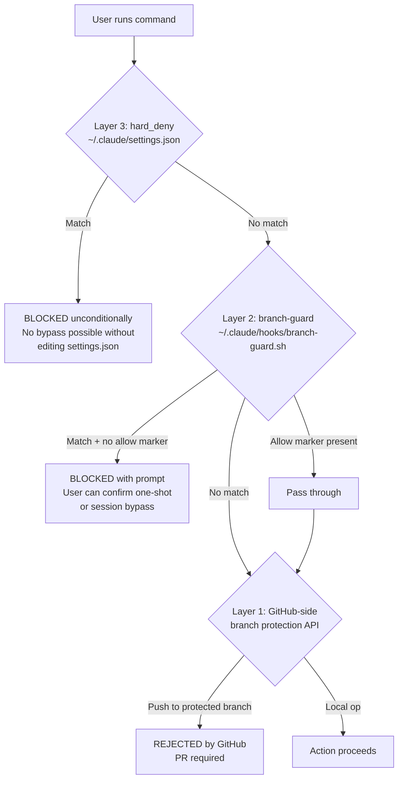
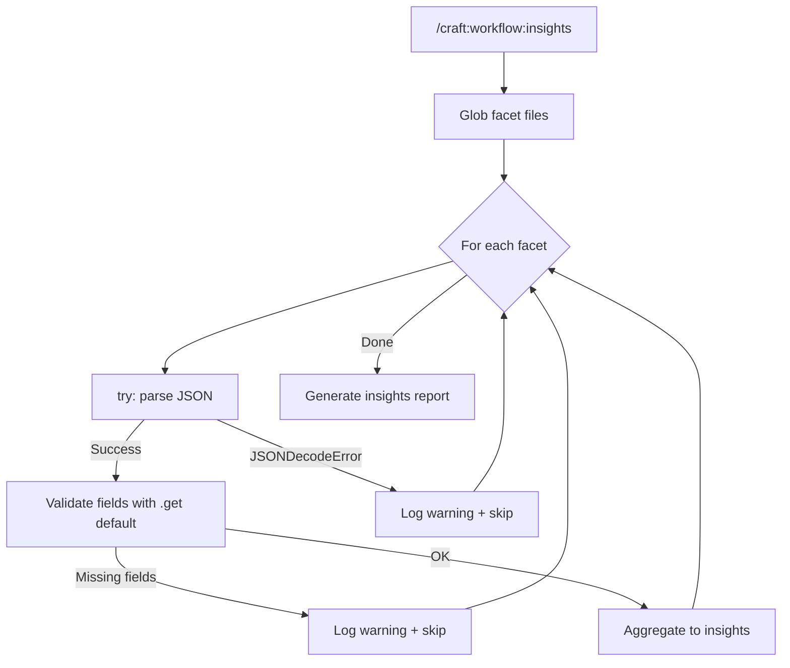

# SPEC: Safety Hardening — hard_deny layer + insights audit

**Status:** draft
**Created:** 2026-05-10
**From Brainstorm:** [BRAINSTORM-safety-hardening-2026-05-10.md](../brainstorm/BRAINSTORM-safety-hardening-2026-05-10.md)
**Source:** `/craft:code:release-watch` findings on Claude Code v2.1.136 fixes
**Estimated effort:** ~3h total (45min for #2, ~2h for #1, ~30min docs/tests)
**Target version:** v2.33.0 increment (paired safety release) or v2.32.2 patch

---

## Overview

Two paired safety improvements driven by Claude Code v2.1.136 release notes:

1. **Layer `settings.autoMode.hard_deny` on top of branch-guard** — adds a third tier of unconditional protection for catastrophic commands that should never execute regardless of session state. Complements (does not replace) branch-guard's smart-mode and GitHub-side branch protection.

2. **Defensive parsing in `/craft:workflow:insights`** — ports the v2.1.136 fix for `/insights` crashes on malformed tool input fields. Prevents craft's insights command from crashing on partial/corrupt facet files.

Both items target the safety/observability layer of craft. They can ship together as a paired "safety hardening" release.

---

## Primary User Story

**As a** Craft plugin user (developer),
**I want** truly catastrophic commands (`git push --force` to main, `rm -rf .git`, `gh repo delete`) to be unconditionally blocked AND my insights command to never crash on a malformed session facet,
**so that** the safety layer protects me even when I've created session bypasses or accumulated edge-case facet data.

### Acceptance Criteria

- [ ] `/craft:workflow:insights` no longer crashes when a facet file contains malformed tool input fields — instead skips the entry and logs a warning
- [ ] Regression test exists that feeds a deliberately malformed facet to the insights parser and asserts no crash
- [ ] `~/.claude/settings.json` `autoMode.hard_deny` rules are documented for: `git push --force` on main, `rm -rf .git`, `gh repo delete` (final list TBD pending schema verification)
- [ ] `/craft:git:protect` detects whether craft's recommended hard_deny rules are installed; offers to add them if missing (with `--no-hard-deny` opt-out flag)
- [ ] Hard_deny rules survive even when `.claude/allow-once` is present (verified by integration test)
- [ ] Hard_deny rules are NARROW — they trigger on patterns that should never execute, not patterns that are merely risky
- [ ] `docs/architecture.md` updated to document the 3-layer protection model (hard_deny + branch-guard + GitHub-side)
- [ ] `REFCARD-BRANCH-GUARD.md` adds a section describing the hard_deny layer
- [ ] All existing branch-guard tests continue to pass (backward compatible)

---

## Secondary User Stories

**As a** developer hitting a hard_deny rule legitimately,
**I want** a clear error message explaining what triggered the block and how to bypass it (modify settings.json, remove rule),
**so that** I'm not stuck with a mysterious failure.

**As a** plugin author looking to adopt the same protection model,
**I want** craft's documentation to clearly explain the 3-layer pattern,
**so that** I can replicate it in my own plugin.

---

## Architecture

### Three-layer protection model (proposed)



**Layer responsibilities:**

| Layer | Scope | Bypass | Use case |
|-------|-------|--------|----------|
| **3 — hard_deny** | Per-machine, all sessions, all branches | Edit `~/.claude/settings.json` | Truly catastrophic patterns (data loss, destruction) |
| **2 — branch-guard** | Per-machine, per-session | `.claude/allow-once` or `/craft:git:unprotect` | Context-aware safety (write code on dev, force-push, etc.) |
| **1 — GitHub-side** | Per-repo, server-side | `gh pr merge --admin` | Push/merge/delete protections on remote |

### Insights defensive parsing flow



---

## API Design

**N/A** — no API changes. Both items are internal to craft's safety/observability layer.

---

## Data Models

**N/A** — no data model changes. Both items operate on existing structures (settings.json schema is Claude Code's; facet JSON schema is craft's existing format).

---

## Dependencies

- **Claude Code v2.1.136+** (for `settings.autoMode.hard_deny` schema)
- **No new craft dependencies** (uses existing python3 json, bash, gh)

---

## UI/UX Specifications

**N/A** — both items are CLI/configuration work; no GUI surface.

**Hard_deny error UX (when triggered):**

```text
[CLAUDE CODE] BLOCKED by hard_deny rule

Rule:    no_force_push_to_main
Pattern: git push --force.*origin\s+main
Command: git push --force origin main

This rule blocks unconditionally — session allow markers
(.claude/allow-once, .claude/allow-dev-edit) do not apply.

To override:
  Edit ~/.claude/settings.json and remove or modify the rule
  in autoMode.hard_deny.

Why this exists: force-pushing to main destroys history that
collaborators may have already pulled. If you genuinely need to
do this, do it intentionally by editing settings.json.
```

---

## Open Questions

1. **Hard_deny schema details** — Need to verify the exact JSON shape and matching semantics of `settings.autoMode.hard_deny`. Is it pattern-based (regex) or rule-based (named conditions)? Does it work on the Bash tool only, or all tools? Action: read Claude Code docs/source before implementation begins.

2. **Auto-install vs opt-in** — Should `/craft:git:protect` offer to install hard_deny rules automatically (with `--no-hard-deny` flag to skip), or should it be a separate explicit command like `/craft:git:harden`? **Recommendation:** auto-detect-and-offer, with a clear preview of what will be added and a `--no-hard-deny` opt-out.

3. **Per-project vs global settings** — Hard_deny in `~/.claude/settings.json` (global) vs `.claude/settings.local.json` (per-project). **Recommendation:** install in global by default for catastrophic patterns; use project-local for project-specific patterns.

4. **Version target** — Ship as v2.32.2 patch (just these 2 items) or as part of v2.33.0 increment work? **Recommendation:** v2.33.0 increment so it can sit alongside the planned insights-driven improvements; both are "safety/observability" themed.

5. **Pattern catalog completeness** — Initial proposed list (`git push --force` on main, `rm -rf .git`, `gh repo delete`) may need expansion. What about `git reset --hard origin/main` (loses local commits silently)? `find . -delete`? Need a focused review of which patterns truly belong in hard_deny vs branch-guard.

---

## Review Checklist

- [ ] Brainstorm reviewed and key decisions captured
- [ ] Open questions resolved or explicitly deferred to implementation phase
- [ ] Acceptance criteria are testable (each can be turned into a test)
- [ ] Architecture diagram approved
- [ ] No scope creep beyond the 2 source items
- [ ] Estimated effort matches available time budget
- [ ] Sequencing decision made (#2 first, then #1)
- [ ] Ship-target version decided (v2.33.0 vs v2.32.2)

---

## Implementation Notes

### Sequencing rationale

**Item #2 first** (insights defensive parsing):

- Smaller scope (~45 min total)
- No upstream schema dependency
- Pure defensive — can ship as standalone fix
- Validates the spec process for paired-safety releases

**Item #1 second** (hard_deny layer):

- Requires Claude Code schema verification first (open question #1)
- More design work (auto-install vs opt-in, per-project vs global)
- Higher coordination risk if schema is more complex than assumed

### Test strategy

For #2:

- Unit test: feed malformed facet JSON, assert no crash
- Unit test: feed facet missing `tool_input` field, assert skip+log
- Integration test: run `/craft:workflow:insights` with a corrupt facet directory, assert clean exit

For #1:

- Integration test: simulate `git push --force origin main` with `.claude/allow-once` present, assert hard_deny still blocks
- Unit test: `/craft:git:protect` correctly detects missing hard_deny rules and offers installation
- Integration test: opt-out flag (`--no-hard-deny`) skips the prompt

### Coordination with existing work

- Adjacent to v2.33.0 spec (Insights-Driven Improvements) — that spec includes `/craft:check --version` (uses craft's bump-version logic) and worktree pre-flight (extends `/craft:git:worktree`). This safety-hardening spec doesn't conflict with any of those scopes.
- Branch-guard's existing tests (`tests/test_branch_guard_dogfood.py`) continue to pass — hard_deny is additive, not replacing.
- The `/craft:git:protect` and `/craft:git:unprotect` commands need updated docs noting that `unprotect` does NOT bypass hard_deny (similar to how protect-baseline noted unprotect doesn't bypass GitHub-side).

### What this spec deliberately does NOT include

- Mass-modifying other plugins to adopt hard_deny (that's the long-term cross-plugin pattern, separate scope)
- New `/craft:guard:audit` features (also long-term)
- Auto-detection of which user-specific patterns to hard_deny (this is the manual catalog work)

---

## History

| Date | Event |
|------|-------|
| 2026-05-10 | Spec created from brainstorm; status: draft. Open questions on schema, auto-install policy, version target, pattern catalog. |
