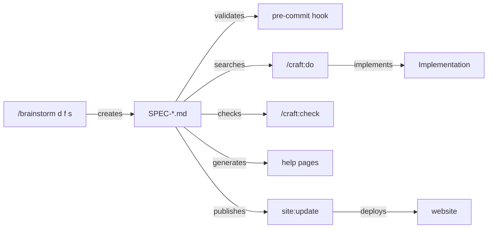

# SPEC: Spec Standards Integration into Craft Commands

**Status:** Draft
**Date:** 2026-01-16
**Priority:** High
**Target:** v1.21.0
**Effort:** ~20 hours (4 weeks phased)

---

## Problem Statement

Currently, craft has no standardized way to create, validate, or use specifications. Specs are ad-hoc, inconsistent, and disconnected from the development workflow. The help template spec we just created is comprehensive, but there's no system to ensure future specs follow the same structure. Without integration, specs will remain documentation artifacts rather than living implementation guides.

---

## Solution Overview

Integrate spec standards deeply into craft commands with a five-part solution:

1. **Template Embedding** - Store spec template v1.0.0 in brainstorm command
2. **Command Integration** - Connect brainstorm → do → check → site/docs commands
3. **Validation System** - Content validation on commit via pre-commit hook
4. **Website Publishing** - New Specifications section with category pages
5. **Smart Routing** - /craft:do searches specs by keyword for implementation guidance

**Key Principles:**
- Consistency: All specs use same template structure
- Validation: Content validation (not just format checking)
- Integration: Specs drive implementation (not just documentation)
- Versioning: Template versions for backward compatibility

---

## Scope

### In Scope

- ✅ Embed spec template v1.0.0 in `commands/workflow/brainstorm.md`
- ✅ Create validation module `tests/validate_specs.py`
- ✅ Add spec validation to pre-commit hook
- ✅ Implement spec search in `/craft:do`
- ✅ Add spec validation to `/craft:check`
- ✅ Create Specifications section on website
- ✅ Generate help pages from specs
- ✅ Template version tracking system

### Out of Scope

- ❌ Auto-migration tool (manual migration OK for now)
- ❌ Spec analytics/metrics (future enhancement)
- ❌ GitHub issue integration (future enhancement)
- ❌ Interactive spec editor (future enhancement)

---

## Design

### Template Storage (Embedded)

Template v1.0.0 lives in `commands/workflow/brainstorm.md` with these sections:

**Required Sections:**
1. Problem Statement (20+ words)
2. Solution Overview (20+ words)
3. Scope (In/Out with 1+ item each)
4. Design
5. Implementation Phases
6. Files Created/Modified
7. Success Metrics (1+ metric)
8. Risk Assessment
9. Dependencies
10. Open Questions
11. Next Steps

**Frontmatter:**
```yaml
---
version: 1.0.0
status: draft|approved|implemented|deprecated
created: YYYY-MM-DD
from_brainstorm: BRAINSTORM-*.md
---
```

### Validation Strategy (Content Validation)

| Section | Validation Rule |
|---------|----------------|
| Problem Statement | 20+ words (not just "N/A") |
| Solution Overview | 20+ words |
| Scope | Must have In/Out with 1+ item each |
| Success Metrics | 1+ metric defined |
| All others | Can be "N/A - [reason]" |

**Validation Triggers:**
- On commit (pre-commit hook) - blocks invalid specs
- In `/craft:check` - reports spec issues
- In `/craft:site:check` - validates before deployment

**Error Handling:** Block and prompt to fix (strict mode)

### Command Integration Map



### Website Structure

**Navigation Addition:**
```yaml
- Specifications:
  - Overview: specs/index.md
  - Feature Specs: specs/features.md
  - Architecture Specs: specs/architecture.md
  - API Specs: specs/api.md
```

**Spec Index Page:** List all specs grouped by category (draft/approved/implemented)

**Help ↔ Spec Links:** Help pages have "View Full Specification" link in footer

---

## Implementation Phases

### Phase 1: Foundation (Week 1 - 2-3 hours)

**Goal:** Embed template and validate specs on commit

**Tasks:**
1. Add spec template v1.0.0 to `commands/workflow/brainstorm.md`
2. Create `tests/validate_specs.py` module
3. Update `capture_spec()` function to use embedded template
4. Add spec validation to `.git/hooks/pre-commit`

**Deliverables:**
- Embedded template with all required sections
- Working validator (CLI + importable)
- Pre-commit hook blocks invalid specs

**Success Criteria:**
- [ ] `/craft:workflow:brainstorm d f s "test"` generates valid spec
- [ ] `python3 tests/validate_specs.py` validates existing specs
- [ ] Pre-commit hook catches missing sections

---

### Phase 2: Command Integration (Week 2 - 6-8 hours)

**Goal:** Connect specs to implementation workflow

**Tasks:**
1. Add `find_relevant_spec()` to `/craft:do`
2. Integrate spec search into smart routing
3. Add `check_specs()` to `/craft:check`
4. Add spec validation to `/craft:site:check`

**Deliverables:**
- Spec search by keyword (similarity matching)
- Check command validates specs
- Site check validates before deployment

**Success Criteria:**
- [ ] `/craft:do "implement X"` finds spec for X
- [ ] `/craft:check` shows spec validation results
- [ ] `/craft:site:check` blocks on invalid specs

---

### Phase 3: Website Integration (Week 3 - 6-8 hours)

**Goal:** Publish specs to documentation site

**Tasks:**
1. Add Specifications section to `mkdocs.yml`
2. Create `docs/specs/index.md` (spec index)
3. Create category pages (features.md, architecture.md, api.md)
4. Add `generate_help_from_spec()` to `/craft:docs:update`
5. Update help template to link to specs

**Deliverables:**
- Specifications section live on site
- Spec index with category filtering
- Help pages link to specs
- Auto-generate help from specs

**Success Criteria:**
- [ ] Specs section appears in site navigation
- [ ] Spec index lists all specs by category
- [ ] Help pages have "View Specification" links
- [ ] `/craft:docs:update generate-help-from-specs` works

---

### Phase 4: Template Versioning (Week 4 - 2-3 hours)

**Goal:** Track template versions and enable evolution

**Tasks:**
1. Create `docs/specs/TEMPLATE-VERSIONS.md`
2. Document v1.0.0 sections and validation rules
3. Add migration strategy for future versions
4. Update validator to check template version

**Deliverables:**
- Template version history documented
- Migration strategy defined
- Validator checks spec version

**Success Criteria:**
- [ ] TEMPLATE-VERSIONS.md exists
- [ ] Validator warns on outdated specs
- [ ] Backward compatibility policy documented

---

## Files Created/Modified

### New Files (Phase 1-4)

| File | Purpose | Lines (est) |
|------|---------|-------------|
| `tests/validate_specs.py` | Spec validation module | 150 |
| `docs/specs/index.md` | Spec index page | 80 |
| `docs/specs/features.md` | Feature specs category | 60 |
| `docs/specs/architecture.md` | Architecture specs category | 60 |
| `docs/specs/api.md` | API specs category | 60 |
| `docs/specs/TEMPLATE-VERSIONS.md` | Template version history | 100 |

**Total new:** ~510 lines across 6 files

### Modified Files (Phase 1-4)

| File | Changes | Lines (est) |
|------|---------|-------------|
| `commands/workflow/brainstorm.md` | Embed template, enhance capture | +200 |
| `commands/do.md` | Add spec search logic | +50 |
| `commands/check.md` | Add spec validation | +30 |
| `commands/site/check.md` | Add spec validation | +40 |
| `commands/docs/update.md` | Add help-from-spec generation | +60 |
| `commands/site/update.md` | Add specs to navigation | +30 |
| `commands/git/init.md` | Add spec validation to hook | +40 |
| `mkdocs.yml` | Add Specifications section | +10 |

**Total modified:** ~460 lines across 8 files

---

## Success Metrics

### Phase 1 (Foundation)

| Metric | Target | How to Measure |
|--------|--------|----------------|
| Template embedded | 100% | Grep for template v1.0.0 in brainstorm.md |
| Validator works | 100% passing specs | `python3 tests/validate_specs.py` exits 0 |
| Hook validates | 100% invalid specs blocked | Test with incomplete spec |

### Phase 2 (Command Integration)

| Metric | Target | How to Measure |
|--------|--------|----------------|
| Spec search accuracy | 80% correct matches | Manual testing with 10 requests |
| Check integration | All specs validated | `/craft:check` shows spec results |
| Site check blocks | Invalid specs rejected | Test with incomplete spec |

### Phase 3 (Website Integration)

| Metric | Target | How to Measure |
|--------|--------|----------------|
| Specs section live | 100% | Check site navigation |
| Spec index complete | All specs listed | Count specs in index vs docs/specs/ |
| Help links work | 50% help pages link to specs | Grep for "View Specification" |

### Phase 4 (Versioning)

| Metric | Target | How to Measure |
|--------|--------|----------------|
| Version tracked | All specs have version | Grep for "version: 1.0.0" |
| Migration guide exists | 100% | TEMPLATE-VERSIONS.md exists |

---

## Risk Assessment

| Risk | Likelihood | Impact | Mitigation |
|------|------------|--------|------------|
| **Template changes break old specs** | Medium | Medium | Version tracking + backward compat policy |
| **Validation too strict** | Low | High | Content validation only (not format), allow N/A |
| **Spec search mismatches** | Medium | Medium | Manual override: `--spec=SPEC-*.md` flag |
| **Help generation loses context** | Low | Medium | Keep specs comprehensive, help links to spec |
| **Pre-commit hook friction** | Low | Low | Allow skip with `--no-verify` flag |

---

## Dependencies

**None** - Pure Python/bash implementation

**Prerequisites:**
- Python 3.x (for validator)
- Bash (for pre-commit hook)
- MkDocs Material theme (already configured)

**Tool Requirements:**
- `re` module (standard library)
- `pathlib` module (standard library)
- No external dependencies

---

## Open Questions

1. **Should specs be required for all features?**
   - **Recommendation:** Start optional, require for High/Critical priority
   - **Decision:** TBD after Phase 3 (see adoption metrics)

2. **How to handle spec updates after implementation?**
   - **Recommendation:** Keep specs immutable, create v2 spec if design changes
   - **Decision:** Test with help-template spec (implementation → update spec?)

3. **Should specs be versioned (v1, v2) or timestamped?**
   - **Recommendation:** Timestamp in filename, version in frontmatter
   - **Decision:** Approved (current pattern works well)

4. **What about specs for bug fixes vs features?**
   - **Recommendation:** Specs for features only, bugs use GitHub issues
   - **Decision:** Approved (specs are for design, not bug tracking)

---

## Next Steps

### Immediate (This Session)

1. ✅ Complete deep feature brainstorming
2. ✅ Generate comprehensive plan
3. ✅ Auto-capture as SPEC-spec-integration-2026-01-16.md

### Next Session (Phase 1 - Week 1)

1. **Embed template** in `commands/workflow/brainstorm.md`
   - Copy template v1.0.0 from brainstorm
   - Add to "Spec Template (v1.0.0)" section
   - Update capture_spec() to use embedded template

2. **Create validator** `tests/validate_specs.py`
   - Implement REQUIRED_SECTIONS check
   - Implement CONTENT_RULES validation
   - Add CLI entry point

3. **Update pre-commit hook** in `commands/git/init.md`
   - Add spec validation block
   - Check required sections
   - Validate Problem Statement length

4. **Test end-to-end**
   - Run `/craft:workflow:brainstorm d f s "test"`
   - Validate generated spec
   - Commit spec and verify hook runs

**Time estimate:** 2-3 hours

### Week 2-4

Follow phased implementation plan (Phases 2-4)

---

**Specification Author:** Claude Sonnet 4.5
**Brainstorm Mode:** Deep Feature (12 questions)
**Plan File:** `/Users/dt/.claude/plans/purring-prancing-mango.md`
