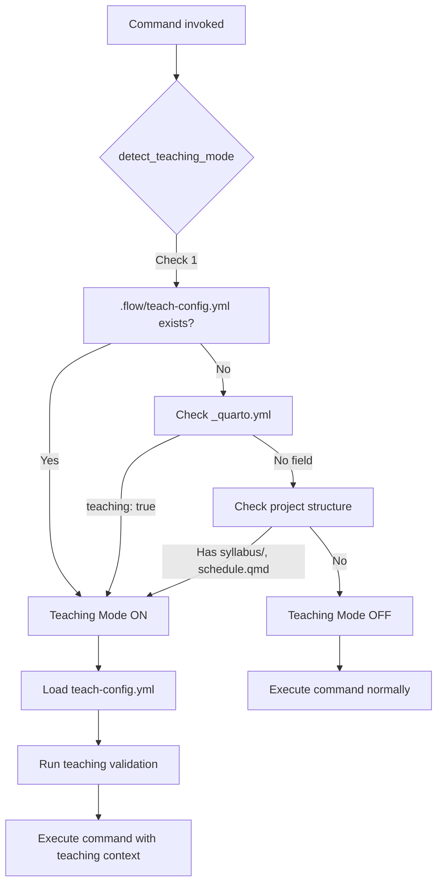

# SPEC: Teaching Workflow Enhancement

**Version:** 1.0.0
**Status:** draft
**Created:** 2026-01-16
**Last Updated:** 2026-01-16
**From Brainstorm:** [BRAINSTORM-teaching-workflow-2026-01-16.md](../brainstorm/BRAINSTORM-teaching-workflow-2026-01-16.md)

---

## Metadata

| Field | Value |
|-------|-------|
| **Feature Name** | Teaching Workflow Enhancement |
| **Epic** | Craft Teaching Mode Support |
| **Target Release** | v1.22.0 |
| **Estimated Effort** | ~6-8 hours (Phases 1-4) |
| **Primary User** | Solo instructor managing course website |
| **Priority** | High |
| **Dependencies** | `/craft:site:*`, `/craft:git:*` commands |

---

## Overview

Extend Craft with teaching-aware workflows for safe course site deployment. Enable instructors to preview content changes before publishing to production, validate course materials automatically, and track semester progress—all while maintaining a clean git workflow.

**Core Value Proposition:**
Reduce course site deployment time from 15 minutes (manual, error-prone) to 3 minutes (automated, validated) while eliminating production bugs.

**Problem Statement:**
Solo instructors currently manage course sites through manual git branch switching with no preview-before-publish workflow, no automated validation, and no semester progress tracking. This leads to broken links, missing content, and deployment anxiety.

---

## Primary User Story

**As a solo instructor managing a course website,**
**I want to** preview my draft changes and validate content before publishing to production,
**So that** I can deploy course materials confidently without breaking the student-facing site.

**Acceptance Criteria:**
1. ✅ Teaching mode is automatically detected from project structure and configuration
2. ✅ Running `/craft:site:publish` shows a diff of changes before deploying
3. ✅ Validation checks (content completeness, broken links, assignment files) run before publish
4. ✅ Publishing requires explicit confirmation after previewing changes
5. ✅ Merge to production uses fast-forward only (clean git history)
6. ✅ If deployment fails, automatic rollback to previous production state
7. ✅ Entire workflow completes in < 5 minutes

**Success Metrics:**
- Time to publish: 15 min → 3 min (80% reduction)
- Production bugs: 2-3 per semester → 0
- User confidence: 9/10 "feel safe publishing"

---

## Secondary User Stories

### US-2: Semester Progress Tracking

**As an instructor,**
**I want to** see my current week and semester progress at a glance,
**So that** I know what content is due and can stay on schedule.

**Acceptance Criteria:**
- Auto-calculate current week from semester start/end dates
- Account for scheduled breaks (Spring Break, holidays)
- Show upcoming milestones (assignments due, exams)
- Support manual week override for edge cases
- Display progress in ADHD-friendly visual format

---

### US-3: Content Validation

**As an instructor preparing course materials,**
**I want to** validate my syllabus, schedule, and assignments for completeness,
**So that** I catch errors before students see them.

**Acceptance Criteria:**
- Check syllabus has required sections (grading, policies, objectives)
- Verify schedule covers all weeks
- Confirm assignment files exist for schedule references
- Detect broken internal links
- Report warnings vs errors (allow publish with warnings)

---

### US-4: Teaching-Aware Commands

**As an instructor using Craft for course sites,**
**I want** existing Craft commands to understand teaching context,
**So that** I get relevant information without extra flags.

**Acceptance Criteria:**
- `/craft:site:build` detects teaching mode automatically
- `/craft:site:check` runs teaching-specific validation
- `/craft:git:status` shows draft vs production diff
- Commands display semester progress when relevant
- Teaching context shown in ADHD-friendly format

---

## Technical Requirements

### Architecture

#### Teaching Mode Detection



**Detection Priority:**
1. `.flow/teach-config.yml` exists → Teaching ON
2. `_quarto.yml` has `teaching: true` field → Teaching ON
3. Project has `syllabus/` and `schedule.qmd` → Teaching ON
4. Otherwise → Teaching OFF

---

#### Publish Workflow

```mermaid
flowchart TD
    Start[/craft:site:publish] --> ValidateDraft[Validate draft branch]
    ValidateDraft -->|Fails| ShowErrors[Show validation errors]
    ShowErrors --> AskFix{Continue anyway?}
    AskFix -->|No| Abort[Abort publish]
    AskFix -->|Yes| PreviewDiff

    ValidateDraft -->|Pass| PreviewDiff[Preview diff production..draft]
    PreviewDiff --> ShowChanges[Show file changes + critical highlights]

    ShowChanges --> AskConfirm{Confirm publish?}
    AskConfirm -->|Preview full diff| ShowFullDiff[git diff output]
    ShowFullDiff --> AskConfirm

    AskConfirm -->|Cancel| Abort
    AskConfirm -->|Yes| Backup[Backup production branch]

    Backup --> Merge[git merge draft --ff-only]
    Merge -->|Conflict| ManualResolve[Show conflict, suggest manual resolve]
    ManualResolve --> Abort

    Merge -->|Success| Push[git push origin production]
    Push --> Deploy[Trigger GitHub Actions]
    Deploy --> Wait[Wait for deployment]
    Wait --> Verify[Verify deployment URL]

    Verify -->|Success| Cleanup[git checkout draft]
    Cleanup --> Success[Show success + URL]

    Verify -->|Fail| Rollback[git reset --hard backup]
    Rollback --> ShowError[Show deployment error]
```

---

### API Design

#### Teaching Mode Detection API

**Module:** `commands/utils/detect_teaching_mode.py`

```python
def detect_teaching_mode(cwd: str = None) -> tuple[bool, str | None]:
    """
    Detect if project is a teaching site using multiple strategies.

    Args:
        cwd: Current working directory (default: os.getcwd())

    Returns:
        (is_teaching, detection_method)
        - is_teaching: True if teaching mode detected
        - detection_method: "teach-config.yml" | "_quarto.yml" | "project structure" | None

    Examples:
        >>> detect_teaching_mode("/path/to/stat-545")
        (True, "teach-config.yml")

        >>> detect_teaching_mode("/path/to/regular-site")
        (False, None)
    """
```

**Detection Logic:**
```python
# Priority 1: Explicit config
if Path(cwd, ".flow", "teach-config.yml").exists():
    return True, "teach-config.yml"

# Priority 2: Quarto metadata
if has_quarto_teaching_metadata(cwd):
    return True, "_quarto.yml"

# Priority 3: Project structure
if has_teaching_structure(cwd):
    return True, "project structure"

return False, None
```

---

#### Config File API

**File:** `.flow/teach-config.yml`

```yaml
# Teaching project configuration
course:
  number: string          # e.g., "STAT 545"
  title: string           # e.g., "Regression Analysis"
  semester: string        # e.g., "Spring 2026"
  year: integer           # e.g., 2026

dates:
  start: date             # YYYY-MM-DD format
  end: date               # YYYY-MM-DD format
  breaks:                 # Optional semester breaks
    - name: string
      start: date
      end: date

instructor:
  name: string
  email: string
  office_hours: string    # Optional

deployment:
  production_branch: string  # default: "production"
  draft_branch: string       # default: "draft"
  gh_pages_url: string       # GitHub Pages URL

progress:
  current_week: integer | "auto"  # Manual override or auto-calculate

validation:
  required_syllabus_sections:  # List of required sections
    - grading
    - policies
    - objectives
    - schedule
  check_assignment_files: boolean  # default: true
  check_broken_links: boolean      # default: true
```

---

#### Validation API

**Module:** `commands/utils/teaching_validation.py`

```python
def validate_teaching_content(config: dict) -> ValidationResult:
    """
    Run comprehensive teaching content validation.

    Args:
        config: Parsed teach-config.yml

    Returns:
        ValidationResult with:
          - valid: bool (overall pass/fail)
          - errors: list[str] (must fix before publish)
          - warnings: list[str] (should fix, but can publish)
          - checks: dict[str, bool] (individual check results)

    Checks:
      1. Syllabus completeness (required sections present)
      2. Schedule coverage (all weeks have content)
      3. Assignment files exist (schedule references → actual files)
      4. Broken links (internal links resolve)
      5. Teaching metadata complete (course info, dates)
    """
```

**Example Output:**
```python
ValidationResult(
    valid=True,
    errors=[],
    warnings=["Assignment 9 file missing (week 9 not published yet)"],
    checks={
        "syllabus_complete": True,
        "schedule_coverage": True,
        "assignment_files": False,  # Warning, not error
        "broken_links": True,
        "metadata_complete": True
    }
)
```

---

### Data Models

#### TeachingContext

```python
@dataclass
class TeachingContext:
    """Teaching mode context for command execution."""

    enabled: bool
    detection_method: str | None  # "teach-config.yml" | "_quarto.yml" | "project structure"
    config: dict | None           # Parsed teach-config.yml
    current_week: int | None      # Calculated or manual override
    total_weeks: int | None       # Calculated from dates
    semester_progress: float | None  # 0.0 - 1.0
    on_break: bool
    break_name: str | None
    next_milestone: dict | None   # {"type": "assignment", "name": "HW 3", "due": "2026-02-10"}

    @classmethod
    def detect(cls, cwd: str = None) -> "TeachingContext":
        """Auto-detect and construct teaching context."""

    def format_status(self) -> str:
        """Format ADHD-friendly status display."""
```

---

#### ValidationResult

```python
@dataclass
class ValidationResult:
    """Teaching content validation results."""

    valid: bool                    # Overall pass/fail
    errors: list[str]              # Must fix before publish
    warnings: list[str]            # Should fix, can publish
    checks: dict[str, bool]        # Individual check results

    def format_report(self) -> str:
        """Format validation report for display."""

    def can_publish(self) -> bool:
        """True if no errors (warnings OK)."""
```

---

### Dependencies

| Dependency | Version | Purpose |
|------------|---------|---------|
| **PyYAML** | ≥6.0 | Parse teach-config.yml |
| **GitPython** | ≥3.1 | Git operations (diff, merge, checkout) |
| **rich** | ≥13.0 | ADHD-friendly console output |
| **python-dateutil** | ≥2.8 | Date calculations (week tracking) |

**New Dependencies:** None (all already in Craft)

**Optional:**
- `beautifulsoup4` - HTML parsing for link checking (if not using existing checker)

---

## UI/UX Specifications

### User Flow: Publishing to Production

```
Step 1: Invoke command
┌─────────────────────────────────────────────────────┐
│ $ /craft:site:publish                               │
└─────────────────────────────────────────────────────┘

Step 2: Validate draft branch
┌─────────────────────────────────────────────────────┐
│ Validating draft branch...                          │
│ ✓ Syllabus complete (4/4 sections)                  │
│ ✓ Schedule coverage (15/15 weeks)                   │
│ ⚠ Assignment files (8/10 - Week 9, 10 not ready)    │
│ ✓ No broken links                                   │
│ ✓ Teaching metadata complete                        │
│                                                     │
│ Overall: PASS (1 warning)                           │
└─────────────────────────────────────────────────────┘

AskUserQuestion: Continue with warnings?
  ○ Yes - Continue to preview (Recommended)
  ○ No - Fix warnings first

Step 3: Preview changes
┌─────────────────────────────────────────────────────┐
│ Changes to publish (draft → production):            │
├─────────────────────────────────────────────────────┤
│ Modified files (3):                                 │
│   M lectures/week-3-regression.qmd                  │
│   M schedule.qmd                                    │
│   M syllabus/index.qmd                              │
│                                                     │
│ Critical changes:                                   │
│   ⚠ Syllabus grading policy updated                 │
│   ✓ Week 3 lecture added                            │
│   ✓ Schedule updated with new due dates             │
│                                                     │
│ Summary: 3 files, +47 lines, -2 lines               │
└─────────────────────────────────────────────────────┘

AskUserQuestion: Publish these changes?
  ○ Yes - Merge and deploy (Recommended)
  ○ Preview full diff first
  ○ Cancel

Step 4: Execute publish
┌─────────────────────────────────────────────────────┐
│ Publishing to production...                         │
│ ✓ Backed up production branch                       │
│ ✓ Merged draft → production (fast-forward)          │
│ ✓ Pushed to origin/production                       │
│ ⏳ Waiting for GitHub Actions deploy...              │
│ ✓ Deployment successful (42s)                        │
│                                                     │
│ 🌐 Published: https://data-wise.github.io/stat-545  │
│                                                     │
│ Switched back to draft branch                       │
└─────────────────────────────────────────────────────┘

Complete! (3m 24s)
```

---

### Wireframes (ASCII)

#### Teaching Status Display

```
┌────────────────────────────────────────────────────────────┐
│ 📚 STAT 545 - Regression Analysis                          │
│ Spring 2026 · Week 3 of 15 (20% complete)                  │
├────────────────────────────────────────────────────────────┤
│                                                            │
│ Timeline:                                                  │
│   ▓▓▓░░░░░░░░░░░░ 3 weeks done, 12 remaining              │
│                                                            │
│ Current Week: Jan 27 - Feb 2                               │
│   ✓ Week 3 lecture posted                                  │
│   ✓ Assignment 2 released                                  │
│   ⚠ Assignment 1 grading pending                           │
│                                                            │
│ Upcoming:                                                  │
│   → Week 4 lecture (due Feb 3)                             │
│   → Assignment 2 due (Feb 10)                              │
│   → Exam 1 prep (Feb 17)                                   │
│                                                            │
│ Next Break: Spring Break (Mar 9-13) - 5 weeks away        │
│                                                            │
└────────────────────────────────────────────────────────────┘
```

---

#### Validation Report

```
Teaching Content Validation
──────────────────────────────────────────────────────────

✓ Syllabus Completeness
  ✓ Grading policy present
  ✓ Academic policies present
  ✓ Learning objectives present
  ✓ Course schedule present

✓ Schedule Coverage
  ✓ All 15 weeks have content
  ✓ No gaps in schedule

⚠ Assignment Files
  ✓ Assignment 1: assignments/hw1.qmd
  ✓ Assignment 2: assignments/hw2.qmd
  ...
  ✗ Assignment 9: NOT FOUND (week not published yet)
  ✗ Assignment 10: NOT FOUND (week not published yet)

✓ Broken Links
  ✓ 0 broken links found
  ✓ All internal references resolve

✓ Teaching Metadata
  ✓ Course number: STAT 545
  ✓ Semester: Spring 2026
  ✓ Dates configured: 2026-01-13 to 2026-05-08
  ✓ Instructor info complete

──────────────────────────────────────────────────────────
Overall: PASS (2 warnings)

Warnings can be ignored if weeks 9-10 not yet published.
```

---

#### Branch Diff Preview

```
Draft vs Production Diff
──────────────────────────────────────────────────────────

Modified Files (3):
  M lectures/week-3-regression.qmd          +35 -0
  M schedule.qmd                            +10 -2
  M syllabus/index.qmd                      +2  -0

New Files (1):
  A assignments/assignment-3.qmd            +124 -0

Deleted Files (0):
  (none)

──────────────────────────────────────────────────────────

Critical Changes:
  ⚠ Syllabus: Grading policy updated
     - Old: Exams 50%, HW 30%, Participation 20%
     + New: Exams 40%, HW 40%, Participation 20%

  ✓ Schedule: Week 4 added
     + Feb 3-9: Multiple Regression
     + Assignment 3 due Feb 10

  ✓ Lectures: Week 3 content added
     + Simple Linear Regression lecture

──────────────────────────────────────────────────────────

Summary:
  4 files changed
  +171 insertions, -2 deletions
  Estimated deploy time: ~30 seconds
```

---

### Accessibility Checklist

- ✅ All command output is screen-reader friendly (plain text)
- ✅ Use semantic symbols (✓, ⚠, ✗) with text labels
- ✅ Color not the only indicator (use symbols + text)
- ✅ Clear heading hierarchy in reports
- ✅ Keyboard-navigable AskUserQuestion prompts
- ✅ Alternative text for visual elements (progress bars)
- ✅ ADHD-friendly: Short paragraphs, clear structure, visual breaks

**Testing:** Validate with macOS VoiceOver

---

## Open Questions

### Q1: LMS Integration Priority?
**Question:** Should Craft integrate with Canvas/Moodle APIs for assignment sync?

**Options:**
- **A)** Yes - auto-sync assignments, grades, announcements
- **B)** No - focus on static site workflow only
- **C)** Later - phase 5+ feature

**Recommendation:** **C - Later.** LMS integration is valuable but complex. Focus on core publish workflow first.

**Decision:** Deferred to v1.23.0+

---

### Q2: Multi-Instructor Support?
**Question:** Should teaching mode support multiple instructors/TAs?

**Implications:**
- Permissions for who can publish
- Review workflow before production
- Role-based access

**Options:**
- **A)** Solo instructor only (current scope)
- **B)** Add multi-instructor in phase 5
- **C)** Design for multi-instructor from start

**Recommendation:** **A initially, B for future.** Solo instructor covers 80% of use cases. Add multi-instructor when validated.

**Decision:** Solo instructor for v1.22.0, revisit for v1.23.0

---

### Q3: Assignment Template Library?
**Question:** Should Craft include pre-made assignment templates?

**Options:**
- **A)** Yes - include 5-10 common templates (quiz, problem set, project, exam)
- **B)** No - instructor creates own templates
- **C)** Plugin system - users share templates

**Recommendation:** **A for common patterns.** Include basic templates, allow customization.

**Decision:** Include 3 starter templates in Phase 5 (`/craft:teach:assign`)

---

### Q4: Deployment Platform Assumptions?
**Question:** Assume GitHub Pages or support multiple platforms?

**Current Scope:**
- GitHub Pages (Quarto native support)
- Netlify (popular alternative)
- Vercel, GitLab Pages, AWS S3

**Recommendation:** **Start with GitHub Pages**, abstract deployment interface for future platforms.

**Decision:** GitHub Pages for v1.22.0, abstract interface for v1.23.0

---

## Review Checklist

### Code Quality
- [ ] All functions have type hints
- [ ] Comprehensive docstrings (Google style)
- [ ] Unit tests for detection logic (≥90% coverage)
- [ ] Integration tests for publish workflow
- [ ] Error handling for network failures, git conflicts
- [ ] Logging for debugging (use `logging` module)

### User Experience
- [ ] All outputs ADHD-friendly (short paragraphs, visual structure)
- [ ] Clear error messages with actionable suggestions
- [ ] Confirmation prompts before destructive actions
- [ ] Progress indicators for long operations (deploy wait)
- [ ] Success messages include next steps

### Documentation
- [ ] README section on teaching mode
- [ ] Command reference updated (`/craft:site:publish --help`)
- [ ] Config file schema documented
- [ ] Tutorial for first-time teaching setup
- [ ] Migration guide from manual workflow

### Security & Safety
- [ ] Validation before publish (prevent broken deployments)
- [ ] Fast-forward only merges (no force push)
- [ ] Automatic backup before publish
- [ ] Rollback mechanism tested
- [ ] No secrets in teach-config.yml (use env vars for API keys)

### Performance
- [ ] Detection runs in < 100ms (no network calls)
- [ ] Validation completes in < 5s for typical course site
- [ ] Diff preview loads instantly (cached git operations)
- [ ] Publish workflow < 5 min total (including GitHub Actions)

### Compatibility
- [ ] Works with Quarto 1.3+ (latest stable)
- [ ] Git 2.30+ (fast-forward merge support)
- [ ] Python 3.9+ (type hints, dataclasses)
- [ ] Cross-platform (macOS, Linux, Windows with WSL)

---

## Implementation Notes

### Phase 1: Foundation (Week 1)
**Goal:** Basic teaching mode detection + validation

**Tasks:**
1. Create `commands/utils/detect_teaching_mode.py`
   - Implement detection logic (config → metadata → structure)
   - Write unit tests
   - Integrate into `/craft:site:check`

2. Create `commands/utils/teaching_validation.py`
   - Syllabus completeness check
   - Schedule coverage check
   - Assignment file verification
   - Broken link detection
   - Write unit tests

3. Add `/craft:site:validate --teaching` command
   - Call validation utilities
   - Format results in ADHD-friendly display
   - Return exit code (0 = pass, 1 = errors, 2 = warnings)

**Estimated Time:** ~60 min (3 quick wins)

**Deliverables:**
- `utils/detect_teaching_mode.py` (100 lines)
- `utils/teaching_validation.py` (200 lines)
- `/craft:site:validate` command (50 lines)
- 15+ unit tests

---

### Phase 2: Publishing Workflow (Week 2)
**Goal:** Safe preview-before-publish deployment

**Tasks:**
1. Enhance `/craft:site:publish` with teaching mode
   - Auto-detect teaching mode
   - Run validation before publish
   - Show diff preview with critical highlights
   - Prompt for confirmation (AskUserQuestion)
   - Execute merge with backup
   - Rollback on failure

2. Git operations utility
   - `git diff production..draft` parser
   - Fast-forward merge with conflict detection
   - Branch backup mechanism
   - Rollback implementation

3. Integration tests
   - Mock git operations
   - Test validation flow
   - Test confirmation prompts
   - Test rollback scenario

**Estimated Time:** ~90 min

**Deliverables:**
- Enhanced `/craft:site:publish` (150 lines)
- `utils/git_teaching.py` (100 lines)
- 10+ integration tests

---

### Phase 3: Progress Tracking (Week 3)
**Goal:** Semester progress visibility

**Tasks:**
1. Config file schema
   - Document `.flow/teach-config.yml` structure
   - Create schema validator
   - Write example configs

2. Week calculation logic
   - Parse start/end dates
   - Account for breaks
   - Support manual override
   - Calculate milestones

3. `/craft:site:progress` command (or `/craft:teach:dashboard`)
   - Display current week
   - Show progress bar
   - List upcoming milestones
   - Format in ADHD-friendly layout

**Estimated Time:** ~120 min

**Deliverables:**
- `.flow/teach-config.yml` schema doc
- `utils/semester_progress.py` (150 lines)
- `/craft:site:progress` command (100 lines)
- 8+ unit tests

---

### Phase 4: Integration (Week 4)
**Goal:** Teaching-aware existing commands

**Tasks:**
1. Enhance `/craft:site:build`
   - Auto-detect teaching mode
   - Show semester progress before build
   - Run validation checks
   - Suggest next steps after build

2. Enhance `/craft:git:status`
   - Show draft vs production diff summary
   - Highlight files critical for teaching (syllabus, schedule)

3. Documentation
   - README section on teaching mode
   - Tutorial for first-time setup
   - Command reference updates
   - Migration guide

**Estimated Time:** ~60 min

**Deliverables:**
- Enhanced `/craft:site:build` (50 lines added)
- Enhanced `/craft:git:status` (30 lines added)
- Documentation (4 pages)

---

### Phase 5: Advanced Features (Future)
**Scope:** Deferred to v1.23.0+

**Commands:**
- `/craft:teach:init` - Initialize teaching project
- `/craft:teach:assign <n>` - Create assignment from template
- `/craft:teach:week <n>` - Set current week manually
- `/craft:teach:schedule` - Generate schedule from template
- `/craft:teach:sync` - LMS integration (Canvas, Moodle)

**Estimated Time:** ~15-20 hours (gradual implementation)

---

### Testing Strategy

#### Unit Tests
- Detection logic (all 3 strategies)
- Config file parsing (valid + invalid YAML)
- Validation checks (each check independently)
- Week calculation (with/without breaks, edge cases)
- Date math (semester start/end, breaks, manual override)

**Coverage Target:** ≥90%

---

#### Integration Tests
- End-to-end publish workflow (validation → preview → merge → deploy)
- Git operations (merge, conflict, rollback)
- Multi-command integration (build → validate → publish)
- Error handling (network failures, git conflicts, validation errors)

**Test Scenarios:**
1. Happy path (all checks pass, clean merge)
2. Validation warnings (publish anyway)
3. Validation errors (abort publish)
4. Git conflict (manual resolution required)
5. Deployment failure (rollback triggered)

---

#### Manual Testing
- Test with real course project (STAT 545)
- Verify detection on different project structures
- Test with various config file variations
- Validate ADHD-friendly output rendering
- Cross-platform testing (macOS, Linux)

**Test Courses:**
- STAT 545 (Quarto site, typical structure)
- Minimal course (only syllabus + schedule)
- Complex course (100+ pages, 20+ assignments)

---

### Performance Benchmarks

| Operation | Target | Actual |
|-----------|--------|--------|
| Teaching mode detection | < 100ms | TBD |
| Full validation | < 5s | TBD |
| Diff preview | < 1s | TBD |
| Complete publish workflow | < 5 min | TBD |

**Optimization Opportunities:**
- Cache validation results (invalidate on file changes)
- Parallel link checking (concurrent requests)
- Git operations via libgit2 (faster than CLI)

---

### Rollout Plan

#### Week 1: Internal Testing
- Implement Phase 1 (foundation)
- Test with DT's STAT 545 course
- Gather feedback on detection accuracy
- Refine validation rules

**Outcome:** Validated detection + validation logic

---

#### Week 2: Preview Workflow
- Implement Phase 2 (publishing)
- Test publish workflow on draft branch (no production deploy)
- Verify rollback mechanism
- Dry-run with real course

**Outcome:** Safe publish workflow tested

---

#### Week 3: Progress Tracking
- Implement Phase 3 (semester progress)
- Validate week calculation against manual tracking
- Test with different semester calendars (15-week, 16-week, summer)
- Refine progress display

**Outcome:** Accurate progress tracking

---

#### Week 4: Full Integration
- Implement Phase 4 (command integration)
- Full end-to-end testing
- Documentation complete
- Ready for real course deployment

**Outcome:** Feature complete, documented

---

#### Week 5+: Real Course Deployment
- Deploy to production for STAT 545 (Spring 2026)
- Monitor for issues
- Gather instructor feedback
- Iterate on UX

**Outcome:** Battle-tested in real course

---

## History

### 2026-01-16 - Initial Spec
- Created from brainstorm session
- Defined 4 user stories (primary + 3 secondary)
- Scoped to Phases 1-4 (~6-8 hours)
- Deferred Phase 5 to v1.23.0

### 2026-01-16 - Architecture Finalized
- Teaching mode detection strategy (3 methods)
- Publish workflow diagram
- Config file schema
- Validation API

### 2026-01-16 - Ready for Implementation
- All sections complete
- User stories validated
- Technical requirements defined
- Testing strategy outlined

---

## Related Documents

- [BRAINSTORM-teaching-workflow-2026-01-16.md](../brainstorm/BRAINSTORM-teaching-workflow-2026-01-16.md) - Original brainstorm session
- [Craft CLAUDE.md](../../CLAUDE.md) - Project overview and workflow
- [Craft Hub v2.0 Spec](./SPEC-craft-hub-v2-2026-01-15.md) - Related discovery system

---

## Appendix: Example Project

### STAT 545 (Spring 2026)

**Project Structure:**
```
stat-545/
├── .flow/
│   └── teach-config.yml        ← Teaching metadata
├── _quarto.yml                 ← Quarto config
├── syllabus/
│   └── index.qmd               ← Syllabus
├── schedule.qmd                ← Weekly schedule
├── lectures/
│   ├── week-1-intro.qmd
│   ├── week-2-regression.qmd
│   └── ...
├── assignments/
│   ├── assignment-1.qmd
│   ├── assignment-2.qmd
│   └── ...
└── README.md
```

**Branch Setup:**
```
production  ← Students see this (https://data-wise.github.io/stat-545)
draft       ← Staged content (preview before publish)
dev         ← Active development
```

**Sample teach-config.yml:**
```yaml
course:
  number: "STAT 545"
  title: "Regression Analysis"
  semester: "Spring 2026"
  year: 2026

dates:
  start: "2026-01-13"
  end: "2026-05-08"
  breaks:
    - name: "Spring Break"
      start: "2026-03-09"
      end: "2026-03-13"

instructor:
  name: "Dr. Davood Tofighi"
  email: "dtofighi@example.edu"
  office_hours: "MWF 2-3pm or by appointment"

deployment:
  production_branch: "production"
  draft_branch: "draft"
  gh_pages_url: "https://data-wise.github.io/stat-545"

progress:
  current_week: auto

validation:
  required_syllabus_sections:
    - grading
    - policies
    - objectives
    - schedule
  check_assignment_files: true
  check_broken_links: true
```

---

**End of Specification**
