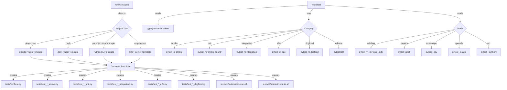

# SPEC: Test Generation & Execution Refactor

**Status:** reviewed
**Created:** 2026-02-18
**From Brainstorm:** `BRAINSTORM-test-gen-refactor-2026-02-18.md`
**Author:** DT + Claude

---

## Overview

Consolidate Craft's test infrastructure from 7 overlapping commands + 2 skills into 2 commands (`/craft:test`, `/craft:test:gen`) with first-class support for 4 project types (Claude plugins, ZSH plugins, Python CLIs, MCP servers). Establish shared test helpers, pytest markers, and tiered CI integration. Add full lifecycle e2e and dogfood test generation.

---

## Primary User Story

**As a** developer managing multiple project types (Claude plugins, ZSH scripts, Python CLIs, MCP servers),
**I want** a single test generation command that produces appropriate automated + interactive test suites per project type,
**So that** I can quickly set up comprehensive testing without remembering which of 7 commands to use.

### Acceptance Criteria

- [ ] `/craft:test:gen` auto-detects project type and generates appropriate test suite
- [ ] `/craft:test` runs tests with category filtering (`smoke`, `unit`, `integration`, `e2e`, `dogfood`)
- [ ] Old commands (`test:cli-gen`, `test:cli-run`, `test:coverage`, `test:debug`, `test:watch`) deprecated with aliases
- [ ] Plugin template includes full lifecycle e2e (install, load, invoke, verify, uninstall)
- [ ] ZSH template validates sourcing, function availability, completions
- [ ] MCP template validates protocol compliance and tool execution
- [ ] All test files use pytest with markers (no more CheckResult pattern or raw unittest)
- [ ] Shared `tests/helpers.py` eliminates duplicated utilities across test files
- [ ] `pyproject.toml` has `[tool.pytest.ini_options]` with all markers defined
- [ ] Documentation deliverables: help reference, tutorial, architecture guide for revised commands
- [ ] Tutorial covers: getting started with `/craft:test:gen`, running tiers, adding custom tests
- [ ] Architecture doc explains: template system, project detection, test tier model, CI integration
- [ ] Help reference documents: all arguments, flags, modes, project types, examples
- [ ] `/craft:test:template` command manages template lifecycle (`list`, `show`, `edit`, `add`, `update`, `validate`, `diff`)
- [ ] Template directory with `_base/` partials and per-type subdirs (`plugin/`, `zsh/`, `cli/`, `mcp/`)
- [ ] `registry.json` defines template metadata, detection rules, and required variables
- [ ] Template update mechanism re-renders generated tests when templates change

---

## Secondary User Stories

### Cross-Project Testing

**As a** developer with 16+ projects in `~/projects/dev-tools/`,
**I want** consistent test patterns across projects,
**So that** I don't need to remember different test conventions per project.

### CI Integration

**As a** CI pipeline,
**I want** tiered test execution (smoke < 2 min, unit < 5 min, e2e < 30 min),
**So that** PRs get fast feedback while nightly builds run comprehensive suites.

### Interactive QA

**As a** developer doing manual QA before releases,
**I want** interactive test suites with visual comparison,
**So that** I can verify output formatting, colors, and UX that automated tests can't catch.

---

## Architecture



---

## API Design

### /craft:test — Unified Runner

| Argument | Type | Default | Description |
|----------|------|---------|-------------|
| `category` | positional | `unit` | Test tier: `smoke`, `unit`, `integration`, `e2e`, `dogfood`, `release` |
| `path` | positional | auto | Specific test file or directory |
| `--filter` | string | none | Test name filter pattern |
| `--debug` | flag | false | Verbose output + pdb on failure |
| `--watch` | flag | false | Re-run on file changes |
| `--coverage` | flag | false | Collect coverage data |
| `--parallel` | flag | false | Run tests in parallel |
| `--ci` | flag | false | CI mode (JUnit XML, no colors) |
| `--dry-run` / `-n` | flag | false | Preview execution plan |

### /craft:test:gen — Unified Generator

| Argument | Type | Default | Description |
|----------|------|---------|-------------|
| `type` | positional | auto-detect | Project type: `plugin`, `zsh`, `cli`, `mcp` |
| `category` | positional | `all` | What to generate: `smoke`, `unit`, `integration`, `e2e`, `dogfood`, `all` |
| `--interactive` | flag | true | Include interactive QA suite |
| `--ci` | flag | false | Include CI workflow YAML |
| `--fixtures` | flag | false | Generate test fixture files |
| `--output` | string | `tests/` | Output directory |
| `--force` | flag | false | Overwrite existing test files |

### /craft:test:template — Template & Skill Management

Manage, inspect, and update the Jinja2 test templates and the `test-generator` skill.

| Argument | Type | Default | Description |
|----------|------|---------|-------------|
| `action` | positional | `list` | Action: `list`, `show`, `edit`, `add`, `update`, `validate`, `diff` |
| `type` | positional | none | Project type: `plugin`, `zsh`, `cli`, `mcp` |
| `category` | positional | none | Test tier: `smoke`, `unit`, `integration`, `e2e`, `dogfood` |
| `--dry-run` / `-n` | flag | false | Preview changes without writing |

#### Actions

| Action | What it does | Example |
|--------|-------------|---------|
| `list` | Show all templates with project type and tier | `/craft:test:template list` |
| `show [type] [category]` | Display a specific template's content | `/craft:test:template show plugin smoke` |
| `edit [type] [category]` | Open template for editing, validate on save | `/craft:test:template edit zsh e2e` |
| `add [type]` | Scaffold a new project type template set | `/craft:test:template add quarto` |
| `update` | Re-render existing generated tests from updated templates | `/craft:test:template update` |
| `validate` | Check all templates for syntax errors and completeness | `/craft:test:template validate` |
| `diff [type]` | Show drift between templates and generated tests | `/craft:test:template diff plugin` |

#### Template Lifecycle

```
Create template (.j2)
    ↓
/craft:test:template validate   ← Check Jinja2 syntax, required variables
    ↓
/craft:test:gen [type]          ← Render template → test files
    ↓
(templates updated)
    ↓
/craft:test:template diff       ← Show what changed vs generated tests
    ↓
/craft:test:template update     ← Re-render tests from updated templates
```

#### Template Directory Structure

```
templates/
├── _base/                      # Shared partials
│   ├── conftest.py.j2          # Common conftest fixture generation
│   ├── helpers.py.j2           # Common test helper generation
│   ├── automated_base.sh.j2    # Bash test boilerplate (colors, counters)
│   └── interactive_base.sh.j2  # Interactive test boilerplate
├── plugin/                     # Claude Code plugin templates
│   ├── smoke.py.j2
│   ├── unit.py.j2
│   ├── integration.py.j2
│   ├── e2e.py.j2
│   ├── dogfood.py.j2
│   ├── automated.sh.j2
│   └── interactive.sh.j2
├── zsh/                        # ZSH plugin templates
│   ├── smoke.py.j2
│   ├── unit.py.j2
│   ├── integration.py.j2
│   ├── e2e.sh.j2              # ShellSpec format
│   └── automated.sh.j2
├── cli/                        # Python/Node CLI templates
│   ├── smoke.py.j2
│   ├── unit.py.j2
│   ├── integration.py.j2
│   ├── e2e.py.j2
│   ├── dogfood.py.j2
│   ├── snapshot.py.j2
│   └── automated.sh.j2
├── mcp/                        # MCP server templates
│   ├── smoke.py.j2
│   ├── unit.py.j2
│   ├── integration.py.j2
│   ├── e2e.py.j2
│   └── automated.sh.j2
└── registry.json               # Template metadata and variable schemas
```

#### Template Variables (per project type)

Each template receives a context dict from the detector. Example for `plugin`:

```python
# Context passed to plugin templates
{
    "project_name": "craft",
    "project_root": "/Users/dt/projects/dev-tools/craft",
    "plugin_json": {"name": "craft", "version": "2.21.0", ...},
    "command_count": 111,
    "skill_count": 25,
    "agent_count": 8,
    "command_files": ["commands/test/run.md", ...],
    "skill_dirs": ["skills/release", ...],
    "has_hooks": True,
    "hook_files": ["branch-guard.sh"],
    "date": "2026-02-18",
}
```

#### registry.json Schema

```json
{
  "version": "1.0.0",
  "types": {
    "plugin": {
      "description": "Claude Code plugin",
      "detect": [".claude-plugin/plugin.json"],
      "required_vars": ["project_name", "plugin_json", "command_count"],
      "tiers": ["smoke", "unit", "integration", "e2e", "dogfood"],
      "templates": {
        "smoke": "plugin/smoke.py.j2",
        "unit": "plugin/unit.py.j2"
      }
    }
  }
}
```

#### Validation Checks

| Check | What it verifies |
|-------|------------------|
| Jinja2 syntax | Template parses without errors |
| Required variables | All `{{ var }}` refs exist in the type's `required_vars` |
| Base inheritance | `` and `` targets exist |
| Output parseable | Rendered output is valid Python/Bash syntax |
| Marker coverage | Every generated test file uses at least one pytest marker |
| Tier completeness | Each project type has all expected tiers |

#### Update Mechanism

`/craft:test:template update` re-renders generated tests from current templates:

1. Find all projects that have tests generated by craft (check for `# Generated by /craft:test:gen` header comment)
2. Read the original context (stored as JSON comment at top of generated file)
3. Re-render from updated template with same context
4. Show diff before writing
5. Write if user confirms (or `--force`)

```
$ /craft:test:template update

  TEMPLATE UPDATE
  ===============
  Found 4 projects with craft-generated tests:

  craft (plugin):
    tests/test_plugin_smoke.py ........ 3 lines changed
    tests/test_plugin_unit.py ......... no changes
    tests/cli/automated-tests.sh ...... 8 lines changed

  rforge (plugin):
    tests/test_plugin_smoke.py ........ 3 lines changed

  Apply changes? (y/n/diff)
```

### Skill: test-template-manager

Advisory skill that understands template patterns, helps users write custom templates, and troubleshoots template rendering issues.

**When to use:**

- User wants to add a new project type template
- Template rendering produces unexpected output
- User wants to customize generated tests beyond what templates provide
- Need to understand template variable schema

---

## Data Models

### pytest marker configuration (`pyproject.toml`)

```toml
[tool.pytest.ini_options]
testpaths = ["tests"]
markers = [
    "smoke: critical path tests (every commit, < 2 min)",
    "unit: function-level tests (every commit, < 5 min)",
    "integration: filesystem/subprocess tests (every PR, < 15 min)",
    "e2e: full pipeline tests (nightly/pre-release, < 30 min)",
    "dogfood: self-testing against real state (pre-release, < 10 min)",
    "slow: tests taking > 5s",
    "snapshot: output comparison tests",
]
```

### Test template registry (internal)

```python
TEMPLATES = {
    "plugin": {
        "detect": [".claude-plugin/plugin.json"],
        "smoke": "templates/plugin_smoke.py.j2",
        "unit": "templates/plugin_unit.py.j2",
        "integration": "templates/plugin_integration.py.j2",
        "e2e": "templates/plugin_e2e.py.j2",
        "dogfood": "templates/plugin_dogfood.py.j2",
        "automated_sh": "templates/plugin_automated.sh.j2",
        "interactive_sh": "templates/plugin_interactive.sh.j2",
    },
    "zsh": {
        "detect": ["*.plugin.zsh", "*.zsh", "functions/"],
        "smoke": "templates/zsh_smoke.py.j2",
        ...
    },
    "cli": {
        "detect": ["pyproject.toml+scripts", "package.json+bin"],
        ...
    },
    "mcp": {
        "detect": ["mcp-server/", "server.py", "server.ts"],
        ...
    },
}
```

---

## Dependencies

| Dependency | Purpose | Required? |
|------------|---------|-----------|
| `pytest` | Test runner | Yes (already used) |
| `jinja2` | Template engine for test generation | Yes (Phase 2) |
| `shellspec` | ZSH/shell testing framework | Yes (Phase 3, `brew install shellspec`) |
| `pytest-xdist` | Parallel execution (`-n auto`) | Optional |
| `pytest-watch` | Watch mode | Optional |
| `pytest-cov` | Coverage | Optional |
| `syrupy` | Snapshot testing | Optional (Phase 4) |
| `hypothesis` | Property-based testing | Optional (Phase 4) |

---

## UI/UX Specifications

### Detect + Confirm Flow

```
$ /craft:test:gen

  Detecting project type...

  PROJECT DETECTED
  ================
  Type: Claude Code Plugin
  Name: craft
  Commands: 111
  Skills: 25
  Agents: 8

  Test categories to generate:
    [x] smoke     - Plugin structure validation (6 tests)
    [x] unit      - Command/skill file validation (111+ tests)
    [x] integration - Command routing, hook execution (15 tests)
    [x] e2e       - Full lifecycle (install/load/invoke) (8 tests)
    [x] dogfood   - Self-testing against real state (12 tests)
    [x] interactive - Human-guided visual QA (20 scenarios)

  Total: ~172 tests across 7 files

  Proceed? (y/n/customize)
```

### Test Runner Output

```
$ /craft:test smoke

  SMOKE TESTS (craft)
  ====================
  [1/6] Plugin JSON valid .............. PASS  0.01s
  [2/6] Commands dir exists ............ PASS  0.00s
  [3/6] Skills dir exists .............. PASS  0.00s
  [4/6] No unrecognized keys ........... PASS  0.02s
  [5/6] Version matches ................ PASS  0.01s
  [6/6] File counts consistent ......... PASS  0.15s

  6 passed in 0.19s
```

### Accessibility

- N/A — CLI only, uses standard terminal colors with `--no-color` fallback
- All output readable without ANSI codes

---

## Resolved Questions

1. **Template engine: Jinja2 (`.j2` files)** — Adds `jinja2` dependency but templates are readable, editable, and maintainable. Store in `templates/` directory within the plugin.
2. **Shared test library: `/craft:test:gen` generates it** — Each project gets a fresh `tests/helpers.py` tailored to its type. No cross-project coupling. The generator command creates helpers appropriate for the detected project type.
3. **Shell testing: ShellSpec** — Native ZSH support, built-in mocking, BDD-style, JUnit XML output for CI. Install via `brew install shellspec`.
4. **Deprecation: Remove immediately** — Clean break. Old commands (`test:cli-gen`, `test:cli-run`, `test:coverage`, `test:debug`, `test:watch`) will be deleted, not aliased. Update docs in the same release.

---

## Review Checklist

- [ ] Spec reviewed by stakeholder
- [ ] Architecture diagram accurate
- [ ] All project types covered
- [ ] Migration path clear
- [ ] No breaking changes without deprecation
- [ ] Test count estimates realistic
- [ ] Dependencies acceptable

---

## Implementation Notes

### Phase 1: Foundation (Priority: HIGH)

- Add `[tool.pytest.ini_options]` to `pyproject.toml`
- Create `tests/helpers.py` with shared utilities extracted from existing tests
- Enrich `tests/conftest.py` with fixtures (`craft_root`, `temp_plugin_dir`, `temp_git_repo`)
- Add `@pytest.mark.*` markers to ALL existing 70 test files
- Migrate 10 CheckResult-pattern files to pytest (`test_craft_plugin.py`, `test_hub_*.py`, etc.)

### Phase 2: Command Consolidation (Priority: HIGH)

- Create new `commands/test.md` (unified runner)
- Create new `commands/test/gen.md` (unified generator)
- Create new `commands/test/template.md` (template manager — list, show, edit, add, update, validate, diff)
- Create `templates/` directory with `_base/` shared partials and per-type subdirs (`plugin/`, `zsh/`, `cli/`, `mcp/`)
- Create `templates/registry.json` with type metadata, detection rules, and required variables
- Deprecate: `test:cli-gen`, `test:cli-run`, `test:coverage`, `test:debug`, `test:watch`
- Update `test-generator` skill to delegate to `test:gen`

### Phase 2.5: Documentation (Priority: HIGH — ships with Phase 2)

- **Help reference** (`docs/guide/test-commands.md`) — full argument/flag reference for `/craft:test` and `/craft:test:gen`, all project types, all tiers, examples
- **Tutorial** (`docs/tutorials/testing-quickstart.md`) — step-by-step: detect project → generate tests → run smoke → run full suite → add custom tests → CI integration
- **Architecture guide** (`docs/guide/test-architecture.md`) — template system design, Jinja2 templates, project detection logic, test tier model, ShellSpec integration, CI pipeline patterns
- **Migration guide** (`docs/guide/test-migration.md`) — how to move from old commands to new ones, marker tagging guide for existing tests
- Update `CLAUDE.md` Quick Commands table with new test commands
- Update mkdocs nav with new doc pages

### Phase 3: Project Type Templates (Priority: MEDIUM)

- Templates are Jinja2 files in `templates/<type>/` directories
- Each type gets: `smoke.py.j2`, `unit.py.j2`, `integration.py.j2`, `e2e.py.j2`, `dogfood.py.j2`, `automated.sh.j2`, `interactive.sh.j2`
- Claude Code plugin template (most complex, full lifecycle)
- ZSH plugin template (new capability)
- Python CLI template (enhanced from current)
- MCP server template (new capability)

### Phase 4: Advanced Features (Priority: LOW)

- Snapshot testing with syrupy
- Property-based testing with Hypothesis
- Contract tests for plugin.json strict schema
- CI workflow YAML generation

### Phase 5: Cross-Project (Priority: FUTURE)

- Shared test library package
- Affected-project detection
- Cross-project dogfood tests

---

## History

| Date | Change |
|------|--------|
| 2026-02-18 | Initial draft from max brainstorm session |
| 2026-02-18 | Interactive review: resolved 4 open questions, status → reviewed |
| 2026-02-18 | Added documentation deliverables: help ref, tutorial, architecture, migration guide |
| 2026-02-18 | Added `/craft:test:template` command, template directory structure, registry.json, and update mechanism |
