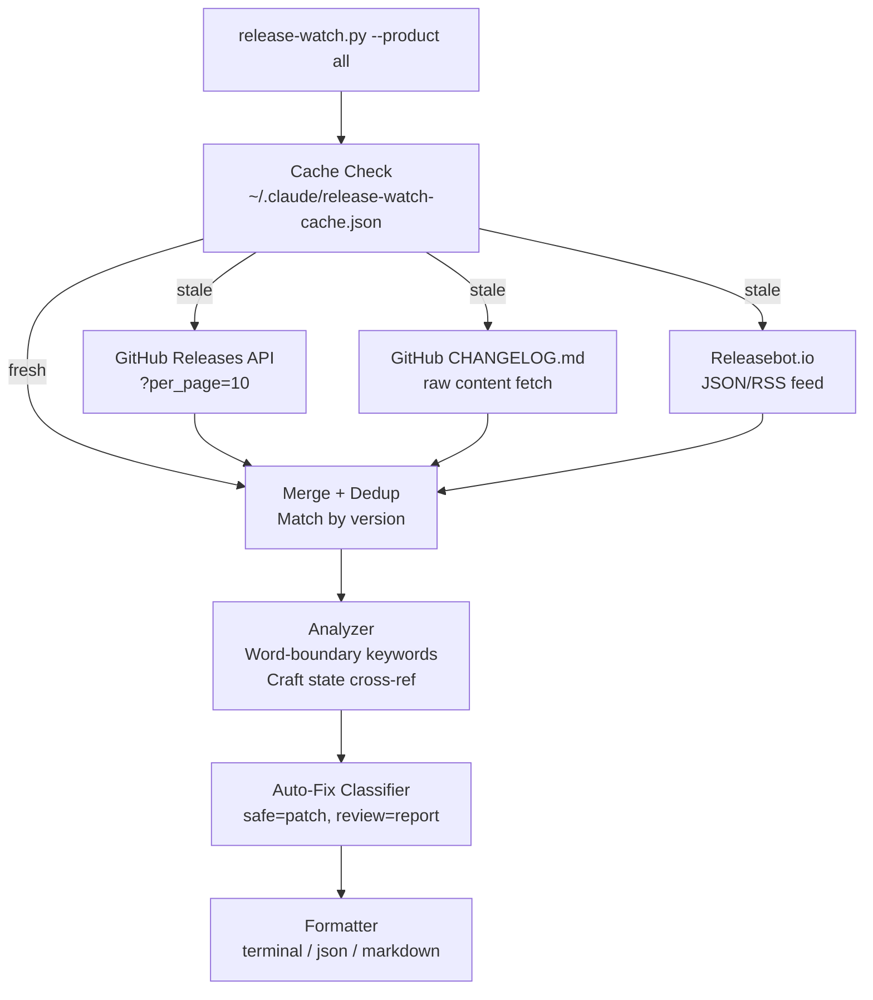

# SPEC: Unified Release Watch v2

**Status:** draft
**Created:** 2026-02-26
**From Brainstorm:** BRAINSTORM-unified-release-watch-2026-02-26.md
**Supersedes:** SPEC-release-watcher-2026-02-21.md

---

## Overview

Redesign `scripts/release-watch.py` to track both Claude Code CLI and Claude Desktop releases in a single unified tool. Replace the noisy keyword-only scanning with structured CHANGELOG parsing, add a 24h cache to avoid redundant API calls, integrate releasebot.io for Desktop tracking, and introduce propose-only auto-fix for safe items like model pattern updates.

---

## Primary User Story

**As a** craft plugin maintainer running a pre-release check,
**I want** a single command that shows what changed in Claude Code AND Desktop since my last release,
**so that** I can catch breaking changes, adopt new features, and update stale model references before shipping.

### Acceptance Criteria

- [ ] `python3 scripts/release-watch.py` tracks both Code and Desktop (default `--product all`)
- [ ] `--product code` reproduces exact current behavior (backward compatible)
- [ ] `--product desktop` replaces the web-search-based `desktop-watch` command
- [ ] Fetches only needed releases (no `--paginate` fetching all history)
- [ ] Results cached in `~/.claude/release-watch-cache.json` with 24h per-source TTL
- [ ] CHANGELOG.md enriches findings with structured Added/Fixed/Improved categorization
- [ ] Keyword matching uses word boundaries (`\b`) to reduce false positives
- [ ] `--auto-fix` generates a patch file (propose-only), never modifies files directly
- [ ] Auto-fix proposals only sourced from GitHub API data, never releasebot.io
- [ ] All existing tests pass; new tests added for cache, CHANGELOG parser, and Desktop source
- [ ] Exit code 0 for all runs (advisory tool, not a gate)

---

## Secondary User Stories

**As a** CI pipeline operator, **I want** `--strict` mode that only reports BREAKING/DEPRECATED findings, **so that** I can gate releases on critical upstream changes without noise.

**As a** developer working offline, **I want** the tool to use cached data when network is unavailable, **so that** I still get useful output from my last successful fetch.

---

## Architecture



### Single-File Layout (sectioned)

```
scripts/release-watch.py
  ├── Constants & Config
  ├── Cache Layer (load, save, freshness check)
  ├── Source: GitHub Releases API (?per_page=N)
  ├── Source: GitHub CHANGELOG.md (parser)
  ├── Source: Releasebot.io (Desktop)
  ├── Merge & Deduplicate
  ├── Analyzer (keyword scan + craft state)
  ├── Auto-Fix Classifier
  ├── Formatters (terminal, json, markdown)
  └── Main (CLI + orchestration)
```

---

## API Design

N/A -- CLI tool, not a REST API. The `--format json` output is the machine-readable interface.

### JSON Output Schema (v2)

```json
{
  "version": 2,
  "products": {
    "code": {
      "releases_checked": 5,
      "latest_version": "v2.1.59",
      "findings": { "new": [], "deprecated": [], "breaking": [], "fixed": [] }
    },
    "desktop": {
      "releases_checked": 3,
      "latest_version": "2026-02-25",
      "findings": { "new": [], "deprecated": [], "breaking": [], "fixed": [] }
    }
  },
  "craft_state": { "hardcoded_models": [], "agent_features": {} },
  "action_items": [],
  "source_status": {}
}
```

---

## Data Models

```python
@dataclass
class UnifiedRelease:
    product: str              # "code" | "desktop"
    version: str
    date: str
    body_github: str          # From GitHub Releases API
    body_changelog: dict      # {"added": [...], "fixed": [...]}
    source: str               # "github+changelog" | "releasebot"

@dataclass
class ActionItem:
    description: str
    product: str
    version: str
    category: str             # NEW, DEPRECATED, BREAKING, FIXED
    risk: str                 # "safe" | "review"
    auto_fix: str | None      # What the patch would do

@dataclass
class FetchResult:
    success: bool
    data: Any
    source: str
    error: str | None
    from_cache: bool
```

---

## Dependencies

| Dependency | Required | Fallback |
|------------|----------|----------|
| `gh` CLI (authenticated) | Yes (for Code) | Error with install instructions |
| `curl` | Yes (for releasebot.io) | subprocess with urllib fallback |
| `python3` | Yes | Already required by craft |

---

## UI/UX Specifications

### Terminal Output (unified)

```
RELEASE WATCH -- Claude Code + Desktop

  Sources:
    GitHub Releases: fresh (5 releases)
    CHANGELOG.md: fresh (enriched 5 versions)
    Releasebot.io: fresh (3 Desktop entries)

  CLAUDE CODE (latest: v2.1.59, 2026-02-26)
  NEW
  - v2.1.59: Auto-memory saves context (plugin, feature)
  - v2.1.59: /copy command for code blocks (command, new)

  CLAUDE DESKTOP (latest: 2026-02-25)
  NEW
  - 2026-02-25: Scheduled tasks in Cowork (feature)
  - 2026-02-25: Customize section for plugins (plugin)

  CRAFT STATE
  Hardcoded models: 12 reference(s)
    - claude-opus-4-6, claude-sonnet-4-6

  Action Items: 2 item(s)
    - [safe] Update MODEL_PATTERNS: add claude-sonnet-4-6
    - [review] Check Desktop plugin grouping feature
```

### User Flow

```
Start --> Check cache --> Fetch stale sources --> Merge --> Analyze
  --> Display findings --> (if --auto-fix) Generate .patch file
  --> Show next steps
```

N/A -- No wireframes (CLI only).

**Accessibility:** All output includes `--format markdown` plain-text fallback.

---

## Security Constraints

| Constraint | Enforcement |
|------------|-------------|
| Releasebot.io data is secondary/read-only | Source-tag all findings; exclude from auto-fix |
| Auto-fix is propose-only | Generate `.patch` file, never modify files directly |
| Cache permissions | `0o700` dir, `0o600` files |
| No shell injection | List-form `subprocess.run()` only (already done) |
| Subprocess timeouts | 30s for GitHub API, 10s for releasebot.io |
| Advisory exit codes | Always exit 0 (findings are info, not errors) |

---

## Open Questions

1. **Releasebot.io API format** -- Need to verify JSON endpoint (`/updates/anthropic/claude.json`). RSS is fallback. Verify before Increment 5.
2. **`sync-features` skill update** -- Currently chains 3 commands; unified tool simplifies. Update in a follow-up.
3. **Test mocking** -- How to test releasebot.io without network? Fixture JSON file + `--test-source` flag?

---

## Review Checklist

- [ ] All existing `test_release_watch.py` tests still pass
- [ ] `--product code --count 1 --format json` output matches v1 schema (backward compat)
- [ ] Cache created with correct permissions (`0o700`/`0o600`)
- [ ] `--refresh` bypasses cache for all sources
- [ ] CHANGELOG parser handles format changes gracefully (warns, doesn't crash)
- [ ] Releasebot.io timeout doesn't block the tool (10s max, stale cache fallback)
- [ ] Auto-fix patch file is valid `git apply` input
- [ ] `MODEL_PATTERNS` updated with Claude 4.x family
- [ ] Word-boundary matching enabled for all keywords

---

## Implementation Notes

- **Start with quick wins** (Increment 1): Fix `per_page`, word boundaries, model patterns, FIXED bug. These improve the existing tool immediately.
- **Cache second** (Increment 2): Foundation for all multi-source work.
- **CHANGELOG enrichment third** (Increment 3): Biggest signal-to-noise improvement.
- **Releasebot.io last** (Increment 5): Needs API verification; highest risk item.
- **Keep single-file convention**: Matches `claude_md_sync.py`, `validate-counts.sh` patterns.
- **v1 JSON output compatibility**: `--product code` must produce output parseable by existing tests.

### Increments

| # | Deliverable | Effort | Risk |
|---|-------------|--------|------|
| 1 | Quick wins (per_page, \b regex, models, FIXED bug) | 30 min | Low |
| 2 | Cache layer + `--refresh` + `--no-cache` | 30 min | Low |
| 3 | CHANGELOG.md parser + merge logic | 1 hour | Medium |
| 4 | Verify releasebot.io API format | 15 min | Research |
| 5 | Releasebot.io fetcher + `--product` flag | 1 hour | Medium |
| 6 | Auto-fix propose mode | 45 min | Low |
| 7 | Unified output + command file updates | 30 min | Low |
| 8 | Tests (cache, CHANGELOG, Desktop, backward compat) | 30 min | Low |

**Total: ~5 hours across 2-3 sessions**

---

## History

| Date | Event |
|------|-------|
| 2026-02-21 | Original brainstorm + spec (SPEC-release-watcher) |
| 2026-02-26 | Code review identified 5 issues in current implementation |
| 2026-02-26 | Max brainstorm: unified redesign with 2 agents (architect + security) |
