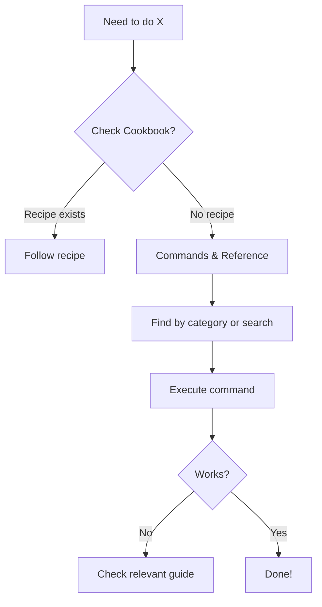

# Website Organization Standard

**Status:** draft
**Created:** 2026-01-17
**From Brainstorm:** [BRAINSTORM-website-organization-2026-01-17.md](../brainstorm/BRAINSTORM-website-organization-2026-01-17.md)
**Applies to:** Craft documentation site (MkDocs)

---

## Overview

This specification defines the standard for organizing the Craft documentation website to serve three distinct user audiences (beginners, daily users, advanced) while maintaining clarity, discoverability, and ADHD-friendly navigation patterns.

**Design Principles:**
1. **Progressive disclosure** - Show what's needed, hide complexity until required
2. **Task-oriented** - Organize by what users want to accomplish
3. **Scannable** - Visual hierarchy with strategic emoji use
4. **Consistent** - Predictable patterns across sections
5. **Accessible** - Mobile-friendly, reduced cognitive load

---

## Primary User Story

**As a Craft user**, I want to quickly find documentation relevant to my needs without being overwhelmed by navigation complexity, so I can accomplish my task efficiently.

**Acceptance Criteria:**
- New users find Quick Start in < 5 seconds
- Daily users locate specific commands in ≤ 2 clicks
- Advanced users access architecture docs without navigating through beginner content
- Mobile users can scroll sidebar comfortably (< 2 screen heights)
- Zero broken links after any reorganization

---

## Secondary User Stories

### Beginner User Story

**As a new Craft user**, I want a clear entry point that guides me to my first successful command, so I can understand what Craft does without reading extensive documentation.

**Journey:**
1. Land on site → See "Getting Started" section
2. Click Quick Start → 30-second tutorial
3. Run first command → Success!
4. Optional: Choose learning path (visual, ADHD, deep-dive)

### Daily User Story

**As a daily Craft user**, I want command references and recipes organized by task, so I can quickly look up syntax or find solutions to common problems.

**Journey:**
1. Know what I want → Check Cookbook first
2. Need command syntax → Commands & Reference
3. Troubleshooting → Search or check relevant guide

### Advanced User Story

**As an advanced Craft user or contributor**, I want clear separation between user guides and technical architecture, so I can deep-dive into implementation details or contribute improvements.

**Journey:**
1. Need architecture → Reference & Architecture section
2. Want to contribute → For Contributors section
3. Extend functionality → Skills & Agents reference

---

## Technical Requirements

### Architecture

#### Navigation Structure (8 Top-Level Sections)

```yaml
nav:
  # 1. GETTING STARTED (Entry point for all users)
  - 🚀 Getting Started:
    - Quick Start                  # 30-second tutorial
    - ADHD Guide                   # 2-minute focused guide
    - Choose Your Path             # Personalized journey selection
    - Visual Workflows             # Flowcharts and diagrams
    - Playground                   # Interactive command testing

  # 2. GUIDES & TUTORIALS (Task-oriented learning)
  - 📖 Guides & Tutorials:
    - Core Workflows:
      - Documentation Automation
      - Site Creation
      - Release Management
      - Development Workflow
    - Teaching Mode:
      - Overview & Quick Start
      - Setup Tutorial
      - Complete Guide
      - Config Schema & Migration
    - Specialized Features:
      - Git Repository Init
      - Orchestration & Agents
      - Homebrew Distribution

  # 3. COMMANDS & REFERENCE (Merged Help section)
  - ⚙️ Commands & Reference:
    - Command Overview             # High-level categories
    - By Category:
      - Smart Commands            # do, check, hub, orchestrate
      - Documentation
      - Site Management
      - Code & Testing
      - Git & CI
      - Architecture
      - Distribution
      - Planning
    - Complete A-Z Reference      # Alphabetical list

  # 4. COOKBOOK & EXAMPLES (Use case driven)
  - 📚 Cookbook & Examples:
    - Common Recipes:
      - Set up new project
      - Deploy course website
      - Automate release
      - Check code quality
    - Advanced Patterns:
      - Multi-agent orchestration
      - Custom documentation sites
      - Teaching mode automation

  # 5. REFERENCE & ARCHITECTURE (Technical deep-dive)
  - 🔧 Reference & Architecture:
    - Configuration
    - Design Presets
    - Skills & Agents
    - Orchestrator Deep Dive
    - Architecture Overview

  # 6. FOR CONTRIBUTORS (Development)
  - 🛠️ For Contributors:
    - Development Setup
    - Documentation Quality
    - CI/CD Templates
    - Testing & Validation

  # 7. QUICK REFERENCE CARD (Printable)
  - 📋 Quick Reference Card
```

**Rationale:**
- **7 sections** vs 14 (50% reduction)
- **Emoji refinement** - Strategic use for key sections only
- **Merged Help** - Eliminates duplication with Commands
- **Playground nested** - Under Getting Started as learning tool
- **Task-oriented** - Guides organized by workflow, not feature
- **Progressive** - Entry point (Getting Started) → Learning (Guides) → Reference → Advanced

#### Nesting Depth Rules

| Section | Max Depth | Rationale |
|---------|-----------|-----------|
| Getting Started | 2 levels | Keep simple for beginners (5 pages: Quick Start, ADHD, Choose Path, Workflows, Playground) |
| Guides & Tutorials | 3 levels | Allow workflow → topic → page |
| Commands & Reference | 3 levels | Category → subcategory → command |
| Cookbook | 2 levels | Recipe category → recipe |
| Reference & Architecture | 2 levels | Topic → page |
| For Contributors | 2 levels | Guide category → guide |

**Variable nesting:** Complex sections (Guides, Commands) can go deeper; simple sections (Getting Started, Cookbook) stay shallow.

#### Emoji Usage Standard

**Approved emojis (5):**
- 🚀 Getting Started (energy, movement, launch) - includes Playground
- 📖 Guides & Tutorials (learning, books)
- ⚙️ Commands & Reference (technical, settings)
- 📚 Cookbook & Examples (collection, library)
- 📋 Quick Reference Card (checklist, document)

**No emojis:**
- 🔧 Reference & Architecture (professional tone)
- 🛠️ For Contributors (serious, technical)

**Rationale:** Emojis for user-facing sections; professional tone for technical sections. Playground nested under Getting Started, so no separate emoji needed.

### API Design

N/A - This is documentation organization, not code API.

### Data Models

#### Page Metadata Standard

Every documentation page must include:

```yaml
---
title: "Page Title"
description: "One-sentence description"
category: "getting-started|guides|commands|cookbook|reference|contributors"
level: "beginner|intermediate|advanced"
time_estimate: "30 seconds|2 minutes|10 minutes"
related:
  - path/to/related-page.md
  - path/to/another-page.md
---
```

**Example:**
```yaml
---
title: "Quick Start"
description: "Run your first Craft command in 30 seconds"
category: "getting-started"
level: "beginner"
time_estimate: "30 seconds"
related:
  - ADHD-QUICK-START.md
  - guide/getting-started.md
---
```

#### Cookbook Recipe Template

```markdown
# Recipe: [Action Verb + Object]

**Time:** [X minutes]
**Level:** [Beginner|Intermediate|Advanced]
**Prerequisites:** [Required setup]

## Problem

[User's goal in one sentence - "I want to..."]

## Solution

[Step-by-step commands with explanations]

1. **Step name**
   ```bash
   command here
   ```
   Why: [Brief explanation]

2. **Next step**
   ...

## Explanation

[How the solution works, what's happening behind the scenes]

## Variations

- **Variation 1:** [When to use, how it differs]
- **Variation 2:** [Alternative approach]

## Troubleshooting

| Issue | Solution |
|-------|----------|
| [Common error] | [How to fix] |

## Related

- [Related Guide](../guide/relevant-guide.md)
- [Related Command](../commands/relevant-command.md)
- [Related Recipe](another-recipe.md)
```

### Dependencies

**MkDocs plugins required:**

```yaml
plugins:
  - search                        # Built-in search
  - redirects:                    # URL preservation
      redirect_maps:
        'help/hub.md': 'commands/overview.md#hub'
        'help/do.md': 'commands/smart.md#do'
        # ... (see URL Preservation section)
  - awesome-pages:               # Optional: Enhanced navigation
      collapse_single_pages: true
```

**Python dependencies:**
```
mkdocs>=1.5.0
mkdocs-material>=9.5.0
mkdocs-redirects>=1.2.0
```

### URL Preservation Strategy

**Required redirects (Phase 1):**

```yaml
plugins:
  - redirects:
      redirect_maps:
        # Help → Commands merger
        'help/hub.md': 'commands/overview.md#hub'
        'help/do.md': 'commands/smart.md#do'
        'help/check.md': 'commands/smart.md#check'
        'help/orchestrate.md': 'guide/orchestrator.md'
        'help/git-worktree.md': 'commands/git.md#worktree'
        'help/docs-update.md': 'commands/docs.md#update'
        'help/ci-generate.md': 'commands/git.md#ci'
        'help/brainstorm.md': 'commands/plan.md#brainstorm'

        # Git Init reorganization
        'git-init-docs-index.md': 'guides/git-init/index.md'
        'commands/git-init-reference.md': 'guides/git-init/reference.md'
        'guide/git-init-tutorial.md': 'guides/git-init/tutorial.md'
        'architecture/git-init-flow.md': 'guides/git-init/architecture.md'
```

**No breaks policy:**
- All guide pages preserved
- All command reference pages preserved
- Top-level entry points (index, QUICK-START, REFCARD)

---

## UI/UX Specifications

### User Flow: New User Journey

```mermaid
graph TD
    Land[Land on site] --> GetStart[See "🚀 Getting Started"]
    GetStart --> Quick[Click "Quick Start"]
    Quick --> Run[Run first command in 30s]
    Run --> Success{Success?}
    Success -->|Yes| Choose[See "Choose Your Path"]
    Success -->|No| Trouble[Check troubleshooting]
    Choose --> Path{Select path}
    Path -->|Visual learner| Workflows[Visual Workflows]
    Path -->|ADHD-friendly| ADHD[ADHD Guide]
    Path -->|Deep dive| Guide[Complete Guide]
```

### User Flow: Daily User Journey



### Wireframe: "Choose Your Path" Page

```
┌─────────────────────────────────────────────────────────────┐
│ # Choose Your Learning Path                                 │
├─────────────────────────────────────────────────────────────┤
│                                                             │
│ ┌───────────────────────────────────────────────────────┐   │
│ │ 🆕 I'm New to Craft                                   │   │
│ │                                                       │   │
│ │ Goal: Understand what Craft does and run first cmd   │   │
│ │                                                       │   │
│ │ → Quick Start (30 seconds)                            │   │
│ │ → Visual Workflows (5 minutes)                        │   │
│ │ → ADHD Guide (2 minutes)                              │   │
│ └───────────────────────────────────────────────────────┘   │
│                                                             │
│ ┌───────────────────────────────────────────────────────┐   │
│ │ 💼 I Use Craft Daily                                  │   │
│ │                                                       │   │
│ │ Goal: Look up commands, troubleshoot, optimize       │   │
│ │                                                       │   │
│ │ → Command Overview                                    │   │
│ │ → Quick Reference Card                                │   │
│ │ → Cookbook (common recipes)                           │   │
│ └───────────────────────────────────────────────────────┘   │
│                                                             │
│ ┌───────────────────────────────────────────────────────┐   │
│ │ 🏗️ I'm Building on Craft                              │   │
│ │                                                       │   │
│ │ Goal: Extend, contribute, deep-dive architecture     │   │
│ │                                                       │   │
│ │ → Skills & Agents                                     │   │
│ │ → Orchestrator Deep Dive                              │   │
│ │ → Architecture Overview                               │   │
│ │ → For Contributors                                    │   │
│ └───────────────────────────────────────────────────────┘   │
│                                                             │
└─────────────────────────────────────────────────────────────┘
```

### Accessibility Checklist

- [ ] Keyboard navigation works throughout
- [ ] Color contrast meets WCAG AA standards
- [ ] All emojis have text alternatives
- [ ] Headings form logical hierarchy
- [ ] Links have descriptive text (not "click here")
- [ ] Mobile sidebar scrollable with one hand
- [ ] Focus indicators visible
- [ ] Screen reader friendly navigation

---

## Open Questions

1. **Teaching Mode placement:** Should it move earlier in navigation (currently #4 in Guides)?
   - **Status:** Open
   - **Stakeholder:** Documentation team
   - **Decision by:** Next planning session

2. **Playground nesting:** ~~Should it nest under Getting Started or stay top-level?~~
   - **Status:** ✅ RESOLVED - 2026-01-17
   - **Decision:** Nest under Getting Started (option B)
   - **Rationale:** Makes sense as learning/tutorial tool for beginners

3. **Search implementation:** Which search approach?
   - **Status:** Deferred to Phase 3
   - **Options:**
     - A) MkDocs built-in search (current)
     - B) Algolia DocSearch (free for open source)
     - C) Custom tag-based search (requires plugin)

---

## Review Checklist

- [ ] **Navigation audit**
  - Sidebar has ≤ 8 top-level sections
  - No section duplicates content
  - Max nesting follows depth rules
  - Emojis used consistently

- [ ] **User journey testing**
  - New user finds Quick Start in < 5s
  - Daily user finds command in ≤ 2 clicks
  - Advanced user accesses architecture docs easily
  - Mobile sidebar comfortable (< 2 screen heights)

- [ ] **URL preservation**
  - All redirects configured in mkdocs.yml
  - Critical pages preserved
  - No broken internal links
  - External links to site still work

- [ ] **Content quality**
  - All pages have metadata (title, description, level)
  - Cookbook recipes follow template
  - Cross-links between related pages
  - Consistent terminology throughout

- [ ] **Accessibility**
  - Keyboard navigation works
  - Color contrast passes WCAG AA
  - Screen reader friendly
  - Mobile responsive

- [ ] **Performance**
  - Page load time < 2s
  - Search responsive
  - Sidebar renders quickly
  - No JavaScript errors

---

## Implementation Notes

### Phase 1: Quick Wins (< 1 hour)

**Priority:** High (blocking Phase 2)

**Steps:**
1. Back up current mkdocs.yml
2. Update navigation structure (20 min)
3. Create Choose Your Path page (15 min)
4. Test all links (10 min)
5. Commit and deploy (5 min)

**Files modified:**
- `mkdocs.yml` (navigation section)
- `docs/getting-started/choose-path.md` (new)

**Breaking changes:** None (redirects preserve URLs)

### Phase 2: Medium Effort (2-4 hours)

**Priority:** Medium (can defer)

**Steps:**
1. Create cookbook directory structure (15 min)
2. Write 4 common recipes (90 min)
3. Merge help/*.md into commands/* (45 min)
4. Add visual workflow index (30 min)
5. Test and commit (15 min)

**Files modified:**
- `docs/cookbook/` (new directory)
- `docs/commands/` (merged help content)
- `docs/workflows/index.md` (enhanced)
- `mkdocs.yml` (cookbook navigation, redirects)

**Breaking changes:** Help section URLs (redirects added)

### Testing Strategy

**Unit tests:** N/A (documentation)

**Integration tests:**
1. Link checker - all internal links resolve
2. Redirect verification - old URLs redirect correctly
3. Mobile rendering - sidebar scrollable
4. Search indexing - all pages indexed

**Manual tests:**
1. User journey walkthroughs (new, daily, advanced)
2. Cross-browser testing (Chrome, Firefox, Safari)
3. Mobile device testing (iOS, Android)
4. Accessibility audit (WAVE, axe)

### Rollback Plan

**If Phase 1 fails:**
1. Revert mkdocs.yml from backup
2. Delete new files
3. Redeploy previous version
4. Estimated rollback time: 5 minutes

**If Phase 2 fails:**
1. Keep Phase 1 changes (stable)
2. Remove cookbook directory
3. Restore help/*.md files
4. Revert command mergers
5. Estimated rollback time: 15 minutes

---

## History

### 2026-01-17 - Initial Draft

**Author:** DT + Claude Sonnet 4.5
**Changes:**
- Created from brainstorm session (8 deep questions)
- Defined 8-section navigation structure
- Established emoji usage standard
- Created cookbook recipe template
- Documented URL preservation strategy
- Added user journey wireframes

**Decisions:**
- Hybrid IA pattern (task + feature)
- Teaching Mode stays standalone
- Help merges into Commands
- Playground nests under Getting Started (learning tool)
- Quick wins first approach
- Preserve all URLs with redirects

**Status:** Draft → Ready for review

### 2026-01-17 - Playground Nesting Decision

**Author:** DT
**Changes:**
- Moved Playground from top-level (section #7) to nested under Getting Started
- Updated section count: 8 → 7 (50% reduction vs 14 original)
- Removed 🎯 emoji (Playground inherits 🚀 from Getting Started)
- Updated nesting depth table for Getting Started (5 pages)

**Rationale:**
- Playground is a learning/tutorial tool, not a standalone feature
- Better contextual placement for beginners
- Cleaner top-level navigation

### Next Review: TBD

**Reviewers:** Documentation team, UX lead
**Focus areas:**
- Navigation structure approval
- Choose Your Path content
- Cookbook recipe priorities
- Emoji refinement feedback

---

## Related Documentation

- [BRAINSTORM-website-organization-2026-01-17.md](../brainstorm/BRAINSTORM-website-organization-2026-01-17.md) - Original brainstorm
- [Documentation Quality Standard](../guide/documentation-quality.md) - Content standards
- [ADHD Guide](../ADHD-QUICK-START.md) - Accessibility principles
- [MkDocs Material Documentation](https://squidfunk.github.io/mkdocs-material/) - Theme reference

---

**Generated with:** `/brainstorm deep "website organization"` → spec capture
**Co-Authored-By:** Claude Sonnet 4.5 <noreply@anthropic.com>
