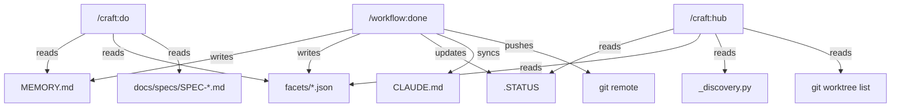

# SPEC: Workflow Command Enhancements (done, do, hub)

**Status:** draft
**Created:** 2026-02-26
**From Brainstorm:** BRAINSTORM-workflow-enhancements-2026-02-26.md
**Tech Lead Review:** PROPOSAL-command-overhaul-v2.md

---

## Overview

Overhaul three core workflow commands (`/workflow:done`, `/craft:do`, `/craft:hub`) to close the loop between session work and persistent knowledge. `/done` becomes the **producer** (captures learnings, syncs state, auto-gits), `/do` becomes the **consumer** (reads memory and friction data before routing), and `/hub` becomes the **reflector** (live counts, next actions, worktree status). Every new step is opt-out, adds <3s to the happy path, and degrades gracefully when dependencies are missing.

---

## Primary User Story

**As a** craft plugin developer ending a work session,
**I want** `/workflow:done` to auto-sync CLAUDE.md, capture memory, commit, push, and sync in one flow,
**so that** I never lose context at session boundaries and don't need 3+ manual git steps after closing.

### Acceptance Criteria

- [ ] `/workflow:done` Option A executes: git add + commit + push + sync (no manual steps)
- [ ] CLAUDE.md counts and Active Work section auto-synced silently during `/done`
- [ ] Memory patterns (2+ occurrences or explicit) appended to MEMORY.md with user confirmation
- [ ] `/craft:do` checks MEMORY.md for relevant learnings before routing
- [ ] `/craft:do` suggests brainstorm→spec→worktree pipeline for complexity 6+ features
- [ ] `/craft:hub` displays live counts from discovery engine (no hardcoded numbers)
- [ ] `/craft:hub` shows Next Action from .STATUS and active worktree status
- [ ] All new steps individually opt-out via environment variables
- [ ] All existing tests pass unchanged
- [ ] Emergency exit path (Enter through everything) completes in <30 seconds

---

## Secondary User Stories

**As a** developer starting a session, **I want** `/craft:hub` to show my next action and active worktrees, **so that** I immediately know where to pick up.

**As a** developer routing a complex task, **I want** `/craft:do` to surface relevant memory entries and suggest the full pipeline, **so that** I avoid repeating past mistakes and follow the proven workflow.

**As a** developer in a worktree, **I want** `/craft:do` to skip redundant branch/worktree prompts, **so that** routing is faster when I'm already in the right context.

---

## Architecture

### Data Flow Diagram



### Component Changes

#### `/workflow:done` — New Steps

| Step | Name | Input | Output | Time |
|------|------|-------|--------|------|
| 1.10 | CLAUDE.md Auto-Sync | `utils/claude_md_sync.py`, `.STATUS` | Updated CLAUDE.md | ~1s |
| 1.11 | Memory Capture | Session analysis, user confirmation | Appended MEMORY.md entries | ~2s |
| 1.12 | Auto-Git | Committed files | Push to remote | ~3s |
| 1.13 | Insights Capture | Session friction signals | `facets/session-<ts>.json` | ~1s |
| 1.14 | Worktree Status | `git worktree list` | Status in summary | ~1s |

**Updated step order:**

```
1.0-1.9   (existing — git, specs, doc health, CLAUDE.md check, .STATUS, drift)
1.10      CLAUDE.md auto-sync (NEW)
1.11      Memory capture (NEW)
1.13      Insights capture (NEW)
1.14      Worktree status (NEW)
2.0       Interactive summary (existing, enhanced with new sections)
3.0       Handle user choice (existing)
3.5       Auto-git: commit + push + sync (NEW, after Option A)
```

#### `/craft:do` — New Steps

| Step | Name | Input | Output |
|------|------|-------|--------|
| 0.5 | Worktree Detection | `git worktree list` | Skip branch prompts if in worktree |
| 1.0 | Memory Lookup | MEMORY.md, task description | Routing hints |
| 1.5 | Insights Check | `facets/*.json` | Friction guardrails |
| 5.0 | Pipeline Suggestion | Complexity score, spec check | Suggest brainstorm→worktree pipeline |

**Updated routing flow:**

```
Task → [0.5 Worktree?] → [1.0 Memory] → [1.5 Insights] → [2.0 Branch] → [3.0 Spec] → [4.0 Score] → [5.0 Route/Pipeline]
```

#### `/craft:hub` — New Sections

| Section | Source | Position |
|---------|--------|----------|
| Next Action | `.STATUS` | Top (above commands) |
| Worktree Status | `git worktree list` + ORCHESTRATE | After Next Action |
| Live Counts | `_discovery.py` | Banner (replaces hardcoded) |
| Recently Used | `facets/*.json` | Footer |

---

## API Design

N/A — No API changes. These are Claude Code skill/command file changes (markdown instructions).

---

## Data Models

### Facet JSON Schema (new file per session)

```json
{
  "session_id": "2026-02-26T14:30:00",
  "project": "craft",
  "branch": "feature/pin-markdownlint",
  "duration_minutes": 45,
  "goal_category": "feature",
  "outcome": "success",
  "friction_events": [
    {
      "type": "wrong_approach",
      "detail": "Started on dev, had to switch to worktree",
      "timestamp": "2026-02-26T14:32:00"
    }
  ],
  "learnings_captured": 1,
  "commits": 3,
  "files_changed": 10
}
```

**Location:** `~/.claude/usage-data/facets/session-<timestamp>.json`
**Retention:** 90 days (cleanup during `/done`)

### Memory Update Format (appended to existing MEMORY.md)

```markdown
### [Short Title] ([date])
[2-3 sentences: what happened, why it matters, what to do differently.]
```

**Deduplication:** Skip if existing heading has >60% word overlap with new title.
**Size limit:** Suggest archiving when Key Learnings exceeds 200 lines.

---

## Dependencies

| Dependency | Version | Purpose |
|------------|---------|---------|
| `utils/claude_md_sync.py` | Existing | CLAUDE.md counts and active work sync |
| `commands/_discovery.py` | Existing | Live command counts for hub |
| `git` | System | Worktree detection, auto-push |
| `gh` CLI | System | PR suggestion in worktree done |

No new external dependencies required.

---

## UI/UX Specifications

### `/done` Updated Summary Template

```
┌─────────────────────────────────────────────────────────────┐
│ SESSION SUMMARY                                              │
├─────────────────────────────────────────────────────────────┤
│                                                             │
│ COMPLETED:                                                  │
│    [inferred from commits/changes]                          │
│                                                             │
│ IN PROGRESS:                                                │
│    [uncommitted changes]                                    │
│                                                             │
│ SYNCED:                                          (NEW)      │
│    CLAUDE.md: counts updated (107→108 commands)             │
│    Memory: 2 patterns captured                              │
│                                                             │
│ WORKTREE:                                        (NEW)      │
│    feature/pin-markdownlint (5 ahead of dev)                │
│    Ready for PR? [y/N]                                      │
│                                                             │
│ A) Full auto: .STATUS + commit + push + sync     (NEW)      │
│ B) Edit what was completed                                  │
│ C) Skip .STATUS + git                                       │
│ D) Cancel                                                   │
└─────────────────────────────────────────────────────────────┘
```

### `/hub` Updated Layout

```
+---------------------------------------------------------------------+
| CRAFT v{version}                                                     |
| {project} ({type}) on {branch}                                       |
| {total} commands | {skills} skills | {agents} agents                 |
+---------------------------------------------------------------------+
| NEXT ACTION:                                            (NEW)        |
|   A) Finish pin-markdownlint PR (~15 min)                            |
|   B) Session 2: unified-release-watch (~2 hrs)                       |
+---------------------------------------------------------------------+
| WORKTREES:                                              (NEW)        |
|   feature/pin-markdownlint       5 ahead, 10 modified               |
|   feature/unified-release-watch  3 ahead, WIP                       |
+---------------------------------------------------------------------+
| SMART COMMANDS:                                                      |
|   /craft:do <task>    /craft:check    /craft:smart-help              |
+---------------------------------------------------------------------+
| [... existing category grid ...]                                     |
+---------------------------------------------------------------------+
| RECENTLY USED:                                          (NEW)        |
|   /craft:do (3x) · /craft:check (2x) · /workflow:done (2x)         |
+---------------------------------------------------------------------+
```

### Accessibility

All new sections follow existing craft patterns (box-drawing, indentation). No color-only indicators — all status uses text labels.

---

## Security Constraints

| Constraint | Enforcement |
|------------|-------------|
| Auto-git never force-pushes | `git push` only (no `--force`, no `--force-with-lease`) |
| Auto-git skips main branch | `if branch == "main": skip push` |
| Memory append-only | Never delete/modify existing MEMORY.md entries programmatically |
| Facets contain no secrets | Only session metadata (branch, duration, friction type) |
| CLAUDE.md sync is mechanical only | Updates counts and version, never rewrites prose |

---

## Open Questions

1. **Memory dedup precision** — 60% word overlap threshold needs validation. Too strict = duplicates; too loose = missed entries. Start at 60%, tune based on usage.
2. **Auto-git failure recovery** — If push fails (behind remote), should `/done` attempt rebase or just report? Recommendation: report and suggest `git pull --rebase` manually.
3. **Pipeline chain UX** — When `/do` suggests the pipeline, should it launch brainstorm immediately or show the plan first? Recommendation: show plan, let user confirm.
4. **Facets data retention** — 90-day default. Need cleanup step in `/done` to delete old facets.
5. **Cross-project memory** — MEMORY.md is project-scoped. Some learnings are universal (shell portability). Future: global memory index.

---

## Review Checklist

- [ ] All 3 command files updated (done.md, do.md, hub.md)
- [ ] Published docs copies updated (docs/commands/*.md)
- [ ] All new steps have opt-out env vars
- [ ] Existing tests pass unchanged
- [ ] New features degrade gracefully when data sources missing
- [ ] Emergency exit path (<30s) still works
- [ ] No hardcoded counts in hub.md template
- [ ] CLAUDE.md Active Work section reflects new capabilities
- [ ] REFCARD.md workflow section updated

---

## Implementation Notes

### Phase 1: Quick Wins (v2.30.0, ~4-6 hours)

| # | Item | Command | Risk |
|---|------|---------|------|
| 1 | Hub live counts (replace hardcoded) | hub | Low |
| 2 | Hub .STATUS next action | hub | Low |
| 3 | Worktree-aware routing in /do | do | Low |
| 4 | Worktree status in /done summary | done | Low |

### Phase 2: Integration (v2.31.0, ~6-10 hours)

| # | Item | Command | Dependencies |
|---|------|---------|-------------|
| 5 | Auto-git (commit + push + sync) | done | Phase 1 worktree awareness |
| 6 | CLAUDE.md auto-sync | done | Existing sync utility |
| 7 | Hub worktree status section | hub | None |
| 8 | Pipeline suggestion for 6+ complexity | do | Phase 1 worktree awareness |

### Phase 3: Learning Loop (v2.32.0, ~12-18 hours)

| # | Item | Command | Dependencies |
|---|------|---------|-------------|
| 9 | Insights capture (facets) | done | Creates data for 11-13 |
| 10 | Memory capture | done | Dedup logic |
| 11 | Memory-aware routing | do | Needs entries in MEMORY.md |
| 12 | Insights-informed routing | do | Needs facet data |
| 13 | Hub recent usage | hub | Needs facet data |

### File Change Summary

| File | Phase | Changes |
|------|-------|---------|
| `commands/workflow/done.md` | 1-3 | Add steps 1.10-1.14, update step 3 with auto-git |
| `commands/do.md` | 1-3 | Add steps 0.5, 1.0, 1.5, update step 5 routing |
| `commands/hub.md` | 1-3 | Add Next Action, Worktree, Recently Used sections; dynamic counts |
| `docs/commands/done.md` | 1-3 | Published copy — mirror changes |
| `docs/commands/do.md` | 1-3 | Published copy |
| `docs/commands/hub.md` | 1-3 | Published copy |
| `CLAUDE.md` | 2 | Update Active Work with new capabilities |
| `docs/REFCARD.md` | 2 | Update workflow command descriptions |

### Env Var Opt-Outs

| Variable | Default | Step |
|----------|---------|------|
| `SKIP_CLAUDE_MD_SYNC` | unset (runs) | 1.10 |
| `SKIP_MEMORY_UPDATE` | unset (runs) | 1.11 |
| `SKIP_GIT_SYNC` | unset (runs) | 1.12/3.5 |
| `SKIP_INSIGHTS` | unset (runs) | 1.13 |
| `SKIP_WORKTREE_STATUS` | unset (runs) | 1.14 |

### Backward Compatibility

- All existing invocations produce identical output when new data sources are missing
- No new required arguments — all features auto-detected from environment
- No schema changes to existing files (.STATUS, CLAUDE.md, plugin.json)
- New files are additive (facets JSON, MEMORY.md append)

---

## History

| Date | Event |
|------|-------|
| 2026-02-26 | Max-depth brainstorm with 2 agents (Explore + Tech Lead) |
| 2026-02-26 | Spec created from brainstorm + tech lead proposal |
