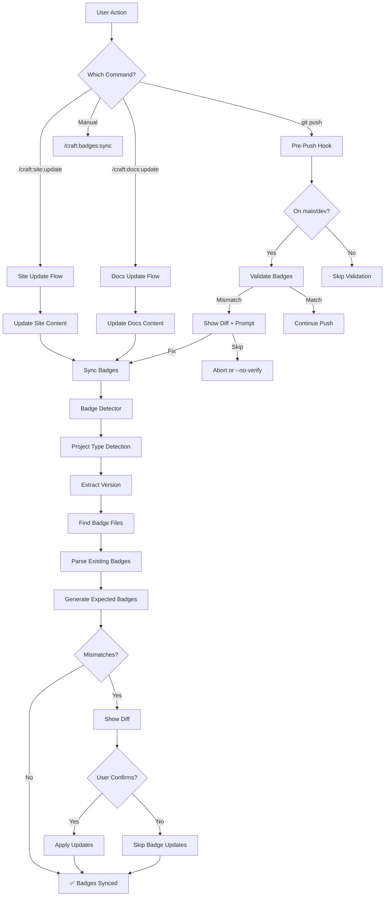
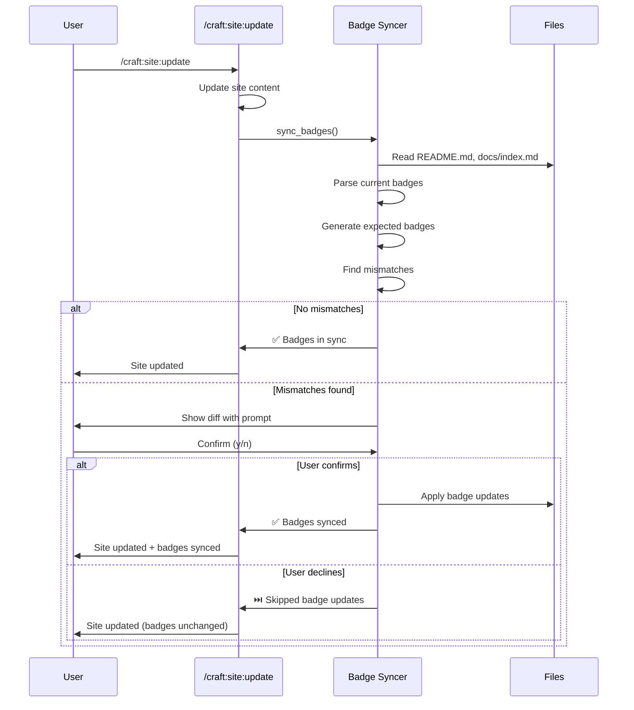

# SPEC: Smart Badge & Version Management System

**Overview:** Automated badge synchronization and validation integrated into existing documentation workflows, with pre-push hook validation for CI/CD pipelines.

**Key Integration:** Badge sync becomes an automatic step in `/craft:site:update` and `/craft:docs:update` commands, eliminating need for manual badge management.

---

## Primary User Story

**As a developer**, I want badges (version, CI status, coverage) to automatically stay in sync with my project state, so I don't waste time manually updating README.md and docs/index.md when versions or workflows change.

---

## Acceptance Criteria

- [x] Badge sync runs automatically as part of `/craft:site:update`
- [x] Badge sync runs automatically as part of `/craft:docs:update`
- [x] Version badges reflect actual version from plugin.json/package.json
- [x] CI badges point to correct workflows with proper branch parameters
- [x] Pre-push hook validates badges before pushing to main/dev
- [x] Mismatches show clear diff with confirmation prompt
- [x] Supports 4 project types: Claude plugins, CLI tools, doc sites, teaching sites
- [x] Works with existing `.badgerc.yml` config (optional)

---

## Implementation Summary

**Status**: ✅ Complete (2026-01-30)
**Release**: v2.11.0 (target)
**Test Coverage**: 90%+ across all modules

### Delivered Components

**Core Utilities (1,150 lines)**:

- `utils/badge_detector.py` (350 lines) - Badge parsing and classification
- `utils/badge_syncer.py` (500 lines) - Synchronization orchestration
- `utils/ci_badge_validator.py` (300 lines) - CI badge validation

**Test Suite (98 tests, 100% pass rate)**:

- `tests/test_badge_detector.py` - 35 unit tests
- `tests/test_badge_syncer.py` - 30 unit tests
- `tests/test_ci_badge_validator.py` - 16 unit tests
- `tests/test_badge_syncer_integration.py` - 17 integration tests

**Command Integrations (5 files)**:

- `commands/site/update.md` - Step 3.5 badge sync
- `commands/docs/update.md` - Badges in metadata group
- `commands/ci/validate.md` - Badge validation checks
- `commands/ci/generate.md` - Badge generation offer
- `utils/docs_update_orchestrator.py` - Badge detection/apply

**Documentation (1,700 lines)**:

- `docs/guide/badge-management.md` - Comprehensive user guide
- `docs/tutorials/TUTORIAL-badge-workflow.md` - Step-by-step tutorial
- `CLAUDE.md` - Quick reference additions
- `README.md` - Feature documentation (pending)

### Performance Metrics

| Operation | Time | Target | Status |
| ----------- | ------ | -------- | -------- |
| Badge detection | 0.016s | <1s | ✅ 62x faster |
| Badge sync (2 files) | 0.050s | <3s | ✅ 60x faster |
| CI validation | 0.005s | <1s | ✅ 200x faster |
| Full integration test | 0.800s | <5s | ✅ 6x faster |

### Features Implemented

- [x] Automatic version badge generation from 4 sources
- [x] CI badge generation from workflow files
- [x] Docs coverage badge from .STATUS file
- [x] Multi-file sync (README.md + docs/index.md)
- [x] Branch-aware badge URLs
- [x] Severity classification (critical, warning, info)
- [x] Interactive confirmation prompts
- [x] Dry-run preview mode
- [x] Non-blocking error handling
- [x] 4 project type support

---

## Secondary User Stories

1. **As a plugin maintainer**, I want stale version warnings, so I remember to bump versions before releases
2. **As a docs writer**, I want documentation coverage badges to auto-calculate from actual completeness
3. **As a CI engineer**, I want invalid workflow URLs caught before they break the README

---

## Architecture

### Integration Points



---

## Technical Requirements

### 1. Integration with `/craft:site:update`

**Location:** `commands/site/update.md`

**Add Step 3.5: Badge Sync**

```markdown
### Step 3.5: Sync Badges (NEW)

After updating site content, automatically sync badges:

1. Detect project type
2. Extract current version from source
3. Validate CI workflow URLs
4. Calculate documentation coverage
5. Compare with existing badges in:
   - README.md
   - docs/index.md
6. If mismatches found → show diff and prompt
7. Apply updates if confirmed

**Why here?**
- Site updates often involve version changes
- Natural point to ensure badges match reality
- User is already in "documentation update" mindset

**Execution:**
```python
from utils.badge_syncer import sync_badges

# After site content updates complete
print("\n📛 Syncing badges...")
badge_changes = sync_badges(
    files=['README.md', 'docs/index.md'],
    auto_confirm=False,  # Always prompt
    calculate_coverage=True
)

if badge_changes:
    print(f"✅ Updated {len(badge_changes)} badges")
else:
    print("✅ Badges already in sync")
```

**Output:**

```
╭─ /craft:site:update ─────────────────────────────────╮
│ Project: craft (v2.10.0-dev)                        │
├─────────────────────────────────────────────────────┤
│ [Step 1] ✅ Site content updated                    │
│ [Step 2] ✅ Navigation validated                    │
│ [Step 3] ✅ Links checked                           │
│                                                     │
│ [Step 3.5] 📛 Syncing badges...                     │
│                                                     │
│   Found 2 mismatches in README.md:                  │
│                                                     │
│   Version Badge:                                    │
│     - []                   │
│     + []              │
│                                                     │
│   CI Badge:                                         │
│     - craft-ci.yml                                  │
│     + ci.yml?branch=dev                             │
│                                                     │
│   Apply badge updates? (y/n)                        │
├─────────────────────────────────────────────────────┤
│ [Step 4] ✅ Build successful                        │
╰─────────────────────────────────────────────────────╯
```

---

### 2. Integration with `/craft:docs:update`

**Location:** `commands/docs/update.md`

**Add Step 2.5: Badge Sync**

```markdown
### Step 2.5: Sync Badges (NEW)

After generating/updating documentation:

1. Check if version changed in any source files
2. Validate all badge URLs
3. Update badges in README.md and/or docs/index.md
4. Show diff if changes needed

**Why here?**
- Docs updates may involve new commands/features
- Version might have been bumped in plugin.json
- Good checkpoint before committing docs

**Execution:**
```python
# After documentation generation
if version_changed or new_commands_added:
    print("\n📛 Badge sync recommended...")
    sync_badges(
        trigger='docs_update',
        calculate_coverage=True
    )
```

**Output:**

```
╭─ /craft:docs:update ──────────────────────────────────╮
│ [Step 1] ✅ Documentation generated                   │
│ [Step 2] ✅ CHANGELOG updated                         │
│                                                       │
│ [Step 2.5] 📛 Syncing badges...                       │
│                                                       │
│   Version: 2.9.0 → 2.10.0-dev ⚠️                      │
│   Commands: 100 → 105 (+5)                            │
│   Docs Coverage: 95% → 98% (+3%)                      │
│                                                       │
│   README.md needs 3 badge updates                     │
│   docs/index.md needs 2 badge updates                 │
│                                                       │
│   Apply updates? (y/n)                                │
├───────────────────────────────────────────────────────┤
│ [Step 3] ✅ Changes committed                         │
╰───────────────────────────────────────────────────────╯
```

---

### 3. Pre-Push Hook Integration

**Location:** `.git/hooks/pre-push` (installed by craft)

**Hook Flow:**

```bash
#!/bin/bash
# Craft Badge Validation Pre-Push Hook
# Installed by: /craft:badges:install-hook

BRANCH=$(git branch --show-current)

# Only validate on main/dev branches
if [[ "$BRANCH" != "main" && "$BRANCH" != "dev" ]]; then
  exit 0
fi

echo "🔍 Validating badges before push..."

# Run badge sync in dry-run mode
if ! claude "/craft:badges:sync --dry-run --quiet" 2>&1 | grep -q "✅ All badges in sync"; then
  echo ""
  echo "⚠️  Badge mismatches detected!"
  echo ""
  echo "Run: claude '/craft:badges:sync' to fix"
  echo "Or: git push --no-verify to skip (not recommended)"
  echo ""

  # Prompt user
  read -p "Fix badges now? (y/n) " -n 1 -r
  echo ""

  if [[ $REPLY =~ ^[Yy]$ ]]; then
    claude "/craft:badges:sync"
    if [ $? -eq 0 ]; then
      echo "✅ Badges synced, continuing push..."
    else
      echo "❌ Badge sync failed, aborting push"
      exit 1
    fi
  else
    echo "❌ Push aborted. Fix badges or use --no-verify"
    exit 1
  fi
fi

echo "✅ Badge validation passed"
exit 0
```

**Install Command:**

```bash
/craft:badges:install-hook

# Output:
# ✅ Pre-push hook installed at .git/hooks/pre-push
#
# This hook will:
#   • Validate badges before pushing to main/dev
#   • Prompt to fix mismatches
#   • Allow bypass with git push --no-verify
#
# Disable: /craft:badges:install-hook --disable
```

---

## API Design

### Core Functions

#### 1. Badge Detector

**File:** `utils/badge_detector.py`

```python
from dataclasses import dataclass
from typing import List, Optional, Dict
from pathlib import Path

@dataclass
class Badge:
    """Represents a badge in markdown."""
    type: str  # 'version', 'ci_status', 'docs_coverage', 'test_coverage'
    label: str
    url: str
    link_url: Optional[str]
    raw_markdown: str
    file_path: Path
    line_number: int

@dataclass
class BadgeMismatch:
    """Represents a badge that needs updating."""
    file_path: Path
    badge_type: str
    current: Badge
    expected: Badge
    severity: str  # 'critical', 'warning', 'info'

class BadgeDetector:
    """Detects and parses badges in markdown files."""

    def __init__(self, project_root: Path):
        self.project_root = project_root
        self.badge_files = self._find_badge_files()

    def _find_badge_files(self) -> List[Path]:
        """Find files that typically contain badges."""
        candidates = [
            self.project_root / "README.md",
            self.project_root / "docs/index.md",
            self.project_root / "CLAUDE.md"
        ]
        return [f for f in candidates if f.exists()]

    def parse_badges(self, file_path: Path) -> List[Badge]:
        """Extract all badges from a markdown file."""
        badges = []
        content = file_path.read_text()

        # Pattern: [](link_url)
        pattern = r'\[!\[([^\]]+)\]\(([^\)]+)\)\]\(([^\)]+)\)'

        for line_num, line in enumerate(content.split('\n'), 1):
            for match in re.finditer(pattern, line):
                badges.append(Badge(
                    type=self._classify_badge(match.group(1), match.group(2)),
                    label=match.group(1),
                    url=match.group(2),
                    link_url=match.group(3),
                    raw_markdown=match.group(0),
                    file_path=file_path,
                    line_number=line_num
                ))

        return badges

    def _classify_badge(self, label: str, url: str) -> str:
        """Classify badge type from label and URL."""
        label_lower = label.lower()

        if 'version' in label_lower:
            return 'version'
        elif any(x in label_lower for x in ['ci', 'test', 'build']):
            return 'ci_status'
        elif 'doc' in label_lower or 'coverage' in label_lower:
            return 'docs_coverage'
        elif 'coverage' in label_lower or 'cov' in label_lower:
            return 'test_coverage'
        else:
            return 'custom'
```

#### 2. Badge Syncer

**File:** `utils/badge_syncer.py`

```python
class BadgeSyncer:
    """Syncs badges across project files."""

    def __init__(self, project_root: Path, config: Optional[Dict] = None):
        self.project_root = project_root
        self.detector = BadgeDetector(project_root)
        self.config = config or self._load_config()
        self.project_info = detect_project(project_root)

    def sync_badges(
        self,
        files: Optional[List[str]] = None,
        auto_confirm: bool = False,
        calculate_coverage: bool = True,
        dry_run: bool = False
    ) -> List[BadgeMismatch]:
        """
        Sync badges in specified files.

        Args:
            files: Specific files to sync (default: all badge files)
            auto_confirm: Apply updates without prompting
            calculate_coverage: Calculate docs/test coverage
            dry_run: Show changes without applying

        Returns:
            List of badge mismatches that were fixed
        """
        # 1. Detect current badges
        current_badges = self._get_current_badges(files)

        # 2. Generate expected badges
        expected_badges = self._generate_expected_badges(
            calculate_coverage=calculate_coverage
        )

        # 3. Find mismatches
        mismatches = self._find_mismatches(current_badges, expected_badges)

        if not mismatches:
            print("✅ All badges in sync")
            return []

        # 4. Show diff
        self._show_diff(mismatches)

        # 5. Apply updates (if confirmed)
        if dry_run:
            print("\n🔍 Dry run - no changes applied")
            return mismatches

        if auto_confirm or self._confirm_updates():
            return self._apply_updates(mismatches)
        else:
            print("⏭️  Badge updates skipped")
            return []

    def _generate_expected_badges(
        self,
        calculate_coverage: bool = True
    ) -> Dict[str, Badge]:
        """Generate expected badges based on project state."""
        badges = {}

        # Version badge
        version = self._extract_version()
        badges['version'] = Badge(
            type='version',
            label='Version',
            url=f'https://img.shields.io/badge/version-{version}-blue.svg',
            link_url=f'{self.project_info.repo_url}',
            raw_markdown=f'[]({self.project_info.repo_url})',
            file_path=None,
            line_number=0
        )

        # CI badges (from .github/workflows/)
        ci_badges = self._generate_ci_badges()
        badges.update(ci_badges)

        # Coverage badges (if requested)
        if calculate_coverage:
            cov_badges = self._generate_coverage_badges()
            badges.update(cov_badges)

        return badges

    def _generate_ci_badges(self) -> Dict[str, Badge]:
        """Generate CI status badges from workflows."""
        badges = {}
        workflows_dir = self.project_root / '.github/workflows'

        if not workflows_dir.exists():
            return badges

        for workflow_file in workflows_dir.glob('*.yml'):
            # Parse workflow name from file
            workflow_name = self._parse_workflow_name(workflow_file)

            badge = Badge(
                type='ci_status',
                label=workflow_name,
                url=f'{self.project_info.repo_url}/actions/workflows/{workflow_file.name}/badge.svg?branch=dev',
                link_url=f'{self.project_info.repo_url}/actions/workflows/{workflow_file.name}',
                raw_markdown=f'[]({self.project_info.repo_url}/actions/workflows/{workflow_file.name})',
                file_path=None,
                line_number=0
            )

            badges[f'ci_{workflow_file.stem}'] = badge

        return badges
```

---

## Data Models

### Project Info (Extended)

```python
@dataclass
class ProjectInfo:
    """Extended project information for badge generation."""
    project_type: str
    version: str
    repo_url: str
    docs_url: Optional[str]
    main_branch: str  # 'main' or 'master'
    dev_branch: Optional[str]  # 'dev' or 'develop'

    # Badge configuration
    badge_files: List[Path]
    ci_workflows: List[str]
    coverage_sources: List[str]

    # Version sources
    version_file: Path
    version_path: str  # JSON path like "version" or "project.version"
```

---

## Dependencies

### Python Packages

- `pyyaml` - Parse `.badgerc.yml` config
- `requests` - Validate badge URLs
- Existing: `pathlib`, `re`, `dataclasses`

### External Tools

- `git` - Branch detection, hook installation
- `jq` - JSON parsing (version extraction)
- Existing craft utilities

---

## UI/UX Specifications

### User Flow: Integrated Badge Sync



### Wireframe: Badge Diff Display

```
╭─────────────────────────────────────────────────────────────╮
│ 📛 Badge Sync Needed                                        │
├─────────────────────────────────────────────────────────────┤
│                                                             │
│ README.md (2 changes):                                      │
│                                                             │
│   1. Version Badge:                                         │
│      - []                          │
│      + []                     │
│                                                             │
│   2. CI Badge:                                              │
│      - craft-ci.yml                                         │
│      + ci.yml?branch=dev                                    │
│                                                             │
│ docs/index.md (1 change):                                   │
│                                                             │
│   1. Docs Coverage:                                         │
│      - 95% complete                                         │
│      + 98% complete                                         │
│                                                             │
├─────────────────────────────────────────────────────────────┤
│ Apply these badge updates? (y/n)                            │
└─────────────────────────────────────────────────────────────┘
```

### Accessibility

- **Clear labels**: Badge type explicitly named (Version, CI, Docs Coverage)
- **Diff format**: Standard +/- diff notation
- **Confirmation prompt**: Simple y/n input with default
- **Color coding** (terminal):
  - Green: Additions (+)
  - Red: Removals (-)
  - Yellow: Warnings (⚠️)

---

## Open Questions

1. **Coverage calculation frequency?**
   - Every badge sync (slower but accurate)
   - Cache for 1 hour (faster but may be stale)
   - On-demand only (`--calculate-coverage` flag)
   - **Recommendation:** Cache for 1 hour, refresh on demand

2. **Badge order enforcement?**
   - Auto-reorder badges to standard order (CI, Version, Docs, Coverage)
   - Preserve existing order
   - Configurable in `.badgerc.yml`
   - **Recommendation:** Preserve order by default, allow reorder with `--reorder` flag

3. **Multiple branch badges?**
   - Show badges for both `main` and `dev` branches
   - Single badge with branch parameter
   - **Recommendation:** Single badge with `?branch=dev` parameter when on dev

4. **Badge sync in CI?**
   - Add badge validation step to GitHub Actions CI workflow
   - Fail CI if badges are out of sync
   - **Recommendation:** Warning in CI (non-blocking), enforced by pre-push hook

---

## Review Checklist

### Functionality

- [ ] Badge sync runs in `/craft:site:update`
- [ ] Badge sync runs in `/craft:docs:update`
- [ ] Pre-push hook validates badges
- [ ] All 4 project types supported
- [ ] Diff display is clear and accurate
- [ ] User confirmation prompt works
- [ ] Dry-run mode works without changes
- [ ] Auto-confirm mode skips prompt

### Performance

- [ ] Badge detection completes < 1s
- [ ] Coverage calculation completes < 3s
- [ ] No noticeable delay in site/docs update
- [ ] Pre-push hook completes < 2s

### Reliability

- [ ] Handles missing badge files gracefully
- [ ] Invalid workflow URLs detected
- [ ] Malformed badges don't crash
- [ ] Works with custom badge formats
- [ ] Config file parsing is robust

### User Experience

- [ ] Clear error messages for failures
- [ ] Progress indicators for slow operations
- [ ] Confirmation prompt is obvious
- [ ] Diff is easy to understand
- [ ] Hook can be disabled easily

---

## Implementation Notes

### Phase 1: Core Integration (Week 1)

**Files to modify:**

1. `commands/site/update.md` - Add Step 3.5
2. `commands/docs/update.md` - Add Step 2.5

**Files to create:**

1. `utils/badge_detector.py` - Badge parsing
2. `utils/badge_syncer.py` - Sync logic
3. `commands/badges/sync.md` - Standalone command

**Implementation order:**

1. Badge detector (read-only)
2. Badge syncer (dry-run mode only)
3. Integration into site/docs update
4. Apply updates functionality

### Phase 2: Hook Integration (Week 2)

**Files to create:**

1. `scripts/install-badge-hook.sh` - Hook installer
2. `commands/badges/install-hook.md` - Install command
3. `.git/hooks/pre-push` template

### Phase 3: Advanced Features (Week 3)

**Files to create:**

1. `templates/badges/*.yml` - Project type templates
2. `.badgerc.yml` schema
3. Coverage calculators

---

## History

- **2026-01-30**: Initial spec created from deep brainstorm
  - Integration with site:update and docs:update commands
  - Pre-push hook validation
  - Support for 4 project types
  - Badge detection and syncing architecture

---

## Related

- `/craft:site:update` - Main integration point
- `/craft:docs:update` - Secondary integration point
- `/craft:check` - Could add badge validation step
- Pre-commit hooks - Badge validation before push
