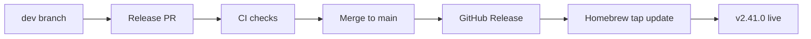

# Tutorial: docs:mermaid — Create and Validate Mermaid Diagrams

By the end of this tutorial you will have:

- Created a Mermaid diagram from a natural-language description
- Validated an existing diagram for syntax errors
- Previewed a diagram in a browser

**Prerequisites:** craft installed, optionally the mermaid-mcp server for live rendering.

---

## Step 1: Create a Diagram from Natural Language

```
/craft:docs:mermaid "show the release pipeline flow from dev branch to Homebrew tap"
```

The command generates Mermaid syntax from your description:



Output: `docs/diagrams/release-pipeline.mmd`

---

## Step 2: Use a Template

Browse available templates:

```
/craft:docs:mermaid --input template
```

Then pick one:

```
/craft:docs:mermaid --input template:flowchart
/craft:docs:mermaid --input template:sequence
/craft:docs:mermaid --input template:er
/craft:docs:mermaid --input template:gitgraph
```

---

## Step 3: Validate an Existing Diagram

```
/craft:docs:mermaid --validate docs/diagrams/architecture.mmd
```

Runs the diagram through the Mermaid parser and reports syntax errors:

```
Validation — architecture.mmd
──────────────────────────────
✅ Syntax valid
✅ All node references resolve
⚠️  Deprecated: 'graph' keyword — use 'flowchart' instead
```

---

## Step 4: Preview in Browser

```
/craft:docs:mermaid --preview docs/diagrams/release-pipeline.mmd
```

Opens a browser tab with the rendered diagram. Requires the mermaid-mcp server.

---

## Step 5: Save to a Specific Output Path

```
/craft:docs:mermaid "auth flow diagram" --output docs/guide/auth-flow.mmd
```

---

## What's Next

- Diagrams in `docs/diagrams/` are auto-embedded in MkDocs pages via ```` ```mermaid ```` fences
- Use the `mermaid-expert` agent for complex multi-diagram documents
- Validate all diagrams before release: `find docs -name "*.mmd" -exec /craft:docs:mermaid --validate {} \;`
