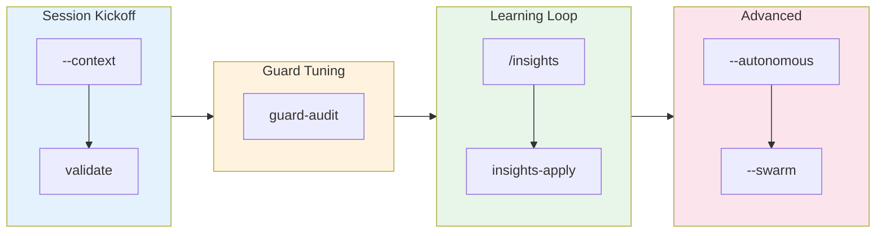
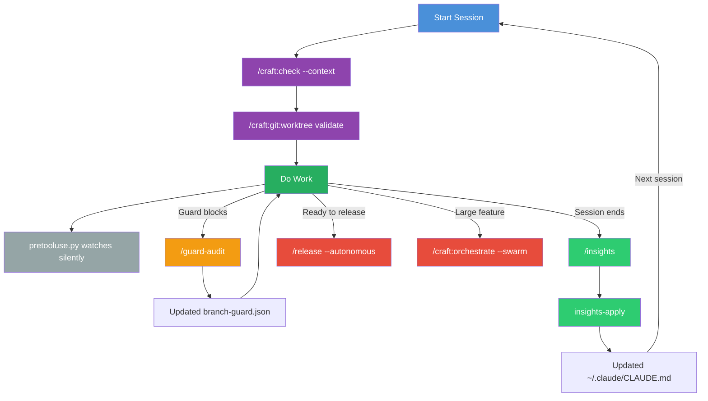

# Insights-Driven Workflow

> **Time:** 15 minutes | **Level:** Intermediate | **Prerequisites:** Craft plugin loaded, worktree workflow familiar

## What You'll Learn

1. Start sessions with full context using `--context`
2. Validate your worktree environment
3. Audit the branch guard to reduce false positives
4. Generate and apply insights to your CLAUDE.md
5. Understand the pretooluse safety hook
6. Run unattended releases with `--autonomous` (with CI monitoring in v2.22.0)
7. Use swarm mode for parallel agent isolation

## Learning Path



---

## Step 1: Understand the Feedback Loop

The insights system (introduced in v2.18.0, enhanced in v2.22.0) is built around one idea: **your usage patterns should improve your workflow automatically**.

```
┌─────────────────────────────────────────────────────────────┐
│ THE FEEDBACK LOOP                                            │
├─────────────────────────────────────────────────────────────┤
│                                                              │
│   Use Craft  ──→  /insights analyzes patterns                │
│       ↑                      ↓                               │
│       │            /insights-apply updates CLAUDE.md          │
│       │                      ↓                               │
│       └──── Better prompts ←─┘                               │
│                                                              │
│   Guard blocks ──→ /guard-audit finds false positives        │
│       ↑                      ↓                               │
│       │            Tune branch-guard.json                     │
│       │                      ↓                               │
│       └──── Less friction ←──┘                               │
│                                                              │
└─────────────────────────────────────────────────────────────┘
```

No commands to run here — just understand that each feature feeds into the next.

---

## Step 2: Start a Session with Context

**Run:** `/craft:check --context`

**Expected output:**

```
┌───────────────────────────────────────────────────────────────┐
│ SESSION CONTEXT                                               │
├───────────────────────────────────────────────────────────────┤
│ Project:   craft (Claude Code Plugin)                         │
│ Branch:    feature/insights-improvements                      │
│ Worktree:  ~/.git-worktrees/craft/feature-insights-improvements│
│ Base:      dev                                                │
│ Guard:     smart mode (v2)                                    │
│ Phase:     implementation (commits ahead: 5)                  │
│ Tests:     python3 tests/test_craft_plugin.py (1504 passing)  │
│ Lint:      npx markdownlint-cli2 "**/*.md"                    │
├───────────────────────────────────────────────────────────────┤
│ TIP: Front-load this context in prompts to reduce wrong-      │
│ approach friction.                                            │
└───────────────────────────────────────────────────────────────┘
```

**Why it matters:** Instead of manually checking branch, phase, and test status, `--context` gives you everything in one box. The phase detection tells you whether you're in implementation, testing, PR prep, or release mode.

**How phase is detected:**

| Phase | Condition |
|-------|-----------|
| `implementation` | Commits ahead of base, no PR |
| `testing` | Test files modified recently |
| `pr-prep` | PR exists for branch, branch clean |
| `release` | On dev branch, features merged |

**Try it:** Run `/craft:check --context` right now. Notice the phase it detects — does it match what you're actually doing?

---

## Step 3: Validate Your Worktree

**Run:** `/craft:git:worktree validate`

**Expected output (all passing):**

```
┌───────────────────────────────────────────────────────────────┐
│ WORKTREE VALIDATION                                           │
├───────────────────────────────────────────────────────────────┤
│ CWD:       ~/.git-worktrees/craft/feature-auth                │
│ Branch:    feature/auth                                       │
│ Toplevel:  ~/.git-worktrees/craft/feature-auth                │
│ Main repo: ~/projects/dev-tools/craft                         │
├───────────────────────────────────────────────────────────────┤
│ CWD is inside expected worktree                               │
│ Branch matches folder name                                    │
│ No writes detected outside worktree                           │
└───────────────────────────────────────────────────────────────┘
```

**When it catches problems:**

```
┌───────────────────────────────────────────────────────────────┐
│ WORKTREE VALIDATION                                           │
├───────────────────────────────────────────────────────────────┤
│ Branch/folder mismatch                                        │
│   Branch: feature/auth                                        │
│   Folder: feature-login                                       │
│                                                               │
│ External writes detected                                      │
│   File: ~/projects/dev-tools/craft/src/utils.py               │
│   This file is in the main repo, not this worktree            │
└───────────────────────────────────────────────────────────────┘
```

**Why it matters:** A common mistake is being in the wrong directory, or having the branch diverge from the folder name after a rename. This catches both instantly.

**Pro tip:** Combine steps 2 and 3 as your session kickoff habit:

```bash
/craft:check --context
/craft:git:worktree validate
```

---

## Step 4: Audit the Branch Guard

Imagine the guard just blocked you from writing a `.json` config file on `dev`. That's a false positive — config files should be allowed.

**Run:** `/guard-audit`

**What happens (5 steps):**

1. **Discovery** — Reads `branch-guard.sh` and extracts all protection rules
2. **Friction Analysis** — Maps each rule to false positive scenarios
3. **Test Harness** — Generates and runs test scenarios
4. **Report** — Shows specific recommendations with config changes
5. **Apply** — Asks you to confirm before writing `.claude/branch-guard.json`

**Example friction report:**

```
┌───────────────────────────────────────────────────────────────┐
│ GUARD FRICTION REPORT                                         │
├───────────────────────────────────────────────────────────────┤
│ Rules Analyzed: 12                                            │
│ False Positives Found: 2                                      │
│                                                               │
│ Recommendation 1: Expand allowed file types on dev            │
│   Issue: Guard blocks config files (.json, .yaml) on dev      │
│   Fix: Add config extensions to allowed list                  │
│   Config change:                                              │
│     "dev_allowed_extensions": [".md", ".json", ".yaml"]       │
│                                                               │
│ Recommendation 2: Allow force-push on feature/*               │
│   Issue: Guard blocks force-push after rebase on feature      │
│   Fix: Only block force-push on main and dev                  │
│   Config change:                                              │
│     "force_push_allow": ["feature/*", "fix/*"]                │
└───────────────────────────────────────────────────────────────┘
```

**Key principle:** The guard script (`branch-guard.sh`) is never modified. Only the JSON config file changes. Think of it as the engine vs. the tuning knobs.

**Try it:** If you've had guard friction recently, run `/guard-audit` now. If not, you'll get a clean audit report — that's fine too.

---

## Step 5: Generate Insights

Before you can apply insights, you need them. The `/insights` command analyzes your recent Claude Code sessions.

**Run:** `/insights`

This generates a report at `~/.claude/usage-data/report.html` containing:

- Session patterns (what commands you use most)
- Error patterns (what goes wrong frequently)
- `claude_md_additions` — suggested rules for CLAUDE.md
- Workflow bottlenecks

**What to look for:** The `claude_md_additions` array. These are structured suggestions with title, content, source sessions, and priority.

---

## Step 6: Apply Insights to CLAUDE.md

Now turn those suggestions into persistent rules.

**Run:** Type "apply insights" (the `insights-apply` skill auto-triggers)

**What happens (5 steps):**

1. **Parse** — Locates report.html or facets data
2. **Present** — Shows each suggestion with priority and source
3. **Apply** — For each: apply, skip, or edit first
4. **Budget Check** — Ensures CLAUDE.md stays under 200 lines
5. **Report** — Summary of what was applied

**Example suggestion review:**

```
┌───────────────────────────────────────────────────────────────┐
│ Suggestion 1/3: Worktree Best Practices                       │
│ Source: 8 sessions with this pattern                          │
│ Priority: high                                                │
│                                                               │
│ Proposed CLAUDE.md addition:                                  │
│ ┌─────────────────────────────────────────────────────────┐   │
│ │ ## Worktree Best Practices                              │   │
│ │ - Always validate worktree before starting work         │   │
│ │ - Use /craft:check --context for session kickoff        │   │
│ │ - Never write files outside current worktree            │   │
│ └─────────────────────────────────────────────────────────┘   │
└───────────────────────────────────────────────────────────────┘
```

You choose: **Apply** / **Skip** / **Edit first**

**Key principle:** Insights target the global `~/.claude/CLAUDE.md` only, because usage patterns are cross-project.

**Budget awareness:** If your CLAUDE.md exceeds 200 lines after adding suggestions, the skill warns you and offers to run the optimizer.

---

## Step 7: Understand the PreToolUse Hook

This hook runs silently in the background. You don't invoke it — it protects you automatically.

**What it does:** On every Write/Edit call, if you're in a worktree and the file path points outside that worktree, it prints a warning to stderr.

**Example warning:**

```
⚠️  WARNING: Writing outside worktree
   File:     /Users/dt/projects/dev-tools/craft/src/utils.py
   Worktree: /Users/dt/.git-worktrees/craft/feature-auth
   Consider: cd /Users/dt/.git-worktrees/craft/feature-auth
```

**Important properties:**

- **Non-blocking** — always exits 0, never prevents the write
- **Fast** — 45ms on the fast path, 60ms when checking worktree
- **Targeted** — only fires for Write/Edit, only in worktrees

**Try it:** You can test it manually:

```bash
cd ~/.git-worktrees/<project>/<branch>
CLAUDE_TOOL_NAME="Write" \
CLAUDE_TOOL_INPUT='{"file_path":"/tmp/outside.txt"}' \
python3 .claude-plugin/hooks/pretooluse.py 2>&1
```

You should see the warning since `/tmp/outside.txt` is outside the worktree.

---

## Step 8: Run an Unattended Release

When you're confident a release is ready, skip all the confirmation prompts.

**Preview first (always recommended):**

```bash
/release --autonomous --dry-run
```

This shows exactly what `--autonomous` would do without executing anything.

**Then execute:**

```bash
/release --autonomous
```

**Safety pre-checks (must ALL pass):**

| Check | Required |
|-------|----------|
| Working tree clean | No uncommitted changes |
| On dev branch | Must be on `dev` |
| All tests pass | Full test suite green |
| No open blockers | No blocking issues |

If any check fails, the pipeline aborts immediately with a clear error.

**What runs automatically:**

1. Version bump (auto-detected: patch/minor/major)
2. Changelog generation (from commit messages)
3. Commit + tag (auto-confirmed)
4. PR creation (auto-filled description)
5. Merge PR
6. Publish (Homebrew/PyPI)

**Important:** Autonomous mode auto-uses `--admin` to bypass branch protection if the merge is blocked. This skips required status checks. Always preview with `--autonomous --dry-run` first.

**Recovery:** If it fails mid-pipeline, state is preserved. You can fix the issue and resume.

---

## Step 9: Use Swarm Orchestration

For large features where multiple agents would conflict on the same files, swarm mode gives each agent its own worktree.

**Requirements:**

- An ORCHESTRATE file with agent assignments and file scopes
- A feature branch to converge into

**Example ORCHESTRATE file:**

```markdown
## Swarm Configuration

| Agent | Focus | Files |
|-------|-------|-------|
| tests | Write tests | tests/ |
| impl | Implementation | src/ |
| docs | Documentation | docs/, README.md |
```

**Run:**

```bash
/craft:orchestrate --swarm "implement auth"
```

**What happens:**

1. Creates convergence branch `feature/swarm-auth`
2. Creates worktree per agent (`swarm-auth-agent1`, etc.)
3. Launches agents in parallel (fully isolated)
4. Waits for all to complete
5. Merges all branches into convergence branch
6. Runs tests on merged result
7. Creates single PR to dev
8. Cleans up swarm worktrees

**Preview without creating worktrees:**

```bash
/craft:orchestrate --swarm --dry-run "implement auth"
```

**When to use swarm vs. normal orchestration:**

| Scenario | Use |
|----------|-----|
| Research + small changes | Normal orchestration |
| Agents touching same files | Swarm mode |
| Parallel feature implementation | Swarm mode |
| Quick task delegation | Normal orchestration |

---

## Workflow Map

Here's how insights-driven features connect:



---

## Quick Reference

| Command | Purpose | When |
|---------|---------|------|
| `/craft:check --context` | Session context summary | Start of session |
| `/craft:git:worktree validate` | Worktree health check | Start of session |
| `/guard-audit` | Find and fix guard false positives | After guard friction |
| `/insights` | Generate usage report | Periodically |
| "apply insights" | Apply suggestions to CLAUDE.md | After /insights |
| `/release --autonomous` | Unattended release | When release is ready |
| `/release --autonomous --dry-run` | Preview release plan | Before autonomous release |
| `/craft:orchestrate --swarm` | Isolated agent worktrees | Large parallel features |

---

## Next Steps

- **[Branch Guard Setup](TUTORIAL-branch-guard-setup.md)** — If you haven't set up the guard yet
- **[Release Pipeline](TUTORIAL-release-pipeline.md)** — Deep dive into the full release flow
- **[Interactive Orchestration](interactive-orchestration.md)** — Orchestrator modes and wave management
- **[Insights Guide](../guide/insights-improvements-guide.md)** — Reference with all 7 flowcharts

---

**Last Updated**: 2026-02-19
**Craft Version**: v2.22.0
