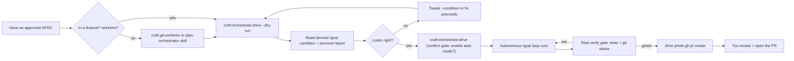

# Tutorial: Drive a spec to green with /craft:orchestrate:drive

This walkthrough takes a first-timer end-to-end: from an approved toy spec
to a verified-green handoff, on a tiny example. The golden rule —
**preview with `--dry-run` before any autonomous turn runs.**

## The big picture



## Step 1: Start with an approved spec in a feature worktree

Assume you have a small approved `docs/specs/SPEC-toy.md` describing one
function and one test. Drive only runs in an isolated `feature/*`
worktree — never on `dev` or `main`:

```bash
git worktree add ~/.git-worktrees/myproj/feature-toy -b feature/toy dev
cd ~/.git-worktrees/myproj/feature-toy
```

## Step 2: Lead with `--dry-run`

```bash
/craft:orchestrate:drive --dry-run
```

This prints — with **zero side effects** — the derived `/goal` condition,
the per-turn dispatch plan, and a precondition report. Read it:

- The **derived condition** restates the spec's Acceptance Criteria as
  measurable end states, each provable by showing command output, bounded
  by `--max-turns`.
- The **precondition report** flags anything blocking (no worktree, `/goal`
  unavailable, auto mode off). Each line is prefixed `✓` / `⚠` / `✗`.

If the condition isn't quite right, tweak it with `--condition "<text>"`
or fix a precondition, then dry-run again.

## Step 3: Run for real — the confirm gate

```bash
/craft:orchestrate:drive
```

You'll see the condition again at the **confirm gate** (defaults to No). If
auto mode is off, drive **offers** to enable it here — it never enables it
silently. Answer Yes to proceed, then the autonomous `/goal` loop runs,
dispatching one file-scoped subagent per turn by default.

## Step 4: The real verify gate

When the `/goal` condition clears, drive runs your project's **actual**
verify command plus `git status --short`. A green-looking transcript is not
enough — the command must really pass. If it comes back red, the loop
continues.

## Step 5: The green handoff

On verified green, drive **stops** and prints the exact command:

```bash
gh pr create --base dev --title "feat: toy"
```

Copy it, run it, and open the PR yourself. Drive never opens a PR for you.

## Next: review the PR

Open the PR it printed, review the diff, and merge when you're satisfied.
Drive's job ends at verified green — the publish decision is always yours.
