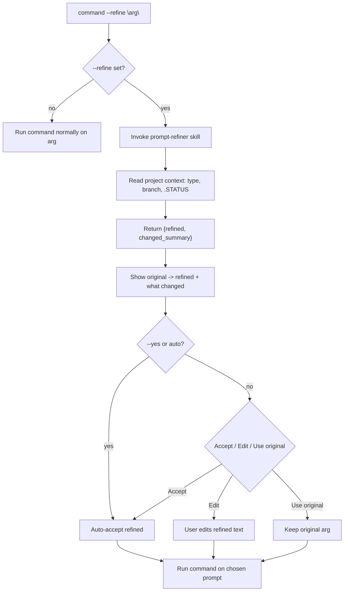

# Tutorial: Refine a Vague Prompt with `--refine`

**Level:** Beginner
**Time:** 10 minutes
**Prerequisites:** Basic familiarity with Craft commands
**Version:** 2.34.0+

## What You'll Learn

By the end of this tutorial, you'll understand:

1. How to add `--refine` to a command
2. How to read the Original → Refined before/after box
3. What Accept / Edit / Use-original each do
4. How `--yes` / auto auto-accepts for unattended runs

## Overview

`--refine` sharpens a vague prompt before the command acts. It hands your
argument to the `prompt-refiner` skill, shows you a before/after box, and lets
you confirm. Let's walk through it with `/craft:workflow:brainstorm`.

## Step 1: Run brainstorm with a vague prompt

```text
/craft:workflow:brainstorm --refine "add auth"
```

`add auth` is exactly the kind of terse prompt that benefits from refinement —
it doesn't say which auth, where, or what success looks like.

## Step 2: Read the before/after box

The `prompt-refiner` skill reads project context (project type, branch,
`.STATUS`) and returns a sharper prompt plus a summary of what changed:

```text
  ┌─ Original ──────────────────────────────────────────┐
  │ add auth                                             │
  ├─ Refined ───────────────────────────────────────────┤
  │ Add user authentication to the app: choose a flow    │
  │ (session vs token), define login/logout, and cover   │
  │ protected routes. Note security and migration risks. │
  ├─ What changed ──────────────────────────────────────┤
  │ Named the surface, the flow choice, and the risks    │
  │ to weigh during brainstorming.                       │
  └─────────────────────────────────────────────────────┘

  Accept (Recommended) / Edit / Use original?
```

## Step 3: Accept

Choose **Accept**. The brainstorm now runs on the *refined* topic — exploring
auth flows, protected routes, and risks — instead of the bare phrase
`add auth`.

> **Tip:** Prefer **Edit** when the refinement is close but not quite right,
> or **Use original** to discard it. Passing `--yes` (or running in an auto /
> unattended context) **auto-accepts the refined prompt** and skips this
> question entirely.

## Architecture

How the flag flows from your argument to the running command:



## What's Next

- [Help: The --refine Flag](../help/refine-flag.md) — full reference
- [Recipe: Refine a prompt before running](../cookbook/recipes/refine-before-running.md)
