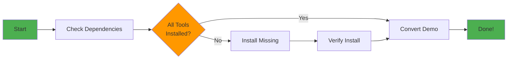

# Getting Started with Dependency Management

**Level**: Beginner
**Time**: ~10 minutes
**Prerequisites**: None

Learn how to use the `/craft:docs:demo` dependency management system to check, install, and manage tools for terminal GIF generation.

---

## Tutorial Overview

By the end of this tutorial, you will be able to:
- ✅ Check which tools are installed
- ✅ Understand dependency status
- ✅ Install missing tools automatically
- ✅ Convert .cast files to optimized GIFs
- ✅ Troubleshoot common issues

---

## Learning Path



---

## Step 1: Verify the System Exists

Before starting, let's verify the dependency management system is available.

**What you'll do:**
```bash
# Check that the demo command exists
ls -la commands/docs/demo.md
```

**Expected output:**
```
-rw-r--r-- 1 user staff 15234 Jan 17 demo.md
```

**What this means:**
- The `/craft:docs:demo` command is installed
- The dependency management system is ready to use

---

## Step 2: Check Your Current Dependencies

Let's see what tools you already have installed.

**Command:**
```bash
/craft:docs:demo --check
```

**What happens:**
1. Reads tool specifications from YAML frontmatter
2. Detects which tools are installed
3. Checks tool health and versions
4. Displays a formatted status table

**Example output:**
```
╔════════════════════════════════════════════════════╗
║  DEPENDENCY STATUS - asciinema method              ║
╚════════════════════════════════════════════════════╝

Tool         Status    Version    Health    Required
──────────────────────────────────────────────────────
asciinema    ✅        2.3.0      ok        yes
agg          ❌        -          n/a       yes
gifsicle     ✅        1.96       ok        yes
fswatch      ⚠️        -          n/a       no

Summary: 2/3 required tools ready
```

**Understanding the status:**
- ✅ **Green checkmark**: Tool installed and working
- ❌ **Red X**: Required tool missing
- ⚠️  **Warning**: Optional tool missing (not critical)

---

## Step 3: Understand the Methods

The system supports two methods for creating GIFs:

### Method 1: asciinema (Recommended)

**Best for:** Real terminal recordings, authentic output

**Required tools:**
- `asciinema` - Record terminal sessions
- `agg` - Convert .cast to .gif
- `gifsicle` - Optimize GIF size

**Optional:**
- `fswatch` - Watch mode for live updates

**Check this method:**
```bash
/craft:docs:demo --check --method asciinema
```

### Method 2: VHS

**Best for:** Scripted demos, repeatable workflows

**Required tools:**
- `vhs` - Generate scripted demos
- `gifsicle` - Optimize GIF size

**Optional:**
- `ffmpeg` - Video processing

**Check this method:**
```bash
/craft:docs:demo --check --method vhs
```

**💡 Tip**: Most users start with asciinema for real recordings.

---

## Step 4: Install Missing Dependencies

If you have missing tools, the system can install them automatically.

**Command:**
```bash
/craft:docs:demo --fix
```

**What happens:**
1. Detects which tools are missing
2. Asks for your consent to install each tool
3. Tries multiple installation methods:
   - Homebrew (macOS)
   - Cargo (Rust)
   - Binary download
   - APT/YUM (Linux)
4. Verifies each installation succeeded

**Example interaction:**
```
Missing dependencies detected:
  - agg (required for asciinema method)

Install agg via cargo? (y/n): y

Installing agg via cargo...
✓ agg installed successfully

Verifying installation...
✓ agg version 1.4.3 detected
✓ Health check passed

All dependencies installed!
```

**Installation safety:**
- ✅ Always asks for consent
- ✅ Tries multiple methods
- ✅ Verifies after install
- ✅ Reports any failures

---

## Step 5: Verify Installation Success

After installation, check that everything is working.

**Command:**
```bash
/craft:docs:demo --check
```

**Expected output (all green):**
```
╔════════════════════════════════════════════════════╗
║  DEPENDENCY STATUS - asciinema method              ║
╚════════════════════════════════════════════════════╝

Tool         Status    Version    Health    Required
──────────────────────────────────────────────────────
asciinema    ✅        2.3.0      ok        yes
agg          ✅        1.4.3      ok        yes
gifsicle     ✅        1.96       ok        yes

Summary: All required tools ready ✨
```

**If you still see issues:**
- See [Step 9: Troubleshooting](#step-9-troubleshooting)
- Check [DEPENDENCY-MANAGEMENT.md](../DEPENDENCY-MANAGEMENT.md#troubleshooting)

---

## Step 6: Create Your First Recording

Now let's record a simple terminal session.

**Record a demo:**
```bash
# Record a session (press Ctrl+D when done)
asciinema rec my-first-demo.cast

# Inside the recording, try some commands:
echo "Hello, World!"
ls -la
pwd

# Exit the recording
<Ctrl+D>
```

**What you'll see:**
```
asciinema: recording started, press <Ctrl-D> or type "exit" to finish
$ echo "Hello, World!"
Hello, World!
$ ls -la
...
$ pwd
/Users/you/project
$ <Ctrl+D>
asciinema: recording finished
```

**Output**: `my-first-demo.cast` file created

---

## Step 7: Convert Recording to GIF

Convert your .cast recording to an optimized GIF.

**Command:**
```bash
/craft:docs:demo --convert my-first-demo.cast
```

**What happens:**
1. Validates the .cast file
2. Converts using `agg` (with optimized settings)
3. Optimizes with `gifsicle`
4. Reports statistics

**Expected output:**
```
Converting: my-first-demo.cast → my-first-demo.gif

✓ Conversion successful
  Duration: 2.3s
  Size: 145KB
  Output: my-first-demo.gif
```

**Conversion settings:**
- Font size: 16
- Line height: 1.4
- Theme: monokai
- Optimization: Level 3 (maximum)
- Colors: 256

**View your GIF:**
```bash
open my-first-demo.gif
```

---

## Step 8: Batch Convert Multiple Files

If you have many .cast files, convert them all at once.

**Scenario**: You have multiple recordings
```bash
# Create demo recordings
docs/
  demo1.cast
  demo2.cast
  demo3.cast
```

**Batch conversion:**
```bash
/craft:docs:demo --batch
```

**What happens:**
1. Finds all .cast files in search path (default: `docs/`)
2. Filters out files with existing .gif (unless `--force`)
3. Converts each file with progress tracking
4. Displays summary

**Example output:**
```
Found 3 .cast files

Converting batch...
[████████░░] 2/3 (67%) - ETA: 8s

✓ demo1.cast → demo1.gif (2.1s, 145KB)
✓ demo2.cast → demo2.gif (1.8s, 98KB)
✓ demo3.cast → demo3.gif (3.2s, 187KB)

Summary: 3/3 converted successfully
Total time: 15.4s
Total size: 430KB
```

**Batch options:**
```bash
# Search different directory
/craft:docs:demo --batch --search-path examples/

# Overwrite existing GIFs
/craft:docs:demo --batch --force

# Preview without converting
/craft:docs:demo --batch --dry-run
```

---

## Step 9: Troubleshooting

Common issues and solutions.

### Issue 1: Tool Not Detected (Installed but Shows Missing)

**Symptom:**
```
agg          ❌        -          n/a       yes
```

**Solutions:**
```bash
# Verify tool is in PATH
which agg

# Reload shell
exec $SHELL

# Check PATH
echo $PATH
```

---

### Issue 2: Installation Failed

**Symptom:**
```
Installing agg via cargo... ✗ Failed
```

**Solutions:**
```bash
# Try manual installation
cargo install agg

# Or download binary
curl -L https://github.com/asciinema/agg/releases/latest/download/agg-x86_64-apple-darwin -o /usr/local/bin/agg
chmod +x /usr/local/bin/agg
```

---

### Issue 3: Health Check Failing

**Symptom:**
```
asciinema    ⚠️        2.3.0      broken    yes
```

**Solutions:**
```bash
# Test tool manually
asciinema --version

# Reinstall
brew uninstall asciinema
/craft:docs:demo --fix
```

---

### Issue 4: GIF Too Large

**Symptom:**
```
✓ demo.cast → demo.gif (5.2s, 2.4MB)
```

**Solutions:**
```bash
# Further optimize
gifsicle -O3 --colors 128 demo.gif -o demo-small.gif

# Reduce recording length
# Record shorter sessions

# Use lower color count
gifsicle -O2 --colors 64 demo.gif -o demo-minimal.gif
```

---

## Step 10: Next Steps

Congratulations! You've completed the getting started tutorial. 🎉

**What you've learned:**
- ✅ Check dependency status
- ✅ Install missing tools
- ✅ Record terminal sessions
- ✅ Convert .cast to .gif
- ✅ Batch process recordings
- ✅ Troubleshoot common issues

**Continue learning:**

### Intermediate Topics
- **Advanced conversion**: Custom agg settings, themes, optimization
- **CI/CD integration**: Automate dependency checks in GitHub Actions
- **VHS scripting**: Create repeatable scripted demos
- **Watch mode**: Iterative development with live updates

**Resources:**
- [User Guide](../DEPENDENCY-MANAGEMENT.md) - Complete reference
- [API Reference](../API-REFERENCE.md) - Function documentation
- [Architecture](../DEPENDENCY-ARCHITECTURE.md) - System design
- [Developer Guide](../DEVELOPER-GUIDE.md) - Contributing

### Try These Commands

**Get JSON output for scripting:**
```bash
/craft:docs:demo --check --json
```

**Check specific tool versions:**
```bash
./scripts/version-check.sh validate asciinema
```

**Detect repair candidates:**
```bash
./scripts/repair-tools.sh detect asciinema
```

---

## Quick Reference

| Task | Command |
|------|---------|
| Check all dependencies | `/craft:docs:demo --check` |
| Check specific method | `/craft:docs:demo --check --method asciinema` |
| Install missing tools | `/craft:docs:demo --fix` |
| Record terminal | `asciinema rec demo.cast` |
| Convert single file | `/craft:docs:demo --convert demo.cast` |
| Batch convert | `/craft:docs:demo --batch` |
| Get JSON output | `/craft:docs:demo --check --json` |

---

## Feedback

Did this tutorial help you? Have suggestions for improvement?

- Open an issue on [GitHub](https://github.com/Data-Wise/craft/issues)
- Submit improvements via PR
- Share your feedback in discussions

---

**Last Updated**: 2026-01-17
**Version**: 1.26.0
**Tutorial Duration**: ~10 minutes
**Completion Rate Target**: 80%+
