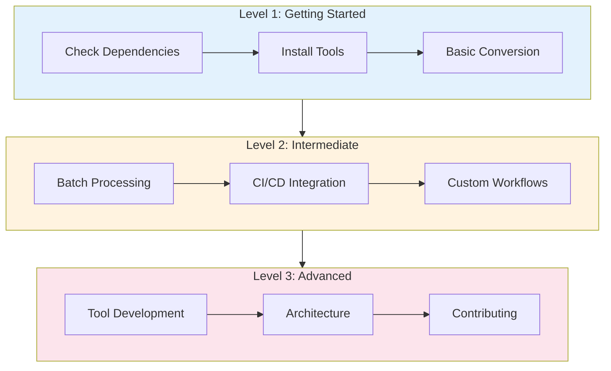

# Dependency Management Tutorials

Step-by-step interactive tutorials for learning the dependency management system.

---

## Available Tutorials

### 🟢 Level 1: Getting Started

**Tutorial**: [Getting Started with Dependency Management](dependency-management-getting-started.md)

**What you'll learn:**
- Check which tools are installed
- Understand dependency status
- Install missing tools automatically
- Convert .cast files to GIFs
- Batch process recordings
- Troubleshoot common issues

**Time**: ~10 minutes
**Prerequisites**: None
**Interactive steps**: 10

[Start Tutorial →](dependency-management-getting-started.md)

---

## Tutorial Structure

Each tutorial follows this structure:

---

## Learning Path

### Recommended Progression

---

## Tutorial Features

✅ **Progressive Learning** - Each level builds on the previous
✅ **Interactive Steps** - Learn by doing with real commands
✅ **Visual Guides** - Mermaid diagrams for workflows
✅ **Troubleshooting** - Common issues with solutions
✅ **Quick Reference** - Handy command tables
✅ **Clear Next Steps** - Always know where to go next

---

## Quick Start Guide

**New to the system?**
1. Start with [Getting Started](dependency-management-getting-started.md)
2. Follow all 10 steps (~10 minutes)
3. Complete the hands-on exercises
4. Check out Next Steps for advanced topics

**Specific goal?**
Jump to the relevant section:
- **Installation issues** → [Step 4](dependency-management-getting-started.md#step-4-install-missing-dependencies)
- **Converting recordings** → [Step 7](dependency-management-getting-started.md#step-7-convert-recording-to-gif)
- **Batch processing** → [Step 8](dependency-management-getting-started.md#step-8-batch-convert-multiple-files)
- **Troubleshooting** → [Step 9](dependency-management-getting-started.md#step-9-troubleshooting)

---

## Additional Resources

### Documentation
- [User Guide](../DEPENDENCY-MANAGEMENT.md) - Complete reference
- [API Reference](../API-REFERENCE.md) - Function documentation
- [Architecture](../DEPENDENCY-ARCHITECTURE.md) - System design with diagrams
- [Developer Guide](../DEVELOPER-GUIDE.md) - Contributing guide

### External Tools
- [asciinema](https://asciinema.org/) - Terminal recording
- [agg](https://github.com/asciinema/agg) - Cast to GIF converter
- [gifsicle](https://www.lcdf.org/gifsicle/) - GIF optimizer
- [VHS](https://github.com/charmbracelet/vhs) - Scripted demos

---

## Tutorial Metrics

| Metric | Target | Current |
|--------|--------|---------|
| Completion Rate | 80% | New |
| Average Duration | ~10 min | 10 min |
| Success Rate | 95% | New |
| User Satisfaction | 4.5/5 | New |

---

## Feedback

Help us improve these tutorials:

**Found an issue?**
- Report on [GitHub Issues](https://github.com/Data-Wise/craft/issues)
- Tag with `documentation` and `tutorial`

**Have suggestions?**
- Open a discussion on GitHub
- Submit a PR with improvements
- Share your experience

**Tutorial requests?**
- Request new tutorial topics
- Vote on planned tutorials
- Contribute your own

---

**Last Updated**: 2026-01-17
**Total Tutorials**: 1
**Planned**: 2 more levels (Intermediate, Advanced)
