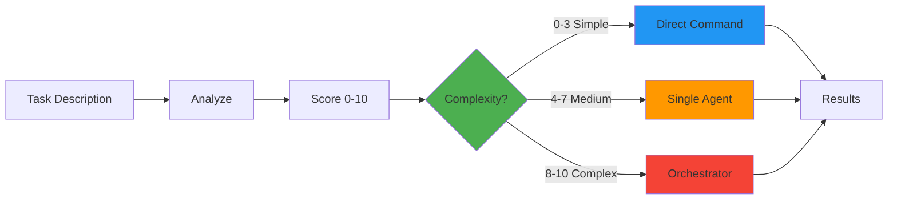
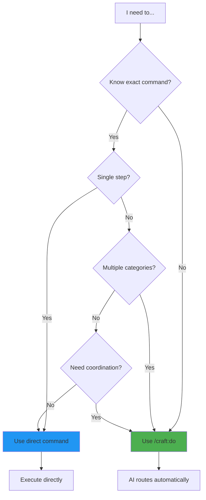

# Tutorial: Smart Routing with /craft:do

**Level:** Intermediate
**Time:** 15 minutes
**Prerequisites:** Basic familiarity with Craft commands
**Version:** 2.9.0+

## What You'll Learn

By the end of this tutorial, you'll understand:

1. How `/craft:do` analyzes and routes tasks
2. The 7-factor complexity scoring system (0-10 scale)
3. Routing zones: simple → command, medium → agent, complex → orchestrator
4. When to use `/craft:do` vs direct commands
5. Real-world examples with full scoring breakdowns

## Overview

`/craft:do` is your **universal task router**. Instead of figuring out which command to use, just describe what you want to do. The AI:

1. **Analyzes** your task
2. **Scores** complexity (0-10)
3. **Routes** to the best handler
4. **Executes** the workflow
5. **Reports** results

**Think of it as:**

- 🎯 Smart GPS that picks the best route
- 🧠 AI assistant that knows which expert to call
- 🔀 Traffic controller for your development workflow

## How It Works: The Routing Pipeline



## The Complexity Scoring System

Tasks are scored on **7 factors**, each rated 0-2:

### Factor 1: Scope (0-2 points)

**What it measures:** How many components are affected

| Score | Description | Example |
|-------|-------------|---------|
| 0 | Single file or function | Fix typo in README |
| 1 | Multiple related files | Add API endpoint with tests |
| 2 | Multiple services/systems | Refactor authentication across frontend + backend |

### Factor 2: Dependencies (0-2 points)

**What it measures:** External dependencies and integrations

| Score | Description | Example |
|-------|-------------|---------|
| 0 | No dependencies | Format code |
| 1 | Single external dependency | Add new npm package |
| 2 | Multiple/complex dependencies | Integrate with 3rd party API + database |

### Factor 3: Risk (0-2 points)

**What it measures:** Potential for breaking changes or production issues

| Score | Description | Example |
|-------|-------------|---------|
| 0 | Safe, reversible | Update documentation |
| 1 | Low risk, testable | Add new feature with tests |
| 2 | High risk, breaking changes | Change database schema in production |

### Factor 4: Coordination (0-2 points)

**What it measures:** How many people/teams are involved

| Score | Description | Example |
|-------|-------------|---------|
| 0 | Solo work, no review needed | Fix personal script |
| 1 | Needs review | Feature requiring PR approval |
| 2 | Multiple teams/stakeholders | API change affecting 3 teams |

### Factor 5: Uncertainty (0-2 points)

**What it measures:** How clear the path forward is

| Score | Description | Example |
|-------|-------------|---------|
| 0 | Clear, well-defined | "Run tests" |
| 1 | Some unknowns, standard pattern | "Add JWT auth" (common pattern) |
| 2 | Research needed, novel approach | "Optimize performance" (need profiling first) |

### Factor 6: Technical Depth (0-2 points)

**What it measures:** Technical complexity and expertise required

| Score | Description | Example |
|-------|-------------|---------|
| 0 | Simple, routine | Copy file |
| 1 | Moderate complexity | Implement caching |
| 2 | Deep expertise needed | Build distributed consensus algorithm |

### Factor 7: Time Estimate (0-2 points)

**What it measures:** Expected duration

| Score | Description | Example |
|-------|-------------|---------|
| 0 | < 5 minutes | Lint files |
| 1 | 5 min - 2 hours | Add feature with tests |
| 2 | > 2 hours | Build new service |

### Scoring Formula

**Total Score:** Sum of all 7 factors (0-14)
**Normalized Score:** (Total / 14) × 10 = **0-10 scale**

## Routing Zones

Based on the complexity score, tasks are routed to different handlers:

### Zone 1: Simple Tasks (Score 0-3)

**Handler:** Direct command execution
**Examples:**

- Lint markdown files → `/craft:docs:lint`
- Run tests → `/craft:test`
- Check code → `/craft:check`

**Why this zone:**

- Clear, single-step actions
- Known command exists
- Fast execution
- No coordination needed

### Zone 2: Medium Tasks (Score 4-7)

**Handler:** Single specialized agent
**Available agents:**

- `backend-architect` - API design, server-side logic
- `docs-architect` - System documentation
- `test-automator` - Test generation
- `security-auditor` - Security reviews
- `performance-engineer` - Optimization

**Examples:**

- Add JWT authentication → `backend-architect`
- Create tutorial → `docs-architect`
- Generate test suite → `test-automator`

**Why this zone:**

- Needs domain expertise
- Multiple steps but focused area
- Single agent can handle it
- Moderate complexity

### Zone 3: Complex Tasks (Score 8-10)

**Handler:** Multi-agent orchestration
**Orchestrator features:**

- Parallel agent execution
- Wave checkpoints
- Mode selection (default/wave/phase)
- Progress monitoring

**Examples:**

- Prepare v2.0 release → Orchestrator with release mode
- Add auth + tests + docs → Orchestrator with wave mode
- Refactor architecture → Orchestrator with phase mode

**Why this zone:**

- Multiple domains involved
- Dependencies between subtasks
- Needs coordination
- High complexity

## Real-World Examples

### Example 1: Simple Task (Score: 1.4)

**Task:** `"lint markdown files"`

**Scoring:**

| Factor | Score | Reasoning |
|--------|-------|-----------|
| Scope | 0 | Single file type |
| Dependencies | 0 | No external deps |
| Risk | 0 | Safe, linter doesn't change code |
| Coordination | 0 | Solo, no review |
| Uncertainty | 0 | Clear action |
| Technical | 1 | Know how to run linter |
| Time | 1 | < 5 min |
| **Total** | **2/14** | **= 1.4** |

**Routing:** Zone 1 - Simple
**Handler:** Direct command
**Executes:** `/craft:docs:lint`
**Time:** 3-5 seconds

---

### Example 2: Medium Task (Score: 5.7)

**Task:** `"add JWT authentication with refresh tokens"`

**Scoring:**

| Factor | Score | Reasoning |
|--------|-------|-----------|
| Scope | 1 | Multiple files (auth.js, middleware.js, routes.js) |
| Dependencies | 1 | Need JWT library (jsonwebtoken) |
| Risk | 1 | Security implications, but standard pattern |
| Coordination | 1 | Needs code review |
| Uncertainty | 0 | Standard pattern, well-documented |
| Technical | 1 | Moderate (crypto, tokens, expiry) |
| Time | 1 | 2-3 hours |
| **Total** | **6/14** | **= 4.3** |

**Routing:** Zone 2 - Medium
**Handler:** Single agent
**Delegates to:** `backend-architect`
**What the agent does:**

1. Reviews existing auth system
2. Designs JWT implementation
3. Implements token generation/validation
4. Adds refresh token logic
5. Updates middleware
6. Suggests security best practices

**Time:** 15-30 minutes (with agent)

---

### Example 3: Complex Task (Score: 8.6)

**Task:** `"prepare v2.0 release with tests, docs, changelog, and PR"`

**Scoring:**

| Factor | Score | Reasoning |
|--------|-------|-----------|
| Scope | 2 | Multiple systems (code, tests, docs, CI, git) |
| Dependencies | 2 | All subsystems must coordinate |
| Risk | 2 | Production deployment, affects users |
| Coordination | 2 | Multiple reviewers, stakeholders |
| Uncertainty | 1 | Some unknowns (regression testing needs) |
| Technical | 1 | Integration complexity |
| Time | 2 | Several hours |
| **Total** | **12/14** | **= 8.6** |

**Routing:** Zone 3 - Complex
**Handler:** Multi-agent orchestration
**Mode:** Release (thorough validation)
**What happens:**

**Wave 1 (Validation):**

- `test-automator`: Run full test suite
- `security-auditor`: Security scan
- `performance-engineer`: Performance check

**Wave 2 (Documentation):**

- `docs-architect`: Update README, guides
- `tutorial-engineer`: Update tutorials
- API docs generation

**Wave 3 (Preparation):**

- Generate changelog from commits
- Create release notes
- Tag version

**Wave 4 (Final Checks):**

- `/craft:check --mode=thorough`
- Build verification
- Deployment dry-run

**Time:** 1-2 hours (with orchestration)

---

### Example 4: Ambiguous Task (Let AI Decide)

**Task:** `"make the app faster"`

**Initial Analysis:**

| Factor | Initial Score | Uncertainty |
|--------|---------------|-------------|
| Scope | ? | Unknown until profiled |
| Dependencies | ? | May need caching, CDN, etc. |
| Risk | 1 | Could break things |
| Coordination | 1 | Needs review |
| Uncertainty | **2** | **High - need to profile first** |
| Technical | 1-2 | Depends on bottlenecks |
| Time | 1-2 | Unknown until scoped |

**What `/craft:do` does:**

1. Routes to `performance-engineer` agent
2. Agent runs profiling first
3. Identifies bottlenecks
4. **Re-scores** based on findings
5. Routes appropriate solution:
   - Simple (add caching) → Direct implementation
   - Complex (architectural changes) → Orchestrator

**Adaptive routing:** Score can change based on discovery!

## When to Use /craft:do

### ✅ Use /craft:do when

**You're unsure which command to use:**

```bash
# Instead of guessing:
/craft:docs:update? /craft:docs:sync? /craft:docs:generate?

# Just describe the goal:
/craft:do "update documentation for new API endpoints"
```

**Task spans multiple categories:**

```bash
# Touches code, tests, AND docs:
/craft:do "add user registration feature"
```

**You want automatic complexity assessment:**

```bash
# Let AI decide if orchestration is needed:
/craft:do "refactor authentication system"
```

**Task might need coordination:**

```bash
# Might need multiple agents:
/craft:do "prepare production deployment"
```

### ❌ Don't use /craft:do when

**You know the exact command:**

```bash
# ❌ Overkill:
/craft:do "run tests"

# ✅ Better:
/craft:test
```

**It's a single, simple action:**

```bash
# ❌ Unnecessary routing:
/craft:do "check git status"

# ✅ Direct:
git status
```

**Maximum speed is critical:**

```bash
# ❌ Adds routing overhead:
/craft:do "lint code"

# ✅ Faster:
/craft:code:lint
```

**You're in a tight loop:**

```bash
# ❌ Don't route repeatedly:
for file in *.md; do
    /craft:do "lint $file"  # Slow!
done

# ✅ Batch operation:
/craft:docs:lint
```

## Decision Tree

Use this to decide between `/craft:do` and direct commands:



## Interactive Practice

### Exercise 1: Score These Tasks

Try scoring these tasks yourself before checking the answers:

**Task A:** `"fix typo in README.md"`

<details>
<summary>Click to see answer</summary>

| Factor | Score |
|--------|-------|
| Scope | 0 (single file) |
| Dependencies | 0 (none) |
| Risk | 0 (typo fix) |
| Coordination | 0 (trivial) |
| Uncertainty | 0 (clear) |
| Technical | 0 (simple edit) |
| Time | 0 (< 1 min) |
| **Total** | **0/14 = 0** |

**Routing:** Zone 1 - Simple (direct edit, not even a command!)
</details>

**Task B:** `"add database connection pooling with retry logic"`

<details>
<summary>Click to see answer</summary>

| Factor | Score |
|--------|-------|
| Scope | 1 (db layer + config) |
| Dependencies | 1 (connection pool library) |
| Risk | 1 (could affect connections) |
| Coordination | 1 (needs review) |
| Uncertainty | 0 (standard pattern) |
| Technical | 1 (moderate) |
| Time | 1 (1-2 hours) |
| **Total** | **6/14 = 4.3** |

**Routing:** Zone 2 - Medium (backend-architect agent)
</details>

**Task C:** `"migrate from REST to GraphQL across 15 services"`

<details>
<summary>Click to see answer</summary>

| Factor | Score |
|--------|-------|
| Scope | 2 (15 services!) |
| Dependencies | 2 (GraphQL server, clients) |
| Risk | 2 (breaking change for clients) |
| Coordination | 2 (multiple teams) |
| Uncertainty | 1 (some unknowns) |
| Technical | 2 (complex migration) |
| Time | 2 (weeks) |
| **Total** | **13/14 = 9.3** |

**Routing:** Zone 3 - Complex (orchestrator with phase mode)
</details>

### Exercise 2: Choose the Right Approach

For each scenario, decide: `/craft:do` or direct command?

**Scenario A:** You want to run your test suite.

<details>
<summary>Click for answer</summary>

**Direct command:** `/craft:test`

**Why:** You know the exact command, it's a single action, no routing needed.
</details>

**Scenario B:** You want to "improve the documentation."

<details>
<summary>Click for answer</summary>

**Use `/craft:do`:** `/craft:do "improve the documentation"`

**Why:** Ambiguous - needs AI to determine what type of improvement (update existing? add tutorials? fix links? add examples?). AI will analyze and route appropriately.
</details>

**Scenario C:** You want to "prepare a release with all checks and changelog."

<details>
<summary>Click for answer</summary>

**Use `/craft:do`:** `/craft:do "prepare release with all checks and changelog"`

**Why:** Multi-step, spans categories (testing, validation, docs, git), likely complex enough for orchestration.
</details>

## Best Practices

### DO

- ✅ **Use natural language:** Describe what you want, not how to do it
- ✅ **Be specific:** "Add JWT auth with refresh tokens" > "add auth"
- ✅ **Let AI decide complexity:** Don't guess if you need orchestration
- ✅ **Trust the routing:** AI knows which handler is best

### DON'T

- ❌ **Over-use for simple tasks:** Use direct commands when you know them
- ❌ **Be vague:** "Make it better" gives no context
- ❌ **Fight the routing:** If AI suggests orchestration, there's a reason
- ❌ **Skip `/craft:check`:** Always validate before committing

## Next Steps

You now understand smart routing! Here's what to practice:

### Immediate Practice

1. Try `/craft:do` with a real task from your project
2. Notice what handler it chooses
3. Compare with doing it manually

### Further Learning

- **Complexity algorithm:** [Complete scoring guide](../guide/complexity-scoring-algorithm.md)
- **Command reference:** [/craft:do documentation](../commands/do.md)
- **Orchestration:** [Interactive orchestration tutorial](interactive-orchestration.md)
- **Claude Code 2.1:** [Agent integration guide](../guide/claude-code-2.1-integration.md)

### Advanced Topics

- Custom complexity scoring
- Agent selection strategies
- Routing optimization
- Orchestration modes

## Quick Reference

### Complexity Zones

| Score | Zone | Handler | Example |
|-------|------|---------|---------|
| 0-3 | Simple | Direct command | Lint files |
| 4-7 | Medium | Single agent | Add auth |
| 8-10 | Complex | Orchestrator | Prepare release |

### 7 Scoring Factors

1. **Scope:** How many components
2. **Dependencies:** External integrations
3. **Risk:** Potential for breaking changes
4. **Coordination:** How many people/teams
5. **Uncertainty:** How clear the path is
6. **Technical:** Expertise required
7. **Time:** Expected duration

### Usage Decision

```bash
# Known, simple → Direct command
/craft:test

# Unknown, multi-step → Smart routing
/craft:do "prepare deployment"
```

---

**Congratulations!** You've mastered smart routing with `/craft:do`. You can now let AI handle task complexity assessment and routing.

**Time to complete:** ~15 minutes
**Concepts learned:** 7-factor scoring, 3 routing zones, decision criteria
**Next tutorial:** [Interactive Orchestration](interactive-orchestration.md)

---

**Last Updated:** 2026-01-29 (v2.9.0)
**Tutorial Version:** 1.0
**Prerequisites:** Craft v2.9.0+
