# Visual Workflows

⏱️ **5 minutes** • 🟢 Beginner • ✓ See the big picture

> **TL;DR** (30 seconds)
>
> - **What:** 5 visual workflow diagrams showing how craft commands work together
> - **Why:** Understand the complete flow from start to finish for common tasks
> - **How:** Click any diagram to see the step-by-step process
> - **Next:** Try the [Documentation Workflow](#documentation-workflow) to automate your docs

Visual guides to craft's most common workflows - see how commands, skills, and agents work together.

---

## Workflow Selector

Not sure where to start? This decision tree shows you the right workflow for your task.

```mermaid
graph TD
    Start["🎯 What do you need to do?"] --> Goal{Choose Your Goal}

    Goal -->|"📚 Update docs"| Docs["Documentation Workflow"]
    Goal -->|"🌐 Create docs site"| Site["Site Creation Workflow"]
    Goal -->|"📦 Release version"| Release["Release Workflow"]
    Goal -->|"✨ Build feature"| Dev["Development Workflow"]
    Goal -->|"🤖 Route a task"| Route["AI Routing Workflow"]

    Docs --> DocsCmd["🔧 /craft:docs:update"]
    Site --> SiteCmd["🔧 /craft:site:create --quick"]
    Release --> RelCmd["🔧 /craft:check --for release"]
    Dev --> DevCmd["🔧 /craft:git:worktree add name"]
    Route --> RouteCmd["🔧 /craft:do 'task description'"]

    DocsCmd --> DocsTime["⏱️ &lt; 30 seconds"]
    SiteCmd --> SiteTime["⏱️ &lt; 5 minutes"]
    RelCmd --> RelTime["⏱️ &lt; 2 minutes"]
    DevCmd --> DevTime["⏱️ Varies"]
    RouteCmd --> RouteTime["⏱️ Varies"]

    style Start fill:#e3f2fd,stroke:#1976d2,stroke-width:2px
    style Goal fill:#fff3e0,stroke:#f57c00,stroke-width:2px
    style Docs fill:#e8f5e9,stroke:#388e3c,stroke-width:2px
    style Site fill:#e8f5e9,stroke:#388e3c,stroke-width:2px
    style Release fill:#fce4ec,stroke:#c2185b,stroke-width:2px
    style Dev fill:#f3e5f5,stroke:#7b1fa2,stroke-width:2px
    style Route fill:#ede7f6,stroke:#512da8,stroke-width:2px
```

!!! tip "Pro Tip: Start with Documentation"
    New to craft? The Documentation Workflow is the easiest starting point - just run `/craft:docs:update` and watch it detect and fix everything automatically.

---

## Documentation Workflow

**From code changes to deployed docs in one command.**

```mermaid
flowchart TD
    START([📝 Code Changes]) --> UPDATE["/craft:docs:update"]

    UPDATE --> DETECT{🔍 Detect Changes}
    DETECT -->|CLI changes| CLI["Update CLI help epilogs"]
    DETECT -->|New features| FEAT["Generate feature guides"]
    DETECT -->|API changes| API["Update API reference"]

    CLI --> REFCARD["Rebuild REFCARD.md"]
    FEAT --> REFCARD
    API --> REFCARD

    REFCARD --> CHECK["/craft:docs:check"]
    CHECK --> LINKS{🔗 Validate Links}
    LINKS -->|Broken| FIX["Auto-fix links"]
    LINKS -->|Valid| NAV["Check navigation"]
    FIX --> NAV

    NAV --> DECISION{Ready?}
    DECISION -->|Manual fixes| MANUAL["Edit files manually"]
    MANUAL --> CHECK
    DECISION -->|Looks good| CHANGELOG["/craft:docs:changelog"]

    CHANGELOG --> DEPLOY["/craft:site:deploy"]
    DEPLOY --> DONE(["✅ Docs Live"])

    click UPDATE "../commands/docs#craftdocsupdate" "Click to see full documentation"
    click CHECK "../commands/docs#craftdocscheck" "Click to see validation options"
    click CHANGELOG "../commands/docs#craftdocschangelog" "Click to see changelog generation"
    click DEPLOY "../commands/site#craftcreatecraftsitedeploy" "Click to see deployment options"

    style START fill:#e8f5e9,stroke:#388e3c,stroke-width:2px
    style UPDATE fill:#e3f2fd,stroke:#1976d2,stroke-width:2px
    style CHECK fill:#fff3e0,stroke:#f57c00,stroke-width:2px
    style DEPLOY fill:#e8f5e9,stroke:#388e3c,stroke-width:2px
    style DONE fill:#c8e6c9,stroke:#2e7d32,stroke-width:2px
```

**Key Commands:**

- `/craft:docs:update` - Smart detection → full execution
- `/craft:docs:check` - Validation with auto-fixes
- `/craft:docs:changelog` - Generate changelog from commits
- `/craft:site:deploy` - Deploy to GitHub Pages

**ADHD-Friendly:** Complete workflow in one command, clear progress at each step.

!!! success "Quick Win"
    Run `/craft:docs:update` right now - it takes < 30 seconds and shows instant results. No configuration needed!

---

## Site Creation Workflow

**Zero to deployed documentation site in under 5 minutes.**

```mermaid
flowchart LR
    START(["🌐 Need Docs Site"]) --> CREATE["/craft:site:create"]

    CREATE --> DETECT["🔍 Detect<br/>project type"]
    DETECT --> WIZARD{⚙️ Interactive<br/>Wizard}

    WIZARD -->|Preset| PRESET["Choose from<br/>8 presets"]
    WIZARD -->|Branding| BRAND["Set name<br/>& tagline"]
    WIZARD -->|Nav| NAV["Pick nav<br/>structure"]

    PRESET --> GEN["📝 Generate<br/>config files"]
    BRAND --> GEN
    NAV --> GEN

    GEN --> FILES["✅ Creates:<br/>mkdocs.yml<br/>docs/index.md<br/>CI workflow"]

    FILES --> BUILD["/craft:site:build"]
    BUILD --> PREVIEW["/craft:site:preview"]
    PREVIEW --> REVIEW{👀 Looks<br/>good?}

    REVIEW -->|❌ No| THEME["/craft:site:theme"]
    THEME --> BUILD
    REVIEW -->|✅ Yes| DEPLOY["/craft:site:deploy"]

    DEPLOY --> DONE(["🎉 Site Live"])

    click CREATE "../commands/site#craftcreate" "Click to see site creation wizard"
    click THEME "../commands/site#craftcreatecraftsitetheme" "Click to see theme options"
    click DEPLOY "../commands/site#craftcreatecraftsitedeploy" "Click to see deployment options"
    click PRESET "../reference/presets" "Click to see all 8 presets"

    style START fill:#e8f5e9,stroke:#388e3c,stroke-width:2px
    style CREATE fill:#e3f2fd,stroke:#1976d2,stroke-width:2px
    style WIZARD fill:#fff3e0,stroke:#f57c00,stroke-width:2px
    style FILES fill:#f3e5f5,stroke:#7b1fa2,stroke-width:2px
    style DEPLOY fill:#e8f5e9,stroke:#388e3c,stroke-width:2px
    style DONE fill:#c8e6c9,stroke:#2e7d32,stroke-width:2px
```

**8 ADHD-Friendly Presets:**

- `adhd-focus` - Calm forest green
- `adhd-calm` - Warm earth tones
- `adhd-dark` - Dark-first mode
- `adhd-light` - Warm off-white
- `data-wise` - DT's standard (blue/orange)
- `minimal` - Clean and simple
- `open-source` - Community-friendly
- `corporate` - Professional

**Time to Deploy:** < 5 minutes with `--quick` flag

!!! tip "Pro Tip: Use --quick for Zero Prompts"
    Add `--quick` to skip all wizard prompts and use smart defaults: `/craft:site:create --preset adhd-focus --quick`

---

## Release Workflow

**From pre-release checks to published release with safety gates.**

```mermaid
flowchart TD
    START(["📦 Ready to Release"]) --> CHECK["/craft:check<br/>--for release"]

    CHECK --> AUDIT{🔍 Full Audit}
    AUDIT -->|Tests| TESTS["Run test suite"]
    AUDIT -->|Quality| LINT["Code style checks"]
    AUDIT -->|Docs| DOCS["Validate all docs"]
    AUDIT -->|Git| GIT["Verify clean<br/>git status"]

    TESTS --> RESULTS{✅ All Pass?}
    LINT --> RESULTS
    DOCS --> RESULTS
    GIT --> RESULTS

    RESULTS -->|❌ No| FIX["Fix issues"]
    FIX --> CHECK

    RESULTS -->|✅ Yes| CHANGELOG["/craft:docs:changelog"]
    CHANGELOG --> VERSION["Update version<br/>in config"]
    VERSION --> TAG["Create git tag"]
    TAG --> PUSH["Push to remote"]

    PUSH --> GHRELEASE["🚀 GitHub Release<br/>Auto-triggers"]
    GHRELEASE --> PYPI["PyPI publish<br/>via OIDC"]
    GHRELEASE --> BREW["Homebrew<br/>formula update"]
    GHRELEASE --> PAGES["GitHub Pages<br/>deploy"]

    PYPI --> DONE(["✨ Released"])
    BREW --> DONE
    PAGES --> DONE

    style START fill:#fce4ec,stroke:#c2185b,stroke-width:2px
    style CHECK fill:#e3f2fd,stroke:#1976d2,stroke-width:2px
    style AUDIT fill:#fff3e0,stroke:#f57c00,stroke-width:2px
    style RESULTS fill:#fff3e0,stroke:#f57c00,stroke-width:2px
    style GHRELEASE fill:#f3e5f5,stroke:#7b1fa2,stroke-width:2px
    style DONE fill:#c8e6c9,stroke:#2e7d32,stroke-width:2px
```

**Automation:**

- GitHub Actions triggers PyPI publish (trusted publisher)
- Homebrew formula updates via PR
- Docs deploy to GitHub Pages
- All from one release creation

**Safety:** Multiple validation gates prevent bad releases

!!! warning "Release Safety"
    `/craft:check --for release` will fail if tests fail, docs are stale, or git status is dirty. This prevents releasing broken code - fix issues before retrying.

---

## Development Workflow

**Feature branch to merged PR with git worktrees.**

```mermaid
flowchart TD
    START(["✨ New Feature"]) --> WORKTREE["/craft:git:worktree<br/>add feature-name"]

    WORKTREE --> CLONE["Create isolated<br/>worktree at<br/>~/.git-wt/project/"]
    CLONE --> SWITCH["Switch terminal<br/>context"]

    SWITCH --> LOOP{💻 Development Loop}
    LOOP -->|Write code| CODE["Implement feature"]
    LOOP -->|Run tests| TEST["/craft:test:run debug"]
    LOOP -->|Check quality| LINT["/craft:code:lint optimize"]

    CODE --> CHECK["/craft:check"]
    TEST --> CHECK
    LINT --> CHECK

    CHECK --> VALID{✅ All Pass?}
    VALID -->|No| LOOP
    VALID -->|Yes| DOCS["/craft:docs:update"]

    DOCS --> COMMIT["git commit + push"]
    COMMIT --> PR["Create PR<br/>via gh cli"]
    PR --> REVIEW{👥 Code Review}

    REVIEW -->|Changes requested| LOOP
    REVIEW -->|Approved| MERGE["Merge PR<br/>to dev"]

    MERGE --> CLEANUP["/craft:git:worktree remove"]
    CLEANUP --> DONE(["🎉 Feature Complete"])

    style START fill:#f3e5f5,stroke:#7b1fa2,stroke-width:2px
    style WORKTREE fill:#e3f2fd,stroke:#1976d2,stroke-width:2px
    style LOOP fill:#fff3e0,stroke:#f57c00,stroke-width:2px
    style CHECK fill:#fff3e0,stroke:#f57c00,stroke-width:2px
    style MERGE fill:#e8f5e9,stroke:#388e3c,stroke-width:2px
    style DONE fill:#c8e6c9,stroke:#2e7d32,stroke-width:2px
```

**Worktree Benefits:**

- Work on multiple features in parallel
- Keep main branch clean
- Instant context switching
- No stashing required

**Commands:**

- `/craft:git:worktree add` - Create feature worktree
- `/craft:git:worktree list` - See all worktrees
- `/craft:git:worktree remove` - Clean up after merge

---

## AI Routing Workflow

**How /craft:do intelligently routes tasks to the right tools.**

```mermaid
flowchart TD
    START(["🤖 /craft:do<br/>'add auth'"]) --> ANALYZE["task-analyzer<br/>skill"]

    ANALYZE --> CLASSIFY{🎯 Classify<br/>Task Type}

    CLASSIFY -->|🔧 Backend| BACKEND["backend-designer<br/>skill"]
    CLASSIFY -->|✅ Testing| TEST["test-strategist<br/>skill"]
    CLASSIFY -->|📚 Docs| DOCS["Docs commands"]
    CLASSIFY -->|🏗️ Complex| ORCHESTRATE["Orchestrator<br/>v2"]

    BACKEND --> ROUTE1{Choose<br/>Tool}
    ROUTE1 -->|Simple| CMD1["Direct<br/>command"]
    ROUTE1 -->|Complex| AGENT1["backend-architect<br/>agent"]

    TEST --> ROUTE2{Choose<br/>Tool}
    ROUTE2 -->|Unit tests| CMD2["/craft:test:run"]
    ROUTE2 -->|Strategy| AGENT2["test-strategist<br/>skill"]

    DOCS --> ROUTE3{Choose<br/>Tool}
    ROUTE3 -->|Update| CMD3["/craft:docs:update"]
    ROUTE3 -->|Site| CMD4["/craft:site:create"]

    ORCHESTRATE --> PARALLEL["⚡ Run in<br/>parallel"]
    PARALLEL --> SUB1["Backend agent"]
    PARALLEL --> SUB2["Test agent"]
    PARALLEL --> SUB3["Docs agent"]

    CMD1 --> DONE(["✨ Task Complete"])
    AGENT1 --> DONE
    CMD2 --> DONE
    AGENT2 --> DONE
    CMD3 --> DONE
    CMD4 --> DONE
    SUB1 --> DONE
    SUB2 --> DONE
    SUB3 --> DONE

    click START "../commands/smart#craftdo" "Click to see universal command docs"
    click ORCHESTRATE "../guide/orchestrator" "Click to learn about orchestrator"
    click CMD3 "../commands/docs#craftdocsupdate" "Click to see docs automation"
    click CMD4 "../commands/site#craftcreate" "Click to see site creation"

    style START fill:#ede7f6,stroke:#512da8,stroke-width:2px
    style ANALYZE fill:#e3f2fd,stroke:#1976d2,stroke-width:2px
    style CLASSIFY fill:#fff3e0,stroke:#f57c00,stroke-width:2px
    style ORCHESTRATE fill:#ffe0b2,stroke:#e65100,stroke-width:2px
    style DONE fill:#c8e6c9,stroke:#2e7d32,stroke-width:2px
```

**Three Layers:**

1. **Skills** (17 total) - Auto-triggered expertise
   - `task-analyzer` - Routes to appropriate tools
   - `backend-designer` - API/database/auth patterns
   - `test-strategist` - Test strategy recommendations

2. **Commands** (69 total) - Direct actions
   - `/craft:docs:update` - Documentation automation
   - `/craft:test:run` - Test execution
   - `/craft:code:lint` - Code quality checks

3. **Agents** (7 specialized) - Long-running complex tasks
   - `backend-architect` - Scalable API design
   - `docs-architect` - Comprehensive documentation
   - `api-documenter` - OpenAPI spec generation

**Mode System:**

- `default` (<10s) - Quick tasks, 2 agents max
- `debug` (<120s) - Verbose output, 1 agent (sequential)
- `optimize` (<180s) - 4 agents max, parallel execution
- `release` (<300s) - Thorough validation, full reports

**ADHD-Friendly:** One command handles routing, you don't need to remember which tool to use.

---

## Workflow Comparison Overview

High-level comparison of all five workflows - choose based on your task type.

```mermaid
graph LR
    subgraph docs["📚 Documentation Workflow"]
        d1["Code Changes<br/>↓<br/>Detect & Fix<br/>↓<br/>Deploy"]
    end

    subgraph site["🌐 Site Workflow"]
        s1["Create Site<br/>↓<br/>Configure<br/>↓<br/>Build & Deploy"]
    end

    subgraph release["📦 Release Workflow"]
        r1["Pre-flight Checks<br/>↓<br/>Tag Version<br/>↓<br/>Publish"]
    end

    subgraph dev["✨ Development Workflow"]
        dv1["Feature Branch<br/>↓<br/>Write & Test<br/>↓<br/>PR & Merge"]
    end

    subgraph route["🤖 AI Routing"]
        rt1["Describe Task<br/>↓<br/>Auto-Route<br/>↓<br/>Execute"]
    end

    style docs fill:#e8f5e9,stroke:#388e3c,stroke-width:2px
    style site fill:#e8f5e9,stroke:#388e3c,stroke-width:2px
    style release fill:#fce4ec,stroke:#c2185b,stroke-width:2px
    style dev fill:#f3e5f5,stroke:#7b1fa2,stroke-width:2px
    style route fill:#ede7f6,stroke:#512da8,stroke-width:2px
```

| Workflow | Best For | Start Command | Time | Complexity |
|----------|----------|---------------|------|------------|
| **Documentation** | Auto-sync docs | `/craft:docs:update` | < 30s | Simple |
| **Site Creation** | New docs site | `/craft:site:create --quick` | < 5m | Simple |
| **Release** | Publishing | `/craft:check --for release` | < 2m | Medium |
| **Development** | New features | `/craft:git:worktree add name` | Varies | Medium |
| **AI Routing** | Complex tasks | `/craft:do "description"` | Varies | Complex |

---

## Quick Reference

| Workflow | Start Command | Time | ADHD Score |
|----------|--------------|------|------------|
| Documentation | `/craft:docs:update` | < 30s | ⭐⭐⭐⭐⭐ |
| Site Creation | `/craft:site:create --quick` | < 5m | ⭐⭐⭐⭐⭐ |
| Release | `/craft:check --for release` | < 2m | ⭐⭐⭐⭐ |
| Development | `/craft:git:worktree add name` | varies | ⭐⭐⭐⭐ |
| AI Routing | `/craft:do "task"` | varies | ⭐⭐⭐⭐⭐ |

## Next Steps

- **Try a workflow:** Pick one diagram above and run the first command
- **Combine workflows:** Use `/craft:orchestrate` to run multiple workflows
- **Learn more:** Read the [Orchestrator Guide](../guide/orchestrator.md)
- **Reference:** Check the [Quick Reference Card](../REFCARD.md)
