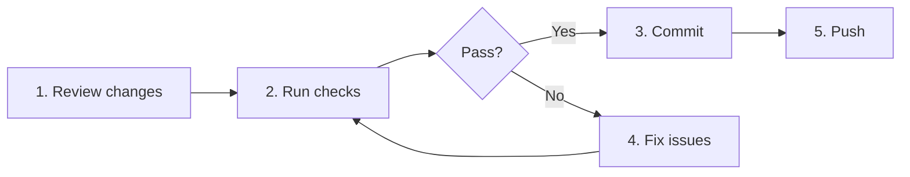

# Pre-commit Workflow

> **Scenario:** Validating changes before committing to ensure code quality
> **Time:** 1-5 minutes
> **Difficulty:** 🟢 Beginner

---

## When to Use This Workflow

Use this workflow when you:

- Finish a coding session and want to commit
- Need to validate changes before pushing
- Want to catch issues before CI runs
- Are preparing code for review

**Example scenarios:**
- "Ready to commit my changes"
- "Want to make sure everything works before pushing"
- "Need to validate before creating a PR"

---

## Prerequisites

Before starting, ensure you have:

- [x] Changes staged or ready to stage
- [x] On a feature branch (not main/dev)
- [x] Tests exist for the project

**Quick check:**
```bash
git status
git branch --show-current
```

---

## Basic Workflow



### Step 1: Review Changes

See what you're about to commit.

```bash
# Check status
git status

# Review diff
git diff

# Or with craft
/craft:git:recap
```

**Look for:**
- Unintended file changes
- Debug code or console.log statements
- Sensitive data (API keys, passwords)
- Large files that shouldn't be committed

### Step 2: Run Pre-commit Checks

Use craft to validate everything.

```bash
# Quick validation
/craft:check

# Or for more thorough check
/craft:check --for commit
```

**What it checks:**
| Check | Description |
|-------|-------------|
| Lint | Code style and quality |
| Tests | Run test suite |
| Types | Type checking (if applicable) |
| Git status | Working tree status |

**Expected output:**
```
╭─ /craft:check ───────────────────────────────────────╮
│ Project: craft (Claude Plugin)                       │
│ Time: 12.4s                                          │
├──────────────────────────────────────────────────────┤
│ ✓ Lint         0 issues                              │
│ ✓ Tests        89/89 passed                          │
│ ✓ Git          37 files changed                      │
├──────────────────────────────────────────────────────┤
│ STATUS: ALL CHECKS PASSED ✓                          │
╰──────────────────────────────────────────────────────╯
```

### Step 3: Commit Changes

If checks pass, commit with a descriptive message.

```bash
# Stage changes
git add .

# Or stage specific files
git add src/ tests/

# Commit with conventional commit message
git commit -m "feat: add user authentication"
```

**Conventional Commits:**
| Prefix | Use for |
|--------|---------|
| `feat:` | New features |
| `fix:` | Bug fixes |
| `docs:` | Documentation only |
| `refactor:` | Code changes that don't add features or fix bugs |
| `test:` | Adding or updating tests |
| `chore:` | Maintenance tasks |

### Step 4: Fix Issues (if needed)

If checks fail, fix the issues and re-run.

```bash
# Auto-fix lint issues
/craft:code:lint --fix

# Re-run tests to see failures
/craft:test:run debug

# Re-run checks
/craft:check
```

### Step 5: Push Changes

After successful commit, push to remote.

```bash
git push origin feature/my-feature
```

---

## Quick One-Liner

For experienced users, the entire flow in one sequence:

```bash
# Check, stage, commit, push
/craft:check && git add . && git commit -m "feat: description" && git push
```

---

## Pre-commit Hooks (Optional)

Set up automatic checks before every commit.

### Using pre-commit framework (Python)

```bash
# Install pre-commit
pip install pre-commit

# Create .pre-commit-config.yaml
cat > .pre-commit-config.yaml << 'EOF'
repos:
  - repo: https://github.com/astral-sh/ruff-pre-commit
    rev: v0.1.6
    hooks:
      - id: ruff
        args: [--fix]
      - id: ruff-format

  - repo: https://github.com/pre-commit/pre-commit-hooks
    rev: v4.5.0
    hooks:
      - id: trailing-whitespace
      - id: end-of-file-fixer
      - id: check-yaml
      - id: check-added-large-files
EOF

# Install hooks
pre-commit install
```

### Using husky (Node.js)

```bash
# Install husky
npm install --save-dev husky

# Initialize
npx husky init

# Add pre-commit hook
echo "npm test" > .husky/pre-commit
```

---

## Variations

### Quick Commit (Skip Extensive Checks)

For trivial changes where you trust the code:

```bash
# Just lint check
/craft:code:lint

# Commit if clean
git add . && git commit -m "fix: typo in README"
```

### Pre-PR Commit

More thorough validation before creating a PR:

```bash
# Full PR checks
/craft:check --for pr

# Includes:
# - Lint + tests
# - Coverage threshold
# - Branch up to date
# - No merge conflicts
```

### Amend Last Commit

Fix the last commit without creating a new one:

```bash
# Stage additional changes
git add .

# Amend (only if not pushed!)
git commit --amend --no-edit

# Or with new message
git commit --amend -m "feat: better description"
```

---

## Troubleshooting

| Issue | Solution |
|-------|----------|
| Lint errors | Run `/craft:code:lint --fix` |
| Test failures | Run `/craft:test:run debug` for details |
| Large file warning | Add to .gitignore or use Git LFS |
| Sensitive data | Remove and add to .gitignore |
| Wrong branch | `git stash && git checkout correct-branch && git stash pop` |

---

## Quick Reference

| Action | Command |
|--------|---------|
| Review changes | `git status` or `/craft:git:recap` |
| Quick check | `/craft:check` |
| Full check | `/craft:check --for commit` |
| Auto-fix lint | `/craft:code:lint --fix` |
| Stage all | `git add .` |
| Commit | `git commit -m "type: message"` |
| Push | `git push origin branch-name` |

---

## See Also

- **Help:** [/craft:check](../commands/check.md)
- **Help:** [/craft:git:worktree](../commands/git/worktree.md)
- **Workflow:** [Git Feature Workflow](git-feature-workflow.md)
- **Workflow:** [Release Workflow](release-workflow.md)
