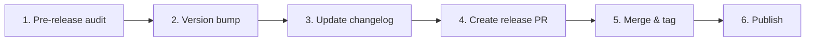

# Release Workflow

> **Scenario:** Preparing and publishing a new version release
> **Time:** 30-60 minutes
> **Difficulty:** 🔧 Medium

---

## When to Use This Workflow

Use this workflow when you need to:

- Release a new version to production
- Publish to package registries (npm, PyPI, CRAN)
- Create GitHub releases with changelogs
- Deploy documentation updates

**Example scenarios:**
- "Ready to release v1.20.0"
- "Need to publish the latest fixes"
- "Time for a major version bump"

---

## Prerequisites

Before starting, ensure you have:

- [x] All tests passing on `dev` branch
- [x] Changelog updated
- [x] Version bumped in config files
- [x] Documentation up to date
- [x] No uncommitted changes

**Quick check:**
```bash
/craft:check --for release
```

---

## Basic Workflow



### Step 1: Pre-Release Audit

Run comprehensive checks before releasing.

```bash
/craft:check --for release
```

**What it checks:**
| Check | Description |
|-------|-------------|
| Tests | Full test suite with coverage |
| Lint | All rules, security checks |
| Types | Full type checking |
| Security | Vulnerability audit |
| Docs | Link validation |
| Changelog | Recent entries |

**Expected output:**
```
╭─ /craft:check --for release ─────────────────────────╮
│ Project: craft (Claude Plugin)                       │
│ Time: 2m 34s                                         │
├──────────────────────────────────────────────────────┤
│ ✓ Lint         0 issues                              │
│ ✓ Tests        89/89 passed                          │
│ ✓ Security     0 vulnerabilities                     │
│ ✓ Docs         All links valid                       │
│ ✓ Changelog    Updated within 7 days                 │
├──────────────────────────────────────────────────────┤
│ STATUS: READY FOR RELEASE ✓                          │
╰──────────────────────────────────────────────────────╯
```

### Step 2: Version Bump

Update version numbers in all relevant files.

```bash
# Check current version
cat .claude-plugin/plugin.json | grep version

# Update version (manual or scripted)
# - .claude-plugin/plugin.json
# - pyproject.toml (if Python)
# - package.json (if Node)
# - DESCRIPTION (if R)
```

**Version format:** Follow [Semantic Versioning](https://semver.org/)
- `MAJOR.MINOR.PATCH`
- `1.18.0` → `1.18.1` (patch/bugfix)
- `1.18.0` → `1.19.0` (minor/feature)
- `1.18.0` → `2.0.0` (major/breaking)

### Step 3: Update Changelog

Add release notes to CHANGELOG.md.

```bash
/craft:docs:changelog
```

**Changelog format:**
```markdown
## [1.18.0] - 2026-01-14

### Added
- Help pages for key commands
- Release and pre-commit workflow docs
- Navigation updates to mkdocs.yml

### Changed
- Updated command count to 89

### Fixed
- Broken links in workflow documentation
```

### Step 4: Create Release PR

Merge dev branch to main via pull request.

```bash
# Ensure dev is up to date
git checkout dev
git pull origin dev

# Create release PR
gh pr create --base main --head dev \
  --title "Release v1.20.0" \
  --body "$(cat <<'EOF'
## Summary
Release v1.20.0 with documentation improvements.

## Changes
- Add help pages for key commands
- Add release and pre-commit workflow docs
- Update navigation in mkdocs.yml

## Checklist
- [x] All tests pass
- [x] Changelog updated
- [x] Version bumped
- [x] Documentation complete
EOF
)"
```

### Step 5: Merge & Tag

After PR approval, merge and create release tag.

```bash
# Merge PR (via GitHub UI or CLI)
gh pr merge --merge

# Switch to main and pull
git checkout main
git pull origin main

# Create and push tag
git tag v1.20.0
git push --tags
```

### Step 6: Publish

Publish to relevant registries.

#### PyPI (Python)
```bash
# Automatic via GitHub Actions if configured
# Or manual:
uv build
uv publish
```

#### npm (Node.js)
```bash
npm publish
```

#### GitHub Release
```bash
gh release create v1.20.0 \
  --title "v1.20.0" \
  --notes-file CHANGELOG.md \
  --latest
```

#### Documentation Site
```bash
/craft:site:deploy
# or
mkdocs gh-deploy
```

---

## Variations

### Hotfix Release

For urgent fixes that bypass normal dev flow:

```bash
# Create hotfix branch from main
git checkout main
git checkout -b hotfix/critical-fix

# Fix, test, commit
/craft:check --for release

# PR directly to main
gh pr create --base main --title "hotfix: critical fix"

# After merge, cherry-pick to dev
git checkout dev
git cherry-pick <commit-hash>
git push origin dev
```

### Pre-release (Beta/RC)

For testing before full release:

```bash
# Tag with pre-release identifier
git tag v1.20.0-beta.1
git push --tags

# Create pre-release on GitHub
gh release create v1.20.0-beta.1 \
  --title "v1.20.0 Beta 1" \
  --prerelease
```

### Automated Release

Using GitHub Actions:

```yaml
name: Release

on:
  push:
    tags:
      - 'v*'

jobs:
  release:
    runs-on: ubuntu-latest
    steps:
      - uses: actions/checkout@v4
      - name: Create Release
        uses: softprops/action-gh-release@v1
        with:
          generate_release_notes: true
```

---

## Troubleshooting

| Issue | Solution |
|-------|----------|
| Tests failing | Fix issues, don't skip tests for release |
| Merge conflicts | Resolve on dev, re-run checks |
| Tag already exists | Use different version or delete old tag |
| Publish failed | Check registry credentials/tokens |
| Docs not deploying | Check gh-pages branch permissions |

---

## Quick Reference

| Action | Command |
|--------|---------|
| Pre-release check | `/craft:check --for release` |
| Update changelog | `/craft:docs:changelog` |
| Create release PR | `gh pr create --base main --head dev` |
| Create tag | `git tag v1.20.0 && git push --tags` |
| Create release | `gh release create v1.20.0` |
| Deploy docs | `/craft:site:deploy` |

---

## See Also

- **Help:** [/craft:check](../help/check.md)
- **Help:** [/craft:docs:update](../help/docs-update.md)
- **Workflow:** [Git Feature Workflow](git-feature-workflow.md)
- **Workflow:** [Pre-commit Workflow](pre-commit-workflow.md)
