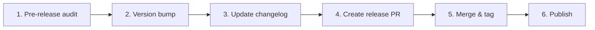

# Release Workflow

> **Scenario:** Preparing and publishing a new version release
> **Time:** 30-60 minutes
> **Difficulty:** 🔧 Medium

---

## When to Use This Workflow

Use this workflow when you need to:

- Release a new version to production
- Publish to package registries (npm, PyPI, CRAN)
- Create GitHub releases with changelogs
- Deploy documentation updates

**Example scenarios:**

- "Ready to release v1.20.0"
- "Need to publish the latest fixes"
- "Time for a major version bump"

---

## Prerequisites

Before starting, ensure you have:

- [x] All tests passing on `dev` branch
- [x] Changelog updated
- [x] Version bumped in config files
- [x] Documentation up to date
- [x] No uncommitted changes
- [x] Marketplace config validated (if applicable)

**Quick check:**

```bash
/craft:check --for release
```

---

## Basic Workflow


```mermaid
flowchart LR
    A[1. Pre-release audit] --> B[2. Version bump]
    B --> C[3. Update changelog]
    C --> D[4. Create release PR]
    D --> E[5. Merge & tag]
    E --> F[6. Publish]
```

### Step 1: Pre-Release Audit

Run two complementary checks before releasing.

**1a. Full CI mirror:**

```bash
/craft:check --for release
```

**1b. Release metadata (Craft plugins):**

```bash
./scripts/pre-release-check.sh <version>
```

**What they check together:**

| Check | Source | Description |
|-------|--------|-------------|
| Tests | `/craft:check` | Full test suite with coverage |
| Lint | `/craft:check` | All rules, security checks |
| Types | `/craft:check` | Full type checking |
| Security | `/craft:check` | Vulnerability audit |
| Docs | `/craft:check` | Link validation |
| Version sync | `pre-release-check.sh` | Version matches across files |
| Count accuracy | `pre-release-check.sh` | Command/skill/agent counts |

**Expected output:**

```
╭─ /craft:check --for release ─────────────────────────╮
│ Project: craft (Claude Plugin)                       │
│ Time: 2m 34s                                         │
├──────────────────────────────────────────────────────┤
│ ✓ Lint         0 issues                              │
│ ✓ Tests        89/89 passed                          │
│ ✓ Security     0 vulnerabilities                     │
│ ✓ Docs         All links valid                       │
│ ✓ Changelog    Updated within 7 days                 │
├──────────────────────────────────────────────────────┤
│ STATUS: READY FOR RELEASE ✓                          │
╰──────────────────────────────────────────────────────╯
```

**1c. Marketplace validation (if marketplace.json exists):**

```bash
claude plugin validate .
```

Validates the marketplace.json structure and plugin compatibility.

### Step 2: Version Bump

Update version numbers in all relevant files.

```bash
# Check current version
cat .claude-plugin/plugin.json | grep version

# Update version (manual or scripted)
# - .claude-plugin/plugin.json
# - pyproject.toml (if Python)
# - package.json (if Node)
# - DESCRIPTION (if R)
```

**Version format:** Follow [Semantic Versioning](https://semver.org/)

- `MAJOR.MINOR.PATCH`
- `1.18.0` → `1.18.1` (patch/bugfix)
- `1.18.0` → `1.19.0` (minor/feature)
- `1.18.0` → `2.0.0` (major/breaking)

### Step 3: Update Changelog

Add release notes to CHANGELOG.md.

```bash
/craft:docs:changelog
```

**Changelog format:**

```markdown
## [1.18.0] - 2026-01-14

### Added
- Help pages for key commands
- Release and pre-commit workflow docs
- Navigation updates to mkdocs.yml

### Changed
- Updated command count to 89

### Fixed
- Broken links in workflow documentation
```

### Step 4: Create Release PR

Merge dev branch to main via pull request.

```bash
# Ensure dev is up to date
git checkout dev
git pull origin dev

# Create release PR
gh pr create --base main --head dev \
  --title "Release v1.20.0" \
  --body "$(cat <<'EOF'
## Summary
Release v1.20.0 with documentation improvements.

## Changes
- Add help pages for key commands
- Add release and pre-commit workflow docs
- Update navigation in mkdocs.yml

## Checklist
- [x] All tests pass
- [x] Changelog updated
- [x] Version bumped
- [x] Documentation complete
EOF
)"
```

### Step 5: Merge & Tag

After PR approval, merge and create release tag.

```bash
# Merge PR (via GitHub UI or CLI)
gh pr merge --merge

# Switch to main and pull
git checkout main
git pull origin main

# Create and push tag
git tag v1.20.0
git push --tags
```

### Step 6: Publish

Publish to relevant registries.

#### PyPI (Python)

```bash
# Automatic via GitHub Actions if configured
# Or manual:
uv build
uv publish
```

#### npm (Node.js)

```bash
npm publish
```

#### GitHub Release

```bash
gh release create v1.20.0 \
  --title "v1.20.0" \
  --notes-file CHANGELOG.md \
  --latest
```

#### Documentation Site

```bash
/craft:site:deploy
# or
mkdocs gh-deploy
```

---

## Post-Release Verification

After publishing, verify that all downstream systems have updated correctly. These steps (11-13) are part of the hardened release pipeline and ensure nothing was missed.

### Step 11: Dev Synced with Main

Ensure the `dev` branch contains all changes from the release:

```bash
git checkout dev
git pull origin dev

# Verify dev is not behind main
git log main..dev --oneline   # should show dev-only commits (if any)
git log dev..main --oneline   # should be empty (dev has everything from main)
```

If dev is behind main, pull main into dev:

```bash
git merge main
git push origin dev
```

### Step 12: Verify CI on Main (MANDATORY)

Check that CI passes on the main branch after the merge. This is a mandatory gate -- do not proceed if CI is red.

```bash
# Check CI status on main
gh run list --branch main --limit 3

# Or use craft command
/craft:ci:status --post-release
```

If CI fails on main, treat it as a release blocker and fix immediately.

### Step 13: Downstream Verification

Verify that all downstream artifacts were updated correctly:

| Check | Command | What to Verify |
|-------|---------|----------------|
| **Docs deploy** | `gh run list --workflow deploy-docs.yml --limit 1` | Deploy docs workflow ran successfully |
| **Homebrew release** | `gh run list --workflow homebrew-release.yml --limit 1` | Homebrew release workflow ran successfully |
| **Live site version** | Visit docs site, check version in footer/banner | Version matches the release |
| **Formula content** | `brew info <formula>` or check tap repo | Formula URL and SHA256 point to new release |
| **Badge validation** | Check README.md badges resolve correctly | Version badge shows new version, CI badge is green |

```bash
# Quick downstream check sequence
gh run list --branch main --limit 5
brew update && brew info craft
curl -s https://data-wise.github.io/craft/ | grep -o 'v[0-9]*\.[0-9]*\.[0-9]*' | head -1
```

If any downstream check fails, investigate and fix before announcing the release.

### Step 13.5: Post-Release Sweep

After downstream verification passes, run the post-release sweep to catch long-tail drift in secondary documentation:

```bash
# Report drift without changes (default)
./scripts/post-release-sweep.sh

# Auto-fix Tier 2 version refs, report everything else
./scripts/post-release-sweep.sh --fix

# JSON output for scripting
./scripts/post-release-sweep.sh --json
```

The sweep uses a three-tier detection model:

| Tier | What It Catches | Action |
|------|----------------|--------|
| 1 | Core file drift (13 files) | Delegates to `bump-version.sh --verify` |
| 2 | Stale version refs in secondary docs | `--fix` auto-corrects |
| 3 | Content staleness (CHANGELOG vs index.md) | Manual review |

If fixes are applied, commit them before announcing the release:

```bash
git add -A && git commit -m "chore: fix post-release drift detected by sweep"
```

See [Post-Release Sweep Reference](../reference/REFCARD-POST-RELEASE-SWEEP.md) for details.

---

## Variations

### Hotfix Release

For urgent fixes that bypass normal dev flow:

```bash
# Create hotfix branch from main
git checkout main
git checkout -b hotfix/critical-fix

# Fix, test, commit
/craft:check --for release

# PR directly to main
gh pr create --base main --title "hotfix: critical fix"

# After merge, cherry-pick to dev
git checkout dev
git cherry-pick <commit-hash>
git push origin dev
```

### Pre-release (Beta/RC)

For testing before full release:

```bash
# Tag with pre-release identifier
git tag v1.20.0-beta.1
git push --tags

# Create pre-release on GitHub
gh release create v1.20.0-beta.1 \
  --title "v1.20.0 Beta 1" \
  --prerelease
```

### Automated Release

Using GitHub Actions:

```yaml
name: Release

on:
  push:
    tags:
      - 'v*'

jobs:
  release:
    runs-on: ubuntu-latest
    steps:
      - uses: actions/checkout@v4
      - name: Create Release
        uses: softprops/action-gh-release@v1
        with:
          generate_release_notes: true
```

---

## Troubleshooting

| Issue | Solution |
|-------|----------|
| Tests failing | Fix issues, don't skip tests for release |
| Merge conflicts | Resolve on dev, re-run checks |
| Tag already exists | Use different version or delete old tag |
| Publish failed | Check registry credentials/tokens |
| Docs not deploying | Check gh-pages branch permissions |

---

## Quick Reference

| Action | Command |
|--------|---------|
| Pre-release check | `/craft:check --for release` |
| Update changelog | `/craft:docs:changelog` |
| Create release PR | `gh pr create --base main --head dev` |
| Create tag | `git tag v1.20.0 && git push --tags` |
| Create release | `gh release create v1.20.0` |
| Deploy docs | `/craft:site:deploy` |

---

## See Also

- **Help:** [/craft:check](../commands/check.md)
- **Help:** [/craft:docs:update](../commands/docs/update.md)
- **Workflow:** [Git Feature Workflow](git-feature-workflow.md)
- **Workflow:** [Pre-commit Workflow](pre-commit-workflow.md)
