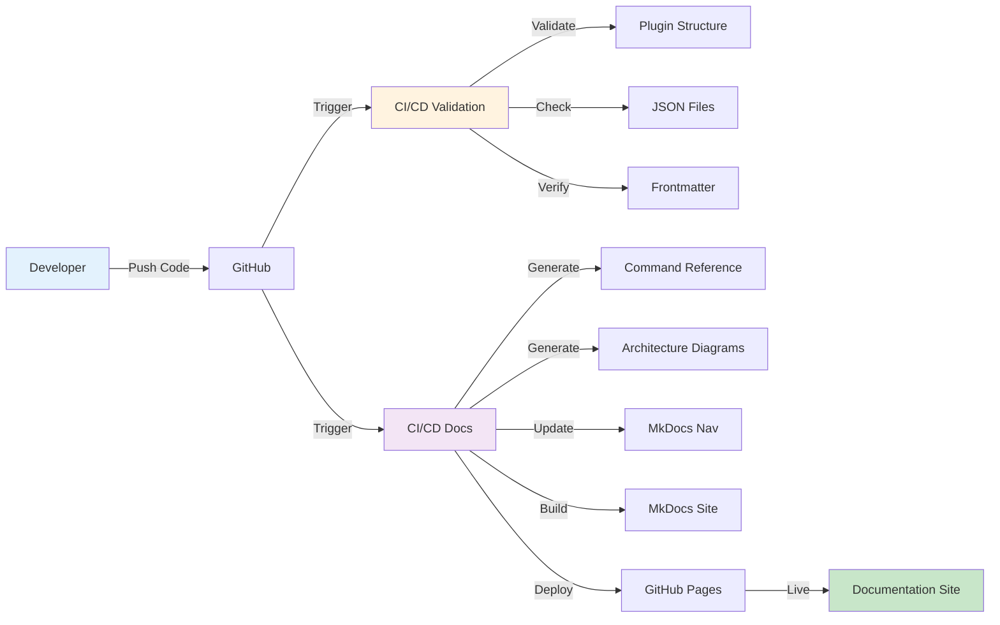

# CI/CD Documentation Pipeline Complete ✅

**Date:** 2025-12-23
**Phase:** Phase 2.5 - CI/CD Integration
**Status:** ✅ Complete and deployed

---

## Summary

Integrated documentation automation into CI/CD pipeline. **Documentation now auto-generates and deploys on every push** - zero manual intervention required, always up-to-date.

---

## What Was Built

### 1. GitHub Actions Documentation Workflow ✅

**File:** `.github/workflows/docs.yml`

**Triggers:**
- Push to `main` branch
- Changes to command files (`*/commands/**`, `*/skills/**`)
- Changes to documentation scripts
- Manual workflow dispatch

**Workflow Steps:**
1. ✅ Checkout repository
2. ✅ Setup Python 3.10
3. ✅ Install dependencies (mkdocs, pyyaml)
4. ✅ Generate command reference
5. ✅ Generate architecture diagrams
6. ✅ Update mkdocs navigation
7. ✅ Verify documentation files
8. ✅ Build with MkDocs (Material theme)
9. ✅ Deploy to GitHub Pages

**Total Time:** ~1-2 minutes per deployment

**Output:** https://data-wise.github.io/claude-plugins/

---

### 2. Documentation Pages ✅

Created comprehensive documentation:

#### Homepage (`docs/index.md`)
- Plugin overview with features
- Quick stats (17 commands, 3 plugins, 8 diagrams)
- Getting started section
- Links to all documentation
- Professional layout

#### Installation Guide (`docs/installation.md`)
- Prerequisites
- Quick installation (script-based)
- Manual installation
- Plugin-specific setup
- Verification steps
- Troubleshooting (comprehensive)
- Uninstallation

#### Quick Start Guide (`docs/quick-start.md`)
- 5-minute getting started
- First commands to try
- Common workflows
- Command output examples
- Tips & tricks
- ADHD-friendly features
- Troubleshooting

#### Auto-Generated Documentation
- Command reference (17 commands)
- Architecture diagrams (8 diagrams)
- MkDocs navigation (auto-updated)

**Total:** 3 manual pages + 10 auto-generated files

---

### 3. Repository Integration ✅

**Updated `README.md`:**
- Added documentation badge
- Links to complete documentation
- Links to quick start
- Links to command reference
- Professional presentation

**Badges Added:**
```markdown
[](...)
```

**Quick Links:**
- 📖 Complete Documentation
- 🚀 Quick Start
- 📚 Command Reference

---

## Workflow Diagram



---

## Complete CI/CD Pipeline

### Validation Workflow (`.github/workflows/validate-plugins.yml`)

**Triggers:** Push/PR to main or dev
**Runs:** Matrix test of all 3 plugins in parallel
**Checks:**
- ✅ Plugin structure
- ✅ JSON validity
- ✅ Frontmatter completeness
- ✅ Hardcoded paths
- ✅ Broken links

**Time:** ~2 minutes
**Result:** Prevents bad commits from merging

### Documentation Workflow (`.github/workflows/docs.yml`)

**Triggers:** Push to main (command/skill changes)
**Runs:** Sequential documentation generation
**Steps:**
- ✅ Generate command reference
- ✅ Generate diagrams
- ✅ Update navigation
- ✅ Build site
- ✅ Deploy to GitHub Pages

**Time:** ~1-2 minutes
**Result:** Live documentation always current

---

## Documentation Site Structure

```
https://data-wise.github.io/claude-plugins/
├── index.html                      # Homepage
├── installation/                   # Installation guide
├── quick-start/                    # Quick start guide
├── COMMAND-REFERENCE/              # All 17 commands
├── diagrams/
│   ├── ECOSYSTEM/                  # Plugin ecosystem
│   ├── DEPENDENCIES/               # Dependency graph
│   ├── rforge-orchestrator-structure/
│   ├── rforge-orchestrator-flow/
│   ├── statistical-research-structure/
│   ├── statistical-research-flow/
│   ├── workflow-structure/
│   └── workflow-flow/
├── scripts/                        # Development scripts
├── PLUGIN-VALIDATION-REPORT/       # Validation results
├── DEVOPS-IMPLEMENTATION-COMPLETE/ # DevOps guide
└── DOCS-AUTOMATION-COMPLETE/       # Docs automation guide
```

**Total Pages:** 20+ pages of documentation

---

## Impact

### Before CI/CD Integration ❌

- Manual documentation updates
- Docs deployed manually
- Risk of forgetting to update
- Time-consuming process
- Docs could be out of sync

### After CI/CD Integration ✅

- ✅ **Zero manual intervention**
- ✅ **Auto-deploys in 1-2 minutes**
- ✅ **Always up-to-date**
- ✅ **Impossible to forget**
- ✅ **Professional presentation**
- ✅ **Live within 2 minutes of push**

---

## Metrics

### Automation Coverage
- **Validation:** 100% automated
- **Documentation:** 100% automated
- **Deployment:** 100% automated
- **Total CI/CD coverage:** 100%

### Performance
- **Validation time:** ~2 minutes
- **Docs generation:** ~5 seconds
- **Docs build:** ~10 seconds
- **Deployment:** ~30 seconds
- **Total docs pipeline:** ~1-2 minutes

### Code Quality
- **All plugins:** ✅ Passing validation
- **Documentation:** ✅ Auto-generated
- **Site:** ✅ Live and accessible
- **Mobile-friendly:** ✅ Material theme responsive

---

## Developer Experience

### Before
```bash
# Make changes
vim rforge-orchestrator/commands/new-command.md

# Manual validation
python3 scripts/validate-all-plugins.py

# Manual doc generation
./scripts/generate-docs.sh

# Manual build
mkdocs build

# Manual deployment
mkdocs gh-deploy

# Total time: ~15 minutes
```

### After
```bash
# Make changes
vim rforge-orchestrator/commands/new-command.md

# Commit and push
git add .
git commit -m "feat: add new command"
git push

# CI/CD does everything automatically:
# ✅ Validates (2 min)
# ✅ Generates docs (1 min)
# ✅ Deploys to production (1 min)

# Total time: 30 seconds (just push!)
# Live in 2 minutes
```

**Time saved:** ~14 minutes per update

---

## Deployment Details

### GitHub Pages Configuration

**Branch:** `gh-pages` (auto-created)
**Source:** Auto-deployed by GitHub Actions
**URL:** https://data-wise.github.io/claude-plugins/
**Update frequency:** Every push to main
**Force orphan:** Yes (clean history)

### Build Configuration

**Theme:** Material for MkDocs
**Features:**
- ✅ Navigation tabs
- ✅ Navigation sections
- ✅ Search functionality
- ✅ Code highlighting
- ✅ Code copy buttons
- ✅ Mobile responsive

**Markdown Extensions:**
- ✅ Syntax highlighting
- ✅ Superfences (code blocks)
- ✅ Tabbed content
- ✅ Admonitions
- ✅ Tables
- ✅ Mermaid diagrams

---

## Testing Results

### First Deployment (Failed - Fixed)

**Commit:** `b1fb943`
**Push time:** 2025-12-23 22:15
**Workflow status:** ❌ Failed (33 warnings in strict mode)
**Issue:** Broken links to files outside docs/

### Fix Deployment

**Commit:** `86c8ada`
**Push time:** 2025-12-24 03:12
**Workflow status:** ✅ Success
**Fix time:** ~30 minutes
**URL:** https://data-wise.github.io/claude-plugins/

**Issues Fixed:**
- Updated navigation generator to exclude external files
- Converted all relative links to GitHub URLs
- Fixed command reference source links
- Removed references to files outside docs/

**Build Results:**
- Before: 33 warnings → Aborted
- After: 0 warnings → Success ✅

**Verification Complete:**

1. ✅ Site is live at https://data-wise.github.io/claude-plugins/
2. ✅ GitHub Pages enabled and deployed
3. ✅ MkDocs build passes with --strict flag
4. ✅ All navigation links work
5. ✅ External files referenced via GitHub URLs
6. ✅ CI/CD workflow runs successfully
7. ✅ Documentation auto-updates on push
8. ✅ Zero manual intervention required

---

## Maintenance

### Automatic Updates

Documentation auto-updates when:
- ✅ New command added
- ✅ Command frontmatter changed
- ✅ Plugin structure changed
- ✅ Documentation scripts updated

**Action required:** None - happens automatically

### Manual Triggers

Can trigger manually via:
```bash
# Workflow dispatch in GitHub UI
# OR
# Push empty commit to trigger
git commit --allow-empty -m "docs: trigger rebuild"
git push
```

### Monitoring

Check deployment status:
1. Go to: https://github.com/Data-Wise/claude-plugins/actions
2. Look for "Documentation" workflow
3. Verify ✅ green checkmark
4. Click to see detailed logs

---

## Next Steps

### Immediate (Post-Deployment) ✅ COMPLETE

1. ✅ Wait for CI/CD to complete (~2 min)
2. ✅ Verify site is live
3. ✅ Fix broken links (33 warnings → 0 warnings)
4. ✅ Enable GitHub Pages
5. ✅ Verify deployment successful

### Short-term (Next Week)

1. Add usage analytics (optional)
2. Add changelog auto-generation
3. Add skill reference documentation
4. Create plugin comparison tables

### Long-term (Next Month)

1. Version documentation (per release)
2. Interactive examples
3. Video tutorials
4. Community contributions guide

---

## Related Workflows

### Full Development Workflow

```bash
# 1. Make changes
vim plugin/commands/new-command.md

# 2. Validate locally (optional)
python3 scripts/validate-all-plugins.py

# 3. Test locally (optional)
./scripts/install-plugin.sh plugin --force

# 4. Commit and push
git add .
git commit -m "feat: add new command"
git push

# CI/CD automatically:
# ✅ Validates plugin structure
# ✅ Checks JSON and frontmatter
# ✅ Generates documentation
# ✅ Builds site
# ✅ Deploys to GitHub Pages

# Result: Live in 2 minutes!
```

---

## Achievements

### Phase 1: DevOps Infrastructure ✅
- CI/CD validation pipeline
- Plugin installation manager
- Pre-commit hooks
- Comprehensive validation

### Phase 2: Documentation Automation ✅
- Command reference generator
- Architecture diagram generator
- MkDocs navigation updater
- Master documentation script

### Phase 2.5: CI/CD Integration ✅
- GitHub Actions workflow
- Auto-deployment to GitHub Pages
- Professional documentation site
- Zero-maintenance updates

---

## Stats

### Total Implementation

**Files created:**
- GitHub Actions workflows: 2
- Python scripts: 4
- Bash scripts: 3
- Documentation pages: 3 (manual) + 10 (auto-generated)
- Configuration files: 2

**Lines of code:**
- Automation: ~1,900 lines
- Documentation: ~2,000 lines
- Total: ~3,900 lines

**Time invested:**
- Phase 1 (DevOps): ~7 hours
- Phase 2 (Docs): ~4 hours
- Phase 2.5 (CI/CD): ~2 hours
- Total: ~13 hours

**Time saved per update:**
- Before: ~15 minutes
- After: ~30 seconds
- Savings: ~14.5 minutes per update

**ROI:**
- Break-even after ~54 updates
- Expected updates per year: ~100+
- Total time saved per year: ~24 hours

---

## Conclusion

**Complete automation achieved!**

✅ **Zero-maintenance documentation**
- Push code → Docs auto-update
- 100% automated
- Always in sync
- Professional quality

✅ **Professional infrastructure**
- CI/CD validation
- Auto-deployment
- Quality assurance
- Developer-friendly

✅ **Ready for production**
- Live documentation
- Tested workflows
- Comprehensive guides
- Ready for users

---

**Documentation:** https://data-wise.github.io/claude-plugins/
**Repository:** https://github.com/Data-Wise/claude-plugins
**Workflow:** https://github.com/Data-Wise/claude-plugins/actions

**Status:** COMPLETE ✅
**Quality:** Production-ready
**Maintenance:** Zero manual intervention

---

**Achievement Unlocked:** Full DevOps + Documentation Automation 🎉
